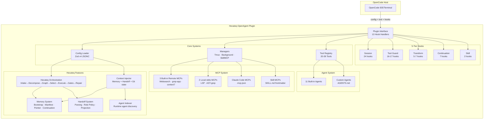
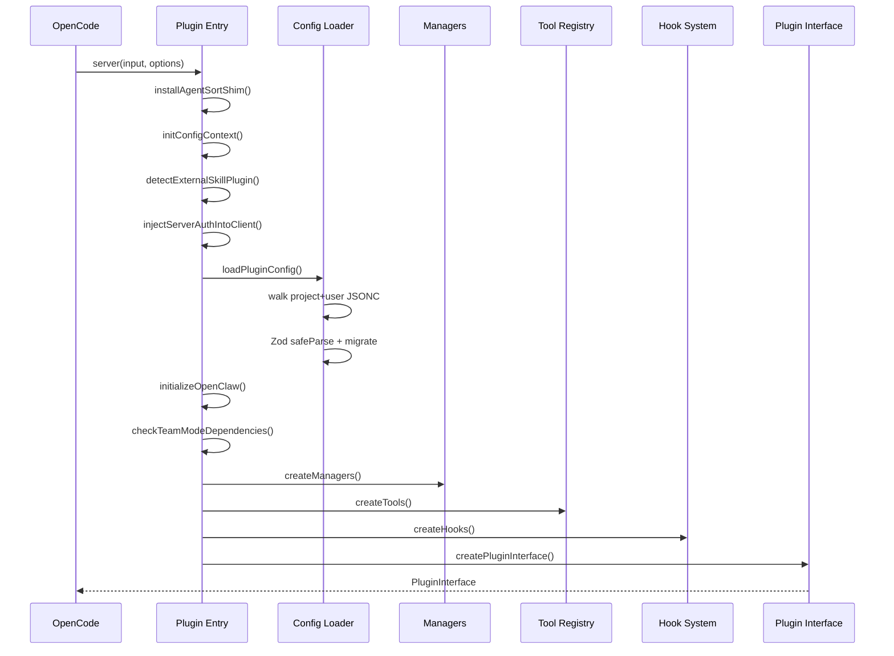
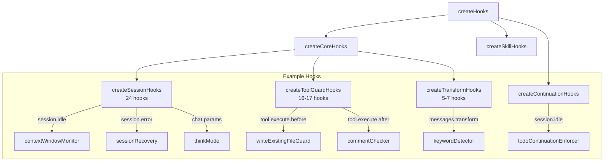
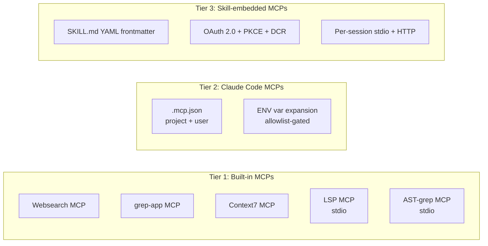

# Hecateq OpenAgent

<p align="center">
  <strong>Hecateq-customized OpenCode agent orchestration plugin</strong><br>
  <em>Multi-model orchestration · Parallel background agents · LSP/AST tools · Hecateq workflow engine</em>
</p>

<p align="center">
  <a href="#status"></a>
  <a href="#license"></a>
  <a href="https://www.npmjs.com/package/@hecateq/openagent"></a>
</p>

---

## Table of Contents

- [Status](#status)
- [Origin & Attribution](#origin--attribution)
- [Overview](#overview)
- [Architecture](#architecture)
- [Hecateq-Specific Additions](#hecateq-specific-additions)
- [Feature Classification](#feature-classification)
- [Quick Start](#quick-start)
- [Installation](#installation)
- [Configuration](#configuration)
- [CLI Commands](#cli-commands)
- [Plugin Architecture](#plugin-architecture)
- [Agent System](#agent-system)
- [Hook System](#hook-system)
- [Tool System](#tool-system)
- [Team Mode](#team-mode)
- [MCP & Skill System](#mcp--skill-system)
- [Memory System](#memory-system)
- [Routing & Delegation](#routing--delegation)
- [Orchestration Pipeline](#orchestration-pipeline)
- [Model & Provider Behavior](#model--provider-behavior)
- [Safety & Guardrails](#safety--guardrails)
- [Telemetry & Privacy](#telemetry--privacy)
- [Auto-Update](#auto-update)
- [Troubleshooting](#troubleshooting)
- [Development](#development)
- [Release](#release)
- [License & Attribution](#license--attribution)

---

## Status

**Beta — use at your own risk.**

This is an experimental Hecateq-customized fork of [oh-my-openagent](https://github.com/code-yeongyu/oh-my-openagent). The following gates are verified to pass:

- Package metadata, bundling, and `npm pack --dry-run`
- TypeScript type checking (`bun run typecheck`)
- Production build (`bun run build`)

**Known limitations:**

- The inherited full test suite (`bun test`) is not fully green due to pre-existing upstream and fork-specific test failures. CI runs tests as a non-blocking signal.
- The Hecateq orchestration system (`hecateq run`, `hecateq plan`, etc.) is in **Experimental** status — APIs may change.
- Custom-agent-first routing is **Experimental** — behavior may evolve.
- Hecateq-specific features are not all covered by unit tests.

Review changes carefully before production use. Do not claim full test stability for this beta release.

---

## Origin & Attribution

Hecateq OpenAgent is a **modified fork** of [oh-my-openagent](https://github.com/code-yeongyu/oh-my-openagent) by YeonGyu Kim — a batteries-included OpenCode plugin with multi-model orchestration, parallel background agents, and crafted LSP/AST tools.

> **No affiliation:** This project is not affiliated with, endorsed by, or sponsored by YeonGyu Kim, the original oh-my-openagent project, or any of its associated entities.

See [NOTICE.md](./NOTICE.md) for full attribution and [LICENSE.md](./LICENSE.md) for the Sustainable Use License v1.0 (SUL-1.0).

**Key modification areas:**
- Hecateq-specific configuration and workflow support (see [Hecateq-Specific Additions](#hecateq-specific-additions))
- Hecateq identity, packaging (`@hecateq/openagent`), and branding
- Telemetry default-off behavior
- Auto-update targeting Hecateq distribution channel
- Hecateq workflow engine with orchestration, memory bootstrap, context injection, agent index, and doctor checks

---

## Overview

Hecateq OpenAgent is an OpenCode plugin that extends the upstream oh-my-openagent with:

### Inherited from oh-my-openagent (upstream)

- **11 specialized AI agents** (Sisyphus, Hephaestus, Prometheus, Oracle, Librarian, Explore, Atlas, Metis, Momus, Multimodal-Looker, Sisyphus-Junior) for planning, implementation, research, and review
- **52+ lifecycle hooks** organized in 5 tiers (Session, Tool Guard, Transform, Continuation, Skill)
- **20–39 config-gated tools** including LSP, AST-grep, grep, glob, background tasks, session management, task delegation, skill loading, and hashline editing
- **3-tier MCP system**: built-in MCPs, Claude Code `.mcp.json`, and skill-embedded MCPs
- **Team Mode**: parallel multi-agent coordination (OFF by default)
- **Boulder state**: persistent work tracking across sessions
- **Multi-level JSONC configuration** with Zod v4 validation
- **Model fallback** (proactive and reactive)
- **IntentGate keyword detector** (ultrawork, search, analyze, team modes)
- **Claude Code compatibility**
- **OpenClaw bidirectional integration** (Discord/Telegram/HTTP)

### Hecateq Additions

- **Hecateq orchestration pipeline**: prompt intake → task decomposition → dependency graph → agent selection → execution planning → quality gates → repair loop → reporting
- **Hecateq CLI commands**: `hecateq plan`, `hecateq run`, `hecateq resume`, `hecateq status`, `hecateq doctor`
- **Hecateq config section** in root schema: 9 sub-configs covering context injection, memory bootstrap, agent index, doctor, git checkpoint, dependency graph, orchestration, auto-spawn, and delegation chain
- **Memory system**: bootstrap, manifest, pointer, continuation, resume
- **Project context injector**: Hecateq-specific hook injecting memory state, git state, handoff context into agent sessions
- **Agent indexer**: runtime agent discovery and summarization
- **Custom-agent-first routing**: delegates to custom agents before built-in agents
- **Handoff system**: structured handoff parsing, role policy, boulder state projection

---

## Architecture



---

## Hecateq-Specific Additions

For detailed documentation on each system, see the supporting docs under [docs/hecateq/](./docs/hecateq/).

| System | Status | Description | Documentation |
|--------|--------|-------------|---------------|
| **Orchestration Pipeline** | **Experimental** | Full task lifecycle: prompt intake → task decomposition → dependency graph → agent selection → execution planning → quality gates → repair loop → final report | [docs/hecateq/orchestration.md](./docs/hecateq/orchestration.md) |
| **CLI Commands** | **Experimental** | `hecateq plan`, `hecateq run`, `hecateq resume`, `hecateq status`, `hecateq doctor` | [docs/hecateq/cli-commands.md](./docs/hecateq/cli-commands.md) |
| **Config Schema** | **Experimental** | `hecateq` config block with 9 sub-configs (context injection, memory bootstrap, agent index, doctor, git checkpoint, dependency graph, orchestration, auto-spawn, delegation chain) | [docs/hecateq/configuration.md](./docs/hecateq/configuration.md) |
| **Memory System** | **Experimental** | File-based memory with bootstrap/create-once semantics, manifest with version/checksum tracking, pointer system, continuation summaries, and portable resume plans | [docs/hecateq/memory-system.md](./docs/hecateq/memory-system.md) |
| **Context Injector Hook** | **Experimental** | Injects memory state, orchestration context, handoff summaries, git checkpoint state, and agent index into agent sessions | [docs/hecateq/overview.md](./docs/hecateq/overview.md) |
| **Memory Bootstrap Hook** | **Experimental** | Auto-creates memory directories and template files on first session.created event | [docs/hecateq/memory-system.md](./docs/hecateq/memory-system.md) |
| **Agent Indexer** | **Experimental** | Scans AGENTS.md files, builds runtime agent registry, supports suggestions and summaries | [docs/hecateq/overview.md](./docs/hecateq/overview.md) |
| **Handoff System** | **Experimental** | Structured handoff parsing, role policy validation, boulder state projection, context injection | [docs/hecateq/orchestration.md](./docs/hecateq/orchestration.md) |
| **Doctor Checks** | **Experimental** | 11 categories of Hecateq-specific workflow diagnostics (memory, artifacts, custom agents, secrets, safety hooks, handoff state, etc.) | [docs/hecateq/cli-commands.md](./docs/hecateq/cli-commands.md) |
| **Dependency Graph** | **Experimental** | Task dependency tracking with cycle detection, batch planning, and sensitive path enforcement (modes: off, warn, enforce) | [docs/hecateq/orchestration.md](./docs/hecateq/orchestration.md) |
| **Git Checkpoint** | **Experimental** | Pre-task git state checkpointing with suggest/auto_clean_only/off modes | [docs/hecateq/overview.md](./docs/hecateq/overview.md) |
| **Auto-Spawn** | **Experimental** | Autonomous subagent spawning with concurrency limits, rate limiting, and failure backoff | [docs/hecateq/orchestration.md](./docs/hecateq/orchestration.md) |
| **Routing Policy Engine** | **Experimental** | Signal-based routing decisions from handoff blocks; supports delegation chains with configurable max depth/fan-out | [docs/hecateq/routing.md](./docs/hecateq/routing.md) |
| **Quality Gates** | **Experimental** | Per-task quality verification pipeline: typecheck, lint, test, build, doctor | [docs/hecateq/orchestration.md](./docs/hecateq/orchestration.md) |
| **Repair Loop** | **Experimental** | Automatic repair on task failure with configurable max attempts | [docs/hecateq/orchestration.md](./docs/hecateq/orchestration.md) |

---

## Feature Classification

| Feature | Status | Note |
|---------|--------|------|
| Plugin entry + OpenCode hook handlers (13 hooks) | **Inherited** | Present in source and carried from upstream |
| Multi-level JSONC config (Zod v4) | **Inherited** | Config loading + validation inherited from upstream |
| 11 built-in agents (Sisyphus, Hephaestus, etc.) | **Inherited** | Upstream agent system retained in this fork |
| Agent prompt system | **Inherited** | Dynamic prompt builders from upstream |
| Task delegation (`task()` tool) | **Inherited** | Existing delegation surface retained |
| Background tasks | **Inherited** | Existing concurrent task execution retained |
| LSP tools (goto_definition, find_references, symbols) | **Inherited** | Via built-in MCP |
| AST-grep tools (search, replace) | **Inherited** | Via built-in MCP |
| grep / glob tools | **Inherited** | Native search tools |
| Session management tools | **Inherited** | session_list, session_read, etc. |
| Skill loading (`skill` tool) | **Inherited** | YAML frontmatter skill loader |
| Skill-embedded MCPs | **Inherited** | Tier-3 MCP system |
| Claude Code MCPs | **Inherited** | Tier-2 MCP system retained |
| Built-in MCPs | **Inherited** | Tier-1 MCP system retained |
| Hashline edit (LINE#ID) | **Inherited** | Content-hash verified edit flow |
| Comment checker | **Inherited** | AI-slop comment detection |
| Rules injector | **Inherited** | Project rules auto-injection |
| Auto-update checker | **Inherited** | npm version check logic retained |
| IntentGate keyword detector | **Inherited** | ultrawork/search/analyze/team |
| Session hooks (24) | **Inherited** | Core session lifecycle |
| Tool Guard hooks (16-17) | **Inherited** | Pre/post tool guards |
| Continuation hooks (7) | **Inherited** | Compaction, boulder, atlas |
| Model fallback (proactive) | **Inherited** | Per-agent fallback chains |
| Runtime fallback (reactive) | **Inherited** | Error-driven provider switch |
| Boulder state | **Inherited** | Persistent work tracking |
| Ralph loop | **Inherited** | Self-referential dev loop |
| OpenClaw | **Beta** | Inherited subsystem with operational risk |
| Base CLI commands and dashboard | **Beta** | install, run, doctor, boulder, dashboard, and related command groups |
| **Team Mode** | **Beta** | Parallel multi-agent coordination |
| MCP OAuth (PKCE + DCR) | **Beta** | OAuth for MCP servers |
| Claude Code plugin compatibility | **Beta** | hooks, commands, agents, MCP |
| Doctor (4-category health checks) | **Inherited** | System/Config/Tools/Models |
| **Hecateq CLI commands** | **Experimental** | plan, run, resume, status, doctor |
| **Hecateq orchestration pipeline** | **Experimental** | Full task lifecycle automation |
| **Hecateq config schema** | **Experimental** | 8 hecateq sub-configs |
| **Hecateq memory system** | **Experimental** | Bootstrap, manifest, pointer |
| **Hecateq context injector hook** | **Experimental** | Memory+handoff+git injection |
| **Hecateq memory bootstrap hook** | **Experimental** | Auto memory init |
| **Hecateq agent indexer** | **Experimental** | Runtime agent discovery |
| **Hecateq handoff system** | **Experimental** | Parsing, role policy, projection |
| **Hecateq doctor checks** | **Experimental** | 11 workflow diagnostic categories |
| **Hecateq dependency graph** | **Experimental** | Task dependency enforcement |
| **Hecateq git checkpoint** | **Experimental** | Pre-task git state management |
| **Hecateq auto-spawn** | **Experimental** | Autonomous subagent spawning |
| **Hecateq routing policy engine** | **Experimental** | Signal-based routing from handoffs |
| **Hecateq quality gates** | **Experimental** | Per-task verification pipeline |
| **Hecateq repair loop** | **Experimental** | Automatic task failure recovery |
| Task system (experimental) | **Needs verification** | Undocumented task system |
| Dynamic context pruning | **Needs verification** | Config schema field, implementation status unclear |

---

## Quick Start

```bash
# Install globally via npm
npm install -g @hecateq/openagent@beta

# (or via bun)
bun install -g @hecateq/openagent@beta
```

Add the plugin to your OpenCode configuration (`~/.config/opencode/opencode.json`):

```json
{
  "plugin": ["@hecateq/openagent"]
}
```

Verify the installation:

```bash
npx hecateq-openagent doctor
```

Run a non-interactive session:

```bash
npx hecateq-openagent run "explain the src directory structure"
```

---

## Installation

### Prerequisites

- **OpenCode** (>= 1.0.150) — the plugin host
- **Bun** (>= 1.3.12) — for development
- **npm** — for global installation

### npm (global install)

```bash
npm install -g @hecateq/openagent@beta
```

### bun (global install)

```bash
bun install -g @hecateq/openagent@beta
```

### Plugin Registration

After installation, configure OpenCode to use the plugin by adding `"@hecateq/openagent"` to the `plugins` array:

```json
{
  "plugins": ["@hecateq/openagent"]
}
```

Or via the legacy format:

```json
{
  "plugin": ["@hecateq/openagent"]
}
```

### Post-Install

The package includes a `postinstall.mjs` script that verifies the platform binary and OpenCode version. Installation output will indicate any platform compatibility issues.

### Uninstall

```bash
npm uninstall -g @hecateq/openagent
# Remove the plugin entry from opencode.json
```

---

## Configuration

Hecateq OpenAgent uses multi-level JSONC configuration with Zod v4 validation. Config files are merged from the closest scope to the user scope.

### Config File Locations

1. **User config**: `~/.config/opencode/oh-my-openagent.jsonc` (or legacy `oh-my-opencode.jsonc`)
2. **Walked project config**: `<project-root>/.opencode/oh-my-openagent.jsonc` (walked up from pwd to $HOME)

Config in closer scope wins; arrays for `disabled_*` fields are unioned; objects for `agents`, `categories`, `claude_code` are deep-merged.

### Schema Autocomplete

```json
{
  "$schema": "https://raw.githubusercontent.com/hecateq/hecateq-openagent/main/assets/hecateq-openagent.schema.json"
}
```

### Root Config Fields

The root schema (`OhMyOpenCodeConfigSchema`) accepts these fields:

| Field | Type | Description |
|-------|------|-------------|
| `$schema` | `string` | JSON Schema URL for autocomplete |
| `hecateq` | `object` | Hecateq-specific configuration (see below) |
| `agent_order` | `string[]` | Preferred display order for agents |
| `agent_definitions` | `object` | External agent definition paths (.md or .json) |
| `disabled_mcps` | `string[]` | Disable built-in MCPs by name |
| `disabled_agents` | `string[]` | Disable agents by name |
| `disabled_categories` | `string[]` | Disable categories by name |
| `disabled_skills` | `string[]` | Disable built-in skills by name |
| `disabled_hooks` | `string[]` | Disable hooks by name |
| `disabled_commands` | `string[]` | Disable slash commands by name |
| `disabled_tools` | `string[]` | Disable tools by name |
| `disabled_providers` | `string[]` | Exclude provider prefixes from fallback chains |
| `mcp_env_allowlist` | `string[]` | Environment vars allowed in `.mcp.json` (`user-only`) |
| `hashline_edit` | `boolean` | Enable hashline_edit tool (default: false) |
| `model_fallback` | `boolean` | Enable proactive model fallback (default: false) |
| `auto_update` | `boolean` | Enable auto-update check |
| `new_task_system_enabled` | `boolean` | Enable experimental task system (default: false) |
| `default_run_agent` | `string` | Default agent for `run` command (env: `OPENCODE_DEFAULT_AGENT`) |
| `agents` | `object` | Per-agent override config (model, prompt, temperature, etc.) |
| `categories` | `object` | Category definitions and model requirements |
| `experimental` | `object` | Feature flags |
| `team_mode` | `object` | Team Mode configuration |
| `background_task` | `object` | Background task concurrency limits |
| `runtime_fallback` | `boolean | object` | Reactive provider fallback |
| `keyword_detector` | `object` | IntentGate keyword configuration |
| `openclaw` | `object` | OpenClaw integration settings |
| `claude_code` | `object` | Claude Code compatibility settings |
| `skills` | `object` | Skill loader configuration |
| `ralph_loop` | `object` | Ralph loop configuration |
| `tmux` | `object` | Tmux integration configuration |
| `browser_automation_engine` | `object` | Browser automation provider |
| `websearch` | `object` | Web search provider (`exa` or `tavily`) |
| `i18n` | `object` | Internationalization settings |
| `notification` | `object` | OS notification settings |
| `sisyphus` | `object` | Sisyphus agent configuration |
| `sisyphus_agent` | `object` | SisyphusAgentConfigSchema |
| `comment_checker` | `object` | AI comment detection settings |
| `babysitting` | `object` | Unstable agent monitoring |
| `git_master` | `object` | Git commit footer settings |
| `start_work` | `object` | Start work command config |
| `default_mode` | `object` | Default mode auto-activation (ultrawork, ralph loop) |
| `model_capabilities` | `object` | Model capabilities config |
| `dynamic_context_pruning` | `object` | Context pruning settings |

### Hecateq Config Section

```jsonc
{
  "hecateq": {
    "enabled": true,
    "context_injection": {
      "enabled": true,
      "mode": "compact",          // "compact" | "expanded" | "off"
      "manifest_first": true,
      "max_memory_file_chars": 500,
      "max_total_chars": 2500,
      "max_artifact_files": 5,
      "include_contracts": true,
      "include_task_graphs": true,
      "include_agent_index": true,
      "max_agent_domains": 8,
      "max_agents_per_domain": 5,
      "inject_on_subagents": false,
      "hecateq_only": true
    },
    "agent_index": {
      "enabled": true,
      "enrich_runtime_agents": true,
      "use_for_suggestions": true,
      "require_fresh": false,
      "fallback_to_runtime_only": true,
      "max_suggestions": 10
    },
    "memory_bootstrap": {
      "enabled": true,
      "create_memory_files": true,
      "create_artifact_dirs": true
    },
    "doctor": {
      "check_memory": true,
      "check_artifacts": true,
      "check_custom_agents": true,
      "check_secrets": true,
      "check_safety_hooks": true
    },
    "git_checkpoint": {
      "enabled": true,
      "mode": "suggest",          // "suggest" | "auto_clean_only" | "off"
      "auto_checkpoint_clean_repo": false,
      "checkpoint_message": "chore: checkpoint before hecateq task",
      "include_status_in_context": true,
      "include_dirty_file_list": false,
      "include_dirty_file_count": true,
      "max_dirty_files": 10,
      "block_destructive_git": true
    },
    "dependency_graph": {
      "mode": "off",              // "off" | "warn" | "enforce"
      "auto_create": true,
      "block_on_cycle": true,
      "block_on_sensitive": true,
      "require_contract_for": []
    },
    "orchestration": {
      "enabled": false,
      "auto_decompose": true,
      "auto_execute_low_risk": true,
      "require_plan_for_high_risk": true,
      "max_repair_attempts": 2,
      "default_task_timeout_ms": 300000,
      "allow_parallel_readonly_tasks": true,
      "allow_parallel_write_tasks": false,
      "quality_gates": {
        "typecheck": true,
        "lint": true,
        "test": true,
        "build": true,
        "doctor": false
      }
    },
    "auto_spawn": {
      "enabled": false,
      "max_concurrent_spawns": 5,
      "spawn_timeout_ms": 300000,
      "auto_retry_on_failure": true,
      "max_failures_before_pause": 3,
      "pause_duration_ms": 60000,
      "allow_background_spawn": true,
      "max_spawn_depth": 3,
      "rate_limit_enabled": true,
      "max_spawns_per_window": 20,
      "spawn_window_ms": 60000
    },
    "delegation_chain": {
      "max_depth": 3,
      "max_fan_out": 10,
      "max_iterations_per_run": 10
    }
  }
}
```

See [docs/hecateq/configuration.md](./docs/hecateq/configuration.md) for the full config reference.

---

## CLI Commands

The package provides three binary entry points:

| Binary | Usage |
|--------|-------|
| `hecateq-openagent` | Primary Hecateq entry point |
| `oh-my-opencode` | Upstream compatibility alias |
| `oh-my-openagent` | Upstream compatibility alias |

### Base Commands (Inherited from oh-my-openagent)

| Command | Description |
|---------|-------------|
| `install` | Interactive/non-interactive setup wizard |
| `run <message>` | Non-interactive session launcher |
| `doctor` | 4-category health diagnostics (System, Config, Tools, Models) |
| `version` | Print plugin version |
| `get-local-version` | Check installed vs npm latest |
| `mcp-oauth login <server-url>` | MCP OAuth login (PKCE + DCR) |
| `mcp-oauth logout` | MCP OAuth logout |
| `mcp-oauth status` | MCP OAuth token status |
| `refresh-model-capabilities` | Refresh model capabilities cache |
| `boulder` | Boulder state inspector |
| `dashboard` / `dashboard serve` | Hecateq dashboard client and persistent server |

`install` also supports the compatibility alias `setup`.

### Hecateq Commands (Experimental)

| Command | Description | Status |
|---------|-------------|--------|
| `hecateq plan <prompt>` | Analyze, decompose, plan — no execution | Experimental |
| `hecateq run <prompt>` | Auto-run low-risk work, show plan for high-risk | Experimental |
| `hecateq resume [--session-id <id>]` | Recover unfinished orchestration sessions | Experimental |
| `hecateq status` | Summarize orchestration state/history | Experimental |
| `hecateq doctor` | 11-category Hecateq workflow diagnostics | Experimental |

#### hecateq plan

Runs the full pre-execution pipeline without executing anything: prompt intake → task decomposition → dependency graph → agent selection → execution plan. Outputs a structured plan report.

```bash
hecateq-openagent hecateq plan "add email validation to user registration"
```

Options: `--json`, `--config`, `--agents-dir`, `--disabled-agents`, `--project-dir`

#### hecateq run

Auto-runs low-risk prompts. Safe-by-default: high-risk or destructive prompts produce a plan-only output and non-zero exit code unless `--force` is passed.

```bash
hecateq-openagent hecateq run "fix typo in README"
hecateq-openagent hecateq run --force "destroy production database"  # blocked by default
```

Options: `--force`, `--dry-run`, `--json`, `--session-id`, `--port`, `--attach`

#### hecateq resume

Recovers unfinished orchestration sessions. Lists available sessions when no `--session-id` is given. Marks stale `in_progress` tasks as failed and continues pending tasks.

```bash
hecateq-openagent hecateq resume
hecateq-openagent hecateq resume --session-id <id>
```

#### hecateq status

Summarizes orchestration state: session count, memory initialization, contract/task-graph directories.

```bash
hecateq-openagent hecateq status
```

#### hecateq doctor

Runs 11 categories of Hecateq-specific workflow diagnostics:

| Category | Checks |
|----------|--------|
| Agent Registration | Hecateq agent registration issues |
| Configuration | Hecateq config validity |
| Orchestration | Orchestration state integrity |
| Safety Hooks | Required safety hooks presence |
| Handoff State | Handoff file integrity |
| Role Policy | Handoff role policy consistency |
| Project Memory | Memory file presence and quality |
| Memory Manifest | Manifest freshness and pointer validity |
| Custom Agents | Custom agent configuration |
| Agent Index | Agent index freshness |
| Artifacts | Artifact directory structure |

See [docs/reference/cli.md](./docs/reference/cli.md) and [docs/hecateq/cli-commands.md](./docs/hecateq/cli-commands.md) for full documentation.

---

## Plugin Architecture

Hecateq OpenAgent implements the OpenCode plugin interface with 13 hook handlers:

| Handler | OpenCode Hook | Purpose |
|---------|---------------|---------|
| `config` | `config` | 6-phase pipeline: provider → plugin-components → agents → tools → MCPs → commands |
| `tool` | `tool` | 20–39 registered tools (config-gated) |
| `chat.message` | `chat.message` | First-message variant, session setup, keyword detection |
| `chat.params` | `chat.params` | Anthropic effort, think mode, runtime fallback |
| `chat.headers` | `chat.headers` | Copilot header injection |
| `command.execute.before` | `command.execute.before` | Pre-command guards |
| `event` | `event` | Session lifecycle, openclaw dispatch, runtime fallback |
| `tool.execute.before` | `tool.execute.before` | Pre-tool guards |
| `tool.execute.after` | `tool.execute.after` | Post-tool hooks |
| `experimental.chat.messages.transform` | `experimental.chat.messages.transform` | Context injection, thinking validation, keyword detection |
| `experimental.chat.system.transform` | `experimental.chat.system.transform` | System-message transforms |
| `experimental.session.compacting` | `experimental.session.compacting` | Context preservation across compaction |
| `experimental.compaction.autocontinue` | `experimental.compaction.autocontinue` | Auto-resume after compaction |

### Initialization Flow



---

## Agent System

The plugin provides 11 built-in agents, organized as OpenCode agent definitions:

| Agent | Mode | Purpose |
|-------|------|---------|
| **Sisyphus** | primary, subagent, all | Master orchestrator — planning, delegation, task splitting |
| **Hephaestus** | primary, subagent, all | Implementation agent — coding, debugging, building |
| **Prometheus** | primary, subagent, all | Prompt engineering — system prompts, agent definitions |
| **Oracle** | subagent | Architectural review — code quality, design review |
| **Librarian** | subagent | Research — documentation lookup, code examples |
| **Explore** | subagent | Codebase exploration — finding files, patterns, structure |
| **Atlas** | subagent | Background orchestrator — boulder, ralph loop, background sessions |
| **Metis** | subagent | Safety & compliance — security audit, dependency check |
| **Momus** | subagent | Critique — assumption breaking, edge case analysis |
| **Multimodal-Looker** | subagent | Visual analysis — images, PDFs, diagrams |
| **Sisyphus-Junior** | subagent | Lightweight delegation — simple subagent tasks |

### Agent Override Fields

Per-agent overrides via the `agents` config section:

- `model` — Model ID override
- `variant` — Model variant (for extended thinking)
- `category` — Category assignment
- `skills` — Skills to load
- `temperature`, `top_p` — Sampling parameters
- `prompt`, `prompt_append` — System prompt customization
- `tools` — Tool allow/block list
- `disable` — Disable specific agent
- `description` — Custom description
- `mode` — Agent mode (primary/subagent/all)
- `color` — Display color
- `permission` — Tool permissions
- `maxTokens` — Max output tokens
- `thinking`, `reasoningEffort` — Extended thinking settings
- `textVerbosity` — Response verbosity control
- `providerOptions` — Provider-specific options
- `fallback_models` — Fallback model chain
- `ultrawork` — Ultrawork mode override

---

## Hook System

The plugin uses a 5-tier hook composition for lifecycle management. See [docs/hecateq/hooks-tools.md](./docs/hecateq/hooks-tools.md) for the complete catalog.



**Total: 54 base hooks, 61 with team-mode enabled.**

| Tier | Count | Team-Mode Additions | Trigger |
|------|-------|---------------------|---------|
| Session | 24 | — | session.created, session.idle, session.error, chat.message, chat.params, tool.execute |
| Tool Guard | 16 | +1 (team-tool-gating) | tool.execute.before, tool.execute.after |
| Transform | 5 | +2 (team-mode-status-injector, team-mailbox-injector) | experimental.chat.messages.transform |
| Continuation | 7 | — | session.idle, session.compacted, event |
| Skill | 2 | — | chat.message |
| Direct event handlers | — | +4 (team-session-events) | session events |

---

## Tool System

The plugin provides 20–39 tools depending on configuration flags. See [docs/hecateq/hooks-tools.md](./docs/hecateq/hooks-tools.md) for the complete catalog.

### Always-On Tools (20)

| Tool | Description |
|------|-------------|
| `lsp_goto_definition` | Go to definition (via MCP) |
| `lsp_find_references` | Find references (via MCP) |
| `lsp_symbols` | List symbols (via MCP) |
| `lsp_diagnostics` | Get diagnostics (via MCP) |
| `lsp_prepare_rename` | Prepare rename (via MCP) |
| `lsp_rename` | Rename symbol (via MCP) |
| `grep` | Search file contents |
| `glob` | Search file paths |
| `ast_grep_search` | AST pattern search (via MCP) |
| `ast_grep_replace` | AST pattern replace (via MCP) |
| `session_list` | List sessions |
| `session_read` | Read session messages |
| `session_search` | Search sessions |
| `session_info` | Session metadata |
| `background_output` | Get background task output |
| `background_cancel` | Cancel background task |
| `call_omo_agent` | Spawn subagent |
| `task` | Delegate task to category |
| `skill` | Load a skill |
| `skill_mcp` | Invoke skill-embedded MCP |

### Conditional Tools

| Tool | Condition |
|------|-----------|
| `look_at` | `multimodal-looker` not disabled |
| `interactive_bash` | `tmux` binary on PATH |
| `edit` | `hashline_edit` enabled |
| `task_create`, `task_get`, `task_list`, `task_update` | `experimental.task_system` enabled |
| `team_create`, `team_delete`, `team_shutdown_request`, `team_approve_shutdown`, `team_reject_shutdown`, `team_send_message`, `team_task_create`, `team_task_list`, `team_task_update`, `team_task_get`, `team_status`, `team_list` | `team_mode.enabled` |

---

## Team Mode

Team Mode enables parallel multi-agent coordination, modeled after Claude Code Agent Teams. It is **OFF by default**.

Enable via `team_mode.enabled: true` in config, then restart OpenCode.

```jsonc
{
  "team_mode": {
    "enabled": true,
    "tmux_visualization": false,
    "max_parallel_members": 4,
    "max_members": 8,
    "max_messages_per_run": 10000,
    "max_wall_clock_minutes": 120,
    "max_member_turns": 500,
    "base_dir": null,
    "message_payload_max_bytes": 32768,
    "recipient_unread_max_bytes": 262144,
    "mailbox_poll_interval_ms": 3000
  }
}
```

**Details:**

- Teams live as directories under `~/.omo/teams/{name}/` (user) or `<project>/.omo/teams/{name}/` (project).
- Members declared as `kind: "subagent_type"` (direct agent) or `kind: "category"` (routed through Sisyphus-Junior).
- Storage: `config.json` (spec), `state.json` (runtime), `mailbox/` (messages), `tasklist.jsonl` (tasks), `worktrees/` (git worktrees).
- Eligible members: Sisyphus, Atlas, Sisyphus-Junior. Conditional: Hephaestus (requires explicit permission). Others hard-rejected.

See [docs/guide/team-mode.md](./docs/guide/team-mode.md) for full documentation.

---

## MCP & Skill System

The plugin implements a 3-tier Model Context Protocol (MCP) system:



| Tier | Source | Loader | Mechanism |
|------|--------|--------|-----------|
| 1. Built-in | `src/mcp/` | `createBuiltinMcps()` | 3 remote HTTP + 2 local stdio MCPs |
| 2. Claude Code | `.mcp.json` (project + user) | `claude-code-mcp-loader` | `${VAR}` env expansion (allowlist-gated) |
| 3. Skill-embedded | SKILL.md YAML frontmatter | `SkillMcpManager` (per-session) | stdio + HTTP, OAuth 2.0 + PKCE + DCR |

**Skill system:** Skills are loaded from `.md` files with YAML frontmatter. Discovery spans 4 scopes: project → opencode → user → global. Skills provide specialized instructions and bundled resources.

---

## Memory System

The Hecateq memory system provides file-based long-term memory for agent sessions. See [docs/hecateq/memory-system.md](./docs/hecateq/memory-system.md).

### Directory Structure

```
<project-root>/.opencode/
├── state/
│   └── memory/
│       ├── active-context.md    # Current session context
│       ├── progress.md          # Milestone tracking
│       ├── decisions.md          # Architecture decisions
│       └── known-issues.md       # Known bugs/issues
├── contracts/                    # Task contracts
├── task-graphs/                  # Dependency graphs
└── memory-manifest.json          # Version/checksum tracking
```

### Subsystems

| Component | Description |
|-----------|-------------|
| **Bootstrap** | Creates directories and template files on first session (once-per-project) |
| **Manifest** | JSON manifest with version, checksums, and file timestamps |
| **Pointer** | Points to the active memory directory (supports multi-worktree) |
| **Continuation** | Summarizes session state for handoff/resume |
| **Resume** | Portable resume plan for session continuation |

---

## Routing & Delegation

See [docs/hecateq/routing.md](./docs/hecateq/routing.md) for full documentation.

### Hecateq Routing

The Hecateq routing policy engine (`src/features/hecateq-orchestration/routing-policy-engine.ts`) reads structured `HANDOFF:` blocks from agent responses and makes routing decisions based on:

- Current task phase and domain
- Required capabilities
- Agent availability
- Signal emissions from upstream agents

### Delegation Chain

Configurable max depth (default: 3), max fan-out (default: 10), and max iterations per run (default: 10). Acts as a circuit breaker against runaway delegation.

### Task Delegation (`task()` tool)

The core delegation mechanism routes tasks to categories:

| Category | Model Preference | Description |
|----------|-----------------|-------------|
| `quick` | Claude/GPT-mini | Fast, low-cost tasks |
| `default` | Claude/GPT | Balanced tasks |
| `deep` | Claude-thinking/GPT-o3 | Complex reasoning |
| `ultrabrain` | Claude/GPT-o3 | Maximum intelligence |
| `unspecified-low` | Gemini/Claude-haiku | Budget tasks |
| `unspecified-high` | Claude-thinking/GPT-o3 | High-effort tasks |
| `artistry` | Claude/GPT-o3 | Creative/design work |
| `oracle` | Claude-thinking/GPT-o3 | Architecture/review |

---

## Orchestration Pipeline

The Hecateq orchestration system is an end-to-end task automation pipeline. See [docs/hecateq/orchestration.md](./docs/hecateq/orchestration.md).


| Stage | Description |
|-------|-------------|
| **Prompt Intake** | Classifies intent, risk level, task size, domains |
| **Task Decomposition** | Splits prompt into atomic task nodes |
| **Dependency Graph** | Builds DAG with cycle detection, batch planning |
| **Agent Selection** | Matches tasks to agents from local registry |
| **Execution Plan** | Orders tasks by dependency, injects contract/plan/verification stages for high-risk tasks |
| **Quality Gates** | Runs typecheck, lint, test, build, doctor per task |
| **Repair Loop** | Retries failed tasks up to `max_repair_attempts` |
| **Final Report** | Summarizes results, changed files, execution outcomes |

---

## Model & Provider Behavior

### Model Fallback (Proactive)

Per-agent fallback chains defined in `model-fallback-requirements.ts`. When the primary model fails, the plugin attempts fallback models in order:

```typescript
// Example fallback chain (Sisyphus)
sisyphus: Claude → Gemini → Kimi → GLM-5
hephaestus: Claude → OpenAI-compatible providers
librarian: Claude → ZAI
```

Configure via `model_fallback: true` in config, or per-agent via `agents.<name>.fallback_models`.

### Runtime Fallback (Reactive)

Configurable via `runtime_fallback` config. Triggers on API error codes (429, 500, 502, 503, 504) and session idle timeout. Auto-switches to next available provider.

### Provider Resolution

Provider availability detected at install time. The `doctor` command validates provider connectivity. The `refresh-model-capabilities` command refreshes the model capabilities cache from `models.dev`.

### Two Fallback Systems

| Aspect | Model Fallback | Runtime Fallback |
|--------|---------------|------------------|
| Timing | Proactive (chat.params) | Reactive (session.error) |
| Configuration | `model_fallback: true` | `runtime_fallback: {}` |
| Trigger | Before API call | After API error |
| Chain | Hardcoded per-agent | Configurable per-category |

---

## Safety & Guardrails

### Built-in Guards

| Guard | Description |
|-------|-------------|
| `writeExistingFileGuard` | Requires Read before Write/Edit on existing files |
| `bashFileReadGuard` | Guards bash commands that read files via cat/head/tail |
| `webfetchRedirectGuard` | Controls webfetch redirect behavior |
| `prometheusMdOnly` | Prometheus may only edit `.md` files |
| `noSisyphusGpt` | Blocks Sisyphus from non-GPT providers |
| `noHephaestusNonGpt` | Blocks Hephaestus from non-GPT models |
| `commentChecker` | Detects AI-slop comment patterns |
| `sensitivePathPolicy` | Blocks tasks targeting `.env`, secrets, keys |

### Hecateq Safety Features

| Feature | Description |
|---------|-------------|
| **Git checkpoint block_destructive_git** | Blocks destructive git operations when enabled |
| **Dependency graph block_on_sensitive** | Blocks tasks referencing sensitive paths |
| **Orchestration require_plan_for_high_risk** | Requires explicit plan for high-risk prompts |
| **Sensitive task blocking** | `isSensitiveTask()` blocks tasks targeting sensitive files |
| **Handoff role policy** | Validates agent role consistency across handoffs |

---

## Telemetry & Privacy

Anonymous telemetry is **disabled by default** in Hecateq builds.

To enable:

```bash
export HECATEQ_SEND_ANONYMOUS_TELEMETRY=1
export HECATEQ_POSTHOG_KEY=your_posthog_project_key
```

If the PostHog key is missing, telemetry safely no-ops. All telemetry is anonymous and non-identifying.

See [docs/legal/privacy-policy.md](./docs/legal/privacy-policy.md) for full details.

---

## Auto-Update

The auto-update checker (inherited from oh-my-openagent) checks npm for new versions on session start. It compares the installed version against the latest npm version and displays a notification if an update is available.

**Hecateq channel:** The auto-update targets the `@hecateq/openagent` npm distribution channel.

Enable/disable via `auto_update` config field (boolean).

---

## Troubleshooting

See [docs/hecateq/troubleshooting.md](./docs/hecateq/troubleshooting.md) for common issues.

### Quick Diagnostics

```bash
# General health check
npx hecateq-openagent doctor

# Hecateq workflow diagnostics
npx hecateq-openagent hecateq doctor

# Check installed version
npx hecateq-openagent get-local-version

# Verify packaging
npm pack --dry-run
```

### Common Issues

| Issue | Check |
|-------|-------|
| Plugin not loading | Verify plugin registration in opencode.json |
| "Platform binary not found" | Run `doctor` to check binary detection |
| Telemetry errors | Unset `HECATEQ_SEND_ANONYMOUS_TELEMETRY` or set a valid PostHog key |
| Build failures | Run `bun run clean && bun run build` |
| Type errors | Run `bun run typecheck` |

---

## Development

### Prerequisites

- **Bun** (>= 1.3.12) — the only supported package manager
- **TypeScript** 6.x (strict mode)

### Setup

```bash
git clone https://github.com/hecateq/hecateq-openagent.git
cd hecateq-openagent
bun install
```

### Commands

```bash
# Type check
bun run typecheck

# Build
bun run build

# Build all (including platform binaries)
bun run build:all

# Run tests
bun test

# Generate JSON Schema
bun run build:schema

# Refresh model capabilities cache
bun run build:model-capabilities

# Generate runtime docs
bun run generate:runtime-docs

# Clean build artifacts
bun run clean

# Packaging check
npm pack --dry-run

# CLI (from source)
bun run src/cli/index.ts doctor
```

### Project Conventions

- **Runtime:** Bun only. Never npm/yarn/pnpm.
- **TypeScript:** strict mode, ESNext, bundler moduleResolution, `bun-types`.
- **Tests:** Bun test (`bun:test`), co-located `*.test.ts`, given/when/then style.
- **Factory pattern:** `createXXX()` for all tools, hooks, agents.
- **File naming:** kebab-case for files and directories.
- **Module structure:** barrel `index.ts` exports. **No catch-all files** (`utils.ts`, `helpers.ts` banned).
- **Imports:** relative within a module, barrel imports across modules. No path aliases in `src/`.
- **Config format:** JSONC with comments + trailing commas, Zod v4 validation.

### Anti-Patterns (Blocking)

- Never `as any`, `@ts-ignore`, `@ts-expect-error`.
- Never add emojis to code/comments unless explicitly asked.
- Never modify `package.json` `version` locally (handled by publish workflow).
- Never write to existing files without reading them first.
- Never delete a failing test to make a build green — fix the code.

---

## Release

See [docs/release.md](./docs/release.md) for the complete release process.

### Publishing

```bash
# First beta publish
npm publish --access public --tag beta

# Subsequent releases
npm version 0.1.0-hecateq.<n>
npm publish --access public --tag beta
```

**Trusted Publishing** (recommended for CI): Configure npm Trusted Publishing for the `@hecateq/openagent` package linked to the `hecateq/hecateq-openagent` repository.

### Pre-release Checklist

> **Note on test status:** The inherited full test suite (`bun test`) is not fully green in this beta fork due to pre-existing upstream and fork-specific test failures. CI runs tests as a non-blocking signal. Manual review of changed code takes precedence over blanket test-suite greenness.

- [ ] `bun install --frozen-lockfile` succeeds
- [ ] Type checks pass (`bun run typecheck`)
- [ ] Build succeeds (`bun run build`)
- [ ] `npm pack --dry-run` shows expected files
- [ ] CHANGELOG.md is updated
- [ ] Version is bumped in `package.json`
- [ ] No secrets or local files in the package
- [ ] Targeted tests for changed code pass (if applicable)

---

## License & Attribution

**License:** Sustainable Use License v1.0 (SUL-1.0) — see [LICENSE.md](./LICENSE.md).

**Attribution:** This project is a **modified fork** of [oh-my-openagent](https://github.com/code-yeongyu/oh-my-openagent) by YeonGyu Kim. See [NOTICE.md](./NOTICE.md) for full attribution.

**No affiliation:** This project is not affiliated with, endorsed by, or sponsored by YeonGyu Kim, the original oh-my-openagent project, or any of its associated entities.

---

## Supporting Documentation

| Document | Description |
|----------|-------------|
| [docs/hecateq/overview.md](./docs/hecateq/overview.md) | Hecateq-specific architecture deep-dive |
| [docs/hecateq/features.md](./docs/hecateq/features.md) | Feature classification table |
| [docs/hecateq/configuration.md](./docs/hecateq/configuration.md) | Complete config schema reference |
| [docs/hecateq/cli-commands.md](./docs/hecateq/cli-commands.md) | CLI commands including `hecateq` subcommands |
| [docs/hecateq/orchestration.md](./docs/hecateq/orchestration.md) | Orchestration pipeline documentation |
| [docs/hecateq/memory-system.md](./docs/hecateq/memory-system.md) | Memory bootstrap, manifest, pointer, continuation |
| [docs/hecateq/mcp-skills.md](./docs/hecateq/mcp-skills.md) | MCP tiers and Skill system |
| [docs/hecateq/hooks-tools.md](./docs/hecateq/hooks-tools.md) | Hook and tool catalog |
| [docs/hecateq/routing.md](./docs/hecateq/routing.md) | Routing and delegation system |
| [docs/hecateq/team-mode.md](./docs/hecateq/team-mode.md) | Team Mode documentation |
| [docs/hecateq/privacy-telemetry.md](./docs/hecateq/privacy-telemetry.md) | Telemetry and privacy |
| [docs/hecateq/troubleshooting.md](./docs/hecateq/troubleshooting.md) | Troubleshooting guide |
| [docs/hecateq/source-map.md](./docs/hecateq/source-map.md) | Source tree and file mapping |
| [docs/guide/overview.md](./docs/guide/overview.md) | Upstream overview guide |
| [docs/guide/installation.md](./docs/guide/installation.md) | Installation guide |
| [docs/guide/orchestration.md](./docs/guide/orchestration.md) | Agent collaboration guide |
| [docs/guide/agent-model-matching.md](./docs/guide/agent-model-matching.md) | Model selection guide |
| [docs/guide/team-mode.md](./docs/guide/team-mode.md) | Team Mode guide |
| [docs/reference/cli.md](./docs/reference/cli.md) | CLI command reference |
| [docs/reference/configuration.md](./docs/reference/configuration.md) | Config reference |
| [docs/reference/features.md](./docs/reference/features.md) | Features reference |
| [docs/reference/known-issues.md](./docs/reference/known-issues.md) | Known issues and workarounds |
| [docs/reference/release-process.md](./docs/reference/release-process.md) | Release process |
| [NOTICE.md](./NOTICE.md) | Attribution and license notice |
| [CONTRIBUTING.md](./CONTRIBUTING.md) | Contributing guidelines |
| [SECURITY.md](./SECURITY.md) | Security policy |
| [CHANGELOG.md](./CHANGELOG.md) | Version history |
