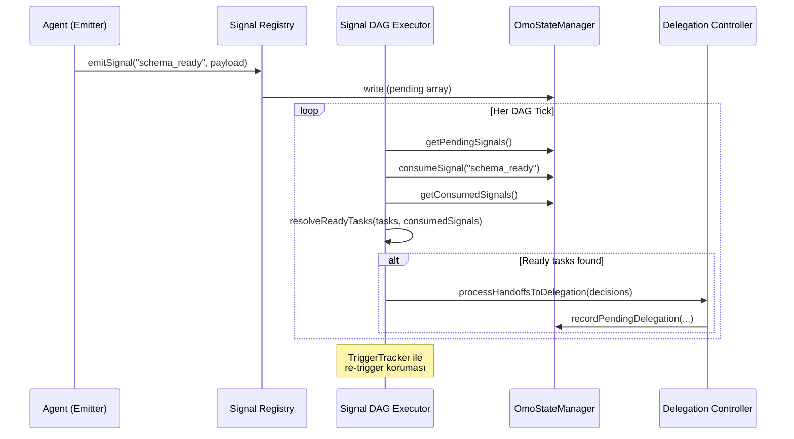
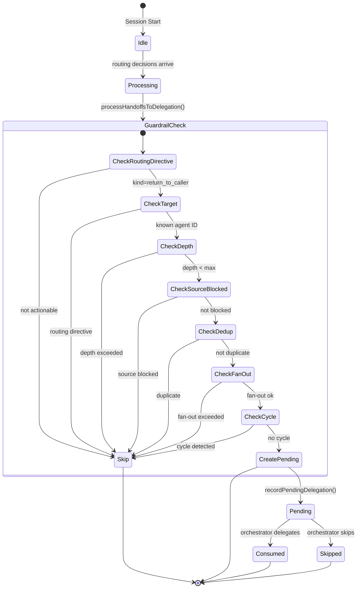
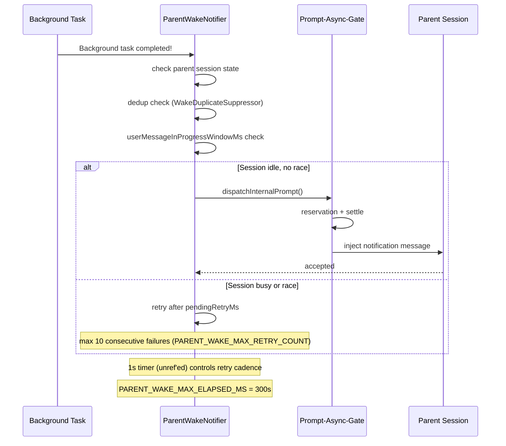
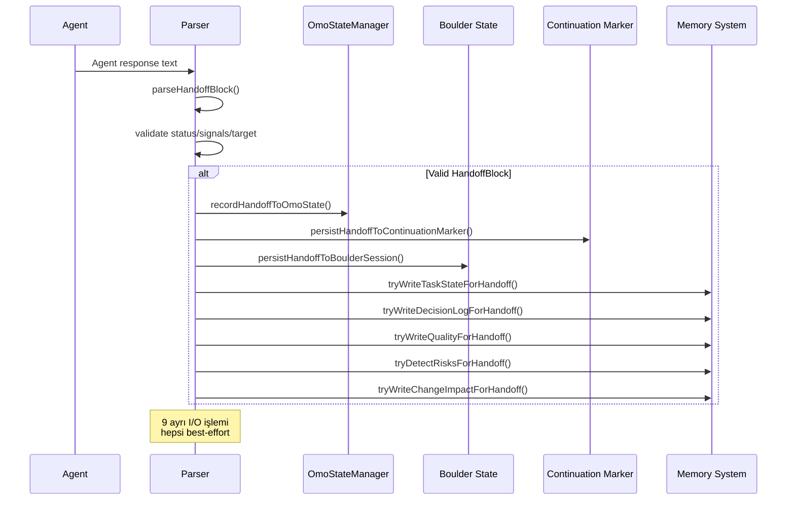
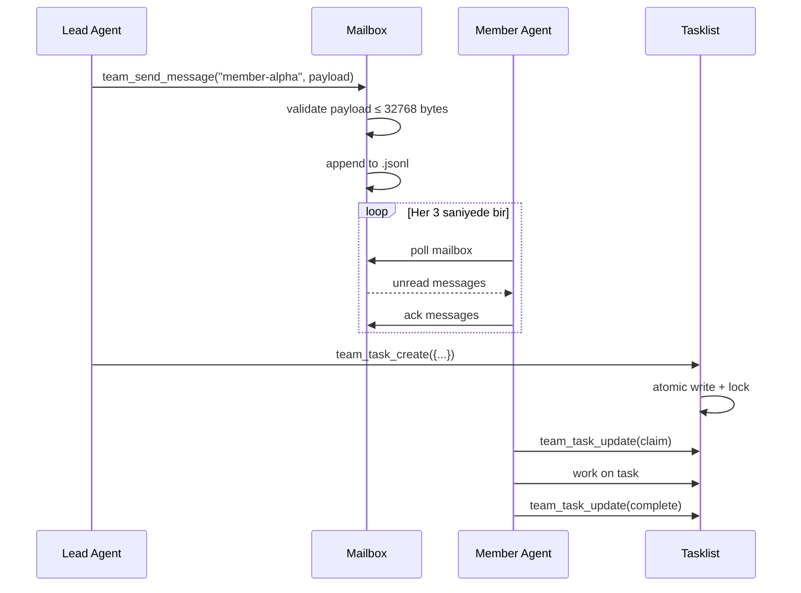
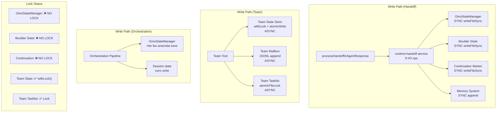

# Agent İletişimi ve Paralel Çalışma — İleri Seviye Teknik Rapor

**Doküman:** Hecateq OpenAgent (oh-my-openagent-hecateq fork)  
**Sürüm:** v4.2.0+ (Hecateq)  
**Tarih:** 2026-06-21  
**Hedef Kitle:** Sistemi derinlemesine anlamak isteyen ileri seviye geliştiriciler  
**Dil:** Türkçe (teknik terimler İngilizce)  
**İletişim Kanalı:** structured handoff blocks, JSON-based signal DAG, file-based mailbox, async parent wake, state machine delegation  

---

## İçindekiler

1. [Yönetici Özeti](#1-yönetici-özeti-executive-summary)
2. [İletişim Topolojisi (5 Katman)](#2-i̇letişim-topolojisi-5-katman)
   - 2.1 [Handoff Blokları (Structured Text Protocol)](#21-handoff-blokları-structured-text-protocol)
   - 2.2 [Signal DAG (Publish/Subscribe)](#22-signal-dag-publishsubscribe)
   - 2.3 [Delegation Controller (State Machine)](#23-delegation-controller-state-machine)
   - 2.4 [Team Mode Mailbox (File-Based)](#24-team-mode-mailbox-file-based)
   - 2.5 [Background Agent Parent Wake](#25-background-agent-parent-wake)
3. [Senkronizasyon Primitifleri](#3-senkronizasyon-primitifleri)
   - 3.1 [Prompt-Async-Gate (Central Injection Governor)](#31-prompt-async-gate-central-injection-governor)
   - 3.2 [Atomic File Locks](#32-atomic-file-locks)
   - 3.3 [Cycle Detection (DFS)](#33-cycle-detection-dfs)
   - 3.4 [Reservation + Dedup](#34-reservation--dedup)
   - 3.5 [Circuit Breaker](#35-circuit-breaker)
4. [Hata Durumları (Failure Modes)](#4-hata-durumları-failure-modes)
   - 4.1 [Agent Crash / Session Error](#41-agent-crash--session-error)
   - 4.2 [Timeout'lar](#42-timeoutlar)
   - 4.3 [Deadlock Patterns](#43-deadlock-patterns)
   - 4.4 [Race Condition Koruması](#44-race-condition-koruması)
   - 4.5 [Best-Effort Pattern](#45-best-effort-pattern)
5. [Performans Karakteristikleri](#5-performans-karakteristikleri)
   - 5.1 [Concurrency Limits Tablosu](#51-concurrency-limits-tablosu)
   - 5.2 [Latency Tablosu](#52-latency-tablosu)
   - 5.3 [Memory & Storage Limitleri](#53-memory--storage-limitleri)
   - 5.4 [File I/O Pattern](#54-file-io-pattern)
6. [Kritik Yollar (Bottlenecks)](#6-kritik-yollar-bottlenecks)
   - 6.1 [Orchestration Pipeline](#61-orchestration-pipeline)
   - 6.2 [Prompt-Async-Gate](#62-prompt-async-gate)
   - 6.3 [OmoStateManager](#63-omostatemanager)
   - 6.4 [Team Mailbox](#64-team-mailbox)
7. [Paralel Çalışma Kalıpları](#7-paralel-çalışma-kalıpları)
   - 7.1 [Hephaestus Native Parallel](#71-hephaestus-native-parallel)
   - 7.2 [Wave-Based Task Execution](#72-wave-based-task-execution)
   - 7.3 [Background Concurrency](#73-background-concurrency)
   - 7.4 [Worktree Isolation](#74-worktree-isolation)
8. [State Yönetimi](#8-state-yönetimi)
   - 8.1 [Session State](#81-session-state)
   - 8.2 [Tool Metadata Store](#82-tool-metadata-store)
   - 8.3 [Memory Manifest](#83-memory-manifest)
   - 8.4 [Run Continuation](#84-run-continuation)
   - 8.5 [Claude Tasks](#85-claude-tasks)
   - 8.6 [Boulder State](#86-boulder-state)
   - 8.7 [MCP Per-Session Isolation](#87-mcp-per-session-isolation)
9. [Anti-Pattern'ler (10+ Yasak)](#9-anti-patternler-10-yasak)
10. [Öneriler (Recommendations)](#10-öneriler-recommendations)

---

## 1. Yönetici Özeti (Executive Summary)

oh-my-openagent-hecateq sistemi, **5 farklı iletişim kanalı** ve **3 concurrency katmanı** üzerine inşa edilmiş, çok-ajanlı (multi-agent) bir orchestration platformudur. Bu rapor, ajanlar arası iletişimin ve paralel çalışmanın mimarisini, senkronizasyon primitiflerini, hata durumlarını ve performans karakteristiklerini derinlemesine analiz eder.

### 5 İletişim Kanalı

| # | Kanal | Mekanizma | Gecikme | Kalıcılık |
|---|-------|-----------|---------|-----------|
| 1 | **Handoff Blokları** | Structured text (STATUS/SIGNALS_EMITTED/HANDOFF) | <1ms parse | Disk (3 yedek) |
| 2 | **Signal DAG** | JSON-based publish/subscribe | <5ms tick | `.omo/hecateq/state.json` |
| 3 | **Delegation Controller** | State machine + 8 guardrail | <50ms | `.omo/hecateq/state.json` |
| 4 | **Team Mailbox** | File-based `.jsonl` | 3s poll interval | `~/.omo/teams/{name}/mailbox/` |
| 5 | **Background Parent Wake** | `dispatchInternalPrompt()` | 1-5s | In-memory + session state |

### 3 Concurrency Katmanı

| Katman | Limit | Mekanizma |
|--------|-------|-----------|
| **Background Tasks** | 5 per `${providerID}/${modelID}` | FIFO queue (`ConcurrencyManager`) |
| **Team Mode** | 4-8 parallel members | Zod-validated config |
| **Auto-Spawn** | 5 max concurrent | `SpawnPolicy` + rate limiting |

### En Kritik Yapı: Prompt-Async-Gate

`src/shared/prompt-async-gate.ts` (214 LOC) — Tüm internal mesaj enjeksiyonlarının merkezi governor'ı. OpenCode'un "stubborn" tasarımı nedeniyle `session.prompt` / `session.promptAsync` çağrılarını kontrol altına alır. Queue behavior (`defer` | `enqueue`), reservation sistemi ve dedup ile duplicate mesajları engeller.

### En Büyük Risk: Sync File I/O + Multi-Persistence

Bir handoff bloğu işlenirken **6 farklı yere** yazılır:
1. `.omo/hecateq/state.json` (canonical — `OmoStateManager`)
2. Run-continuation marker'ı (fallback)
3. Boulder task session state (fallback)
4. Task State Memory (`tasks.jsonl`)
5. Decision Log (`decisions.jsonl`)
6. Quality history / risk profile / change impact map

Tüm yazmalar **best-effort** (try/catch ile sarılı). Hatalar sessizce yutulur — hiçbir hata caller'a iletilmez.

### En Büyük Bottleneck: OmoStateManager

`src/features/hecateq-orchestration/omo-state-manager.ts` (734 LOC) — Tüm state yönetimi **sync** `readFileSync`/`writeFileSync` ile yapılır. File-level lock yoktur. Son yazan kazanır (last-writer-wins). Her pipeline fazı arasında state save edilir.

---

## 2. İletişim Topolojisi (5 Katman)

### 2.1 Handoff Blokları (Structured Text Protocol)

**Dosya:** `src/features/hecateq-orchestration/`  
**Toplam LOC:** ~1,495 (test hariç)

#### Dosya Dökümü

| Dosya | LOC | Görevi |
|-------|-----|--------|
| `handoff-parser.ts` | 364 | Agent output'tan STATUS/SIGNALS_EMITTED/HANDOFF bloklarını parse eder |
| `handoff-parser.test.ts` | — | Parser testleri |
| `runtime-handoff-service.ts` | 688 | Extraction + multi-persistence orchestration |
| `runtime-handoff-service.test.ts` | — | Service testleri |
| `handoff-role-policy.ts` | 258 | Role-based handoff validation (orchestrator/implementer/reviewer) |
| `handoff-role-policy.test.ts` | — | Role policy testleri |
| `handoff-context-injection.ts` | 75 | Handoff context summary builder |
| `handoff-context-injection.test.ts` | — | Context injection testleri |
| `handoff-boulder-projection.ts` | 114 | Handoff → Boulder state projection |
| `handoff-boulder-projection.test.ts` | — | Projection testleri |

#### HandoffBlock Interface

```typescript
// handoff-parser.ts (lines 40-61)
export interface HandoffBlock {
  /** Parsed status, or null if missing/invalid */
  status: HandoffStatus | null;                    // "DONE" | "IN_PROGRESS" | "BLOCKED"
  /** Parsed signals (always an array) */
  signals: HandoffSignal[];                         // [{signal, payload}]
  /** Parsed handoff target, or null if missing */
  handoff: HandoffTarget | null;                    // "return_to_caller" | agent-id
  /** v2: Confidence score (0.0-1.0) */
  confidence: number | null;
  /** v2: Files changed during this task */
  changedFiles: ChangedFileEntry[];                 // [{path, changeType}]
  /** v2: Free-text quality notes */
  qualityNotes: string | null;
  /** v2: Blockers preventing further progress */
  blockers: string[];
  /** v2: Agent recommended for the next task */
  nextRecommendedAgent: string | null;
  /** Validation issues collected during parsing (never throws) */
  validationIssues: HandoffValidationIssue[];       // [{field, message, severity}]
  /** Raw input that was parsed */
  raw: string;
}
```

#### HandoffBlock Format (Agent Output'ta)

Her ajan, yanıtının sonunda aşağıdaki bloku üretebilir:

```
STATUS: DONE
SIGNALS_EMITTED: [{"signal":"schema_ready","payload":{"tables":["users","posts"]}}]
HANDOFF: return_to_caller
CONFIDENCE: 0.95
CHANGED_FILES: [{"path":"prisma/schema.prisma","changeType":"modified"}]
QUALITY_NOTES: Migration tested against staging, no data loss
BLOCKERS: []
NEXT_RECOMMENDED_AGENT: nodejs-backend-developer
```

#### Parser: `parseHandoffBlock()`

```typescript
// handoff-parser.ts (line 105)
export function parseHandoffBlock(input: string): HandoffBlock
```

**Önemli özellikler:**
- **Asla throw etmez** — malformed input'ta validationIssues dizisine hata ekler
- **Backward compatible**: v1 bloklar (STATUS + SIGNALS + HANDOFF) v2 ile aynı şekilde çalışır
- **Last-occurrence-wins**: aynı field birden fazla satırda geçiyorsa sonuncusu kullanılır
- **KNOWN_SIGNAL_NAMES** validasyonu: signal-registry'de tanımlı olmayan sinyaller için warning üretir

#### 3 Yere Yazma Pattern (Canonical + 2 Fallback)

```typescript
// runtime-handoff-service.ts (lines 641-686)
export function processHandoffInAgentResponse(
  textContent: string,
  directory: string,
  sessionId: string,
): HandoffBlock | null {
  // 1. Extract
  const handoff = extractHandoffFromAgentResponse(textContent)
  if (!handoff) return null

  // 2. Canonical write: .omo/hecateq/state.json
  recordHandoffToOmoState(directory, handoff)

  // 3. Fallback 1: run-continuation marker
  persistHandoffToContinuationMarker(directory, sessionId, handoff)

  // 4. Fallback 2: Boulder state
  const state = readBoulderState(directory)
  if (state?.active_work_id) {
    persistHandoffToBoulderSession(directory, state.active_work_id, handoff)
  }

  // 5. Task State Memory (best-effort)
  tryWriteTaskStateForHandoff(handoff, directory, sessionId)

  // 6. Decision Log (best-effort, only if decision content exists)
  tryWriteDecisionLogForHandoff(handoff, directory, sessionId)

  // 7. Quality history (best-effort)
  tryWriteQualityForHandoff(handoff, directory)

  // 8. Risk detection (best-effort)
  tryDetectRisksForHandoff(handoff, directory)

  // 9. Change impact (best-effort)
  tryWriteChangeImpactForHandoff(handoff, directory, sessionId)

  return handoff
}
```

**Risk:** `processHandoffInAgentResponse` 9 farklı I/O işlemi yapar. Her biri try/catch ile sarılı — başarısızlık sessizce yutulur. Hiçbir hata caller'a bildirilmez.

#### 8 Guardrail (Delegation Controller)

`delegation-controller.ts` (356 LOC) içinde `processHandoffsToDelegation()` fonksiyonu 8 guardrail uygular:

| # | Guardrail | Kod | Açıklama |
|---|-----------|-----|----------|
| 1 | **Routing Directive Only** | `decision.kind !== "return_to_caller"` | Sadece `return_to_caller` kararlarını işle |
| 2 | **Not Routing Directive** | `isRoutingDirective(target)` | "return_to_caller"/"return_to_parent_for_routing" direktiflerini atla |
| 3 | **Known Agent ID** | `!knownAgentsExcludingDirectives.includes(target)` | Bilinmeyen ajan ID'lerini engelle |
| 4 | **Max Routing Depth** | `routingDepth >= maxRoutingDepth` | Varsayılan 3, aşılırsa blokla |
| 5 | **No BLOCKED Source** | `sourceTask?.status === "blocked"` | BLOCKED task'lardan delegasyon yapma |
| 6 | **Dedup** | `isDuplicateDelegation()` | Aynı target+task+prompt tekrarını engelle |
| 7 | **Fan-Out Cap** | `perSourceCount >= maxFanOut` | Kaynak başına max 10 pending delegasyon |
| 8 | **Cycle Detection** | `cycleDetector.wouldCreateCycle()` | Reverse-pair chain'leri engelle (A→B, B→A) |

#### Role Policy (handoff-role-policy.ts)

```typescript
// handoff-role-policy.ts
export type AgentRole =
  | "orchestrator"      // → anyone
  | "implementer"       // → any known agent
  | "architect-builder" // → NOT other architects
  | "reviewer-auditor"  // → MUST NOT implementers
  | "docs-research"     // → only caller/parent/orchestrator
  | "unknown"           // → no policy

export function validateHandoffTargetByRole(
  sourceAgent: string,
  targetAgent: string,
): string | null  // null = valid, string = error message
```

**Mimari Karar:** Agent rolleri handoff güvenliği için kullanılır. Bir reviewer-agent doğrudan implementer'a handoff yapamaz — `return_to_parent_for_routing` kullanmak zorundadır.

---

### 2.2 Signal DAG (Publish/Subscribe)

**Dosya:** `src/features/hecateq-orchestration/signal-registry.ts` (148 LOC)  
**Dosya:** `src/features/hecateq-orchestration/signal-dag-executor.ts` (472 LOC)  
**Dosya:** `src/features/hecateq-orchestration/cycle-detector.ts` (118 LOC)

#### Tanımlı Sinyaller (KNOWN_SIGNALS)

```typescript
// signal-registry.ts (lines 46-110)
export const KNOWN_SIGNALS: HecateqSignalDefinition[] = [
  {
    signal: "schema_ready",
    emittedBy: ["database-specialist"],
    consumedBy: ["nodejs-backend-developer", "go-backend-developer", "python-ml-engineer"],
    category: "infrastructure",
  },
  {
    signal: "backend_ready",
    emittedBy: ["nodejs-backend-developer", "go-backend-developer"],
    consumedBy: ["qa-test-engineer", "security-architect", "performance-specialist"],
    category: "development",
  },
  // ... 7 more signals
]
```

| Signal | Emitter | Consumers | Kategori |
|--------|---------|-----------|----------|
| `schema_ready` | database-specialist | BE developers | infrastructure |
| `backend_ready` | BE developers | QA, security, performance | development |
| `ui_specs_ready` | design-translator, ux-motion-designer | FE developers, QA | development |
| `auth_audit_passed` | security-architect | BE developers, release-manager | quality |
| `infra_provisioned` | coolify-devops-specialist, devops-engineer | BE developers, release-manager | infrastructure |
| `pipeline_secured` | devsecops-pipeline-architect | release-manager, devops | deployment |
| `tests_passed` | qa-test-engineer | release-manager, BE/FE developers | quality |
| `performance_verified` | performance-specialist | release-manager, QA | quality |
| `compliance_signed` | compliance-specialist | release-manager, security | compliance |

#### Signal DAG Tick Akışı

```typescript
// signal-dag-executor.ts (lines 415-472)
export function signalDagTick(ctx: SignalDagContext): SignalDagTickResult {
  // 1. Consume pending signals → mark as consumed in state
  const pendingSignals = stateMgr.getPendingSignals()
  for (const pending of pendingSignals) {
    stateMgr.consumeSignal(pending.signal)
  }

  // 2. Load consumed signals
  const consumedSignals = stateMgr.getConsumedSignals()
  const consumedSignalNames = new Set(consumedSignals.map(s => s.signal))

  // 3. Resolve ready tasks (signal-based + dependency-based)
  const readyTasks = resolveReadyTasks(tasks, consumedSignalNames)

  // 4. Filter by TriggerTracker (prevent re-trigger)
  const newTasks = tracker
    ? readyTasks.filter(t => !tracker.isAlreadyTriggered(t.id))
    : readyTasks

  // 5. Convert to delegation decisions
  const decisions = newTasks.map(task => ({
    kind: "return_to_caller",
    reason: `Signal-DAG: all required signals satisfied for "${task.id}"`,
    originalTarget: task.assignedAgent ?? null,
    sourceTaskId: task.id,
    sourceAgent: task.assignedAgent,
  }))

  // 6. Write pending delegations
  processHandoffsToDelegation({ decisions, tasks: newTasks, projectDir })
}
```



#### TriggerTracker

```typescript
// cycle-detector.ts (lines 100-118)
export class SignalDagTriggerTracker {
  private triggeredTaskIds = new Set<string>()

  markTriggered(taskId: string): void { this.triggeredTaskIds.add(taskId) }
  isAlreadyTriggered(taskId: string): boolean { return this.triggeredTaskIds.has(taskId) }
  getTriggeredCount(): number { return this.triggeredTaskIds.size }
  reset(): void { this.triggeredTaskIds.clear() }
}
```

**Sınırlama:** `triggeredTaskIds` sadece Set<string>. Tekrar başlatılmazsa (reset()), sonsuza kadar büyür. Memory leak potansiyeli.

#### Dynamic DAG Mutations (Stretch Goal)

```typescript
// signal-dag-executor.ts (lines 139-208)
export function applyDagMutations(
  mutations: DagMutationBlock,
  existingTasks: TaskNode[],
  sourceTaskId: string,
  sourceAgent: string,
  cycleDetector: DelegationCycleDetector,
  stateMgr: OmoStateManager,
): ApplyMutationsResult
```

**Limitler:**
- `HECATEQ_MAX_NODES_PER_MUTATION = 10`
- `HECATEQ_DYNAMIC_DAG_NODES_MAX = 50`
- `HECATEQ_DYNAMIC_EDGES_MAX = 100`
- `HECATEQ_APPLIED_MUTATIONS_MAX = 50`

---

### 2.3 Delegation Controller (State Machine)

**Dosya:** `src/features/hecateq-orchestration/delegation-controller.ts` (356 LOC)

Delegation Controller, Hecateq God orchestrator'ın okuduğu bir **state machine**'dir. Auto-spawn yapmaz — sadece pending delegation'ları state'e yazar. Orchestrator, mevcut `task()` altyapısını kullanarak bu delegation'ları consume eder.



#### Pending Delegation Interface

```typescript
// types.ts (lines 890-909)
export interface HecateqPendingDelegation {
  id: string                              // "dlg_{target}_{timestamp}_{random}"
  targetAgent: string                     // Known agent ID
  prompt: string                          // Task prompt
  sourceTaskId?: string
  sourceAgent?: string
  createdAt: string                       // ISO-8601
  status: DelegationRequestStatus         // "pending" | "consumed" | "skipped"
  routingDepth: number
  guardrailChecks?: string[]              // Debug için
}
```

#### consumeDelegation() Pattern

```typescript
// delegation-controller.ts (lines 340-356)
export function consumeDelegation(
  projectDir: string,
  delegationId: string,
  executionResult: "executed" | "skipped" | "blocked" = "executed",
  blockReason?: string,
): boolean
```

**Kullanım:** Orchestrator, bir pending delegation'ı okur, `task(subagent_type=targetAgent, prompt=...)` ile delegasyonu yapar, sonucu `consumeDelegation()` ile state'e kaydeder.

#### State Constants

```typescript
// types.ts
export const HECATEQ_MAX_ROUTING_DEPTH = 3       // Max nested delegation
export const HECATEQ_DELEGATION_PENDING_MAX = 20   // Pending queue limit
export const HECATEQ_DELEGATION_HISTORY_MAX = 100  // History limit
```

---

### 2.4 Team Mode Mailbox (File-Based)

**Dosya:** `src/features/team-mode/`  
**Toplam:** ~60 dosya, ~8 alt dizin, ~13,000 LOC

#### Config

```jsonc
// team_mode config
{
  "team_mode": {
    "enabled": false,
    "tmux_visualization": false,
    "max_parallel_members": 4,            // 1..8
    "max_members": 8,                     // 1..8 hard cap (Zod validated)
    "max_messages_per_run": 10000,
    "max_wall_clock_minutes": 120,
    "max_member_turns": 500,
    "message_payload_max_bytes": 32768,   // Per-message limit
    "recipient_unread_max_bytes": 262144, // Per-recipient inbox cap
    "mailbox_poll_interval_ms": 3000      // Poll cadence
  }
}
```

#### 12 Team_* Tools

| Tool | Kaynak | Purpose |
|------|--------|---------|
| `team_create` | `tools/lifecycle.ts` | Team + member session'larını oluştur |
| `team_delete` | `tools/lifecycle.ts` | State, mailbox, tasklist, worktree temizle |
| `team_shutdown_request` | `tools/lifecycle.ts` | Member kendi shutdown'unu talep eder |
| `team_approve_shutdown` | `tools/lifecycle.ts` | Lead shutdown'u onaylar |
| `team_reject_shutdown` | `tools/lifecycle.ts` | Lead shutdown'u reddeder |
| `team_send_message` | `tools/messaging.ts` | Member'a veya broadcast (*) mesaj gönder |
| `team_task_create` | `tools/tasks.ts` | Shared task list'e task ekle |
| `team_task_list` | `tools/tasks.ts` | Task'leri filtrele (status/owner) |
| `team_task_update` | `tools/tasks.ts` | Claim/complete/delete (atomic file lock) |
| `team_task_get` | `tools/tasks.ts` | Tek task getir |
| `team_status` | `tools/query.ts` | Full team durumu (members, tasks, mailbox) |
| `team_list` | `tools/query.ts` | Declared + active team'leri listele |

#### Storage Layout

```
~/.omo/teams/{name}/                       # user scope
<project>/.omo/teams/{name}/               # project scope (kazanır)
  ├── config.json                          # TeamSpec (Zod validated)
  ├── state.json                           # Runtime: members, sessionIDs, lifecycle
  ├── mailbox/                             # Her recipient için .jsonl
  │   ├── member-alpha.json
  │   └── member-beta.json
  ├── tasklist.jsonl                       # Shared task list
  └── worktrees/{member-name}/             # Git worktree per member
```

#### Mailbox İşleyişi

```typescript
// team-mailbox/send.ts — mesaj gönderme
// team-mailbox/poll.ts — mesaj okuma (3s interval)
// team-mailbox/inbox.ts — gelen mesajları listeleme
// team-mailbox/ack.ts — mesaj onaylama
// team-mailbox/reservation.ts — reservation mechanism
```

**JSONL formatı:** Her satır bir JSON mesajı içerir. Yeni mesajlar append edilir. Ack mekanizması dosyayı okuyup işaretler.

#### Member Eligibility

```typescript
// types.ts — AGENT_ELIGIBILITY_REGISTRY
export const AGENT_ELIGIBILITY_REGISTRY = {
  "sisyphus":         "eligible" as const,
  "atlas":            "eligible" as const,
  "sisyphus-junior":  "eligible" as const,
  "hephaestus":       "conditional" as const,  // needs teammate: "allow" permission
  "oracle":           "hard-reject" as const,
  "librarian":        "hard-reject" as const,
  "explore":          "hard-reject" as const,
  "multimodal-looker":"hard-reject" as const,
  "metis":            "hard-reject" as const,
  "momus":            "hard-reject" as const,
  "prometheus":       "hard-reject" as const,
}
```

---

### 2.5 Background Agent Parent Wake

**Dosya:** `src/features/background-agent/parent-wake-notifier.ts` (587 LOC)  
**Dosya:** `src/features/background-agent/wake-idempotency.ts`  
**Dosya:** `src/features/background-agent/wake-route-registry.ts`  
**Dosya:** `src/features/background-agent/wake-event-bus.ts`



#### Key Constants

```typescript
// parent-wake-notifier.ts
export const PARENT_WAKE_MAX_RETRY_COUNT = 10       // Max consecutive failure
const PARENT_WAKE_MAX_ELAPSED_MS = 300_000           // 300s total timeout
const userMessageInProgressWindowMs = 500             // macOS SIGABRT race fix
```

#### Çalışma Prensibi

1. Background task tamamlanınca `enqueueNotificationForParent()` çağrılır
2. `ParentWakeNotifier` 1s timer ile periyodik olarak parent session'ı kontrol eder
3. Kontroller: `session.idle` mi? Son mesaj user message mı? Tool call in progress mi?
4. Tüm kontroller geçilince `dispatchInternalPrompt()` ile parent'a mesaj enjekte edilir
5. `consecutiveFailures >= 10` → wake abandoned
6. `elapsed > PARENT_WAKE_MAX_ELAPSED_MS` → wake abandoned

#### WakeDuplicateSuppressor

```typescript
// wake-idempotency.ts
export class WakeDuplicateSuppressor {
  // sessionID + notification hash + reply mode ile duplicate koruması
  isDuplicate(sessionId: string, notificationKey: string): boolean
  markDispatched(sessionId: string, notificationKey: string): void
}
```

---

## 3. Senkronizasyon Primitifleri

### 3.1 Prompt-Async-Gate (Central Injection Governor)

**Dosya:** `src/shared/prompt-async-gate.ts` (214 LOC)  
**Alt dosyalar:**
- `src/shared/prompt-async-gate/queue.ts`
- `src/shared/prompt-async-gate/reservations.ts`
- `src/shared/prompt-async-gate/session-idle-dispatch.ts`
- `src/shared/prompt-async-gate/timing.ts`
- `src/shared/prompt-async-gate/types.ts`

#### NEDEN VAR?

OpenCode'un **"stubborn"** tasarımı nedeniyle plugin'ler `session.prompt` / `session.promptAsync` API'si aracılığıyla ana sisteme mesaj enjekte edebilir. Bu API:
- `promptAsync` çağrıldığında mesajın kabul edilip edilmediğini **dönmeden önce bildirmez**
- Geç hatalar `session.error` olarak **asenkron** gelir
- Birden fazla hook/tool aynı idle/error/completion edge'ini gözlemleyip **aynı mesajı tekrar tekrar enjekte edebilir**

Bu nedenle tüm internal mesaj enjeksiyonları `dispatchInternalPrompt()` üzerinden geçmek **ZORUNDADIR**.

#### Core API

```typescript
// prompt-async-gate.ts (lines 71-173)
export async function dispatchInternalPrompt<TInput = PromptAsyncInput>(
  args: InternalPromptDispatchArgs<TInput>,
): Promise<InternalPromptDispatchResult>
```

#### Queue Behavior

```typescript
// prompt-async-gate.ts (line 109)
const queueBehavior = args.queueBehavior ?? (args.mode === "sync" ? "defer" : "enqueue")
```

| Behavior | Sync Mode | Async Mode | Açıklama |
|----------|-----------|------------|----------|
| `defer` | Default | — | Session idle olana kadar bekle. Eğer reservation varsa veya queue draining ise "reserved" döndür |
| `enqueue` | — | Default | Prompt'u FIFO queue'ya ekle. Queue drain edilince dispatch et |

#### Reservation Sistemi

```typescript
// prompt-async-gate/reservations.ts
function getActiveReservation(sessionID: string): { source: string; dedupeKey: string } | null
function getQueuedPromptBlocker(sessionID: string): string | undefined
function isPromptQueueDraining(sessionID: string): boolean
```

Bir session'da zaten aktif bir reservation varsa (önceden dispatch edilmiş bir prompt bekliyor), yeni dispatch `{ status: "reserved", reservedBy: source }` döndürür — prompt sessizce atlanır.

#### dispatchAfterSessionIdle() Akışı

```typescript
// prompt-async-gate/session-idle-dispatch.ts
export async function dispatchAfterSessionIdle(args: {
  sessionName: string
  client: PluginInput["client"]
  sessionID: string
  input: unknown
  source: string
  dedupeKey: string
  settleMs: number            // DEFAULT_SESSION_IDLE_SETTLE_MS
  postDispatchHoldMs: number  // DEFAULT_PROMPT_ASYNC_POST_DISPATCH_HOLD_MS
  dispatchTimeoutMs: number   // DEFAULT_PROMPT_DISPATCH_TIMEOUT_MS
  checkStatus?: boolean
  checkToolState?: boolean
  oneShotRetryForShapeMismatch?: boolean
  dispatch: (input: unknown) => Promise<unknown>
}): Promise<InternalPromptDispatchResult>
```

**Akış:**
1. Session'ın idle olmasını bekle (`settleMs` milisaniye)
2. Reservation oluştur
3. `dispatch(input)` çağır
4. `postDispatchHoldMs` boyunca bekle (race condition koruması)
5. Reservation'ı temizle

#### Timing Constants

```typescript
// prompt-async-gate/timing.ts
export const DEFAULT_PROMPT_ASYNC_POST_DISPATCH_HOLD_MS = 200   // 200ms hold
export const DEFAULT_PROMPT_DISPATCH_TIMEOUT_MS = 30_000         // 30s timeout
export const DEFAULT_PROMPT_QUEUE_RETRY_MS = 500                 // 500ms retry
```

#### Audit Test (Enforcement)

```typescript
// src/shared/prompt-async-route-audit.test.ts
// TS Compiler API ile tüm codebase'i tarar ve raw session.promptAsync() çağrılarını audit eder
// FAIL: eğer audit dışında herhangi bir raw çağrı bulursa
```

---

### 3.2 Atomic File Locks

**Dosya:** `src/features/team-mode/team-state-store/locks.ts` (139 LOC)

```typescript
// locks.ts
export async function withLock<T>(
  lockPath: string,
  fn: () => Promise<T>,
  opts?: LockOptions,
): Promise<T>
```

#### Çalışma Prensibi

1. `open(lockPath, "wx")` ile lock dosyası oluştur
2. Başarısız olursa (`EEXIST`): stale lock kontrolü yap
3. Stale ise: `reapStaleLock()` ile temizle, tekrar dene
4. Stale değilse: `LOCK_RETRY_MS` (50ms) bekle, tekrar dene
5. `LOCK_WAIT_TIMEOUT_MS` (4000ms) aşılınca timeout hatası fırlat

```typescript
export const LOCK_RETRY_MS = 50
export const LOCK_WAIT_TIMEOUT_MS = 4_000
export const DEFAULT_STALE_TTL = 300_000  // 300s stale lock threshold
```

#### Stale Lock Detection

```typescript
// locks.ts
export function parseOwnerContent(content: string): { ownerPid: number; acquiredAtEpochMs: number } | null

export async function detectStaleLock(lockPath: string, staleAfterMs: number): Promise<boolean> {
  // 1. Read lock file → parse owner (pid + timestamp)
  // 2. Check if pid is alive (process.kill(pid, 0))
  // 3. If pid dead AND (now - acquired) > staleAfterMs → stale
}
```

#### atomicWrite Pattern

```typescript
export async function atomicWrite(
  filePath: string,
  content: string | Buffer,
  deps: AtomicWriteDeps = {},
): Promise<void> {
  // 1. Write to temp file: {filePath}.tmp.{uuid}
  // 2. fsync temp file
  // 3. rename(temp, filePath) ← atomic on same filesystem
  // 4. On error: clean up temp file
}
```

**Dikkat:** `atomicWrite` sadece team-mode için kullanılır. Diğer state yönetimleri (`OmoStateManager`, `OrchestrationController`) doğrudan `writeFileSync` kullanır — **file-level lock yoktur**.

---

### 3.3 Cycle Detection (DFS)

#### Delegasyon Cycle Detector

```typescript
// cycle-detector.ts (lines 1-98)
export class DelegationCycleDetector {
  private adjacency = new Map<string, Set<string>>()

  recordDelegation(sourceAgent: string, targetAgent: string): void {}
  wouldCreateCycle(sourceAgent: string, targetAgent: string): { cycle: boolean; reason?: string }
  findPath(from: string, to: string): string[]  // DFS stack-based
}
```

**Cycle detection algoritması:**
1. `wouldCreateCycle(A, B)` kontrolü: B'den A'ya path var mı?
2. Path varsa: "N-hop cycle detected: adding 'A → B' would create cycle: B → ... → A"
3. Self-loop kontrolü: `sourceAgent === targetAgent` ise direkt cycle

```typescript
// cycle-detector.ts (lines 24-44)
wouldCreateCycle(sourceAgent: string, targetAgent: string): { cycle: boolean; reason?: string } {
  if (sourceAgent === targetAgent) {
    return { cycle: true, reason: `Self-loop detected: "${sourceAgent}" cannot delegate to itself` }
  }
  if (this.hasPath(targetAgent, sourceAgent)) {
    const path = this.findPath(targetAgent, sourceAgent)
    return { cycle: true, reason: `N-hop cycle detected: ... ${path.join(" → ")} → ${sourceAgent}` }
  }
  return { cycle: false }
}
```

#### Dependency Planner (Kahn's Algorithm)

```typescript
// dependency-planner.ts
export function buildDependencyPlan(tasks: TaskNode[]): DependencyPlan {
  // Kahn's algorithm for topological sort
  // Returns: batches of parallel-executable tasks
}
```

#### 3-Color DFS (Dependency Graph)

```typescript
// types.ts — TaskNode.dependsOn ve requiredSignals ile cycle detection
// Status-based: completed → failed → blocked → skipped transitionları ile DAG yürütülür
```

---

### 3.4 Reservation + Dedup

#### Prompt-Async-Gate Per-Session Reservation

```typescript
// prompt-async-gate/reservations.ts
function getActiveReservation(sessionID: string): { source: string; dedupeKey: string } | null
function getPromptReservation(sessionID: string): { ... } | null
function deletePromptReservation(sessionID: string): void
function reservationSourceMatches(a: string, b: string, prefix?: string): boolean
```

Her session'da sadece **bir** aktif reservation olabilir. İkinci bir dispatch attempt'i `{ status: "reserved" }` döndürür.

#### WakeDuplicateSuppressor

```typescript
// background-agent/wake-idempotency.ts
export class WakeDuplicateSuppressor {
  // Key: sessionID + notification hash + reply mode
  isDuplicate(sessionId: string, notificationKey: string): boolean
  markDispatched(sessionId: string, notificationKey: string): void
}
```

#### Delegation Dedup (Guardrail 6)

```typescript
// delegation-controller.ts (lines 41-52)
function isDuplicateDelegation(
  delegation: { targetAgent: string; sourceTaskId?: string; prompt: string },
  existingPending: HecateqPendingDelegation[],
): boolean {
  const promptKey = delegation.prompt.slice(0, 200)
  return existingPending.some(d =>
    d.targetAgent === delegation.targetAgent &&
    d.sourceTaskId === delegation.sourceTaskId &&
    d.prompt.slice(0, 200) === promptKey
  )
}
```

**Dedup anahtarı:** `targetAgent + sourceTaskId + prompt (ilk 200 karakter)`

---

### 3.5 Circuit Breaker

#### Background Agent Circuit Breaker

**Dosya:** `src/features/background-agent/loop-detector.ts` (102 LOC)  
**Dosya:** `src/features/background-agent/fallback-retry-handler.ts`

```typescript
// loop-detector.ts
export interface CircuitBreakerSettings {
  enabled: boolean                                   // default: true
  maxToolCalls: number                               // default: 4000
  consecutiveThreshold: number                       // default: 20
}

export function recordToolCall(
  window: ToolCallWindow | undefined,
  toolName: string,
  settings: CircuitBreakerSettings,
  toolInput?: Record<string, unknown> | null
): ToolCallWindow

export function detectRepetitiveToolUse(
  window: ToolCallWindow | undefined
): ToolLoopDetectionResult  // { triggered, toolName, repeatedCount }
```

**Repetitive tool use detection:** Aynı tool aynı input ile `consecutiveThreshold` (20) kez çağrılırsa circuit breaker tetiklenir. Tool call signature'ı `toolName + JSON.stringify(sortedInput)` ile hesaplanır.

#### checkAndInterruptStaleTasks()

```typescript
// background-agent/manager.ts
checkAndInterruptStaleTasks(): void {
  // Stale timeout: DEFAULT_STALE_TIMEOUT_MS = 2,700,000 (45 min)
  // Session gone timeout: DEFAULT_SESSION_GONE_TIMEOUT_MS = 60,000 (1 min)
  // Interrupt stale tasks → status = "interrupted"
}
```

#### Fallback Retry Handler

```typescript
// fallback-retry-handler.ts
// Coordinates retries with runtime-fallback system
// Trigger: 429, 500, 502, 503, 504
// Pattern: exponential backoff → max retries → circuit open
```

---

## 4. Hata Durumları (Failure Modes)

### 4.1 Agent Crash / Session Error

#### Runtime Fallback Hook

```
session.error event → runtime-fallback hook (src/hooks/runtime-fallback/)
```

Trigger eden hata kodları:
- `429` — Rate limit
- `500` — Internal server error
- `502` — Bad gateway
- `503` — Service unavailable
- `504` — Gateway timeout

#### 90s First-Prompt Watchdog

**Dosya:** `src/hooks/runtime-fallback/first-prompt-watchdog.ts` (206 LOC)

Subagent session'ları 90 saniye içinde **hiçbir ilerleme kaydetmezse** watchdog tetiklenir. Fallback mekanizması devreye girer veya session abort edilir.

#### LastErrorSignature

```typescript
// parent-wake-notifier.ts
// consecutive vs intermittent failure ayrımı
interface PendingParentWake {
  consecutiveFailures?: number
  lastFailureAt?: number
  lastErrorSignature?: string  // Aynı hata mı? Farklı hata mı?
}
```

---

### 4.2 Timeout'lar

| Zaman Aşımı | Değer | Kaynak |
|-------------|-------|--------|
| `default_task_timeout_ms` | 300,000ms (5 dk) | `orchestration` config |
| `spawn_timeout_ms` | 300,000ms (5 dk) | `auto_spawn` config |
| `syncPollTimeoutMs` | — | Background task poll timeout |
| `DEFAULT_PROMPT_DISPATCH_TIMEOUT_MS` | 30,000ms (30s) | `prompt-async-gate/timing.ts` |
| `DEFAULT_PROMPT_QUEUE_RETRY_MS` | 500ms | Queue retry interval |
| First-prompt watchdog | 90,000ms (90s) | `first-prompt-watchdog.ts` |
| `mailbox_poll_interval_ms` | 3,000ms (3s) | Team mode config |
| `LOCK_WAIT_TIMEOUT_MS` | 4,000ms (4s) | `locks.ts` |
| `PARENT_WAKE_MAX_ELAPSED_MS` | 300,000ms (5 dk) | `parent-wake-notifier.ts` |
| `DEFAULT_STALE_TIMEOUT_MS` | 2,700,000ms (45 dk) | Background task stale |
| `TASK_TTL_MS` | 1,800,000ms (30 dk) | Task history TTL |
| `POLLING_INTERVAL_MS` | 3,000ms (3s) | Background task poll |
| `MIN_STABILITY_TIME_MS` | 10,000ms (10s) | Completion stability window |
| `postDispatchHoldMs` | 200ms | Post-dispatch race guard |
| `settleMs` | `DEFAULT_SESSION_IDLE_SETTLE_MS` | Session idle settle |

---

### 4.3 Deadlock Patterns

#### maxDelegationLoopIterations: 3

Hecateq God delegasyon döngüsünde her bir delegasyon turu için max 3 iterasyon. 3'ten fazla delegasyon zinciri oluşursa orchestrator döngüyü sonlandırır.

#### maxRoutingDepth: 3

Delegation controller guardrail 4: `HECATEQ_MAX_ROUTING_DEPTH = 3`. A→B→C→D zinciri 3'ü aşarsa 4. delegasyon bloklanır.

#### lastMessageIsNoReply() Force Reply

```typescript
// background-agent/wake-tail-resolver.ts
function lastMessageIsNoReply(parentSessionMessages: ParentWakeSessionMessage[]): boolean {
  // Son mesaj "no-reply" modunda ise parent wake atlanır
}
```

#### Queue Full → FIFO

`ConcurrencyManager`'da kuyruk kapasite sınırı yoktur — FIFO sırasıyla bekler. Ancak `HECATEQ_DELEGATION_PENDING_MAX = 20` üzeri pending delegation'lar auto-prune edilir (en eski olanlar silinir).

---

### 4.4 Race Condition Koruması

#### team-session-registry: Spawn-Race-Safe Lookup

```typescript
// team-session-registry.ts
// registerTeamSession(sessionId, entry) — senkron çağrılır, sessionID bilinir bilinmez
// lookupTeamSession(sessionId) — loadRuntimeState()'ten ÖNCE çağrılmalı
```

**Anti-pattern:** `loadRuntimeState()` direkt çağrılırsa spawn-race window'u'na yakalanır.

#### prompt-async-gate: postDispatchHoldMs

```typescript
// session-idle-dispatch.ts
// dispatch() çağrıldıktan sonra postDispatchHoldMs (200ms) bekle
// Bu süre içinde başka bir kaynaktan gelen duplicate dispatch engellenir
```

#### userMessageInProgressWindowMs (macOS/SIGABRT Fix)

```typescript
// parent-wake-notifier.ts (line 81)
/**
 * If the latest message in the parent session is a user message added
 * within this window, the parent-wake injection is deferred. Prevents
 * the race where a parent-wake dispatchInternalPrompt collides with a
 * fresh user prompt, which on macOS/Electron has triggered native
 * SIGABRT crashes inside OpenCode's @parcel/watcher TSFN callback path.
 */
const userMessageInProgressWindowMs = 500
```

#### File-Level Atomic Rename

```typescript
// locks.ts — atomicWrite()
// 1. Write → temp file: {path}.tmp.{uuid}
// 2. fsync
// 3. rename(temp, path) ← atomic on same filesystem
```

---

### 4.5 "Best-Effort" Pattern

Sistemdeki birçok yazma işlemi **best-effort** olarak işaretlenmiştir:

```typescript
// runtime-handoff-service.ts
function recordHandoffToOmoState(...): boolean {
  try {
    // sync write
    return true
  } catch {
    return false  // HATA SESSİZCE YUTULDU
  }
}

function tryWriteTaskStateForHandoff(...): void {
  try {
    // write
  } catch (error) {
    log("handoff-task-state-write: Failed", { error })  // SADECE LOG
  }
}

function tryWriteDecisionLogForHandoff(...): void {
  try {
    // write
  } catch {
    // SESSİZCE YUTULDU
  }
}
```

**Risk:** Bu pattern, hataların fark edilmeden geçmesine neden olur. Özellikle disk dolu olduğunda veya yetki hatası oluştuğunda, state tutarsız hale gelir.

---

## 5. Performans Karakteristikleri

### 5.1 Concurrency Limits Tablosu

| Sistem | Limit | Tip | Configurable | Kaynak |
|--------|-------|-----|-------------|--------|
| Background tasks | 5 per `${providerID}/${modelID}` | FIFO queue | `background_task.modelConcurrency` | `concurrency.ts` |
| Team mode max parallel | 4 (range: 1-8) | Configurable | `team_mode.max_parallel_members` | Zod schema |
| Team mode max members | 8 (hard cap) | Zod validation | `team_mode.max_members` | Zod schema |
| Auto-spawn max concurrent | 5 | Configurable | `auto_spawn.max_concurrent_spawns` | types.ts |
| Routing depth | 3 | Hard guardrail | `delegation_chain.max_depth` | types.ts |
| Delegation fan-out | 10 | Hard guardrail | `delegation_chain.max_fan_out` | `delegation-controller.ts` |
| Delegation loop iterations | 3 | Hard guardrail | `delegation_chain.max_iterations_per_run` | types.ts |
| Subagent max depth | 3 | Configurable | `auto_spawn.max_spawn_depth` | types.ts |
| Wave parallel tasks | 8 | Configurable | — | `execution-planner.ts` |
| Pending delegations max | 20 | Auto-prune | — | types.ts |
| Delegation history max | 100 | Auto-prune | — | types.ts |
| Handoff history max | 20 | Auto-prune | — | `omo-state-manager.ts` |
| Signal pending max | 100 | Auto-prune | — | `omo-state-manager.ts` |
| Signal consumed max | 200 | Auto-prune | — | `omo-state-manager.ts` |
| Routing decisions max | 50 | Auto-prune | — | types.ts |
| Dynamic DAG nodes max | 50 | Auto-prune | — | types.ts |
| Dynamic DAG edges max | 100 | Auto-prune | — | types.ts |
| Applied mutations max | 50 | Auto-prune | — | types.ts |
| Spawn history max | 100 | Auto-prune | — | types.ts |
| Max nodes per mutation | 10 | Hard limit | — | types.ts |
| Max edges per mutation | 20 | Hard limit | — | types.ts |
| Logger | 50MB + .1 + .2 | Auto-rotate | — | logger.ts |
| Background queue | Unbounded | FIFO | — | `concurrency.ts` |

---

### 5.2 Latency Tablosu

| İşlem | Tipik Süre | Not |
|-------|-----------|-----|
| Handoff parse (`parseHandoffBlock`) | <1ms | Sadece string parsing, no I/O |
| Signal DAG tick (`signalDagTick`) | <5ms | In-memory Set/Map işlemleri |
| Cycle detection (100 nodes) | <10ms | DFS stack-based |
| Task claim (team-tasklist) | <50ms | Atomic file lock + JSON parse |
| Delegation guardrail check | <5ms | In-memory array operations |
| OmoStateManager.read() | ~1-5ms | `readFileSync` (sync I/O) |
| OmoStateManager.write() | ~5-20ms | `writeFileSync` + JSON.stringify |
| Parent wake dispatch | 1-5s | Session idle settle + post-dispatch hold |
| Mailbox poll | 3s (fixed interval) | Configurable |
| Task completion detection | ~10-13s | 3s poll × 3+ stable checks |
| Handoff full persistence | ~20-100ms | 6+ file writes (sync) |
| processHandoffInAgentResponse | ~50-200ms | 9 I/O operations |
| Orchestration pipeline (8 faz) | ~2-10s | Her faz arasında state save |
| Auto-spawn rate limit window | 60s | `spawn_window_ms` |
| Pause duration (auto-spawn) | 60s | `pause_duration_ms` |

---

### 5.3 Memory & Storage Limitleri

| Depolama | Limit | Pattern |
|----------|-------|---------|
| Handoff history | 20 entries | Auto-prune (FIFO) |
| Signal pending | 100 entries | Auto-prune (FIFO) |
| Signal consumed | 200 entries | Auto-prune (FIFO) |
| Delegation pending | 50 entries | Auto-prune (FIFO) |
| Delegation history | 100 entries | Auto-prune (FIFO) |
| Dynamic DAG nodes | 50 entries | Auto-prune (FIFO) |
| Dynamic DAG edges | 200 entries | Auto-prune (FIFO) |
| Routing decisions | 50 entries | Auto-prune (FIFO) |
| Applied mutations | 50 entries | Auto-prune (FIFO) |
| Spawn history (active) | 50 entries | Auto-prune (FIFO) |
| Spawn history (total) | 100 entries | Auto-prune (FIFO) |
| Logger file | 50MB | Rotate + .1 + .2 backup |
| Team mailbox per-recipient | 262,144 bytes | `recipient_unread_max_bytes` |
| Team message payload | 32,768 bytes | `message_payload_max_bytes` |
| Task TTL | 30 dk | `TASK_TTL_MS` |
| Terminal task TTL | 30 dk | `TERMINAL_TASK_TTL_MS` |
| Background task stale | 2,700,000ms (45dk) | `DEFAULT_STALE_TIMEOUT_MS` |
| Message staleness | 3,600,000ms (60dk) | `DEFAULT_MESSAGE_STALENESS_TIMEOUT_MS` |

---

### 5.4 File I/O Pattern

#### Sync I/O Kullananlar

```typescript
// OmoStateManager (omo-state-manager.ts)
readFileSync()   // Tüm state okumaları
writeFileSync()  // Tüm state yazmaları

// OrchestrationController
readFileSync() / writeFileSync()  // saveSessionState() her pipeline fazı arasında

// Runtime handoff service
writeFileSync()  // recordHandoffToOmoState()
```

#### Async I/O Kullananlar

```typescript
// Team mailbox (team-mailbox/)
readFile() / writeFile()    // async
rename() / unlink()         // async (atomicWrite)

// Team locks (team-state-store/locks.ts)
open() / writeFile() / rename() / rm()  // hepsi async (fs/promises)
```

#### File-Level Lock DURUMU

| Bileşen | File Lock | Mekanizma | Risk |
|---------|-----------|-----------|------|
| OmoStateManager | ❌ Yok | — | Last-writer-wins |
| OrchestrationController | ❌ Yok | — | State corruption |
| Team state-store | ✅ Var | `withLock()` + `atomicWrite()` | Safe |
| Team tasklist | ✅ Var | Atomic file lock | Safe |
| Boulder state | ❌ Yok | Direct read/write | Last-writer-wins |
| Run continuation | ❌ Yok | Direct read/write | Last-writer-wins |
| Claude tasks | ✅ Var | 30s stale lock threshold | Safe |

#### Bottleneck: Her Pipeline Fazında State Save

```typescript
// orchestration-controller.ts — 8 faz
async function orchestrate(config, prompt): Promise<OrchestrationReport> {
  // Her faz arasında saveSessionState() sync write
  const intake = await runIntake(prompt);                  // Faz 1
  saveSessionState(sessionId, { phase: "intake", ... });   // SYNC WRITE
  
  const tasks = await runDecompose(intake);                // Faz 2
  saveSessionState(sessionId, { phase: "decompose", ... });// SYNC WRITE
  
  const plan = await runDependencyPlan(tasks);              // Faz 3
  saveSessionState(sessionId, { phase: "dependency", ... });// SYNC WRITE
  
  // ... 5 faz daha, her biri arasında sync write
}
```

**Throughput limiti:** En yavaş batch + sync state save. Parallel batch'ler bile state save sırasında serialize olur.

---

## 6. Kritik Yollar (Bottlenecks)

### 6.1 Orchestration Pipeline

**Dosya:** `src/features/hecateq-orchestration/orchestration-controller.ts` (1004+ LOC)

#### 8 Fazlı Pipeline

```typescript
// Pipeline fazları (types.ts)
export type PipelinePhase =
  | "intake"             // Faz 1: Prompt sınıflandırma
  | "decompose"          // Faz 2: Task decomposition
  | "dependency_plan"    // Faz 3: Dependency graph (Kahn)
  | "agent_select"       // Faz 4: Agent selection
  | "execution_plan"     // Faz 5: Execution batch planning
  | "execute"            // Faz 6: Batch execution
  | "delegation_consume" // Faz 7: Delegation consumption
  | "quality_gate"       // Faz 8: Quality gates
  | "repair"             // Faz 9: Repair loop
  | "report"             // Faz 10: Final report
  | "done"
  | "failed"
```

**Bottleneck:** Her faz arasında `saveSessionState()` sync write. Pipeline'ı 10 faza bölmek, teoride 10× state save anlamına gelir. Write batch'leri asla parallel değildir.

### 6.2 Prompt-Async-Gate

#### Gecikme Kaynakları

1. **session.idle settleMs:** Session'ın idle olmasını bekler (`DEFAULT_SESSION_IDLE_SETTLE_MS`)
2. **postDispatchHoldMs:** Dispatch sonrası 200ms bekleme (race condition koruması)
3. **loadParentWakeSessionMessages():** Parent session mesajlarını yüklemek için sync I/O
4. **Debounce 100ms-1s:** Birden fazla wake event'ini tekilleştirmek için

#### Darboğaz Analizi

```
Parent Wake Flow:
  1. Background task complete → enqueueNotification
  2. 1s timer → check session state (her saniye)
  3. Session idle? → wait settleMs (~500ms-1s)
  4. Dispatch → postDispatchHoldMs (200ms)
  5. Total: ~1-5s
```

### 6.3 OmoStateManager

**Dosya:** `src/features/hecateq-orchestration/omo-state-manager.ts` (734 LOC)

```typescript
read(): HecateqOmoState | null {
  readFileSync(this.stateFilePath, "utf-8")  // SYNC READ
  JSON.parse(raw)                            // PARSE
}

write(state: HecateqOmoState): HecateqWriteResult {
  writeFileSync(this.stateFilePath, JSON.stringify(state, null, 2), "utf-8")  // SYNC WRITE
}
```

**Problemler:**
1. **File-level lock yok:** İki ajan aynı anda yazarsa son-yazan-kazanır
2. **Sync I/O:** `readFileSync`/`writeFileSync` event loop'u bloklar
3. **Full state rewrite:** Her yazmada tüm state JSON.stringify edilip yazılır (küçük değişikliklerde bile)
4. **`migrations.last_run` kaybolabilir:** `readOrCreate()` pattern'i race condition'a açıktır

### 6.4 Team Mailbox

#### Her Mesaj İçin I/O Pattern

1. **state load:** `state.json` sync read
2. **inbox append:** JSONL formatında yeni satır ekle
3. **broadcast writes:** `*` broadcast'te her member'ın inbox'ına ayrı ayrı yaz

```typescript
// team-mailbox/send.ts — mesaj gönderme flow
// 1. state.json oku (sync/async)
// 2. hedef member'ın .jsonl dosyasına append
// 3. broadcast ise tüm member'lar için append
```

**Bottleneck:** `team_send_message("*", ...)` broadcast yapıldığında, N member için N ayrı JSONL write işlemi yapılır. Her write lock mekanizmasından geçer.

---

## 7. Paralel Çalışma Kalıpları

### 7.1 Hephaestus Native Parallel

Hephaestus (implementation agent) varsayılan olarak **"Parallelize EVERYTHING"** modunda çalışır:

- `explore`/`librarian` ajanları: `run_in_background=true` ile her zaman arka planda çalışır
- Birden fazla tool call **eşzamanlı** gönderilir
- Native GPT-5.5 parallel processing yetenekleri kullanılır

```typescript
// Örnek: Paralel keşif
task(subagent_type="explore", run_in_background=true, prompt="...")
task(subagent_type="librarian", run_in_background=true, prompt="...")
// Her ikisi de aynı anda çalışır
```

### 7.2 Wave-Based Task Execution

**Dosya:** `src/features/hecateq-orchestration/execution-planner.ts`

```typescript
// execution-planner.ts
export function buildExecutionPlan(
  plan: DependencyPlan,
  assignments: AgentSelectionEntry[],
  config: ResolvedOrchestrationConfig,
): ExecutionPlan
```

**Algoritma:**
1. `buildDependencyPlan()` → Kahn's algorithm ile topological sort
2. **Batch'ler:** 3 tür batch oluşturulur:
   - `parallel_read`: Read-only task'lar — hepsi aynı anda çalışır
   - `parallel_write`: Write task'lar — `allowParallelWriteTasks` flag'ine bağlı
   - `sequential`: Dependency'i olan task'lar — sırayla çalışır

```typescript
export type ExecutionBatchKind = "sequential" | "parallel_read" | "parallel_write"

export interface ExecutionBatch {
  index: number
  kind: ExecutionBatchKind
  taskIds: string[]
  timedOutTaskIds?: string[]
}
```

### 7.3 Background Concurrency

**Dosya:** `src/features/background-agent/concurrency.ts` (137 LOC)

```typescript
export class ConcurrencyManager {
  private counts: Map<string, number> = new Map()     // model → active count
  private queues: Map<string, QueueEntry[]> = new Map() // model → wait queue

  getConcurrencyLimit(model: string): number {
    // 1. model-specific limit (modelConcurrency[model])
    // 2. provider limit (providerConcurrency[provider])
    // 3. default limit (defaultConcurrency)
    // 4. fallback to 5
  }

  async acquire(model: string): Promise<void> {
    // Count < limit → increment, return immediately
    // Count >= limit → queue (FIFO)
  }

  release(model: string): void {
    // Try handoff to next waiter (slot reuse)
    // If no waiter → decrement count
  }
}
```

**Concurrency key format:** `${providerID}/${modelID}` (örn: `anthropic/claude-opus-4-7`)

### 7.4 Worktree Isolation

**Dosya:** `src/features/team-mode/team-worktree/manager.ts`

Her team member için ayrı bir **git worktree** oluşturulur:

```
~/.omo/teams/{name}/worktrees/
  ├── member-alpha/     # Git worktree
  └── member-beta/      # Git worktree
```

- **Branch:** `team-{id}-member-{name}-{hash}`
- **Merge:** Team delete sırasında code review + merge
- **Strateji:** Fast-forward → rebase → manual (sırayla dene)

---

## 8. State Yönetimi

### 8.1 Session State

**Dosya:** `src/features/claude-code-session-state/state.ts` (129 LOC)

```typescript
export class ClaudeCodeSessionState {
  subagentSessions: Set<string>        // Active subagent sessions
  syncSubagentSessions: Set<string>    // Sync polling sessions
  sessionAgentMap: Map<string, string> // sessionID → agent name
}
```

- **Consumers:** 87 farklı noktadan import edilir
- **GC:** YOK — `subagentSessions` Set'i büyümeye devam eder

### 8.2 Tool Metadata Store

**Dosya:** `src/features/tool-metadata-store/` (6 dosya)

```typescript
class ToolMetadataStore {
  private cache: Map<string, ToolMetadata>  // Key: sessionID+callID composite
  private readonly TTL = 15 * 60 * 1000     // 15 dakika TTL
}
```

- **Plugin restart:** Store kaybolur (in-memory)
- **Purpose:** Tool execution metadata cache + publish/recover lifecycle

### 8.3 Memory Manifest

**Dosya:** `src/shared/memory-manifest.ts` (593 LOC)

```typescript
// Schema v2
export interface MemoryManifest {
  version: 2
  files: Record<string, {
    checksum: string
    updatedAt: string
    placeholderDetected: boolean
  }>
  tokenBudget: {
    total: number
    used: number
    available: number
  }
  multiWorktreePointer?: string
  lockState?: {
    locked: boolean
    lockedBy?: string
    lockedAt?: string
  }
}
```

**Hydration Engine** (257 LOC): Placeholder detection + template hydration

### 8.4 Run Continuation

**Dosya:** `src/features/run-continuation-state/` (4 dosya)

```json
// .omo/run-continuation/{sessionID}.json
{
  "sessionId": "ses_xxx",
  "sources": {
    "todo": { "active": true, "reason": "..." },
    "stop": { "active": false },
    "background-task": { "active": true, "reason": "..." }
  },
  "state": "active"  // "idle" | "active" | "stopped"
}
```

- **3 source:** todo, stop, background-task
- **3 state:** idle, active, stopped
- **TTL cleanup:** YOK

### 8.5 Claude Tasks

**Dosya:** `src/features/claude-tasks/` (3 dosya)

```json
// .omo/tasks/{taskId}.json
{
  "id": "task_xxx",
  "content": "...",
  "status": "pending" | "claimed" | "in_progress" | "completed" | "deleted"
}
```

- **Atomic writes:** Temp file + rename
- **File lock:** 30s stale lock threshold
- **Sync:** OpenCode Todo API ile senkronizasyon

### 8.6 Boulder State

**Dosya:** `src/features/boulder-state/` (6 dosya)

```json
// .omo/boulder.json
{
  "active_work_id": "work_xxx",
  "works": {
    "work_xxx": {
      "plan": "Plan description",
      "task_sessions": {
        "task_1": { ... },
        "__handoff__": { ... }  // Handoff projection
      }
    }
  }
}
```

- Schema v2 migration
- `task_sessions` → reusable subagent tracking
- File-level lock: YOK

### 8.7 MCP Per-Session Isolation

```typescript
// Key format: ${sessionID}:${skillName}:${serverName}
// Örnek: "ses_abc123:git-master:playwright-mcp"
```

- **Mechanism:** stdio + HTTP, OAuth 2.0 + PKCE + DCR
- **Idle timeout:** 5 dakika
- **Segregation:** Aynı skill farklı session'larda ayrı MCP client'ları kullanır

---

## 9. Anti-Pattern'ler (10+ Yasak)

### 1. Raw `session.promptAsync()` Kullanımı

**Neden Yasak:** OpenCode'un `promptAsync` API'si, prompt kabul edilmeden önce döner. Geç hatalar `session.error` olarak gelir. Birden fazla kaynak aynı anda çağırırsa duplicate mesaj enjeksiyonu olur.

**İhlal Edildiğinde:** `prompt-async-route-audit.test.ts` TS Compiler API ile tüm codebase'i tarar ve raw çağrı bulursa test FAIL eder.

**Çözüm:** Her zaman `dispatchInternalPrompt({ mode: "async" | "sync", ... })` kullan.

### 2. Write to Existing Files Without Read

**Neden Yasak:** `writeExistingFileGuard` hook'u, mevcut bir dosyaya `Read` yapılmadan `Write`/`Edit` yapılmasını engeller. Yoksa içerik silinebilir.

**İhlal Edildiğinde:** `tool.execute.before` hook'u tool call'u bloklar.

**Mekanizma:** `src/plugin/hooks/tool-guard/write-existing-file-guard.ts`

### 3. `background_cancel(all=true)`

**Neden Yasak:** Tüm background task'ları iptal etmek öngörülemeyen sonuçlara yol açar. Her task bireysel olarak cancel edilmelidir.

**İhlal Edildiğinde:** Kod review'de yakalanır.

**Çözüm:** `background_cancel(taskId="bg_xxx")` — her zaman spesifik task ID ile.

### 4. Direct `loadRuntimeState()` → `lookupTeamSession()`

**Neden Yasak:** Team session spawn-race window'u'na yakalanma riski. Session oluşturulduktan hemen sonra `loadRuntimeState()` çağrılırsa henüz kaydedilmemiş state görülmeyebilir.

**İhlal Edildiğinde:** Hook'lar `team-session-registry` üzerinden `lookupTeamSession()` çağırmalı, direkt `loadRuntimeState()` değil.

**Mekanizma:** `team-session-registry.ts` — spawn anında `registerTeamSession()` çağrılır.

### 5. Members Calling `team_create`

**Neden Yasak:** Nested team oluşturma sonsuz recursion'a yol açar.

**İhlal Edildiğinde:** `team-tool-gating` hook'u member'ların `team_create` çağırmasını engeller.

**Mekanizma:** `src/plugin/hooks/tool-guard/team-tool-gating.ts`

### 6. Raw Tmux Commands

**Neden Yasak:** Tmux komutları doğrudan `Bun.spawn(["tmux", ...])` ile çağrılırsa retry/timeout disiplini atlanır.

**İhlal Edildiğinde:** Kod review'de yakalanır.

**Çözüm:** Her zaman `runTmuxCommand()` fonksiyonu kullan.

### 7. Non-Atomic Team State Writes

**Neden Yasak:** Team state dosyasına doğrudan yazmak, concurrent write'ların çakışmasına yol açar.

**İhlal Edildiğinde:** `withLock()` pattern'i atlanırsa state corruption olur.

**Çözüm:** Her zaman `withLock()` içinde state yaz.

### 8. Emojis in Code

**Neden Yasak:** `commentChecker` hook'u AI-slop comment pattern'lerini algılar. Emojiler AI üretimi kodun belirtisidir.

**İhlal Edildiğinde:** `tool.execute.after` hook'u comment'leri kontrol eder.

**Aşma:** `// @allow` ile tek satır, `// comment-checker-disable-file` ile dosya bypass edilebilir.

### 9. `as any` / `@ts-ignore` / `@ts-expect-error`

**Neden Yasak:** TypeScript strict mode'u bypass eder. Runtime tip hatalarına yol açar.

**İhlal Edildiğinde:** TypeScript derlemesi (typecheck) hata verir.

### 10. `dispatchInternalPrompt()` Without `queueBehavior`

**Neden Yasak:** Varsayılan queue behavior moda göre belirlenir. Explicit olarak belirtilmezse beklenmedik davranış oluşabilir.

**İhlal Edildiğinde:** `prompt-async-route-audit.test.ts` audit testi yakalar.

**Çözüm:** Her zaman `queueBehavior: "defer" | "enqueue"` belirt.

---

## 10. Öneriler (Recommendations)

### 1. File-Level Lock (OmoStateManager)

**Mevcut Durum:** `OmoStateManager` tüm state'i `writeFileSync` ile yazar. File-level lock yok. İki ajan aynı anda yazarsa son-yazan-kazanır.

**Öneri:** `team-state-store/locks.ts`'deki `withLock()` pattern'ini `OmoStateManager`'a da uygula. Veya daha hafif bir `compare-and-swap` mekanizması ekle.

```
// Önerilen: OmoStateManager.withLock()
const result = await stateMgr.withLock(() => {
  const state = stateMgr.read()
  state.handoff.active = newHandoff
  return stateMgr.write(state)
})
```

### 2. Async Hydration (Memory)

**Mevcut Durum:** Memory manifest ve hydration engine sync I/O kullanır.

**Öneri:** Async read/write'a geç. Özellikle büyük manifest dosyaları için `readFile` (async) kullan.

### 3. TTL Cleanup (Run Continuation, Session State)

**Mevcut Durum:** `RunContinuation` state'i `.omo/run-continuation/` dizininde birikir. Session state (`subagentSessions` Set'i) hiçbir zaman GC yapılmaz.

**Öneri:** 
- `RunContinuation`: Stale entry'leri temizle (örn: 24 saatten eski)
- `SessionState`: `subagentSessions` Set'ine periyodik cleanup ekle

### 4. Test Coverage (Signal DAG, Delegation Controller)

**Mevcut Durum:** 
- `signal-dag-executor.ts`: 472 LOC, minimal test coverage
- `delegation-controller.ts`: 356 LOC, `delegation-controller.test.ts` var ama edge case'ler eksik
- `runtime-handoff-service.ts`: 688 LOC, `runtime-handoff-service.test.ts` var

**Öneri:** 
- Signal DAG: Mutation testleri, dynamic DAG edge case'leri
- Delegation: 8 guardrail'in her biri için ayrı test
- Handoff persistence: 3-yere-yazma pattern'inin consistency testi

### 5. Monitoring / Observability

**Mevcut Durum:** Sistemde `emitTraceEvent()` ile trace events var. Ancak merkezi bir monitoring dashboard yok.

**Öneri:**
- Signal DAG tick latency monitoring
- Delegation guardrail hit rate tracking
- OmoStateManager write failure tracking
- Parent wake success/failure ratio dashboard

### 6. Best-Effort Pattern'leri Hard Fail'e Çevir

**Mevcut Durum:** `tryWriteTaskStateForHandoff()`, `tryWriteDecisionLogForHandoff()` gibi fonksiyonlar hataları sessizce yutar.

**Öneri:** En azından bir `lastErrors` kuyruğu tut. Son N hata biriksin ve `doctor` kontrolünde gösterilsin. Kritik yazmalar (canonical state) hard fail olsun.

### 7. ConcurrencyManager Queue Limit

**Mevcut Durum:** `ConcurrencyManager` kuyruğu sınırsız. Çok sayıda background task queue'ya eklenirse memory tüketimi artar.

**Öneri:** Kuyruk için max boyut ekle (örn: 100). Aşılırsa en eski task'ı reject et.

### 8. Cycle Detector Memory Cleanup

**Mevcut Durum:** `DelegationCycleDetector.adjacency` Map'i büyümeye devam eder. Reset() manuel çağrılmalıdır.

**Öneri:** Belli bir edge sayısından sonra (örn: 1000) otomatik prune yap veya LRU cache kullan.

### 9. JSONL Inbox Corruption Recovery

**Mevcut Durum:** Team mailbox JSONL formatındadır. Dosya bozulursa kurtarma mekanizması yoktur.

**Öneri:** Her mesaj için checksum ekle. Bozuk satırları atla. Periyodik integrity check yap.

### 10. Pipeline Parallelism

**Mevcut Durum:** Orchestration pipeline 8+ fazı sırayla çalıştırır. Her faz arasında sync state save yapar.

**Öneri:** 
- Read-only fazları (intake, dependency plan) paralel çalıştır
- State save'i async yap (en azından non-blocking)
- Batch state update: 10 ayrı write yerine tek bir toplu update

---

## Ek A: Mermaid Diyagramları

### Handoff Blok İşleme Flow



### Team Mode Mailbox Flow



### State Read/Write Hiyerarşisi



---

## Ek B: Kod Örnekleri

### Örnek 1: Yeni Bir Handoff Kullanımı

```typescript
import { processHandoffInAgentResponse } from "./features/hecateq-orchestration/runtime-handoff-service"

// Agent yanıtından handoff çıkar ve persistence yap
const handoff = processHandoffInAgentResponse(
  agentResponseText,
  projectDirectory,
  sessionId,
)

if (handoff) {
  console.log(`Handoff: ${handoff.status} → ${handoff.handoff}`)
  console.log(`Signals: ${handoff.signals.length}`)
}
```

### Örnek 2: Signal Emission

```typescript
import { OmoStateManager } from "./features/hecateq-orchestration/omo-state-manager"
import { isKnownSignal } from "./features/hecateq-orchestration/signal-registry"

const stateMgr = new OmoStateManager(projectDir)

// Sinyal emit et
if (isKnownSignal("schema_ready")) {
  stateMgr.emitSignal("schema_ready", {
    tableCount: 5,
    migrationFiles: ["001_init", "002_add_users"],
  }, "database-specialist")
}

// Sinyalleri consume et
const pending = stateMgr.getPendingSignals()
for (const sig of pending) {
  const result = stateMgr.consumeSignal(sig.signal)
  if (result) {
    console.log(`Consumed: ${result.signal} from ${result.emitterAgent}`)
  }
}
```

### Örnek 3: Delegation Controller Kullanımı

```typescript
import { processHandoffsToDelegation } from "./features/hecateq-orchestration/delegation-controller"
import { DelegationCycleDetector } from "./features/hecateq-orchestration/cycle-detector"
import type { RoutingDecision, TaskNode } from "./features/hecateq-orchestration/types"

const cycleDetector = new DelegationCycleDetector()

const decisions: RoutingDecision[] = [
  {
    kind: "return_to_caller",
    reason: "Task complete, handoff to implementer",
    originalTarget: "hephaestus",
    sourceTaskId: "task_001",
    sourceAgent: "sisyphus",
    decidedAt: new Date().toISOString(),
  },
]

const tasks: TaskNode[] = [
  {
    id: "task_001",
    label: "Implement user auth",
    prompt: "Create login/register endpoints",
    domain: "backend",
    action: "write",
    dependsOn: [],
    status: "completed",
  },
]

const result = processHandoffsToDelegation({
  decisions,
  tasks,
  projectDir: "/path/to/project",
  cycleDetector,
  maxRoutingDepth: 3,
  maxFanOut: 10,
})

console.log(`Created: ${result.created}`)
console.log(`Guardrail blocked: ${result.guardrailSkipped}`)
console.log(`Guardrail details: ${result.guardrailDetails}`)
```

### Örnek 4: Prompt-Async-Gate Kullanımı

```typescript
import { dispatchInternalPrompt, isInternalPromptDispatchAccepted } from "./shared/prompt-async-gate"
import { DEFAULT_PROMPT_ASYNC_POST_DISPATCH_HOLD_MS } from "./shared/prompt-async-gate/timing"

// DOĞRU: Gate üzerinden dispatch
const result = await dispatchInternalPrompt({
  client: pluginClient,
  sessionID: "ses_abc123",
  input: {
    role: "user",
    content: [{ type: "text", text: "Background task completed" }],
  },
  source: "background-agent",
  mode: "async",
  queueBehavior: "enqueue",
  dedupeKey: "bg_task_notification:ses_abc123",
  settleMs: 1000,
  postDispatchHoldMs: DEFAULT_PROMPT_ASYNC_POST_DISPATCH_HOLD_MS,
})

if (isInternalPromptDispatchAccepted(result)) {
  console.log("Prompt accepted")
} else if (result.status === "reserved") {
  console.log(`Prompt reserved by: ${result.reservedBy}`)
} else if (result.status === "unavailable") {
  console.log("Session unavailable")
}

// YANLIŞ: Direkt session.promptAsync() kullanmak
// await pluginClient.session.promptAsync({ ... })  // ← YASAK!
```

---

## Ek C: Kaynak Kod Referansları

| Bileşen | Dizin | LOC (test hariç) |
|---------|-------|-----------------|
| Handoff Parser | `src/features/hecateq-orchestration/handoff-parser.ts` | 364 |
| Runtime Handoff Service | `src/features/hecateq-orchestration/runtime-handoff-service.ts` | 688 |
| Handoff Role Policy | `src/features/hecateq-orchestration/handoff-role-policy.ts` | 258 |
| Handoff Context Injection | `src/features/hecateq-orchestration/handoff-context-injection.ts` | 75 |
| Handoff Boulder Projection | `src/features/hecateq-orchestration/handoff-boulder-projection.ts` | 114 |
| Delegation Controller | `src/features/hecateq-orchestration/delegation-controller.ts` | 356 |
| Delegation Executor | `src/features/hecateq-orchestration/delegation-executor.ts` | — |
| Runtime Delegation Consumer | `src/features/hecateq-orchestration/runtime-delegation-consumer.ts` | — |
| OmoStateManager | `src/features/hecateq-orchestration/omo-state-manager.ts` | 734 |
| Orchestration Controller | `src/features/hecateq-orchestration/orchestration-controller.ts` | 1004+ |
| Signal Registry | `src/features/hecateq-orchestration/signal-registry.ts` | 148 |
| Signal DAG Executor | `src/features/hecateq-orchestration/signal-dag-executor.ts` | 472 |
| Cycle Detector | `src/features/hecateq-orchestration/cycle-detector.ts` | 118 |
| Routing Policy Engine | `src/features/hecateq-orchestration/routing-policy-engine.ts` | — |
| Prompt-Async-Gate | `src/shared/prompt-async-gate.ts` | 214 |
| Prompt-Async-Audit | `src/shared/prompt-async-route-audit.test.ts` | — |
| Team Mode | `src/features/team-mode/` (60+ dosya) | ~13,000 |
| Team Locks | `src/features/team-mode/team-state-store/locks.ts` | 139 |
| Background Agent | `src/features/background-agent/` (30+ dosya) | ~5,000 |
| Parent Wake Notifier | `src/features/background-agent/parent-wake-notifier.ts` | 587 |
| Concurrency Manager | `src/features/background-agent/concurrency.ts` | 137 |
| Constants | `src/features/background-agent/constants.ts` | 59 |
| Loop Detector | `src/features/background-agent/loop-detector.ts` | 102 |
| Types (tüm tipler) | `src/features/hecateq-orchestration/types.ts` | 1,167 |

---

*Bu doküman, oh-my-openagent-hecateq v4.2.0+ kaynak koduna dayanmaktadır. Sistem aktif olarak geliştirilmektedir — bazı bölümler (`signal-dag-executor`, `dynamic-dag`) stretch goal/stage 2 olarak işaretlenmiştir.*
