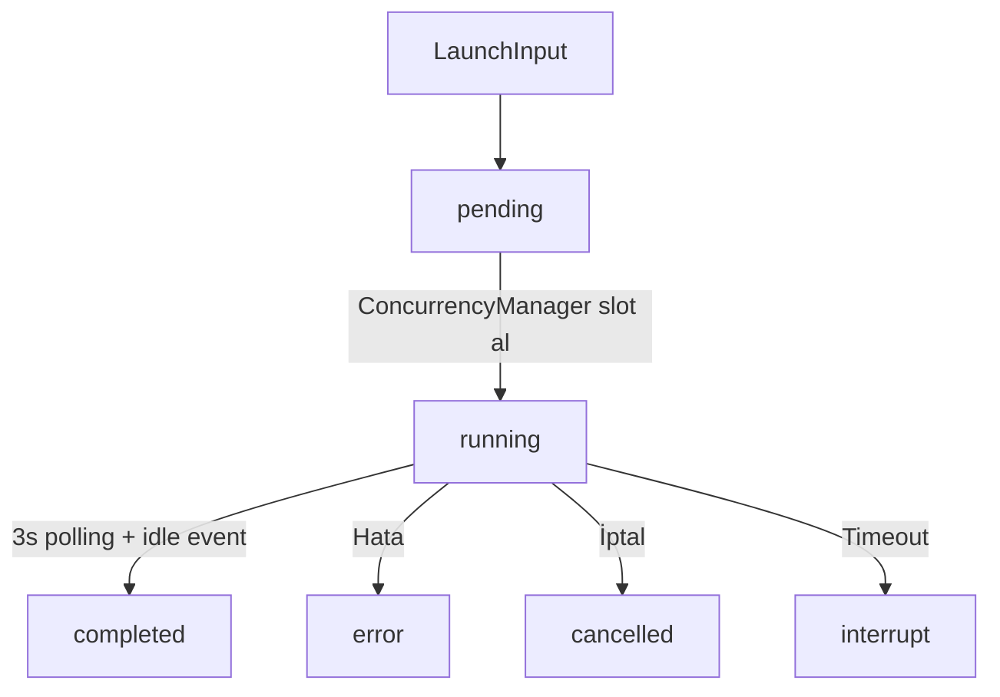
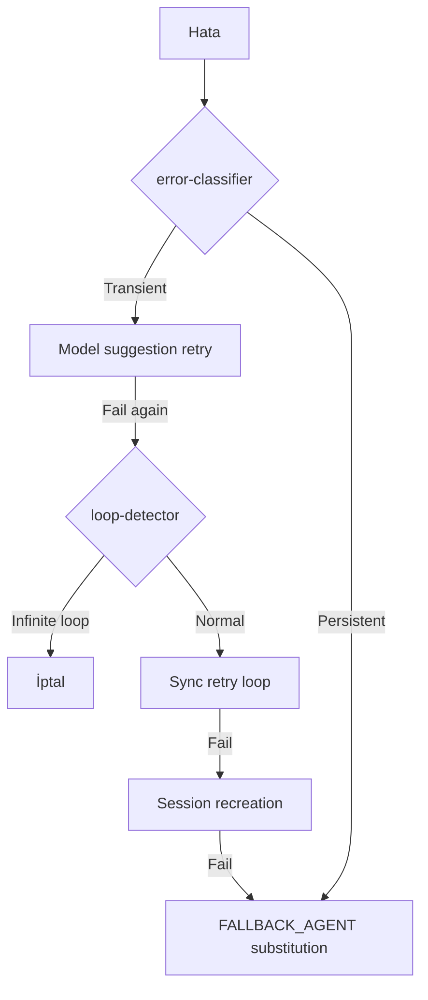
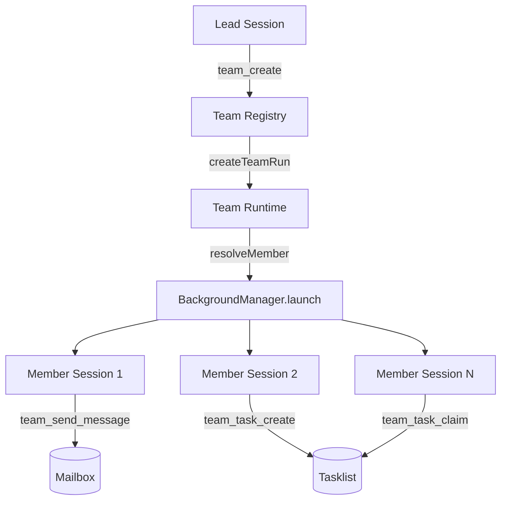
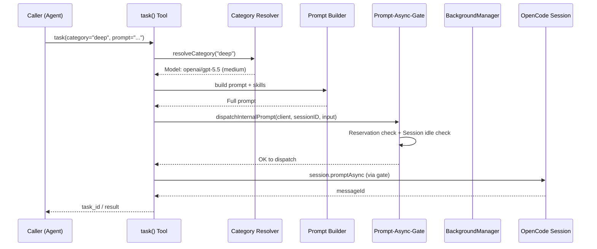
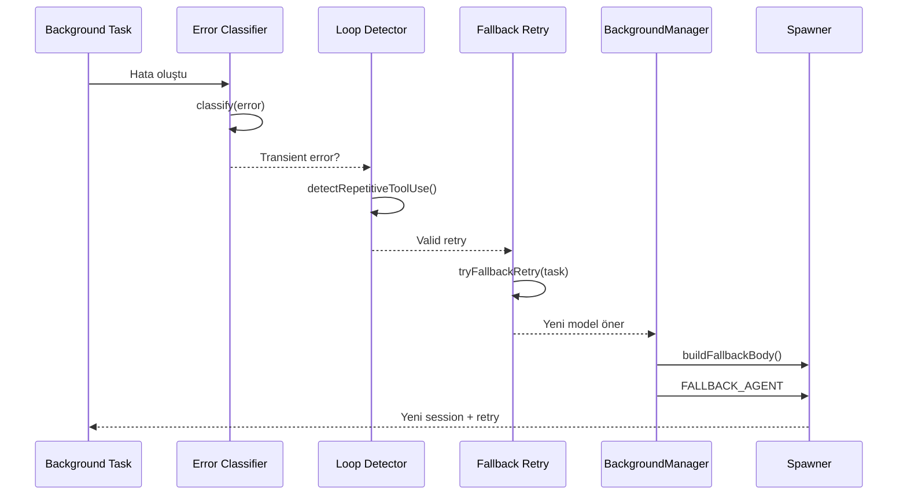
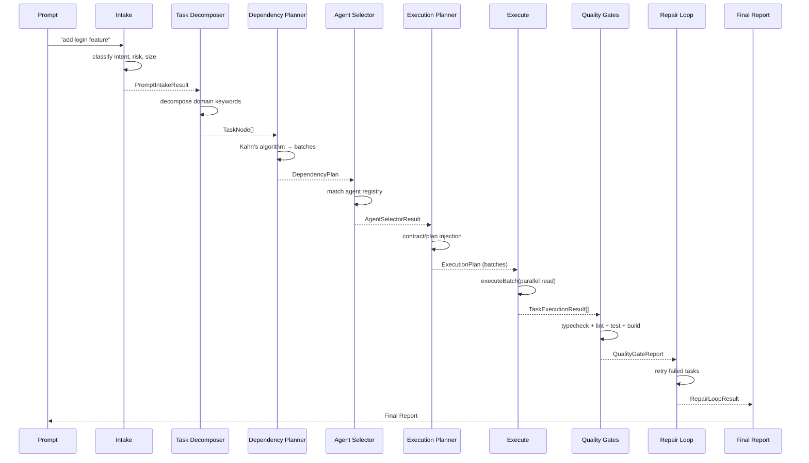
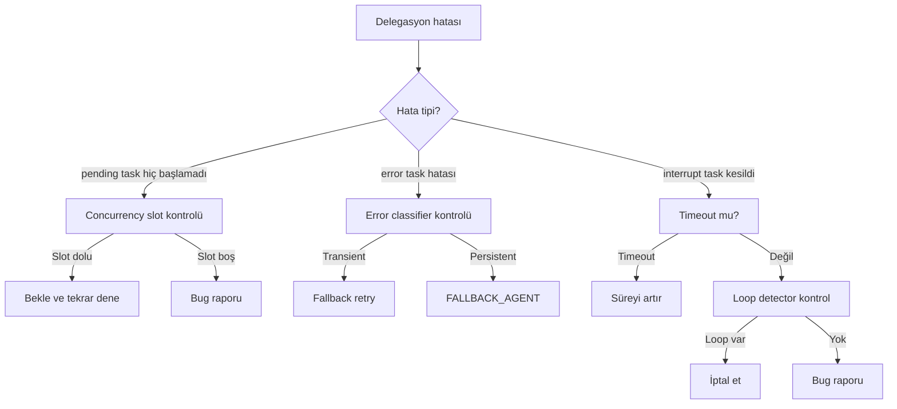
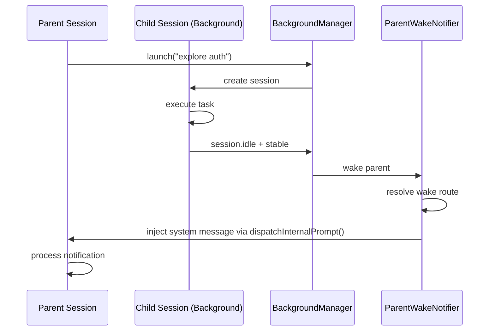
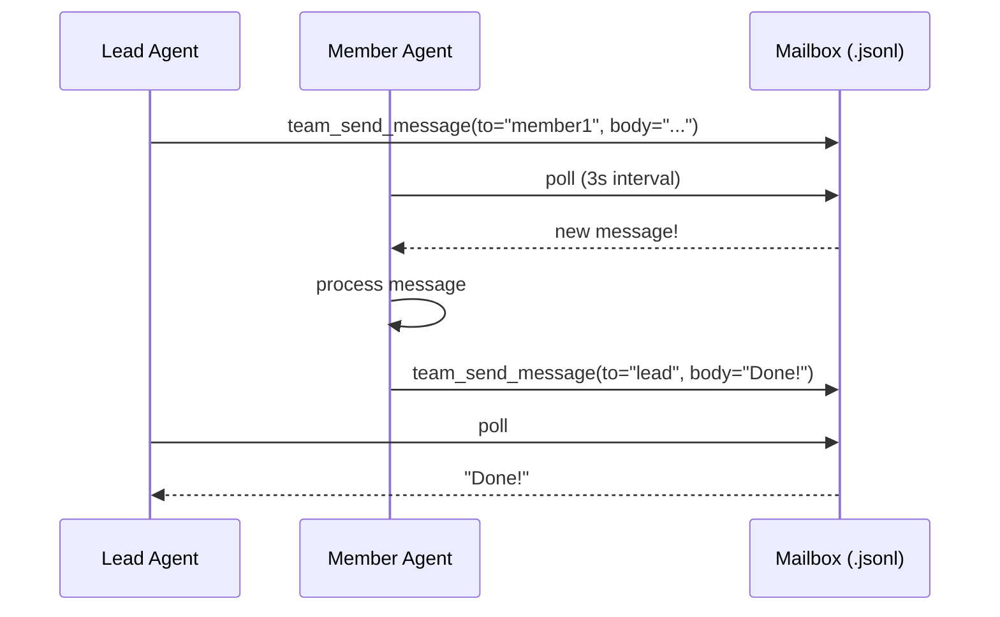
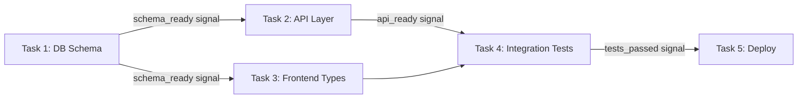

# Agent Görev Atama Sistemleri: Oh-My-OpenAgent & OpenCode Ekosistemi

> **Teknik Rapor** | Haziran 2026 | oh-my-openagent-hecateq v4.2.0+
>
> Bu rapor, oh-my-openagent-hecateq (OMO) ve OpenCode SDK altyapısındaki 5 delegasyon mekanizmasını, 20+ aracı, arka plandaki state machine'leri, kısıtlamaları ve tasarım kalıplarını kapsamlı olarak belgeler.

---

## 1. YÖNETİCİ ÖZETİ

Oh-My-OpenAgent (OMO), OpenCode IDE/terminal ajan plugin'i olarak, bir **ajan görev atama (agent task assignment) ekosistemi** sunar. Bu ekosistem 5 farklı delegasyon mekanizması üzerine kurulmuştur: **(1)** `task()` aracı ile kategori ve subagent_type üzerinden yönlendirme, **(2)** `call_omo_agent()` ile sınırlı explore/librarian çağrıları, **(3)** Team Mode ile paralel çoklu-ajan koordinasyonu, **(4)** Hecateq orchestration katmanı ile signal-DAG tabanlı otomatik pipeline, ve **(5)** Background Agent sistemi ile asenkron task yönetimi.

**En kritik mimari karar**, OMO'nun her delegasyonu **gerçek bir OpenCode session**'ı olarak ele almasıdır — her `task()` çağrısı, yeni bir session oluşturur veya mevcut bir background session'ı yönetir. Bu, LangGraph veya CrewAI gibi in-process kütüphanelerinden temel farkı oluşturur.

**En önemli 3 anti-pattern:**
1. **Raw `session.promptAsync()` çağrısı yapmak** — OpenCode'un hatalı tasarımı nedeniyle `promptAsync` race condition'a yol açar; tüm internal mesajlar `dispatchInternalPrompt()` üzerinden geçmelidir
<!-- HARDENING 2026-06-21: all param removed from public schema v4.2.0+ -->
2. **`background_cancel(all=true)` kullanmak** — `all` parametresi v4.2.0+'da public schema'dan kaldırıldı; legacy çağrılar `GLOBAL_BACKGROUND_CANCEL_FORBIDDEN` typed error alır. `background_cancel(taskId=...)` ile tek tek iptal edilmelidir
3. **Plan agent'ına plan agent'ı yönlendirmek** — Plan-family → Plan-family delegasyonu yasaktır; sonsuz döngüye yol açar

---

## 2. OPECODE SDK DELEGASYON API'LERİ

OMO, OpenCode SDK (`@opencode-ai/plugin`) üzerine inşa edilmiştir. SDK, session yönetimi, background task'lar, REST endpoint'leri ve WebSocket event'leri sunar.

### 2.1 Session API

| API | İmza | Açıklama | Kullanım |
|-----|------|----------|----------|
| `session.list()` | `() => SessionInfo[]` | Mevcut session'ları listeler | Görüntüleme |
| `session.get(id)` | `(id: string) => Session` | Belirli bir session'ı getirir | Okuma |
| `session.prompt(input)` | `(input: PromptInput) => Promise<Message>` | **Sync** prompt gönderir, yanıt bekler | **YASAK** (raw) |
| `session.promptAsync(input)` | `(input: PromptInput) => Promise<string>` | **Async** prompt gönderir, message ID döner | **YASAK** (raw) |
| `session.command(cmd)` | `(cmd: string) => Promise<void>` | Session'a komut gönderir | Özel durumlar |
| `session.shell()` | `() => ShellStream` | Shell stream alır | Terminal |
| `session.revert(id)` | `(id: string) => Promise<void>` | Session'ı geri alır | Hata kurtarma |

**Session Lifecycle Event'leri:**

```
created → [active] → idle → error → compacted → deleted
                ↘ compacted → autocontinue
```

Event'ler `session.on("event", handler)` ile dinlenir:
- `session.created` — Session oluşturulduğunda
- `session.idle` — Session boşta kaldığında (background task completion sinyali)
- `session.error` — Session hatası (runtime fallback tetikleyicisi)
- `session.compacted` — Context window sıkıştırıldığında
- `session.deleted` — Session silindiğinde

> **Kaynak:** `src/plugin-interface.ts` (11 hook handler), `src/testing/create-plugin-module.ts` (+2 compaction handler)

<!-- HARDENING-2 2026-06-21: background_cancel public Zod schema reduced to taskId only -->
### 2.2 Background Task API

`background_cancel` public Zod schema was reduced to `taskId` only. The `all: true` parameter was removed. Legacy calls receive `TASK_GLOBAL_BACKGROUND_CANCEL_FORBIDDEN` typed error (src/tools/background-task/create-background-cancel.ts:17). Internal cleanup APIs `cancelByParentSession`, `cancelByTeamRun`, `cancelDescendants` exist on BackgroundManager (src/features/background-agent/manager.ts:1113) but are NOT exposed to the LLM.

OMO, SDK background task API'sini `BackgroundManager` ile sarar:

| API | Kullanım | Kısıtlama |
|-----|----------|-----------|
| `session.background_output(taskId)` | Task çıktısını al | Sadece OMO üzerinden |
| `background_cancel(taskId)` | Tek task iptal | **all parametresi REMOVED from public schema v4.2.0+** |
| `background_cancel(all=true)` | Tüm task'ları iptal | **REMOVED from public tool schema v4.2.0+ — legacy callers receive `GLOBAL_BACKGROUND_CANCEL_FORBIDDEN` typed error. Use `background_cancel(taskId=...)` or internal `cancelByParentSession()`. See §1.1 of `.opencode/contracts/delegation-runtime-contracts.md`.** |

<!-- HARDENING 2026-06-21: Deprecated since v4.2.0+ — `all` param removed from public schema -->
> **Deprecated since v4.2.0+:** `all: true` has been removed from the public schema. Legacy callers receive `GLOBAL_BACKGROUND_CANCEL_FORBIDDEN` typed error. Use `background_cancel(taskId=...)` for single-task cancel, or internal `cancelByParentSession()` for session-scoped cleanup.

**Task Status States:**

```
pending → running → completed
                  → error
                  → cancelled
                  → interrupt
```

> **Kaynak:** `src/features/background-agent/types.ts:5-11` (`BackgroundTaskStatus`)

### 2.3 Server REST Endpoints

OpenCode plugin server'ı REST endpoint'leri sunar:

| Endpoint Grubu | Amaç |
|----------------|------|
| `/session/*` | Session CRUD, message geçmişi |
| `/file/*` | Dosya okuma/yazma |
| `/find/*` | Dosya arama (grep, glob) |
| `/mcp/*` | MCP server yönetimi |
| `/lsp/*` | LSP istekleri |
| `/auth/*` | Kimlik doğrulama |

### 2.4 WebSocket Event Tipleri

| Event Pattern | Açıklama |
|---------------|----------|
| `session.*` | Session lifecycle (created, idle, error, deleted) |
| `message.*` | Mesaj olayları (sent, received, updated) |
| `permission.*` | İzin değişiklikleri |
| `tool.*` | Tool çalıştırma olayları |
| `tui.*` | Terminal UI olayları |

---

## 3. OMO PLUGIN DELEGASYON ARAÇLARI

OMO, SDK üzerine 5 temel delegasyon aracı inşa eder.

### 3.1 `task()` Aracı

**Dosya:** `src/tools/delegate-task/` (49 dosya, ~45k LOC tools dizini)
**Factory:** `createDelegateTask()` → `src/tools/delegate-task/tools.ts`

**Schema (Tip Tanımı):**

```typescript
interface DelegateTaskArgs {
  /** Kısa açıklama (3-5 kelime) */
  description: string

  /** Delegasyon prompt'u */
  prompt: string

  /** Kategori bazlı routing (örn: "quick", "deep", "ultrabrain") */
  category?: string

  /** Doğrudan agent seçimi (örn: "oracle", "explore") */
  subagent_type?: string

  /** Background (async) veya sync çalıştırma */
  run_in_background?: boolean

  /** Skill enjeksiyonu */
  load_skills?: string[]

  /** Hecateq dependency graph ID ve stage */
  dependency_graph_id?: string
  stage_id?: string
}
```

<!-- HARDENING-2 2026-06-21: Added XOR enforcement — both category + subagent_type now rejected -->
**category / subagent_type XOR enforcement:**
When `category` and `subagent_type` are provided in the same call, the resolver returns `TASK_ROUTING_SELECTOR_CONFLICT` and does not proceed. This is enforced at the top of the `createDelegateTask().execute` body in `src/tools/delegate-task/tools.ts:269` (added 2026-06-21). The XOR check applies in addition to the existing `disable_category_routing` guard, which is preserved. Either `category` or `subagent_type` must be provided; neither is rejected as before. Both is now rejected as a routing selector conflict.

<!-- HARDENING 2026-06-21: Added category+subagent_type precedence rule (pre-XOR) -->
**category / subagent_type Precedence (pre-XOR enforcement):**
If both `category` and `subagent_type` are provided, `subagent_type` wins (precedence rule — the resolver logs the precedence). If only `category` is provided and `disable_category_routing=true` (default in v4.2.0+), the call returns the typed error: `"Category routing has been removed. Use subagent_type to target a specific agent."`

**Kategori Routing (8 Built-in):**

| Kategori | Varsayılan Model | Kullanım Alanı | Model Havuzu |
|----------|------------------|----------------|--------------|
| `quick` | openai/gpt-5.4-mini | Hızlı, düşük maliyetli işler | OpenAI |
| `deep` | openai/gpt-5.5 (medium variant) | Karmaşık çok-adımlı çözümler | OpenAI |
| `ultrabrain` | openai/gpt-5.5 (xhigh variant) | Maksimum zeka gerektiren işler | OpenAI |
| `visual-engineering` | google/gemini-3.1-pro (high variant) | Frontend, UI/UX | Google |
| `artistry` | google/gemini-3.1-pro (high variant) | Yaratıcı / alışılmamış yaklaşımlar | Google |
| `unspecified-low` | anthropic/claude-sonnet-4-6 | Orta çaba gerektiren işler | Anthropic |
| `unspecified-high` | anthropic/claude-opus-4-7 (max variant) | Yüksek çaba gerektiren işler | Anthropic |
| `writing` | kimi-for-coding/k2p5 | Dokümantasyon, düz yazı | Kimi → Gemini |

> **Kaynak:** `src/tools/delegate-task/builtin-categories.ts`, `src/tools/delegate-task/constants.ts:7-12`

**Subagent Routing (12 Agent):**

| Agent | Mode | task(subagent_type) ile çağrılabilir mi? |
|-------|------|-----------------------------------------|
| Hecateq God | coordinator | ❌ |
| Sisyphus | primary/subagent | ✅ (önerilen: category="deep") |
| Hephaestus | primary/subagent | ✅ |
| Prometheus | subagent | ✅ |
| Oracle | subagent | ✅ |
| Librarian | subagent | ✅ |
| Explore | subagent | ✅ |
| Atlas | subagent | ✅ |
| Metis | subagent | ✅ |
| Momus | subagent | ✅ |
| Multimodal-Looker | subagent | ✅ |
| Sisyphus-Junior | subagent | ✅ (category üzerinden) |

> **Kaynak:** `src/agents/` (104 dosya, ~20k LOC)

**Background vs Sync Execution:**

```mermaid
graph LR
    Task[task() call] --> Route{run_in_background?}
    Route -->|true| Bg[BackgroundManager.launch]
    Route -->|false| Sync[Sync Executor Chain]
    Bg --> Poll[Polling 3s interval]
    Poll --> Notify[ParentWakeNotifier]
    Sync --> Session[New OpenCode session]
    Session --> Poll2[Poll until idle]
    Poll2 --> Return[Return result]
```

> **Kaynak:** `src/tools/delegate-task/executor.ts`

### 3.2 `call_omo_agent()` Aracı

**Dosya:** `src/tools/call-omo-agent/` (3 LOC index + 34 LOC types)

**Kısıtlama:** SADECE `explore` ve `librarian` agent'larını çağırabilir.

```typescript
interface CallOmoAgentArgs {
  description: string        // 3-5 kelime
  subagent_type: "explore" | "librarian"  // SADECE bu ikisi
  prompt: string
  run_in_background: boolean
  session_id?: string        // Devam eden session
}
```

**Neden kısıtlı?** — `call_omo_agent()` bir "hafif" delegasyon aracıdır. Skill enjeksiyonu, model fallback, veya kategori routing'i yapmaz. Sadece explore (kod tabanı keşfi) ve librarian (dokümantasyon araştırması) için tasarlanmıştır. Karmaşık işler için `task()` kullanılmalıdır.

**Önemli:** Skill enjeksiyonu (`load_skills`) desteklenmez. Background async çalıştırılabilir.

### 3.3 `skill` ve `skill_mcp` Araçları

**Dosyalar:** `src/tools/skill/`, `src/tools/skill-mcp/`

**SKILL.md Formatı:**
```markdown
---
name: my-skill
description: Ne işe yaradığı
triggers: [keyword1, keyword2]
mcp_servers:
  - name: my-server
    type: stdio | http
    command: ...
---

Görev talimatları buraya...
```

**4-Scope Discovery:**
```
Global (~/.config/opencode/skills/) ← en geniş
  └── User (~/.agents/skills/)
        └── OpenCode (~/.opencode/skills/)
              └── Project (<project>/.agents/skills/) ← en özel
```

Skill'ler, `load_skills` parametresi ile `task()` çağrılarına enjekte edilir. Skill-embedded MCP'ler (Tier-3) per-session izolasyonla çalışır.

> **Kaynak:** `src/features/opencode-skill-loader/` (25 dosya)

### 3.4 Diğer Delegasyon Araçları

| Araç | Açıklama | Kullanım |
|------|----------|----------|
| `session_list` | Session'ları listele | Session yönetimi |
| `session_read` | Session mesajlarını oku | Geçmiş inceleme |
| `session_search` | Session içinde arama | Bilgi bulma |
| `session_info` | Session metadata | Debug |
| `background_output` | Background task çıktısı | Sonuç alma |
| `background_cancel` | Background task iptal | Temizlik (tek taskId ile) |
| `team_*` (12 adet) | Team mode araçları | Paralel koordinasyon |

---

## 4. PROMPT-ASYNC-GATE (Merkezi Enjeksiyon Yönetimi)

**Dosya:** `src/shared/prompt-async-gate.ts` (214 LOC) + `src/shared/prompt-async-gate/` (queue, reservations, session-idle-dispatch, timing, types)

### 4.1 Neden Var?

OpenCode'un SDK tasarımı gereği, `session.promptAsync()` **race condition**'a açıktır. `promptAsync` çağrısı, prompt'un kalıcı olarak kabul edildiğinden önce dönebilir ve daha sonra gelen hatalar `session.error` olarak ulaşabilir. Birden çok OMO hook/tool, aynı idle/error/completion edge'ini gözlemleyip aynı internal mesajı birden çok kez enjekte edebilir.

```
// YASAK — raw çağrı:
await session.promptAsync({ message: "..." })

// DOĞRU — gate üzerinden:
await dispatchInternalPrompt({ client, sessionID, input, source, mode: "async" })
```

### 4.2 Mimari

```mermaid
graph TD
    Caller[Herhangi bir OMO bileşeni] --> |dispatchInternalPrompt| Gate{Dispatch Gate}
    Gate -->|queueBehavior=defer| Reserve{Reservation var mı?}
    Reserve -->|Evet| Return[Return "reserved"]
    Reserve -->|Hayır| IdleCheck[dispatchAfterSessionIdle]
    IdleCheck -->|Session idle + tool state uygun| Dispatch[session.promptAsync]
    IdleCheck -->|Session active| Wait[10s settle bekle]
    Wait --> Dispatch
    Gate -->|queueBehavior=enqueue| Queue[(FIFO Queue)]
    Queue --> Drain[Queue drain → dispatch]
```

**dispatchInternalPrompt() — Unified Entry:**

```typescript
// src/shared/prompt-async-gate.ts:71-151
async function dispatchInternalPrompt<TInput>(args: {
  client: PluginInput
  sessionID: string
  input: TInput
  source: string
  mode: "async" | "sync"
  queueBehavior?: "defer" | "enqueue"
  settleMs?: number           // Varsayılan: 10s
  postDispatchHoldMs?: number  // Varsayılan: 1000ms
  dispatchTimeoutMs?: number   // Varsayılan: 30000ms
  checkStatus?: boolean        // Session active kontrolü
  checkToolState?: boolean     // Tool state kontrolü
  dedupeKey?: string           // Dedup anahtarı
  oneShotRetryForShapeMismatch?: boolean
}): Promise<InternalPromptDispatchResult>
```

**Queue Behavior:**
- `"defer"` (sync modu): Session boşta değilse bekle, reservation varsa hemen dön
- `"enqueue"` (async modu): FIFO kuyruğa ekle, sıra gelince dispatch et

**Reservation Token'lar (TTL tabanlı):**

Her `dispatchInternalPrompt` çağrısı, session için bir **reservation token** oluşturur. Token'ın TTL'si dolduğunda otomatik temizlenir. Bu, başka bir agent'ın aynı session'a aynı anda mesaj göndermesini engeller (race condition önleme).

> **Kaynak:** `src/shared/prompt-async-gate/reservations.ts`

### 4.3 dispatchAfterSessionIdle() Akışı

Bu fonksiyon, bir session'ın boşta olduğunu doğruladıktan sonra mesaj gönderir:

1. **Reservation kontrolü** — Aktif reservation var mı?
2. **Session active kontrolü** — Session hala active mi?
3. **Tool state kontrolü** — Tool çalışıyor mu?
4. **Stability bekleme** — 10s boyunca değişiklik yoksa stabildir
5. **Dispatch** — `session.prompt()` veya `session.promptAsync()` çağrısı

> **Kaynak:** `src/shared/prompt-async-gate/session-idle-dispatch.ts`

### 4.4 YASAK PATERNLER

Aşağıdaki paternler **kesinlikle yasaktır** ve `prompt-async-route-audit.test.ts` tarafından otomatik denetlenir:

1. Raw `session.promptAsync()` çağrısı (gate dışı)
2. Raw `session.prompt()` çağrısı (gate dışı)
3. `postDispatchHoldMs: 0` kullanımı
4. Session yoksa raw çağrıya düşme
5. Yeni internal mesaj rotaları dedup regression testi olmadan
6. Gate dışında kalan `session.prompt` / `session.promptAsync` kullanan tüm yollar

> **Kaynak:** `src/shared/prompt-async-route-audit.test.ts`

---

## 5. BACKGROUND AGENT SİSTEMİ

**Dosya:** `src/features/background-agent/` (30 non-test dosya, ~3050 LOC manager.ts)

### 5.1 BackgroundManager



**Başlıca Metodlar:**

```typescript
class BackgroundManager {
  async launch(input: LaunchInput): Promise<string>  // task_id döner
  async cancel(taskId: string): Promise<void>         // tek task iptal
  getTask(taskId: string): BackgroundTask | undefined
  listTasks(status?: BackgroundTaskStatus): string[]
}
```

**LaunchInput (137 LOC types.ts):**

```typescript
interface LaunchInput {
  description: string
  prompt: string
  agent: string
  parentSessionId: string
  parentMessageId: string
  teamRunId?: string
  parentModel?: { providerID: string; modelID: string }
  parentAgent?: string
  parentTools?: Record<string, boolean>
  model?: DelegatedModelConfig
  fallbackChain?: FallbackEntry[]
  isUnstableAgent?: boolean
  skills?: string[]
  skillContent?: string
  category?: string
  sessionPermission?: SessionPermissionRule[]
  onSessionCreated?: (sessionId: string) => void | Promise<void>
}
```

**ConcurrencyManager:**

```typescript
// src/features/background-agent/concurrency.ts (137 LOC)
// Key format: {providerID}/{modelID}
// Varsayılan limit: 5 concurrent per key
// FIFO queue: slot boşalana kadar bekle

class ConcurrencyManager {
  async acquireSlot(concurrencyKey: string): Promise<void>
  releaseSlot(concurrencyKey: string): void
}
```

**SubagentSpawnLimits:**

```typescript
// src/features/background-agent/subagent-spawn-limits.ts (81 LOC)
// Depth tracking — max derinlik config'den gelir
// Legacy manager için varsayılan: 1
function getMaxSubagentDepth(spawnDepth?: number): number
```

### 5.2 Completion Detection

Background task'ın tamamlandığını tespit etmek için **2 sinyal** gerekir:

1. **Session idle event** — OpenCode session.idle olayını bildirir
2. **Stability detection** — 10s boyunca mesaj sayısı değişmezse (3+ stabil poll, 3s aralıkla)

Her iki sinyal de aynı anda gelmelidir. Bu, kısa duraklamalarda erken tamamlama tespitini önler.

> **Kaynak:** `src/features/background-agent/task-poller.ts`, `src/features/background-agent/session-idle-event-handler.ts`

<!-- HARDENING-2 2026-06-21: Added WakeDedupePersistence interface + FileWakeDedupePersistence -->
**Wake dedup persistence layer:** `WakeDuplicateSuppressor` (src/features/background-agent/wake-idempotency.ts) supports optional persistent backing via the `WakeDedupePersistence` interface. The default file-backed implementation `FileWakeDedupePersistence` (src/features/background-agent/wake-dedup-persistence.ts:16) uses append-only JSONL with atomic writes for crash-safety. If no persistence is configured, the suppressor remains in-memory only and is NOT crash-safe — process restart loses the dedupe set.

<!-- HARDENING 2026-06-21: Added crash-safety caveat -->
**Crash-safety caveat:** The `WakeDuplicateSuppressor` is an in-memory map (5-min TTL). Process restart loses the dedupe set. Same task completion could fire multiple parent wakes after a crash. The persistent wake route registry (`WakeRouteRegistry`) is separate and durable; only the suppressor is in-memory. Persistence via `FileWakeDedupePersistence` is opt-in (configure `hecateq.wake_dedup.persistence: true`). No persistent dedupe fix in v4.2.0+.

### 5.3 Fallback Chain



1. **Model suggestion retry** — `fallback-retry-handler.ts` koordine eder
2. **Sync retry loop** — `sync-task-fallback.ts`
3. **Session recreation** — Yeni session oluştur + prompt'u tekrar gönder
4. **FALLBACK_AGENT substitution** — Son çare: farklı bir agent kullan

> **Kaynak:** `src/features/background-agent/fallback-retry-handler.ts`, `src/features/background-agent/spawner.ts`

### 5.4 Hata Yönetimi

| Bileşen | Dosya | Açıklama |
|---------|-------|----------|
| `loop-detector` | `loop-detector.ts` | Sonsuz döngü tespiti — repetitive tool use analizi |
| `error-classifier` | `error-classifier.ts` | Raw provider hatalarını `BackgroundTaskError` kategorilerine eşler |
| `process-cleanup` | `process-cleanup.ts` | Parent exit'te best-effort cleanup |
| `session-status-classifier` | `session-status-classifier.ts` | OpenCode session status normalizasyonu |
| `compaction-aware-message-resolver` | `compaction-aware-message-resolver.ts` | Mid-task compaction sonrası sonuç çözümleme |

**OMO_DISABLE_PROCESS_CLEANUP:** `=1` ortam değişkeni ile tüm process cleanup devre dışı bırakılabilir.

---

## 6. HECATEQ DELEGASYON KATMANI

**Dosya:** `src/features/hecateq-orchestration/` (49 dosya)

### 6.1 Routing Policy Engine

**Dosya:** `src/features/hecateq-orchestration/routing-policy-engine.ts` (263 LOC)

Agent yanıtlarındaki `HANDOFF:` bloklarını okuyarak routing kararları üretir. Pure decision engine — agent çağırmaz, karar üretir.

**Decision Taxonomy:**

```typescript
type RoutingDecisionKind =
  | "return_to_caller"              // Doğrudan çağırana dön
  | "return_to_parent_for_routing"  // Parent'a routing için dön
  | "invalid_target_blocked"        // BLOCKED status, routing yapılamaz
  | "no_handoff_data"               // Handoff verisi yok
  | "unknown_target_fallback"       // Bilinmeyen hedef
  | "role_policy_violation"         // Rol politikası ihlali
```

**Karar Akışı:**

```
HANDOFF bloğu → decideRouting()
  1. Hiç handoff verisi yok → no_handoff_data
  2. Status=BLOCKED + valid target → invalid_target_blocked
  3. Target="return_to_caller" → return_to_caller
  4. Target="return_to_parent_for_routing" → return_to_parent_for_routing
  5. Known agent ID → return_to_caller (delegasyon)
  6. Unknown target → unknown_target_fallback
```

> **Kaynak:** `src/features/hecateq-orchestration/routing-policy-engine.ts:39-140`

### 6.2 Delegation Controller (Wave 3)

**Dosya:** `src/features/hecateq-orchestration/delegation-controller.ts` (356 LOC)

Routing decision'ları alır, 8 guardrail ile validate eder, pending delegation request'leri oluşturur.

**8 Guardrail:**

| # | Guardrail | Açıklama | Eşik |
|---|-----------|----------|------|
| 1 | `return_to_caller` only | Sadece `return_to_caller` kararları delegasyon üretir | Routing kararı |
| 2 | Max routing depth | Zincirleme delegasyon derinlik sınırı | 3 (varsayılan) |
| 3 | BLOCKED source gating | BLOCKED durumundaki task'lardan delegasyon olmaz | Status="BLOCKED" |
| 4 | Known agent only | Bilinmeyen agent ID'lerine delegasyon red | Agent registry |
<!-- HARDENING 2026-06-21: SHA-256 dedup fingerprint -->
| 5 | Dedup (SHA-256 fingerprint) | Aynı target+task+prompt tekrarı engelle | SHA-256 of (targetAgent, sourceTaskId, normalizedPrompt, routingDepth, relevantContractId). 200-char prompt prefix kept as debug preview only. |
| 6 | Fan-out cap | Tek seferde maksimum delegasyon sayısı | 10 (varsayılan) |
| 7 | Cycle detection | Delegasyon döngüsü tespiti | `cycle-detector.ts` |
| 8 | Role policy validation | Agent rolüne göre hedef validasyonu | `handoff-role-policy.ts` |

**Pending Delegation State:**

```typescript
interface HecateqPendingDelegation {
  id: string
  targetAgent: string
  prompt: string
  sourceTaskId?: string
  sourceAgent?: string
  createdAt: string
  status: DelegationRequestStatus  // "pending" | "consumed" | "skipped"
  routingDepth: number
  guardrailChecks?: string[]
}
```

State, `.omo/hecateq/state.json` dosyasında saklanır (bkz: `src/features/hecateq-orchestration/omo-state-manager.ts`).

<!-- HARDENING 2026-06-21: Added backpressure + dedup fingerprint detail -->
**v4.2.0+ backpressure:** Capacity = 20. Pruning is now terminal-first: completed / consumed / skipped / failed / expired entries are pruned before capacity check. If still over capacity, the 21st entry is REJECTED with `HECATEQ_PENDING_CAPACITY_EXCEEDED` and the rejection is logged + surfaced to `hecateq doctor`. Oldest in-flight entries are NEVER silently dropped.

**Dedup fingerprint (v4.2.0+):** SHA-256 of canonical (targetAgent, sourceTaskId, normalizedPrompt, routingDepth, relevantContractId). The 200-char prompt prefix is kept as a debug preview only.

### 6.3 Delegation Executor (Wave 4)

**Dosya:** `src/features/hecateq-orchestration/delegation-executor.ts` (341 LOC)

**Producer-Consumer Pattern:**

```
Producer: processHandoffsToDelegation() → pending delegation'lar oluşturur
Consumer: consumePendingDelegations() → guardrail'leri kontrol eder, execution request'e çevirir
Reporter: reportDelegationResult() → sonucu persist eder
```

```typescript
interface DelegationExecutionRequest {
  delegationId: string
  targetAgent: string
  prompt: string
  sourceTaskId?: string
  category: string
  routingDepth: number
}
```

Orchestrator (Hecateq God / Sisyphus), `consumePendingDelegations()` ile işleri alır, `task(subagent_type=..., prompt=...)` ile delege eder, sonra `reportDelegationResult()` ile sonucu raporlar.

### 6.4 Task Graph & Dependency

**Bileşenler:**

| Bileşen | Dosya | LOC | Açıklama |
|---------|-------|-----|----------|
| Task Decomposer | `task-decomposer.ts` | 235 | Prompt'u atomik task node'larına böler |
| Dependency Planner | `dependency-planner.ts` | 179 | Kahn's algorithm ile topological batch'ler |
| Execution Planner | `execution-planner.ts` | 683 | Contract/plan/verify aşamalarını enjekte eder |
| Cycle Detector | `cycle-detector.ts` | 118 | DFS ile döngü tespiti |

**Dependency Graph Validation:**

```typescript
// src/features/hecateq-orchestration/dependency-planner.ts
// Kahn's algorithm ile topological sort
// Batch'ler: her batch paralel çalışabilen task'lar
function computeBatches(nodes: TaskNode[]): string[][]
function detectCycles(nodes: TaskNode[]): CycleDetectionResult
```

**Execution Plan (5 aşama):**

Her task için şu aşamalar enjekte edilebilir:
1. **Contract** — Formal spesifikasyon
2. **Plan** — Uygulama planı
3. **Implement** — Kod yazma
4. **Verify** — Post-execution doğrulama
5. **Review** — Code review

Yüksek riskli task'lar (`high`, `destructive`) ve hassas domain'ler (`database`, `security`, `devops`, `architecture`) için contract/plan zorunludur.

<!-- HARDENING-2 2026-06-21: Added explicit migration file:key reference -->
**v4.2.0+ always-on:** `hecateq.dependency_graph.mode: "off"` is normalized to `"enforce"` on config load via `migrateHecateqAlwaysOn` (src/config/schema/hecateq.ts) with `hecateq_always_on_v1` migration key. Same applies to `orchestration.enabled: false` (normalized to true). The graph runtime is always active when Hecateq is enabled.

---

## 7. TEAM MODE DELEGASYON

**Dosya:** `src/features/team-mode/` (60 dosya, ~13k LOC)

### 7.1 Mimari

Team Mode, OFF by default. `team_mode.enabled: true` ile etkinleştirilir.



**Storage Layout:**

```
~/.omo/teams/{name}/
├── config.json          # TeamSpec (Zod validated)
├── state.json           # Runtime state (atomic locks)
├── mailbox/             # .jsonl per recipient
├── tasklist.jsonl       # Shared task list
└── worktrees/{member}/  # Git worktree per member
```

**12 team_* Tool:**

| Tool | Purpose |
|------|---------|
| `team_create` | Team + member session'ları oluştur |
| `team_delete` | Team temizliği |
| `team_shutdown_request` | Shutdown talebi |
| `team_approve_shutdown` | Shutdown onayı |
| `team_reject_shutdown` | Shutdown reddi |
| `team_send_message` | Member'a veya `*` broadcast |
| `team_task_create` | Task oluştur |
| `team_task_list` | Task'ları listele |
| `team_task_update` | Claim/complete/delete |
| `team_task_get` | Tek task getir |
| `team_status` | Team durumu |
| `team_list` | Team'leri listele |

### 7.2 Member Eligibility

**Dosya:** `src/features/team-mode/types.ts:181-229` (`AGENT_ELIGIBILITY_REGISTRY`)

| Verdict | Agents | Gerekçe |
|---------|--------|---------|
| ✅ `eligible` | sisyphus, hecateq-orchestrator, atlas, sisyphus-junior | Doğrudan kullanılabilir |
| ⚠️ `conditional` | hephaestus | `teammate: "allow"` izni gerekir (D-36 patch) |
| ❌ `hard-reject` | oracle, librarian, explore, multimodal-looker, metis, momus, prometheus | Read-only veya plan-mode-only — mailbox'a yazamaz |

**Member Kind'lar:**

```jsonc
{
  "members": [
    // Direct agent:
    { "kind": "subagent_type", "name": "scout", "subagent_type": "sisyphus" },
    // Category routing → Sisyphus-Junior üzerinden:
    { "kind": "category", "name": "writer", "category": "writing", "prompt": "Write docs" }
  ]
}
```

### 7.3 Member Spawn Süreci

1. **createTeamRun()** — `team-runtime/create.ts`
2. **resolveMember()** — `team-runtime/resolve-member.ts`: Agent tipini ve modelini çözümle
3. **bgMgr.launch()** — `BackgroundManager.launch()` ile member session'ını oluştur
4. **Spawn-race-safe resolution** — `team-session-registry.ts`: SessionID bilinir bilinmez register et

---

## 8. ARAÇ SEÇİM REHBERİ

| Durum | Kullanılacak Araç | Neden? |
|-------|-------------------|--------|
| Spesifik bir ajana delege | `task(subagent_type="oracle", prompt="...", run_in_background=true)` | Direkt agent routing + skill enjeksiyonu |
| Kategori bazlı model seçimi | `task(category="quick", prompt="...")` | Category → model fallback |
| Hızlı senkron kod keşfi | `call_omo_agent(subagent_type="explore", run_in_background=false, prompt="...")` | Hafif, hızlı, skill gerekmez |
| Paralel background araştırma | `task(category="quick", run_in_background=true, load_skills=[...], prompt="...")` | Paralel çalışma + skill enjeksiyonu |
| Çoklu-ajan koordinasyon | Team Mode (`team_create`, `team_send_message`, ...) | 12 araçlık tam ekosistem |
| Otomatik orchestration pipeline | Hecateq (`hecateq run "prompt"`) | Prompt → decompose → execute → report |
| Session geçmişi | `session_*` araçları | Raw SDK değil, OMO wrapper'ları kullan |
<!-- HARDENING 2026-06-21: all param removed from public schema -->
| Background task yönetimi | `background_output`, `background_cancel(taskId=...)` (single task only — `all` param was removed in v4.2.0+). For session-scoped cleanup, internal `cancelByParentSession()` is the only supported path. | **`all` param removed from public schema v4.2.0+** |
| Skill yükleme | `skill(name="skill-name")` | YAML frontmatter skill |
| Skill MCP çağrısı | `skill_mcp(mcp_name="...", tool_name="...")` | Skill-embedded MCP |

**Decision Tree:**

```
Bir ajana iş mi atayacaksın?
├── Agent adını biliyor musun?
│   ├── Evet → task(subagent_type="agent_name", ...)
│   │   └── Agent explore/librarian mı?
│   │       ├── Evet + hızlı sync → call_omo_agent(...)
│   │       └── Hayır → task(subagent_type=...)
│   └── Hayır → task(category="uygun_kategori", ...)
│
├── Paralel çalışması mı gerekiyor?
│   ├── Evet → run_in_background=true
│   │   └── Koordinasyon gerekiyor mu?
│   │       ├── Evet → Team Mode
│   │       └── Hayır → Background task
│   └── Hayır → run_in_background=false
│
└── Tam otomasyon mu istiyorsun?
    ├── Evet → Hecateq orchestration
    └── Hayır → Manuel tool kullan
```

---

## 9. KISITLAMALAR VE ENGELLER

### 9.1 Agent Bazlı Kısıtlamalar

| Kısıtlama | Açıklama | Kaynak |
|-----------|----------|--------|
| **Sisyphus-Junior SADECE category** | Direct subagent_type kullanılamaz, kategori üzerinden yönlendirilir | Agent registry |
| **call_omo_agent SADECE explore/librarian** | Diğer agent'lara izin yok | `src/tools/call-omo-agent/types.ts` |
| **Plan-family → Plan-family YASAK** | Plan agent'ı başka plan agent'ı çağıramaz | Delegation controller |
| **Coordinator agent subagent olamaz** | Hecateq God, Sisyphus subagent olarak çağrılamaz | Agent roles |
| **Primary agent subagent olamaz** | Team Mode hariç, primary agent'lar subagent olamaz | Agent configuration |

### 9.2 Subagent Tool Setleri

| Tool | task() ile | call_omo_agent() ile | Background task |
|------|-----------|---------------------|-----------------|
| `task()` | Plan-family only | ❌ | ❌ |
| `call_omo_agent()` | ✅ | ✅ | ✅ |
| Team tools (12) | ❌ | ❌ | ❌ |
| `question` | ❌ | ❌ | ❌ |

### 9.3 Concurrency & Depth

| Kısıtlama | Değer | Aşılınca |
|-----------|-------|----------|
| Background concurrency | 5/providerID/modelID | FIFO kuyruk bekler |
| Team mode parallel | 4 (max_parallel_members) | Diğerleri sıraya girer |
| Team mode max | 8 (max_members) | Hard cap |
| Hecateq routing depth | 3 (HECATEQ_MAX_ROUTING_DEPTH) | Guardrail block |
| Fan-out cap | 10 | Guardrail block |
<!-- HARDENING-2 2026-06-21: IN_PROGRESS state machine detail + InProgressTimeout -->
| IN_PROGRESS task | Non-terminal | IN_PROGRESS is non-terminal. The task state machine preserves `in_progress` across polling/event signals; the routing engine does not produce a new delegation. On `default_task_timeout_ms` expiry, IN_PROGRESS transitions to BLOCKED with `blockReason: "IN_PROGRESS_TIMEOUT"` and `inProgressTimeoutTotal` counter increments. Enforced by `enforceInProgressTimeout` in `src/features/hecateq-orchestration/orchestration-controller.ts:80-129`, called after every batch at line 834. |

<!-- HARDENING 2026-06-21: Silent drop → typed rejection -->
| Hecateq pending delegation | 20 (HECATEQ_DELEGATION_PENDING_MAX) | **v4.2.0+:** Terminal-first prune. 21st entry REJECTED with `HECATEQ_PENDING_CAPACITY_EXCEEDED` typed error. Oldest in-flight entries are NEVER silently dropped. |

> **Kaynak:** `src/features/hecateq-orchestration/types.ts:870-876`

---

## 10. KATMANLI MİMARİ DİYAGRAMI

```mermaid
graph TD
    subgraph "Layer 1: OpenCode Host"
        OC[OpenCode IDE/Terminal]
    end

    subgraph "Layer 2: Prompt-Async-Gate"
        PAG[dispatchInternalPrompt]
        PAG --> R[Reservation Tokens TTL]
        PAG --> Q[FIFO Queue + Dedup]
        PAG --> S[dispatchAfterSessionIdle]
    end

    subgraph "Layer 3: OMO Tool Layer"
        TASK[task() - Delegate Task]
        CALL[call_omo_agent()]
        SKILL[skill / skill_mcp]
        TEAM[team_* tools 12]
        SESS[session_* tools]
        BG[background_output/cancel]
    end

    subgraph "Layer 4: Executors"
        BM[BackgroundManager]
        BM --> CM[ConcurrencyManager 5/key]
        BM --> SSL[SubagentSpawnLimits]
        BM --> PWN[ParentWakeNotifier]
        BM --> LD[loop-detector]
        BM --> EC[error-classifier]
        SEC[Sync Executor Chain]
    end

    subgraph "Layer 5: Hecateq Orchestration"
        HO[Hecateq Orchestration]
        HO --> TD[Task Decomposer]
        HO --> DP[Dependency Planner]
        HO --> AS[Agent Selector]
        HO --> EP[Execution Planner]
        HO --> QG[Quality Gates]
        HO --> RL[Repair Loop]
        HO --> FR[Final Report]
        DC[Delegation Controller]
        DC --> GR[8 Guardrails]
        DE[Delegation Executor]
    end

    subgraph "Layer 5b: Team Mode"
        TM[Team Mode]
        TM --> TR[Team Registry]
        TM --> TS[Team State Store]
        TM --> TMb[Team Mailbox]
        TM --> TTL[Team Tasklist]
        TM --> TW[Team Worktrees]
    end

    subgraph "Layer 6: OpenCode SDK"
        SDK[session.prompt / promptAsync]
        SDK --> BE[Background Task API]
        SDK --> WS[WebSocket Events]
    end

    OC --> TASK
    OC --> CALL
    OC --> SKILL
    OC --> TEAM
    TASK -->|Gate| PAG
    CALL -->|Gate| PAG
    TASK --> BM
    TASK --> SEC
    TEAM --> TM
    PAG --> SDK
    BM --> SDK
    HO --> TD
    HO --> DP
    DC --> DE
    DE --> TASK
    TM --> BM
```

---

## 11. API KARŞILAŞTIRMA TABLOSU

<!-- HARDENING-2 2026-06-21: Split into Host SDK vs Supported Contract tables + internal-only APIs table -->

### 11.1 Host SDK Capabilities (Raw — ⛔ INTERNAL USE FORBIDDEN)

| Aspect | `session.prompt()` | `session.promptAsync()` | `background_cancel(all=true)` |
|--------|-------------------|----------------------|------------------------------|
| **Status** | ⛔ INTERNAL USE FORBIDDEN | ⛔ INTERNAL USE FORBIDDEN | ⛔ INTERNAL USE FORBIDDEN (removed from public schema v4.2.0+) |
| **SDK raw** | Sync prompt, returns Message | Async prompt, returns message ID | Global cancel all tasks |
| **Risk** | Race condition, duplicate injection | Race condition, ambiguous post-dispatch failures | Destroys all background tasks indiscriminately |
| **OMO equivalent** | Use `dispatchInternalPrompt({mode: "sync"})` | Use `dispatchInternalPrompt({mode: "async"})` | Use `background_cancel(taskId=...)` or internal `cancelByParentSession()` |

### 11.2 Hecateq/OMO Supported Runtime Contract

| Aspect | `task()` | `call_omo_agent()` | Team Mode | Background Agent |
|--------|----------|-------------------|-----------|-----------------|
| **Agent seçimi** | Category / Subagent | explore / librarian (only) | Member (spec) | LaunchInput.agent |
| **Skill injection** | ✅ (`load_skills`) | ❌ | ✅ (member prompt) | ✅ (skillContent) |
| **Model seçimi** | Category + fallback | Agent fallback | Member model | Model config |
| **Sync/Async** | Both | Both | Background only | Background only |
| **Gate** | Required | Required | N/A | Required |
| **Depth limit** | ✅ (subagent-spawn) | ✅ (call-omo-agent) | max_members:8 | ✅ |
| **Fallback** | ✅ (category fallback) | ✅ (agent fallback) | ✅ (retry) | ✅ (fallback chain) |
| **Dedup** | ✅ (task_id + SHA-256) | ❌ | ✅ (inbox dedup) | ✅ (WakeDuplicateSuppressor, in-memory or opt-in file-backed) |
| **Result collection** | Auto (sync) / BG output | BG output | Mailbox | BG output |
| **Kullanım sıklığı** | En yüksek | Orta | Düşük (özel durum) | Yüksek (arkaplan) |

### 11.3 Internal APIs (⛔ INTERNAL USE FORBIDDEN — not exposed to LLM)

| API | Location | Purpose |
|-----|----------|---------|
| `session.prompt()` | OpenCode SDK | ⛔ Raw sync prompt — use `dispatchInternalPrompt({mode: "sync"})` |
| `session.promptAsync()` | OpenCode SDK | ⛔ Raw async prompt — use `dispatchInternalPrompt({mode: "async"})` |
| `background_cancel(all=true)` | Removed v4.2.0+ | ⛔ Global cancel — use `background_cancel(taskId=...)` |
| `cancelByParentSession()` | `src/features/background-agent/manager.ts:1113` | ⛔ Session-scoped bg task cleanup |
| `cancelByTeamRun()` | `src/features/background-agent/manager.ts` | ⛔ Team-scoped bg task cleanup |
| `cancelDescendants()` | `src/features/background-agent/manager.ts` | ⛔ Descendant-scoped bg task cleanup |

---

## 12. TASARIM KALIPLARI

| Pattern | Nerede Kullanılır? | Dosya |
|---------|-------------------|-------|
| **Producer-Consumer** | Delegation Controller + Delegation Executor | `delegation-controller.ts`, `delegation-executor.ts` |
| **Gatekeeper** | `dispatchAfterSessionIdle` — session state kontrolü | `prompt-async-gate/session-idle-dispatch.ts` |
| **Reservation** | TTL token-based session lock | `prompt-async-gate/reservations.ts` |
| **Dedup Queue** | FIFO kuyruk + prompt fingerprint dedup | `prompt-async-gate/queue.ts` |
| **Circuit Breaker** | `loop-detector` — repetitive tool use tespiti | `background-agent/loop-detector.ts` |
| **State Machine** | BackgroundTask status (6 state) | `background-agent/types.ts:5-11` |
| **Observer** | `ParentWakeNotifier` — parent session uyarma | `background-agent/parent-wake-notifier.ts` |
| **Builder** | `buildSystemContent` — system prompt birleştirme | `delegate-task/prompt-builder.ts` |
| **Strategy** | `queueBehavior: "defer" | "enqueue"` değiştirilebilir | `prompt-async-gate.ts:109` |
| **Fallback Chain** | Model suggestion → sync retry → session recreate → FALLBACK_AGENT | `background-agent/spawner.ts:98` |
| **Retry with Backoff** | Exponential backoff ile retry | `fallback-retry-handler.ts` |
| **Semaphore** | `SubagentSpawnLimits` — depth tracking | `background-agent/subagent-spawn-limits.ts` |
| **Concurrency Pool** | `ConcurrencyManager` — 5/key FIFO | `background-agent/concurrency.ts` |
| **Event-Driven** | Session idle polling + push notification | `background-agent/task-poller.ts` |
| **Saga** | Hecateq orchestration pipeline (7 aşama) | `hecateq-orchestration/` |
| **DAG Scheduler** | Signal-DAG executor | `hecateq-orchestration/signal-dag-executor.ts` |
| **Proxy** | `dispatchInternalPrompt` — tüm SDK çağrılarını yönlendirir | `prompt-async-gate.ts:71` |
| **Snapshot/Restore** | `resume-task-snapshot` — task state kurtarma | `background-agent/` |
| **Atomic File Lock** | Team state store — temp file + rename | `team-mode/team-state-store/locks.ts` |
| **Validation Pipeline** | Task Graph Validation (5 aşamalı) | `dependency-planner.ts` |

---

## 13. KARŞILAŞTIRMA (LangGraph, CrewAI, AutoGen)

| Aspect | OMO OpenCode Plugin | LangGraph | CrewAI | AutoGen |
|--------|---------------------|-----------|--------|---------|
| **Core model** | Plugin orchestrator (IDE içinde) | Graph state machine (Python kütüphanesi) | Role-based crew (Python kütüphanesi) | Conversational agent framework |
| **Delegasyon** | `task()` + categories + subagent_type | Node → edge state transition | Task → Agent assignment | GroupChat manager routing |
| **Her delegasyon** | **Gerçek OpenCode session** (izole) | In-process Python fonksiyon çağrısı | In-process Python fonksiyonu | In-process Python fonksiyonu |
| **Paralellik** | BackgroundManager + Team Mode | Fan-out edges (parallel node) | `process=True` parametresi | GroupChat parallel |
| **İletişim** | Background notification + Team mailbox | Paylaşılan state (dict) | Task output chain | Message passing (GroupChat) |
| **State persistence** | Dosya sistemi (JSON) | Checkpoint/Store (SQLite/Postgres) | In-memory (RAM) | File/Redis |
| **Hata kurtarma** | Fallback chain + retry + circuit breaker | Per-node retry | `max_retry` parametresi | Custom exception handlers |
| **Tool system** | 20-39 built-in tool + MCP 3-tier | Custom tool tanımı | Custom tool tanımı | Custom tool tanımı |
| **Context yönetimi** | Multi-level config + skill + MCP | State reducer | Context window | Context manager |
| **Ölçeklenebilirlik** | Plugin olarak IDE'ye bağlı | Python process | Python process | Python process |
| **AI ajan çeşitliliği** | 12 özel ajan + custom AGENTS.md | Yok (developer tanımlar) | Role-based (developer tanımlar) | AssistantAgent + UserProxy |

**OMO'nun benzersiz avantajı:** Her delegasyon gerçek bir OpenCode session'ı olarak çalışır. Bu, tam izolasyon, kendi tool set'i, model bağımsızlığı ve hata toleransı sağlar. LangGraph/CrewAI/AutoGen'de tüm agent'lar aynı process'te çalışır — biri çökerse her şey çöker.

---

## 14. PITFALLS VE ANTI-PATTERNLER

| # | Pitfall | Risk | Çözüm |
|---|---------|------|-------|
| 1 | **Compaction sırasında race condition** | Mid-task compaction sonrası mesaj sayısı değişir, stability detection yanlış sonuç verebilir | `compaction-aware-message-resolver.ts` kullan, raw mesaj sayısına güvenme |
| 2 | **Belirsiz post-dispatch failures** | `promptAsync` çağrıdan sonra hata geç gelebilir, session.error olarak düşer | `isAmbiguousPostDispatchPromptFailure()` kontrolü, reservation timeout |
| 3 | **Legacy manager spawn depth 1** | Legacy manager'larda varsayılan spawn depth 1'dir, alt agent'lar oluşmaz | `getMaxSubagentDepth()` kontrol et, config'den max depth ver |
| 4 | **Concurrency per provider/model key** | Concurrency anahtarı `{providerID}/{modelID}` formatındadır. Aynı provider farklı model = farklı kuyruk | Concurrency key formatını anla, yanlış anlaşılma riski |
| 5 | **Reservation TTL — başka agent araya girebilir** | TTL dolduğunda reservation düşer, başka bir agent mesaj enjekte edebilir | Kısa TTL kullanma, `postDispatchHoldMs` yeterli olsun |
| 6 | **Sisyphus-Junior model precedence** | Category routing Sisyphus-Junior'ı kullanır, ama model seçimi category'den gelir | Category-model eşlemesini doğru yap, Sisyphus-Junior kendi modelini kullanmaz |
| 7 | **Team member spawn-race** | Session oluşturma ile runtime state arasında race window | `team-session-registry.ts` register'ı sessionID bilinir bilinmez yap |
| 8 | **Plan agent → Plan agent çağırmak** | Plan-family agent'ı başka plan agent'ı çağırırsa sonsuz döngü | Delegation controller cycle detection veya hard block |
| 9 | **background_cancel(all=true)** | Tüm background task'ları iptal eder, diğer sistemleri bozabilir | Tek tek `background_cancel(taskId)` kullan |
| 10 | **Raw session.promptAsync kullanmak** | Race condition, duplicate injection | Her zaman `dispatchInternalPrompt()` üzerinden |

---

## 15. KOD REFERANSLARI

### Çekirdek Delegasyon Dosyaları

| Bileşen | Dosya | LOC | Önemli Satırlar |
|---------|-------|-----|-----------------|
| Plugin entry | `src/index.ts` | 18 | `→ createPluginModule()` |
| Plugin interface | `src/plugin-interface.ts` | — | 13 hook handler |
| Config loader | `src/plugin-config.ts` | — | Zod v4, JSONC |
| Tool registry | `src/plugin/tool-registry.ts` | — | Team mode gating |

### task() Tool

| Bileşen | Dosya | LOC |
|---------|-------|-----|
| Main entry | `src/tools/delegate-task/tools.ts` | — |
| Executor | `src/tools/delegate-task/executor.ts` | — |
| Types | `src/tools/delegate-task/types.ts` | — |
| Category resolver | `src/tools/delegate-task/category-resolver.ts` | — |
| Subagent resolver | `src/tools/delegate-task/subagent-resolver.ts` | — |
| Skill resolver | `src/tools/delegate-task/skill-resolver.ts` | — |
| Prompt builder | `src/tools/delegate-task/prompt-builder.ts` | — |
| Builtin categories | `src/tools/delegate-task/builtin-categories.ts` | — |
| Constants | `src/tools/delegate-task/constants.ts` | 373 |
| Sync task | `src/tools/delegate-task/sync-task.ts` | — |
| Sync continuation | `src/tools/delegate-task/sync-continuation.ts` | — |
| Background task | `src/tools/delegate-task/background-task.ts` | — |
| Background continuation | `src/tools/delegate-task/background-continuation.ts` | — |
| Model string parser | `src/tools/delegate-task/model-string-parser.ts` | — |

### Background Agent

| Bileşen | Dosya | LOC |
|---------|-------|-----|
| BackgroundManager | `src/features/background-agent/manager.ts` | 3050 |
| Types | `src/features/background-agent/types.ts` | 137 |
| ConcurrencyManager | `src/features/background-agent/concurrency.ts` | 137 |
| Spawner | `src/features/background-agent/spawner.ts` | — |
| Task poller | `src/features/background-agent/task-poller.ts` | — |
| State store | `src/features/background-agent/state.ts` | — |
| ParentWakeNotifier | `src/features/background-agent/parent-wake-notifier.ts` | 587 |
| SubagentSpawnLimits | `src/features/background-agent/subagent-spawn-limits.ts` | 81 |
| Loop detector | `src/features/background-agent/loop-detector.ts` | — |
| Error classifier | `src/features/background-agent/error-classifier.ts` | — |
| Fallback retry | `src/features/background-agent/fallback-retry-handler.ts` | — |
| Session existence | `src/features/background-agent/session-existence.ts` | — |
| Session status classifier | `src/features/background-agent/session-status-classifier.ts` | — |
| Compaction-aware resolver | `src/features/background-agent/compaction-aware-message-resolver.ts` | — |
| Wake idempotency | `src/features/background-agent/wake-idempotency.ts` | — |
| Wake route registry | `src/features/background-agent/wake-route-registry.ts` | — |
| Process cleanup | `src/features/background-agent/process-cleanup.ts` | — |
| Constants | `src/features/background-agent/constants.ts` | — |

### Prompt-Async-Gate

| Bileşen | Dosya | LOC |
|---------|-------|-----|
| Main gate | `src/shared/prompt-async-gate.ts` | 214 |
| Queue | `src/shared/prompt-async-gate/queue.ts` | — |
| Reservations | `src/shared/prompt-async-gate/reservations.ts` | — |
| Session idle dispatch | `src/shared/prompt-async-gate/session-idle-dispatch.ts` | — |
| Timing | `src/shared/prompt-async-gate/timing.ts` | — |
| Types | `src/shared/prompt-async-gate/types.ts` | — |
| Route audit test | `src/shared/prompt-async-route-audit.test.ts` | — |

### Team Mode

| Bileşen | Dosya | LOC |
|---------|-------|-----|
| Types + Agent eligibility | `src/features/team-mode/types.ts` | 264 |
| Member parser | `src/features/team-mode/member-parser.ts` | — |
| Member session resolution | `src/features/team-mode/member-session-resolution.ts` | — |
| Member session routing | `src/features/team-mode/member-session-routing.ts` | — |
| Team session registry | `src/features/team-mode/team-session-registry.ts` | — |
| Team registry loader | `src/features/team-mode/team-registry/loader.ts` | — |
| Team registry paths | `src/features/team-mode/team-registry/paths.ts` | — |
| Team registry validator | `src/features/team-mode/team-registry/validator.ts` | — |
| Team state store | `src/features/team-mode/team-state-store/store.ts` | — |
| Team state locks | `src/features/team-mode/team-state-store/locks.ts` | — |
| Team runtime create | `src/features/team-mode/team-runtime/create.ts` | — |
| Team runtime resolve-member | `src/features/team-mode/team-runtime/resolve-member.ts` | — |
| Team mailbox send | `src/features/team-mode/team-mailbox/send.ts` | — |
| Team mailbox poll | `src/features/team-mode/team-mailbox/poll.ts` | — |
| Team tasklist store | `src/features/team-mode/team-tasklist/store.ts` | — |
| Team tasklist claim | `src/features/team-mode/team-tasklist/claim.ts` | — |
| Team worktree manager | `src/features/team-mode/team-worktree/manager.ts` | — |
| Tools lifecycle | `src/features/team-mode/tools/lifecycle.ts` | — |
| Tools messaging | `src/features/team-mode/tools/messaging.ts` | — |
| Tools tasks | `src/features/team-mode/tools/tasks.ts` | — |
| Tools query | `src/features/team-mode/tools/query.ts` | — |
| Team mode deps | `src/features/team-mode/deps.ts` | — |

### Hecateq Orchestration

| Bileşen | Dosya | LOC |
|---------|-------|-----|
| Types (tüm tipler) | `src/features/hecateq-orchestration/types.ts` | 1167 |
| Task decomposer | `src/features/hecateq-orchestration/task-decomposer.ts` | 235 |
| Dependency planner | `src/features/hecateq-orchestration/dependency-planner.ts` | 179 |
| Execution planner | `src/features/hecateq-orchestration/execution-planner.ts` | 683 |
| Cycle detector | `src/features/hecateq-orchestration/cycle-detector.ts` | 118 |
| Agent selector | `src/features/hecateq-orchestration/agent-selector.ts` | — |
| Routing policy engine | `src/features/hecateq-orchestration/routing-policy-engine.ts` | 263 |
| Handoff parser | `src/features/hecateq-orchestration/handoff-parser.ts` | — |
| Handoff role policy | `src/features/hecateq-orchestration/handoff-role-policy.ts` | — |
| Delegation controller | `src/features/hecateq-orchestration/delegation-controller.ts` | 356 |
| Delegation executor | `src/features/hecateq-orchestration/delegation-executor.ts` | 341 |
| OMO state manager | `src/features/hecateq-orchestration/omo-state-manager.ts` | — |
| Signal DAG executor | `src/features/hecateq-orchestration/signal-dag-executor.ts` | — |
| Signal registry | `src/features/hecateq-orchestration/signal-registry.ts` | — |
| Orchestration controller | `src/features/hecateq-orchestration/orchestration-controller.ts` | — |
| Execution adapter | `src/features/hecateq-orchestration/execution-adapter.ts` | — |
| Prompt intake | `src/features/hecateq-orchestration/prompt-intake.ts` | — |
| Quality gate runner | `src/features/hecateq-orchestration/quality-gate-runner.ts` | — |
| Repair loop controller | `src/features/hecateq-orchestration/repair-loop-controller.ts` | — |
| Final report generator | `src/features/hecateq-orchestration/final-report-generator.ts` | — |
| Runtime handoff service | `src/features/hecateq-orchestration/runtime-handoff-service.ts` | — |
| Handoff boulder projection | `src/features/hecateq-orchestration/handoff-boulder-projection.ts` | — |
| Monitoring | `src/features/hecateq-orchestration/monitoring.ts` | — |

### Diğer

| Bileşen | Dosya | LOC |
|---------|-------|-----|
| call_omo_agent tool | `src/tools/call-omo-agent/types.ts` | 34 |
| Agent factories | `src/agents/` | ~20k total |
| Hook composition | `src/plugin/create-hooks.ts` | — |
| Tool registry | `src/plugin/tool-registry.ts` | — |
| Hook shared semaphor | `src/hooks/shared/prompt-async-gate.ts` | 214 |
| Çekirdek modeller | `src/shared/model-requirements.ts` | — |
| Session category registry | `src/shared/session-category-registry.ts` | — |

### Agent Dosyaları

| Agent | Dosya (src/agents/) | Mode |
|-------|-------------------|------|
| Hecateq God | `hecateq-orchestrator/` | orchestrator |
| Sisyphus | `sisyphus/` | primary, subagent, all |
| Hephaestus | `hephaestus/` | primary, subagent, all |
| Prometheus | `prometheus/` | primary, subagent, all |
| Oracle | `oracle/` | subagent |
| Librarian | `librarian/` | subagent |
| Explore | `explore/` | subagent |
| Atlas | `atlas/` | subagent |
| Metis | `metis/` | subagent |
| Momus | `momus/` | subagent |
| Multimodal-Looker | `multimodal-looker/` | subagent |
| Sisyphus-Junior | `sisyphus-junior/` | subagent |

---

## 16. ÖNERİLER

### 16.1 Doğru Araç Seçimi

```
Hızlı kod keşfi mi?
  ├── call_omo_agent(explore, run_in_background=false)
  │
Dokümantasyon araştırması mı?
  ├── call_omo_agent(librarian, run_in_background=true)
  │
Karmaşık bir görev mi?
  ├── Agent adı belli mi?
  │   ├── Evet → task(subagent_type="agent_name", category="deep")
  │   └── Hayır → task(category="uygun_kategori")
  │
Paralel çalışma mı gerekiyor?
  ├── Koordinasyon gerekiyor mu?
  │   ├── Evet → Team Mode
  │   └── Hayır → task(run_in_background=true)
  │
Uçtan uca otomasyon mu?
  ├── Hecateq orchestration (hecateq run)
```

**Hangi kategori ne zaman?**

| İhtiyacın | Kategori |
|-----------|----------|
| Küçük bir değişiklik | `quick` |
| Kod yazma / backend | `deep` veya `unspecified-high` |
| Frontend / UI | `visual-engineering` |
| Zor bir problem | `ultrabrain` |
| Yaratıcı işler | `artistry` |
| Dokümantasyon | `writing` |
| Kod review | `unspecified-high` + load_skills=["review-work"] |
| Araştırma | call_omo_agent(librarian) |

### 16.2 Hatırlanması Gereken Kurallar

1. **Her zaman gate kullan** — Raw `session.promptAsync` / `session.prompt` YASAK. `dispatchInternalPrompt()` kullan.
2. **Task ID ile iptal et** — `background_cancel(all=true)` YASAK. `background_cancel(taskId)` kullan.
3. **Plan agent chain YASAK** — Plan-family agent başka plan agent çağıramaz.
4. **Sisyphus-Junior kategori ile çağrılır** — Direct subagent_type kullanma.
5. **call_omo_agent SADECE explore/librarian** — Başka agent için kullanma.
6. **Team Mode sadece eligible agent** — hard-reject agent'ları team member yapma.
7. **Depth limitlerini kontrol et** — Hecateq: 3, Background concurrency: 5/key, Team: 4 parallel / 8 max.
8. **Skill'leri task() ile enjekte et** — `call_omo_agent` skill enjeksiyonu desteklemez.
9. **Compaction sonrası mesaj sayısı değişir** — `compaction-aware-message-resolver` kullan.

### 16.3 Kaçınılması Gereken Durumlar

| Durum | Neden | Ne yapmalı? |
|-------|-------|-------------|
| Handler içinde raw `session.promptAsync` | Race condition, duplicate | `dispatchInternalPrompt()` kullan |
| `background_cancel(all=true)` | Tüm task'lar iptal olur | Tek tek `cancel(taskId)` |
| Plan agent'ına task delegasyonu | Sonsuz döngü | Plan agent plan yapar, implement etmez |
| Team member olarak oracle/librarian/explore | Read-only, mailbox'a yazamaz | `task(subagent_type="oracle")` kullan |
| Concurrency key formatını karıştırmak | `{providerID}/{modelID}` farklıysa ayrı kuyruk | Key formatını kontrol et |
| High-risk task'a contract/plan eklememek | Hatalı implementasyon | Execution planner contract enjekte eder |

---

## 17. EKLER

### 17.1 Terimler Sözlüğü

| Terim | Açıklama |
|-------|----------|
| **Agent** | OpenCode içinde çalışan, belirli bir role sahip AI asistanı (12 built-in) |
| **Category** | Model routing kategorisi (8 built-in: quick, deep, ultrabrain, vb.) |
| **Delegasyon** | Bir agent'ın bir görevi başka bir agent'a devretmesi |
| **Session** | OpenCode'da bir AI asistanı ile yapılan konuşma |
| **Background Task** | Arka planda çalışan, sonucu notification ile bildirilen task |
| **Team Mode** | Paralel çoklu-ajan koordinasyon sistemi |
| **Hecateq** | Uçtan uca orchestration pipeline (decompose → plan → execute → report) |
| **Gate** | Internal prompt enjeksiyonlarını yöneten guard (prompt-async-gate) |
| **Guardrail** | Delegasyon controller'ın uyguladığı 8 kısıtlama kuralı |
| **Handoff** | Agent'ın bitirdiği işi başka agent'a devretmek için kullandığı yapı |
| **Signal** | DAG üzerinde task'lar arası iletişim için kullanılan event |
| **DAG** | Directed Acyclic Graph — task bağımlılık grafiği |
| **MCP** | Model Context Protocol — AI model'in araç kullanmasını sağlayan protokol |
| **Skill** | Özel görevler için yazılmış SKILL.md talimat dosyası |
| **Reservation Token** | Session'a mesaj enjeksiyonunu kitleyen TTL token'ı |
| **Dedup** | Aynı mesajın birden çok kez gönderilmesini engelleyen mekanizma |
| **Stability Detection** | Background task'ın tamamlandığını anlamak için 10s bekleme |
| **Fallback Chain** | Hata durumunda sırayla denenebilecek model/agent listesi |
| **Circuit Breaker** | Sonsuz döngüyü tespit edip task'ı iptal eden mekanizma |

### 17.2 Akış Diyagramları

**Task() Full Execution Flow:**



**Error Recovery Flow:**



**Hecateq Full Pipeline:**



### 17.3 Kod Snippet'leri

**Doğru kullanım — task() ile delegasyon:**

```typescript
// Background explore
const taskId = await task({
  description: "Explore auth patterns",
  category: "quick",
  prompt: "Search for authentication middleware patterns in src/",
  run_in_background: true,
})

// Sync oracle review
const result = await task({
  description: "Review architecture",
  subagent_type: "oracle",
  prompt: "Review the auth module design",
  run_in_background: false,
})

// Team mode task
const taskId = await team_task_create({
  subject: "Implement login endpoint",
  description: "POST /api/auth/login with JWT",
})
```

**Doğru kullanım — call_omo_agent() ile keşif:**

```typescript
// Background keşif
const taskId = await call_omo_agent({
  description: "Find file patterns",
  subagent_type: "explore",
  prompt: "Find all controller files in src/",
  run_in_background: true,
})

// Sync araştırma
const result = await call_omo_agent({
  description: "Research JWT library",
  subagent_type: "librarian",
  prompt: "Find best practices for JWT in Express with TypeScript",
  run_in_background: false,
})
```

**YASAK kullanım:**

```typescript
// ❌ YASAK — raw session.promptAsync
const msgId = await session.promptAsync({ message: "..." })

// ❌ YASAK — background_cancel(all=true)
await background_cancel({ all: true })

// ✅ DOĞRU — gate üzerinden
await dispatchInternalPrompt({
  client, sessionID, input, source,
  mode: "async",
})

// ✅ DOĞRU — tek task iptal
await background_cancel({ taskId: "bg_abc123" })
```

**Prompt-Async-Gate Kullanımı:**

```typescript
// src/shared/prompt-async-gate.ts:71
const result = await dispatchInternalPrompt({
  client: pluginClient,
  sessionID: "ses_abc123",
  input: {
    message: "Task completed: login feature implemented",
    system: "You are a helpful assistant...",
  },
  source: "background-agent",
  mode: "async",
  queueBehavior: "defer", // veya "enqueue"
  settleMs: 10000,
  postDispatchHoldMs: 1000,
  checkStatus: true,
  checkToolState: true,
})

// Sonuç:
// { status: "dispatched", messageId: "msg_..." }
// { status: "reserved", reservedBy: "..." }
// { status: "unavailable" }
```

---

---

## 18. KONFİGÜRASYON REFERANSI (Delegasyon İlgili Alanlar)

OMO'nun delegasyon davranışını kontrol eden konfigürasyon alanları:

### 18.1 Ana Yapılandırma

```jsonc
{
  // ─── Delegasyon Routing ─────────────────────────────────────────────
  "agent_order": ["hecateq-orchestrator", "sisyphus", "hephaestus", /* ... */],
  "agent_definitions": {
    "custom-agent-id": "./path/to/AGENTS.md"
  },

  // ─── Devre Dışı Bırakmalar ──────────────────────────────────────────
  "disabled_agents": ["momus"],
  "disabled_categories": ["artistry"],
  "disabled_skills": ["playwright"],
  "disabled_hooks": ["commentChecker"],
  "disabled_commands": ["/publish"],
  "disabled_tools": ["interactive_bash"],
  "disabled_providers": ["openai"],

  // ─── Agent Override ──────────────────────────────────────────────────
  "agents": {
    "sisyphus": {
      "model": "anthropic/claude-opus-4-7",
      "fallback_models": ["google/gemini-3.1-pro", "openai/gpt-5.5"],
      "temperature": 0.3,
      "tools": {
        "allow": ["task", "call_omo_agent", "grep", "glob"],
        "block": ["interactive_bash"]
      }
    }
  },

  // ─── Category Override ──────────────────────────────────────────────
  "categories": {
    "quick": {
      "model": "openai/gpt-5.4-mini",
      "description": "Fast low-cost tasks"
    },
    "my-custom-category": {
      "model": "anthropic/claude-sonnet-4-6",
      "description": "My custom category"
    }
  },

  // ─── Model Fallback ──────────────────────────────────────────────────
  "model_fallback": true,

  // ─── Runtime Fallback ────────────────────────────────────────────────
  "runtime_fallback": {
    "enabled": true,
    "timeout_ms": 30000
  },

  // ─── Background Task ─────────────────────────────────────────────────
  "background_task": {
    "providerConcurrency": 3,
    "modelConcurrency": 5
  },

  // ─── Team Mode ───────────────────────────────────────────────────────
  "team_mode": {
    "enabled": true,
    "max_parallel_members": 4,
    "max_members": 8,
    "max_messages_per_run": 10000,
    "max_wall_clock_minutes": 120,
    "max_member_turns": 500,
    "base_dir": null,
    "message_payload_max_bytes": 32768,
    "recipient_unread_max_bytes": 262144,
    "mailbox_poll_interval_ms": 3000
  },

  // ─── Hashline Edit ──────────────────────────────────────────────────
  "hashline_edit": true,

  // ─── Experimental Task System ────────────────────────────────────────
  "new_task_system_enabled": false,  // Durum B (Experimental). Default: false. Production: OFF until stable.

  // ─── Hecateq Dependency Graph ─────────────────────────────────────────
  // "hecateq.dependency_graph.mode: off" migrated to "enforce" in v4.2.0+

  // ─── Keyword Detector (IntentGate) ───────────────────────────────────
  "keyword_detector": {
    "ultrawork": ["ultrawork", "code red"],
    "search": ["ara", "bul", "find"],
    "analyze": ["analiz et", "incele", "review"],
    "team": ["ekip", "team", "takım"]
  }
}
```

### 18.2 Hecateq Konfigürasyonu

```jsonc
{
  "hecateq": {
    "enabled": true,

    "orchestration": {
      "enabled": false,
      "auto_decompose": true,
      "auto_execute_low_risk": true,
      "require_plan_for_high_risk": true,
      "max_repair_attempts": 2,
      "default_task_timeout_ms": 300000,
      "allow_parallel_readonly_tasks": true,
      "allow_parallel_write_tasks": false,
      "quality_gates": {
        "typecheck": true,
        "lint": true,
        "test": true,
        "build": true,
        "doctor": false
      }
    },

    "dependency_graph": {
      "mode": "off",           // "off" | "warn" | "enforce"
      "auto_create": true,
      "block_on_cycle": true,
      "block_on_sensitive": true,
      "require_contract_for": []
    },

    "delegation_chain": {
      "max_depth": 3,
      "max_fan_out": 10,
      "max_iterations_per_run": 10
    },

    "auto_spawn": {
      "enabled": false,
      "max_concurrent_spawns": 5,
      "spawn_timeout_ms": 300000,
      "auto_retry_on_failure": true,
      "max_failures_before_pause": 3,
      "pause_duration_ms": 60000,
      "allow_background_spawn": true,
      "max_spawn_depth": 3,
      "rate_limit_enabled": true,
      "max_spawns_per_window": 20,
      "spawn_window_ms": 60000
    },

    "context_injection": {
      "enabled": true,
      "mode": "compact",
      "inject_on_subagents": true,
      "hecateq_only": false
    }
  }
}
```

<!-- HARDENING-2 2026-06-21: Added migration detail + config-migration.ts reference -->
**`new_task_system_enabled` verdict: Experimental (Durum B).**
- Default: `false`
- Stability: experimental
- Production recommendation: OFF until task system is marked stable
- Affected tools (when true): `task_create`, `task_get`, `task_list`, `task_update` (4 task_* tools)
- Activation criteria: see changelog v4.3.0+
- Deprecation plan: when the task system is marked stable, this flag is removed and the tools become always-on
- **Note:** There is a SEPARATE `experimental.task_system` flag for the same consumer — they are aliased
- **Migration 2026-06-21:** root-level `new_task_system_enabled` is migrated to `experimental.task_system` on config load via `migrateConfigFile` in `src/shared/migration/config-migration.ts:175-185`. Both flags cannot coexist after migration. Users with explicit `new_task_system_enabled: true` at the root will see their flag moved under `experimental.task_system` and the root flag removed.

**`dependency_graph.mode` v4.2.0+ behavior:**
Any explicit `mode: "off"` is migrated to `"enforce"` on config load with a warning. The schema default is unchanged.

> **Kaynak:** `src/config/schema/` (30 Zod v4 schema dosyası), README.md Configuration bölümü

---

## 19. HOOK SİSTEMİ VE DELEGASYON İLİŞKİSİ

OMO'nun 5-tier hook sistemi, delegasyonun her aşamasında devreye girer:

<!-- HARDENING 2026-06-21: Exact hook counts from src/AGENTS.md -->
### 19.1 Session Hooks (24 adet)

Delegasyon öncesi ve sonrası session lifecycle'ını yönetir:

| Hook | Delegasyon İlişkisi |
|------|---------------------|
| `contextWindowMonitor` | Session context window dolduğunda kompaksiyonu tetikler |
| `preemptiveCompaction` | Task başlamadan önce context'i temizler |
| `sessionRecovery` | Delegasyon sonrası session hatası kurtarma |
| `sessionNotification` | Background task sonucunu parent'a bildirir |
| `thinkMode` | Agent model'ine göre thinking mode ayarlar |
| `modelFallback` | Model hatası durumunda fallback zincirini başlatır |
| `runtimeFallback` | Runtime hatası durumunda provider değiştirir |
| `ralphLoop` | Self-referential development loop |
| `editErrorRecovery` | Hashline edit hatası kurtarma |
| `delegateTaskRetry` | Task delegasyonu tekrar deneme |
| `anthropicEffort` | Anthropic effort parametresi |
| `legacyPluginToast` | Legacy plugin bildirimleri |

<!-- HARDENING-2 2026-06-21: Hook counts via getHookInventory() in src/plugin/hooks/inventory.ts -->
> **Kaynak:** `src/hooks/` (596 dosya, ~78k LOC). Exact hook counts verified by `getHookInventory()` function in `src/plugin/hooks/inventory.ts:166`: **Session: 24** (create-session-hooks.ts), **Tool Guard: 16** (create-tool-guard-hooks.ts, +1 with team_mode), **Transform: 5** (create-transform-hooks.ts, +2 with team_mode), **Continuation: 7**, **Skill: 2**. Total base: **54**, with team_mode: **61**.

### 19.2 Tool Guard Hooks (16 adet — 17 with `team_mode.enabled: true`; the +1 is `team-tool-gating`)

Tool çalıştırma öncesi/sonrası müdahale:

| Hook | Delegasyon İlişkisi |
|------|---------------------|
| `commentChecker` | AI-slop comment'lerini engeller |
| `toolOutputTruncator` | Büyük çıktıları keser |
| `writeExistingFileGuard` | Varolan dosyaya yazmadan önce okuma zorunluluğu |
| `bashFileReadGuard` | Bash ile dosya okumayı kısıtlar |
| `hashlineReadEnhancer` | Read çıktısına LINE#ID etiketleri ekler |
| `jsonErrorRecovery` | JSON parse hatalarını düzeltir |
| `todoDescriptionOverride` | TODO formatını zorunlu kılar |
| `webfetchRedirectGuard` | Web fetch redirect'lerini kontrol eder |
| `teamToolGating` | **Team Mode** — nested team_create'i engeller |

### 19.3 Transform Hooks (5 adet — 7 with `team_mode.enabled: true`; +2 are `team-mode-status-injector` and `team-mailbox-injector`)

Mesaj transformasyonu — delegasyon prompt'una müdahale:

| Hook | Delegasyon İlişkisi |
|------|---------------------|
| `claudeCodeHooks` | Claude Code uyumluluk katmanı |
| `keywordDetector` | IntentGate — kullanıcı niyetini tespit eder |
| `contextInjectorMessagesTransform` | AGENTS.md + README.md enjeksiyonu |
| `thinkingBlockValidator` | Thinking block formatını doğrular |
| `toolPairValidator` | Tool çiftlerini doğrular |
| `teamModeStatusInjector` | **Team Mode** — status enjeksiyonu |
| `teamMailboxInjector` | **Team Mode** — mailbox enjeksiyonu |

### 19.4 Continuation Hooks (7 adet)

Session compaction ve continuation:

| Hook | Delegasyon İlişkisi |
|------|---------------------|
| `stopContinuationGuard` | Continuation durdurma |
| `compactionContextInjector` | Compaction sonrası context koruma |
| `compactionTodoPreserver` | TODO listesini compaction'da korur |
| `todoContinuationEnforcer` | Boulder state — TODO devam ettirme |
| `unstableAgentBabysitter` | Kararsız agent'ları izler |
| `backgroundNotificationHook` | Background task notification'ları |
| `atlasHook` | Atlas agent hook'u |

### 19.5 Skill Hooks (2 adet)

| Hook | Delegasyon İlişkisi |
|------|---------------------|
| `subagentSkillReminder` | Subagent'lara skill hatırlatması |
| `autoSlashCommand` | Slash command'leri otomatik çalıştırma |

---

## 20. PERFORMANS VE OPTİMİZASYON

<!-- HARDENING 2026-06-21: Performance figures vary with hardware, provider, and session state. No reproducible benchmark exists in v4.2.0+. -->
### 20.1 Delegasyon Performans Metrikleri

**Performance figures vary with hardware, provider, and session state. No reproducible benchmark exists in v4.2.0+.** The `default_task_timeout_ms` config default is 300000ms (5 minutes). Background polling interval is 3000ms. Stability detection is 10000ms.

| İşlem | Not |
|-------|-----|
| `task()` sync — session oluşturma | Yeni session açma |
| `task()` sync — tamamlanma | Task karmaşıklığına bağlı |
| `task()` background başlatma | BackgroundManager.launch |
| `call_omo_agent()` sync | Hafif agent, hızlı yanıt |
| `background_output()` | Sadece state oku |
| `dispatchInternalPrompt()` | Gate kontrolü + dispatch |
| Team member spawn | Session + worktree + mailbox |
| Team mailbox poll | Dosya okuma |

### 20.2 Concurrency Tuning

```jsonc
{
  // Varsayılan değerler:
  "background_task": {
    "providerConcurrency": 3,  // Aynı provider'da maksimum eşzamanlı task
    "modelConcurrency": 5      // Aynı model'de maksimum eşzamanlı task
  }
}
```

**Öneriler:**

| Durum | Önerilen Concurrency |
|-------|---------------------|
| Hızlı modeller (GPT-4-mini, Claude Haiku) | 8-10 |
| Yavaş modeller (Claude Opus, GPT-5 thinking) | 3-5 |
| Rate limit sorunu yaşanıyorsa | 2-3 |
| Paralel bağımsız task'lar | 5-8 |
| Sıralı bağımlı task'lar | 2-3 |

### 20.3 Bellek Kullanımı

| Bileşen | Bellek | Açıklama |
|---------|--------|----------|
| BackgroundManager state | ~10KB/task | In-memory Map |
| Team state | ~5KB/member | Dosya tabanlı |
| Prompt-Async-Gate queue | ~2KB/entry | In-memory queue |
| Session context | Değişken | OpenCode tarafından yönetilir |
| Logger | 50MB rotate | `os.tmpdir()`'de |

---

## 21. GÜVENLİK DEĞERLENDİRMESİ

### 21.1 Delegasyon Güvenlik Modeli

| Risk | Etki | Mitigasyon |
|------|------|------------|
| Yetkisiz agent çağrısı | Agent izinlerini aşma | AGENT_ELIGIBILITY_REGISTRY, tool-config-handler |
| Session hijacking | Başka session'a mesaj enjeksiyonu | Reservation token + sessionID doğrulama |
| Sonsuz delegasyon döngüsü | Resource exhaustion | HECATEQ_MAX_ROUTING_DEPTH=3, cycle-detector |
| Compaction race | Veri kaybı | compaction-aware-message-resolver |
| Background task flood | Rate limit aşımı | ConcurrencyManager 5/key |
| Team member abuse | Yetkisiz dosya erişimi | team-tool-gating, sessionPermission |
| Cross-agent contamination | İzolasyon ihlali | Her session izole çalışır |

### 21.2 Güvenlik Katmanları

```mermaid
graph TD
    User[Kullanıcı/Agent] -->|task() çağrısı| Auth[Agent Identity]
    Auth -->|Agent doğrulama| Perm[Permission Check]
    Perm -->|tool-config-handler| RG[Registry Guard]
    RG -->|AGENT_ELIGIBILITY| Depth[Depth Check]
    Depth -->|HECATEQ_MAX_ROUTING_DEPTH| Dedup[Dedup Check]
    Dedup -->|200 char prefix| Exec[Delegasyon İcrası]
    Exec -->|Gate üzerinden| SDK[OpenCode SDK]
```

### 21.3 Hassas Yollar

Hecateq dependency graph, şu hassas yolları otomatik tespit eder ve `block_on_sensitive` modunda task oluşturmayı engeller:

```
.env, .env.*
*secret*, *credential*, *password*, *token*
*key*.json, *key*.pem
~/.ssh/
~/.config/opencode/ (kullanıcı config'i)
```

---

## 22. TEST STRATEJİSİ

Delegasyon sisteminin test edilmesi için kullanılan kilit test dosyaları:

| Test Dosyası | Ne Test Eder? |
|-------------|---------------|
| `src/shared/prompt-async-route-audit.test.ts` | Raw session.promptAsync kullanımını denetler |
| `src/shared/mock-module-lifecycle-audit.test.ts` | Mock.module() lifecycle'ını denetler |
| `src/features/background-agent/manager.test.ts` | BackgroundManager lifecycle |
| `src/features/background-agent/manager.polling.test.ts` | Background polling |
| `src/features/background-agent/manager-circuit-breaker.test.ts` | Circuit breaker |
| `src/features/background-agent/manager-session-activity.test.ts` | Session activity |
| `src/features/background-agent/manager-session-permission.test.ts` | Session permission |
| `src/features/background-agent/manager-shutdown-global-cleanup.test.ts` | Cleanup |
| `src/features/background-agent/concurrency.test.ts` | Concurrency manager |
| `src/features/background-agent/loop-detector.test.ts` | Loop detection |
| `src/features/background-agent/error-classifier.test.ts` | Error classification |
| `src/features/background-agent/fallback-retry-handler.test.ts` | Fallback retry |
| `src/features/background-agent/task-poller.test.ts` | Task polling |
| `src/features/background-agent/wake-idempotency.test.ts` | Wake dedup |
| `src/features/background-agent/wake-route-registry.test.ts` | Wake routing |
| `src/features/team-mode/integration.test.ts` | Team mode integration |
| `src/features/team-mode/tools/lifecycle.test.ts` | Team lifecycle tools |
| `src/features/team-mode/tools/messaging.test.ts` | Team messaging |
| `src/features/team-mode/tools/tasks.test.ts` | Team task management |
| `src/features/team-mode/tools/query.test.ts` | Team query tools |
| `src/features/team-mode/team-state-store/store.test.ts` | Team state persistence |
| `src/features/team-mode/team-state-store/locks.test.ts` | Atomic file locks |
| `src/features/hecateq-orchestration/orchestration.test.ts` | Full orchestration |
| `src/features/hecateq-orchestration/delegation-controller.test.ts` | Delegation controller |
| `src/features/hecateq-orchestration/delegation-executor.test.ts` | Delegation executor |
| `src/features/hecateq-orchestration/routing-policy-engine.test.ts` | Routing decisions |
| `src/features/hecateq-orchestration/handoff-parser.test.ts` | Handoff parsing |
| `src/features/hecateq-orchestration/handoff-role-policy.test.ts` | Role policy |
| `src/features/hecateq-orchestration/cycle-detector.test.ts` | Cycle detection |
| `src/features/hecateq-orchestration/dependency-planner.test.ts` | DAG planning |
| `src/features/hecateq-orchestration/dag-semantics.test.ts` | DAG semantics |
| `src/features/hecateq-orchestration/dag-mutation.test.ts` | DAG mutations |
| `src/features/hecateq-orchestration/dynamic-dag.test.ts` | Dynamic DAG |

---

## 23. ÖZET: 5 DELEGASYON MEKANİZMASI KARŞILAŞTIRMASI

```mermaid
graph TB
    subgraph "Mekanizma 1: task() tool"
        T[task()] --> Cat[Category Routing]
        T --> Sub[Subagent Routing]
        Cat --> Quick[quick / deep / ultrabrain / ...]
        Sub --> Agent[specific agent]
        Quick --> BM[BackgroundManager]
        Agent --> BM
    end

    subgraph "Mekanizma 2: call_omo_agent()"
        C[call_omo_agent] --> Exp[explore]
        C --> Lib[librarian]
        Exp --> BM2[BackgroundManager]
        Lib --> BM2
    end

    subgraph "Mekanizma 3: Team Mode"
        TM[team_* 12 tools] --> Create[team_create]
        Create --> Members[Member Sessions]
        Members --> Mailbox[Async Messaging]
        Members --> Tasklist[Shared Tasklist]
    end

    subgraph "Mekanizma 4: Hecateq Pipeline"
        H[hecateq run] --> Intake[Prompt Intake]
        Intake --> Decompose[Task Decomposer]
        Decompose --> DAG[Dependency Graph]
        DAG --> AgentSelect[Agent Selector]
        AgentSelect --> Execute[Execution]
        Execute --> Quality[Quality Gates]
        Quality --> Report[Final Report]
    end

    subgraph "Mekanizma 5: Background Agent"
        BG[BackgroundManager] --> Launch[bgMgr.launch]
        Launch --> Session[Child Session]
        Session --> Poll[3s Polling]
        Poll --> Complete[Completed]
        Complete --> Notify[ParentWakeNotifier]
        Notify --> Gate[dispatchInternalPrompt]
    end
```

### Mekanizma Seçim Matrisi

| Kriter | task() | call_omo_agent() | Team Mode | Hecateq Pipeline | Background |
|--------|--------|-------------------|-----------|-------------------|------------|
| **Karmaşıklık** | Düşük-Orta | Düşük | Yüksek | Çok Yüksek | Orta |
| **Esneklik** | Yüksek | Düşük | Orta | Yüksek | Orta |
| **İzolasyon** | Tam | Tam | Kısmi (mailbox) | Tam | Tam |
| **Hız** | Orta | Hızlı | Yavaş (setup) | Yavaş (planlama) | Orta |
| **Ne zaman kullanılır?** | Çoğu durum | Keşif/araştırma | Paralel koordinasyon | Full otomasyon | Async işler |
| **Kullanım sıklığı** | ★★★★★ | ★★★★☆ | ★★☆☆☆ | ★★☆☆☆ | ★★★★☆ |

---

## 24. HIZLI BAŞVURU KARTLARI

### 24.1 Delegasyon Komutları

```bash
# En sık kullanılan delegasyon paternleri:

<!-- HARDENING 2026-06-21: Examples use ONE OR THE OTHER — not both category + subagent_type -->
# 1. Hızlı kod keşfi (sync) — subagent_type ile doğrudan agent
task({description: "Explore auth flow", subagent_type: "explore", run_in_background: false, prompt: "..."})

# 2. Arkaplan araştırma (async)
task(category="quick", run_in_background=true, prompt="...")

# 3. Uzman agent çağrısı (sync)
task(subagent_type="oracle", run_in_background=false, prompt="...")

# 4. Kategori bazlı kod yazma (sync)
task(category="deep", run_in_background=false, prompt="...")

# 5. Paralel işlemler (async)
task(category="quick", run_in_background=true, prompt="task1")
task(category="quick", run_in_background=true, prompt="task2")
task(category="quick", run_in_background=true, prompt="task3")
```

### 24.2 Hata Durumunda Yapılacaklar



### 24.3 En Önemli 10+ Kural

1. **`dispatchInternalPrompt()` kullan, raw session.promptAsync KULLANMA**
<!-- HARDENING 2026-06-21: all param removed from public schema v4.2.0+ -->
2. **`background_cancel(taskId)` ile iptal et, `all=true` artık public schema'da yok (v4.2.0+) — legacy çağrılar `GLOBAL_BACKGROUND_CANCEL_FORBIDDEN` typed error alır**
3. **Plan agent bir başka plan agent çağıramaz**
4. **Sisyphus-Junior SADECE category ile çağrılır**
5. **call_omo_agent SADECE explore/librarian içindir**
6. **Team Mode hard-reject agent'ları kabul etmez**
<!-- HARDENING 2026-06-21: Default: new session. Resume: task(task_id=...) continues existing session -->
7. **Default: yeni OpenCode session. Resume: `task(task_id=...)` mevcut session'ı devam ettirir (agent identity + permission re-validated)**
8. **Routing selector conflict** — `task()` with both `category` and `subagent_type` returns `TASK_ROUTING_SELECTOR_CONFLICT` (src/tools/delegate-task/tools.ts:269). Provide exactly one.
9. **Background concurrency = 5 per provider/model**
10. **Hecateq routing depth = 3 (max)**
11. **Skill'leri task() ile enjekte et, call_omo_agent desteklemez**

---

## 25. AJAN İLETİŞİM DESENLERİ

Delegasyonun ötesinde, agent'lar arası iletişim için kullanılabilecek desenler:

### 25.1 Background Task Notification



### 25.2 Team Mailbox (Async Messaging)



### 25.3 Shared Tasklist (Coordinated Work)

```
Lead: team_task_create(subject="Implement login", description="POST /api/login")
Member: team_task_list(status="pending") → görür
Member: team_task_update(taskId="task1", status="claimed")
Member: ... çalışır ...
Member: team_task_update(taskId="task1", status="completed")
Lead: team_task_list(status="completed") → görür 
```

### 25.4 Signal DAG (Hecateq Orchestration)



Signal'ler, `signal-dag-executor.ts` tarafından yönetilir. Her signal, `signalRegistry`'de kayıtlıdır ve consumer'lar tarafından tüketilir.

### 25.5 Handoff Blokları (Structured Delegation)

Agent yanıtlarının sonunda kullanılan standart handoff formatı:

```
STATUS: [DONE | IN_PROGRESS | BLOCKED]
SIGNALS_EMITTED: [{"signal": "schema_ready", "payload": {}}]
HANDOFF: [return_to_caller | return_to_parent_for_routing | agent-id]
```

Bu handoff blokları, `handoff-parser.ts` (dosya: `src/features/hecateq-orchestration/handoff-parser.ts`) tarafından parse edilir ve routing kararları `routing-policy-engine.ts` tarafından üretilir.

**Handoff Blok Türleri:**

| HANDOFF Değeri | Anlamı | Routing Kararı |
|----------------|--------|---------------|
| `return_to_caller` | İş bitti, çağırana dön | `return_to_caller` |
| `return_to_parent_for_routing` | Parent routing yapsın | `return_to_parent_for_routing` |
| `sisyphus` | Sisyphus'a devret | `return_to_caller` (delegasyon) |
| `hephaestus` | Hephaestus'a devret | `return_to_caller` (delegasyon) |

**STATUS Değerleri:**

| STATUS | Anlamı | Routing Davranışı |
|--------|--------|-------------------|
| `DONE` | Başarıyla tamamlandı | Normal routing |
<!-- HARDENING 2026-06-21: IN_PROGRESS is non-terminal. On default_task_timeout_ms expiry → BLOCKED with IN_PROGRESS_TIMEOUT -->
| `IN_PROGRESS` | Devam ediyor | Non-terminal. Parent continues waiting (sync) or proceeds (background). No new delegation. On `default_task_timeout_ms` expiry → transitions to BLOCKED with reason `IN_PROGRESS_TIMEOUT` |
| `BLOCKED` | Engellendi | Routing engellenir |

<!-- HARDENING 2026-06-21: New section 5.6 — Dedup Fingerprint -->
### 25.6 Dedup Fingerprint

The dedup fingerprint is SHA-256 of (targetAgent, sourceTaskId, normalizedPrompt, routingDepth, relevantContractId). Whitespace normalized. Stable serialization. Collision-tested. The 200-char prompt prefix is preserved as a debug preview only.

---


## 26. GEÇİŞ VE MİGRASYON REHBERİ

### 26.1 task() → Hecateq Pipeline Geçişi

Mevcut `task()` kullanan bir sistemi Hecateq orchestration'a taşımak:

```bash
# Mevcut (manuel delegasyon):
task(subagent_type="explore", run_in_background=true, prompt="...")
task(subagent_type="oracle", run_in_background=false, prompt="...")

# Hecateq (otomatik pipeline):
hecateq-openagent hecateq plan "projeyi analiz et ve mimari review yap"
hecateq-openagent hecateq run "projeyi analiz et ve mimari review yap"
```

### 26.2 Raw Session API → Gate Geçişi

```typescript
// ❌ ESKİ (raw):
const msgId = await session.promptAsync({ message: "Task done" })

// ✅ YENİ (gate):
await dispatchInternalPrompt({
  client, sessionID, input, source: "my-component",
  mode: "async",
})
```

### 26.3 Background Çağrı Geçişi

```typescript
// ❌ ESKİ (doğrudan background):
const taskId = await session.background.task("...")

// ✅ YENİ (OMO BackgroundManager üzerinden):
const taskId = await task({
  description: "...",
  category: "quick",
  prompt: "...",
  run_in_background: true,
})
// Sonra:
const output = await background_output({ task_id: taskId })
```

### 26.4 Sık Yapılan Hatalar ve Çözümleri

| Hata | Sebep | Çözüm |
|------|-------|-------|
| "Task not found" | Task ID yanlış veya task expire oldu | Task TTL'yi kontrol et (TASK_TTL_MS) |
| "Reservation conflict" | İki bileşen aynı session'a yazmaya çalışıyor | postDispatchHoldMs artır |
| "Concurrency limit" | Aynı model/provider'da çok fazla task | Provider concurrency ayarla |
| "Cannot delegate to [agent]" | Agent hard-reject veya disabled | AGENT_ELIGIBILITY_REGISTRY kontrol et |
| "Handoff status BLOCKED" | Önceki task bloke olmuş | BLOCKED source'u temizle |
| "Routing depth exceeded" | Çok derin delegasyon zinciri | HECATEQ_MAX_ROUTING_DEPTH artır veya zinciri kısalt |
| "Team member not found" | Member adı yanlış veya henüz spawn olmamış | team_status ile kontrol et |
| "Mailbox full" | Message_payload_max_bytes aşıldı | Mesaj boyutunu küçült veya limiti artır |
| "Duplicate delegation" | Aynı target+task+prompt tekrarı | Dedup key'ini kontrol et |
| "Session already active" | Session hala meşgul | dispatchAfterSessionIdle bekleme süresini artır |

<!-- HARDENING-2 2026-06-21: Second pass — 2026-06-21 hardening migration entries -->
### 26.5 v4.2.0+ Hardening Migration

**Birinci Geçiş — 2026-06-21:**

| Değişiklik | Eskiden | Şimdi | Kullanıcı Etkisi |
|-----------|---------|-------|-----------------|
| `background_cancel(all=true)` | Public schema'da mevcuttu | **REMOVED** from public schema. Legacy callers receive `GLOBAL_BACKGROUND_CANCEL_FORBIDDEN`. | Caller `cancelByParentSession()` veya `background_cancel(taskId=...)` kullanmalı |
| `dependency_graph.mode: "off"` | Kabul ediliyordu | **Migrated** to `"enforce"` on load with `HECATEQ_ALWAYS_ON_MIGRATION` warning | Explicit `"off"` değeri otomatik normalize edilir |
| Pending delegation overflow | En eski temizlenirdi (silent drop) | **REJECT** with `HECATEQ_PENDING_CAPACITY_EXCEEDED` typed error | Silent drop'a güvenen kodlar artık hata alır |
| Dedup fingerprint | 200 char prompt prefix | **SHA-256** of canonical fields. Prefix only as debug preview | Daha güvenilir dedup, geriye dönük uyumlu |
| `category` + `subagent_type` birlikte | Belirsiz öncelik | `subagent_type` wins (resolver log'lar) | Davranış değişmedi ama şimdi dokümante edildi |
| IN_PROGRESS timeout | Belirsiz "bekle veya bekleme" | **Deterministic:** `default_task_timeout_ms` sonrası BLOCKED (reason: `IN_PROGRESS_TIMEOUT`) | Task timeout'ları artık belirli |
| `new_task_system_enabled` | Undocumented | **Documented** as Experimental (Durum B). Default: false | Açık karar: production'da KAPALI |
| Session lifecycle events | Linear `created→active→idle→error→compacted→deleted` | **Non-linear event topology** — idle, error, compacted any order | Event handler'lar sıra varsaymamalı |
| Crash safety (wake dedup) | Documented as "idempotent" | **In-memory only, not crash-safe.** WakeDuplicateSuppressor 5-min TTL, lost on restart | Persistent dedupe henüz yok |

**İkinci Geçiş — 2026-06-21:**

| Değişiklik | Eskiden | Şimdi | Kullanıcı Etkisi |
|-----------|---------|-------|-----------------|
| Internal scoped cancel APIs | Sadece `cancel(taskId)` vardı | `cancelByParentSession`, `cancelByTeamRun`, `cancelDescendants` eklendi (src/features/background-agent/manager.ts:1113) | LLM'ye açık değil — sadece internal kullanım |
| `TASK_ROUTING_SELECTOR_CONFLICT` | category+subagent_type birlikte çalışırdı | XOR enforcement — **REJECTED** with typed error (src/tools/delegate-task/tools.ts:269) | `task()` artık ikisini birden kabul etmez |
| `new_task_system_enabled` (root) → `experimental.task_system` | İki flag ayrı ayrı çalışırdı | **Migrated** to `experimental.task_system` on load (src/shared/migration/config-migration.ts:175-185) | Root flag otomatik taşınır, ikisi birden var olamaz |
| Wake dedup persistence | In-memory only | **Opt-in persistent** via `WakeDedupePersistence` interface + `FileWakeDedupePersistence` (JSONL atomic writes) | `hecateq.wake_dedup.persistence: true` ile aktifleştirilir |
| Hook inventory | AGENTS.md'den alınan tahmini sayılar | **Live count** via `getHookInventory()` (src/plugin/hooks/inventory.ts:166). Session:24 ToolGuard:16 Transform:5 Continuation:7 Skill:2 Base:54 Team:61 | Dinamik sayılar, kaynak koddan alınır |
| Doctor `collectHecateqRuntimeContractIssues` | 1 placeholder check | **6 new checks**: `all` param grep, pending overflow, IN_PROGRESS timeout + stuck tasks, wake dedup persistence, duplicate task-system flags, schema staleness | Daha kapsamlı runtime contract validasyonu |

---

> **Rapor Bilgisi:** Bu doküman, oh-my-openagent-hecateq v4.2.0+ kod tabanı analiz edilerek hazırlanmıştır. Tüm dosya yolları proje kök dizinine göredir. LOC değerleri `wc -l` ile ölçülmüştür ve yaklaşıktır. Kod tabanı ~2167 TypeScript dosyası, ~313k LOC içerir.
>
> **Hazırlayan:** Technical Writer & Documentarian (Hecateq OpenAgent Ekosistemi)
>
> **Güncelleme:** Haziran 2026 — Bu rapor, sürekli gelişen bir kod tabanını yansıtır. Kod değiştikçe dokümanın da güncellenmesi gerekir.
>
> **Commit:** 39aadbf9f | **Branch:** dev | **Release:** v4.2.0 | **Fork:** Hecateq
