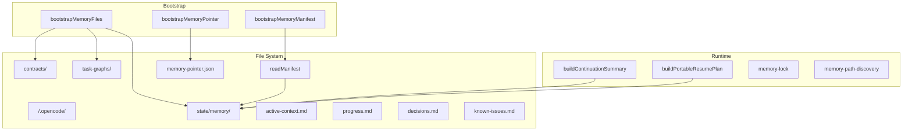

# Hecateq OpenAgent — Memory System

This document describes the Hecateq file-based memory system. **Status: Experimental.**

---

## Overview

The Hecateq memory system provides persistent, file-based long-term memory for agent sessions. It is designed for once-per-project initialization with safe create-or-skip semantics.



---

## Directory Structure

```
<project-root>/.opencode/
├── state/
│   └── memory/
│       ├── active-context.md     # Current session context
│       ├── progress.md           # Milestone tracking
│       ├── decisions.md          # Architecture decisions
│       └── known-issues.md       # Known bugs/issues
├── contracts/                     # Task contracts (contract-*.md)
├── task-graphs/                   # Dependency graphs (graph-*.json)
├── memory-manifest.json           # Version/checksum tracking
└── memory-pointer.json            # Active memory directory pointer
```

---

## Subsystems

### 1. Bootstrap

**Files:** `src/shared/memory-bootstrap.ts`, `src/hooks/hecateq-memory-bootstrap/index.ts`

Creates memory directories and template files. Fires once on the first `session.created` event for a non-subagent session.

**Safety properties:**
- Fires at most once per session (fired guard)
- Skips subagent sessions (parentID check)
- Never overwrites existing files
- All filesystem errors are caught and logged as warnings
- Disableable via `disabled_hooks: ["hecateq-memory-bootstrap"]`

**Template files created:**

```markdown
# active-context.md
# Current Session Context
_This file tracks the active context for the current Hecateq session._

# progress.md
# Progress
_This file tracks milestone progress for the current Hecateq session._

# decisions.md
# Decisions
_This file records architectural and design decisions for the current Hecateq session._

# known-issues.md
# Known Issues
_This file tracks known issues and bugs for the current Hecateq session._
```

### 2. Manifest

**File:** `src/shared/memory-manifest.ts`

JSON metadata file tracking memory file versions and checksums.

```json
{
  "version": 1,
  "files": {
    "active-context.md": {
      "checksum": "abc123...",
      "updatedAt": "2026-05-26T12:00:00.000Z",
      "size": 128
    }
  },
  "updatedAt": "2026-05-26T12:00:00.000Z"
}
```

### 3. Pointer

**File:** `src/shared/memory-bootstrap.ts` (pointer functions)

Points to the active memory directory. Supports multi-worktree scenarios.

```json
{
  "version": 1,
  "projectRoot": "/path/to/project",
  "memoryDir": ".opencode/state/memory",
  "updatedAt": "2026-05-26T12:00:00.000Z"
}
```

### 4. Continuation

**File:** `src/shared/memory-continuation.ts`

Builds a summary of session state for handoff or continuation:

- Current phase and progress
- Active tasks and their status
- Recent decisions
- Known issues
- Memory manifest version

### 5. Resume

**File:** `src/shared/memory-resume.ts`

Builds a portable resume plan for continuing interrupted sessions:

- Session identification
- Task recovery state
- Git checkpoint reference
- Continuation instructions

### 6. Lock

**File:** `src/shared/memory-lock.ts`

Provides concurrency guard for memory file access:

- File-based lock
- Timeout-based auto-release
- Non-blocking acquire

### 7. Path Discovery

**File:** `src/shared/memory-path-discovery.ts`

Discovers the project's memory directory:

- Walks up from `cwd` to find `.opencode/` directory
- Reads memory-pointer.json for active memory location
- Falls back to default path

---

## Context Injection

**File:** `src/hooks/hecateq-project-context-injector/index.ts` (862 lines)

The project context injector hook reads memory state, git state, handoff context, and agent index, then injects them into agent sessions via the `experimental.chat.messages.transform` hook.

**Injection modes:**

| Mode | Description |
|------|-------------|
| `compact` | Brief summary, most fields truncated |
| `expanded` | Full content, minimal truncation |
| `off` | Skip injection entirely |

**Injected content blocks:**

1. Memory Manifest — version, file checksums, timestamps
2. Memory Files — content of active-context.md, progress.md, decisions.md, known-issues.md
3. Git State — checkpoint status, dirty file count, branch
4. Handoff Context — STATUS/SIGNALS/HANDOFF from previous agent
5. Agent Index — available agents and their domains
6. Contract Files — content from `.opencode/contracts/`
7. Task Graphs — dependency graph state from `.opencode/task-graphs/`

**Configuration:**

```jsonc
{
  "hecateq": {
    "context_injection": {
      "enabled": true,
      "mode": "compact",
      "manifest_first": true,
      "max_memory_file_chars": 500,
      "max_total_chars": 2500,
      "max_artifact_files": 5,
      "include_contracts": true,
      "include_task_graphs": true,
      "include_agent_index": true,
      "max_agent_domains": 8,
      "max_agents_per_domain": 5,
      "inject_on_subagents": false,
      "hecateq_only": true
    }
  }
}
```

---

## Memory Files

### active-context.md

Tracks the current session context:

- Current goal/objective
- Active files
- Key decisions in progress
- Open questions
- Next steps

### progress.md

Tracks milestone progress:

- Completed milestones with dates
- In-progress milestones
- Blocked milestones
- Overall progress percentage

### decisions.md

Records architectural and design decisions (ADR-style):

- Date
- Decision
- Rationale
- Consequences

### known-issues.md

Tracks known issues and bugs:

- Issue description
- Severity
- Workaround
- Status (open, in-progress, resolved)

---

## Shared Utilities

| File | Purpose |
|------|---------|
| `src/shared/memory-bootstrap.ts` | Bootstrap functions, templates, directory paths |
| `src/shared/memory-manifest.ts` | Manifest read/write, validation |
| `src/shared/memory-continuation.ts` | Continuation summary builder |
| `src/shared/memory-resume.ts` | Resume plan builder |
| `src/shared/memory-lock.ts` | Concurrency lock |
| `src/shared/memory-path-discovery.ts` | Project root discovery |
| `src/shared/memory-summarizer.ts` | Content summarization |
| `src/shared/memory-manifest-updater.ts` | Manifest auto-update |
