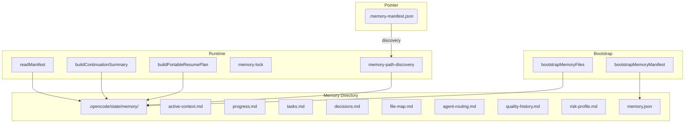

# Hecateq OpenAgent — Memory System

This document describes the Hecateq file-based memory system. **Status: Experimental.**

---

## Overview

The Hecateq memory system provides persistent, file-based long-term memory for agent sessions. It is designed for once-per-project initialization with safe create-or-skip semantics.



---

## Directory Structure

```
<project-root>/
├── .memory-manifest.json           # Repo-root pointer → memory.json path
└── .opencode/
    ├── state/
    │   └── memory/
    │       ├── memory.json          # Manifest (schema v2, checksums, lock state)
    │       ├── active-context.md    # Current session context
    │       ├── progress.md          # Milestone tracking
    │       ├── tasks.md             # Pending/blocked/done tasks
    │       ├── decisions.md         # Architecture decisions (ADR-style)
    │       ├── file-map.md          # Important file paths & entry points
    │       ├── agent-routing.md     # Agent routing rules & preferences
    │       ├── quality-history.md   # Quality gate results & audit trail
    │       └── risk-profile.md      # Known risks & mitigations
    ├── contracts/                   # Task contracts (contract-*.md)
    └── task-graphs/                 # Dependency graphs (graph-*.json)
```

---

## Subsystems

### 1. Bootstrap

**Files:** `src/shared/memory-bootstrap.ts`, `src/hooks/hecateq-memory-bootstrap/index.ts`

Creates memory directories and template files. Fires once on the first `session.created` event for a non-subagent session.

**Safety properties:**
- Fires at most once per session (fired guard)
- Skips subagent sessions (parentID check)
- Never overwrites existing files
- All filesystem errors are caught and logged as warnings
- Disableable via `disabled_hooks: ["hecateq-memory-bootstrap"]`

**Template files created:** All 8 memory files (active-context.md, progress.md, tasks.md, decisions.md, file-map.md, agent-routing.md, quality-history.md, risk-profile.md) are created with deterministic starter content using placeholder headings.

### 2. Manifest

**File:** `src/shared/memory-manifest.ts`

JSON metadata file tracking memory file versions, checksums, and lock state. Path: `.opencode/state/memory/memory.json`.

```json
{
  "schema_version": 2,
  "manifest_updated_at": "2026-05-26T12:00:00.000Z",
  "files": {
    "active-context.md": {
      "content_hash": "sha256:abc123...",
      "size_bytes": 128,
      "last_modified": "2026-05-26T12:00:00.000Z",
      "is_placeholder": false,
      "summary": "Current goal and active files"
    }
  },
  "required_files": [
    "active-context.md",
    "progress.md",
    "tasks.md",
    "decisions.md",
    "file-map.md",
    "agent-routing.md",
    "quality-history.md",
    "risk-profile.md"
  ],
  "updated_by_harness": "opencode"
}
```

### 3. Pointer

**File:** `.memory-manifest.json` (repo root)

A tracked repo-root pointer file that any harness (OpenCode, Claude Code, Codex, CLI) can discover independently. Provides the canonical entry point into the memory system.

```json
{
  "version": 1,
  "kind": "hecateq-memory-pointer",
  "manifest_path": ".opencode/state/memory/memory.json",
  "continuation_path": ".opencode/state/memory/continuation.json",
  "authoritative_root": ".opencode/state/memory",
  "updated_at": "2026-05-26T12:00:00.000Z"
}
```

**Rationale for a pointer file instead of a symlink:**
- Portable on Windows
- Git-friendly (tracked)
- Readable by any harness with plain filesystem access
- Enables path change without updating every harness

### 4. Continuation

**File:** `src/shared/memory-continuation.ts`

Builds a summary of session state for handoff or continuation:

- Current phase and progress
- Active tasks and their status
- Recent decisions
- Risk profile (from risk-profile.md)
- Memory manifest version

### 5. Resume

**File:** `src/shared/memory-resume.ts`

Builds a portable resume plan for continuing interrupted sessions:

- Session identification
- Task recovery state
- Git checkpoint reference
- Continuation instructions

### 6. Lock

**File:** `src/shared/memory-lock.ts`

Provides concurrency guard for memory file access:

- File-based lock
- Timeout-based auto-release
- Non-blocking acquire

### 7. Path Discovery

**File:** `src/shared/memory-path-discovery.ts`

Discovers the project's memory directory:

- Reads `.memory-manifest.json` from repo root for the authoritative memory directory path
- Falls back to `.opencode/state/memory/` if pointer file is absent

---

## Context Injection

**File:** `src/hooks/hecateq-project-context-injector/index.ts` (862 lines)

The project context injector hook reads memory state, git state, handoff context, and agent index, then injects them into agent sessions via the `experimental.chat.messages.transform` hook.

**Injection modes:**

| Mode | Description |
|------|-------------|
| `compact` | Brief summary, most fields truncated |
| `expanded` | Full content, minimal truncation |
| `off` | Skip injection entirely |

**Injected content blocks:**

1. Memory Manifest — version, file checksums, timestamps
2. Memory Files — content of all 8 memory files (active-context.md, progress.md, tasks.md, decisions.md, file-map.md, agent-routing.md, quality-history.md, risk-profile.md)
3. Git State — checkpoint status, dirty file count, branch
4. Handoff Context — STATUS/SIGNALS/HANDOFF from previous agent
5. Agent Index — available agents and their domains
6. Contract Files — content from `.opencode/contracts/`
7. Task Graphs — dependency graph state from `.opencode/task-graphs/`

**Configuration:**

```jsonc
{
  "hecateq": {
    "context_injection": {
      "enabled": true,
      "mode": "compact",
      "manifest_first": true,
      "max_memory_file_chars": 500,
      "max_total_chars": 2500,
      "max_artifact_files": 5,
      "include_contracts": true,
      "include_task_graphs": true,
      "include_agent_index": true,
      "max_agent_domains": 8,
      "max_agents_per_domain": 5,
      "inject_on_subagents": false,
      "hecateq_only": true
    }
  }
}
```

---

## Memory Files

The system manages 8 memory files. Each file is created on first bootstrap with deterministic starter content.

| File | Purpose |
|------|---------|
| `active-context.md` | Current session context — goal, active files, decisions-in-progress, next steps |
| `progress.md` | Milestone tracking — completed, in-progress, blocked |
| `tasks.md` | Task list — pending, blocked, done |
| `decisions.md` | Architecture decisions (ADR-style) |
| `file-map.md` | Important file paths, entry points, and module structure |
| `agent-routing.md` | Agent routing rules and preferences by task type |
| `quality-history.md` | Quality gate results and audit trail |
| `risk-profile.md` | Known risks, mitigations, and watch items |

---

## Shared Utilities

| File | Purpose |
|------|---------|
| `src/shared/memory-bootstrap.ts` | Bootstrap functions, templates, directory paths |
| `src/shared/memory-manifest.ts` | Manifest read/write, validation |
| `src/shared/memory-continuation.ts` | Continuation summary builder |
| `src/shared/memory-resume.ts` | Resume plan builder |
| `src/shared/memory-lock.ts` | Concurrency lock |
| `src/shared/memory-path-discovery.ts` | Project root discovery |
| `src/shared/memory-summarizer.ts` | Content summarization |
| `src/shared/memory-manifest-updater.ts` | Manifest auto-update |
