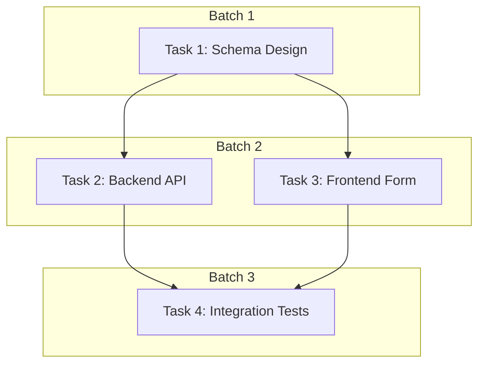

# Hecateq OpenAgent — Orchestration Pipeline

This document describes the Hecateq autonomous task orchestration pipeline. **Status: Experimental.**

---

## Overview

The Hecateq orchestration system (`src/features/hecateq-orchestration/`) implements an end-to-end task automation pipeline that transforms a user prompt into a structured, dependency-aware execution plan with quality gates and automatic repair.

```mermaid
graph LR
    P[User Prompt] --> I[Prompt Intake]
    I --> D[Task Decomposition]
    D --> DG[Dependency Graph]
    DG --> AS[Agent Selection]
    AS --> EP[Execution Plan]
    EP --> QG[Quality Gates]
    QG --> EX[Execute / Delegate]
    EX --> RL[Repair Loop]
    RL --> FR[Final Report]
    
    RL -.->|retry| EX
```



---

## Pipeline Stages

### 1. Prompt Intake

**File:** `prompt-intake.ts`

Analyzes the raw user prompt to extract structural metadata:

- **Intent:** implementation, bugfix, refactor, research, planning, review, devops, documentation, unknown
- **Risk Level:** low, medium, high, destructive
- **Task Size:** small, medium, large
- **Domain Scope:** single-domain, multi-domain, unknown-domain
- **Likely Domains:** backend, frontend, database, devops, security, qa, docs, architecture, research
- **Constraints & Exclusions:** extracted from prompt text
- **Required Agents:** explicitly requested agent names
- **Ambiguity Flag:** whether prompt needs clarification

### 2. Task Decomposition

**File:** `task-decomposer.ts`

Splits the analyzed prompt into atomic `TaskNode` objects:

```typescript
interface TaskNode {
  id: string
  label: string
  prompt: string
  domain: TaskDomain          // backend, frontend, database, etc.
  action: TaskAction          // read, write, both
  status: TaskNodeStatus      // pending, in_progress, completed, failed, blocked, skipped
  dependsOn: string[]         // dependency task IDs
  risk: RiskLevel             // low, medium, high, destructive
  sensitivePaths?: string[]   // referenced sensitive files
  metadata?: Record<string, unknown>
}
```

### 3. Dependency Graph

**File:** `dependency-planner.ts`, `cycle-detector.ts`

Builds a Directed Acyclic Graph (DAG) of task dependencies:

- **Cycle Detection:** Tarjan's algorithm for strongly connected components
- **Batch Planning:** Tasks at the same dependency depth form parallel batches
- **Sensitive Path Enforcement:** Tasks referencing `.env`, secrets, keys are blocked
- **Auto-Creation:** Edges inferred from task domain, action type, and declared signals



### 4. Agent Selection

**File:** `agent-selector.ts`

Matches tasks to agents from a local AGENTS.md registry:

- **Registry:** Reads AGENTS.md files from `~/.config/opencode/agents/`
- **Matching:** By domain, capability, and name
- **Fallback:** Unassigned tasks fall back to the default agent
- **Disabled Agents:** Excluded from selection

### 5. Execution Plan

**File:** `execution-planner.ts`

Orders tasks into dependency-respecting batches and injects overhead stages:

- **Contract Injection:** High-risk tasks get a pre-implementation contract stage
- **Plan Injection:** Complex tasks get a planning stage
- **Verification Injection:** Tasks get a post-implementation verification stage
- **Sensitive Path Gating:** Tasks blocking on sensitive paths are excluded

### 6. Quality Gates

**File:** `quality-gate-runner.ts`

Runs verification commands after task execution:

| Gate | Command | Configurable |
|------|---------|-------------|
| typecheck | `bun run typecheck` | Yes |
| lint | `bun run lint` | Yes |
| test | `bun run test` | Yes |
| build | `bun run build` | Yes |
| doctor | `bun run doctor` | Yes |

Gates can be individually enabled/disabled via `quality_gates` config.

### 7. Repair Loop

**File:** `repair-loop-controller.ts`

Automatic repair on task failure:

- **Max Attempts:** Configurable (default: 2)
- **Retry Strategy:** Full retry with same agent
- **Escalation:** After max attempts, task is marked failed and pipeline continues
- **Error Tracking:** Failed task errors are collected for the final report

### 8. Final Report

**File:** `final-report-generator.ts`

Generates a structured report summarizing the orchestration run:

- Overall success/failure
- Per-task execution results
- Changed files list
- Quality gate outcomes
- Repair attempts
- Execution timing

---

## Handoff System

The orchestration pipeline integrates with a structured handoff system for agent-to-agent communication.

### Handoff Format

```
STATUS: [DONE | IN_PROGRESS | BLOCKED]
SIGNALS_EMITTED: [{"signal":"<name>","payload":{}}]
HANDOFF: [return_to_caller | <agent-id>]
```

### Handoff Components

| Component | File | Purpose |
|-----------|------|---------|
| Handoff Parser | `handoff-parser.ts` | Parse STATUS/SIGNALS/HANDOFF blocks from agent responses |
| Handoff Role Policy | `handoff-role-policy.ts` | Validate agent role consistency across handoffs |
| Handoff Context Injection | `handoff-context-injection.ts` | Enrich handoff records with contextual metadata |
| Handoff Boulder Projection | `handoff-boulder-projection.ts` | Sync handoff state with boulder tracking |
| Runtime Handoff Service | `runtime-handoff-service.ts` | Dispatch handoffs at runtime |

### Routing Policy Engine

**File:** `routing-policy-engine.ts`

Makes routing decisions from handoff blocks:

- Reads `SIGNALS_EMITTED` for capability requirements
- Reads `HANDOFF` target for explicit routing
- Considers task phase, domain, and upstream agent identity
- Returns a `RoutingDecision` with next agent and delegation chain

---

## Delegation System

### Delegation Controller

**File:** `delegation-controller.ts`

Manages the delegation lifecycle:

- Validates delegation requests against chain config (depth, fan-out, iterations)
- Creates delegation execution requests
- Tracks delegation completion

### Delegation Executor

**File:** `delegation-executor.ts`

Executes delegation requests:

- Spawns subagent sessions via `OpenCodeSessionExecutionAdapter`
- Polls for completion with configurable timeout
- Collects results and errors
- Returns `TaskExecutionResult[]`

---

## Execution Adapters

**File:** `execution-adapter.ts`

Abstracts the execution mechanism:

| Adapter | Purpose |
|---------|---------|
| `DryRunExecutionAdapter` | Simulates execution for planning/dry-run |
| `OpenCodeSessionExecutionAdapter` | Real execution via OpenCode sessions |

The OpenCode adapter (`src/cli/hecateq/runtime-adapter.ts`) connects to a running OpenCode instance:

- Session creation and management
- Message dispatch
- Tool execution delegation
- Result collection

---

## Signal System

### Signal Registry

**File:** `signal-registry.ts`

Registry of named signals that agents can emit for inter-agent coordination:

- Schema: `{signal: string, payload: Record<string, unknown>}`
- Registration: Signals declared at agent definition time
- Consumption: Downstream agents declare interest in specific signals

### Signal DAG Executor

**File:** `signal-dag-executor.ts`

Executes signal-driven DAGs where signal emissions trigger downstream tasks:

- Signal → Task mapping
- Parallel execution of signal-independent branches
- Aggregation of signal results

---

## OMO State Manager

**File:** `omo-state-manager.ts`

Manages persistent orchestration state:

- Session state: phase, prompt, task list, timestamps
- State storage: `.opencode/orchestration/<session-id>.json`
- State recovery: Load and resume interrupted sessions
- Migration: `.omo/` → `.opencode/` migration (`omo-migration.ts`)

---

## Pipeline Files

| File | Lines | Purpose |
|------|-------|---------|
| `orchestration-controller.ts` | 937 | Central pipeline orchestrator |
| `types.ts` | 1054 | All shared types |
| `prompt-intake.ts` | ~200 | Prompt analysis |
| `task-decomposer.ts` | ~300 | Task splitting |
| `dependency-planner.ts` | ~200 | DAG + batches |
| `cycle-detector.ts` | ~150 | Cycle detection |
| `agent-selector.ts` | ~200 | Agent matching |
| `execution-planner.ts` | ~300 | Plan + contract injection |
| `quality-gate-runner.ts` | ~150 | Verification commands |
| `repair-loop-controller.ts` | ~200 | Failure recovery |
| `final-report-generator.ts` | ~200 | Summary report |
| `handoff-parser.ts` | ~150 | Handoff parsing |
| `handoff-role-policy.ts` | ~200 | Role validation |
| `handoff-context-injection.ts` | ~150 | Context enrichment |
| `handoff-boulder-projection.ts` | ~150 | Boulder sync |
| `routing-policy-engine.ts` | ~350 | Routing decisions |
| `delegation-controller.ts` | ~200 | Delegation lifecycle |
| `delegation-executor.ts` | ~300 | Delegation execution |
| `execution-adapter.ts` | ~150 | Execution abstraction |
| `signal-registry.ts` | ~100 | Signal declarations |
| `signal-dag-executor.ts` | ~200 | Signal-driven DAG |
| `omo-state-manager.ts` | ~250 | State persistence |
| `omo-migration.ts` | ~150 | State migration |
| `runtime-handoff-service.ts` | ~200 | Runtime handoff |
| `runtime-delegation-consumer.ts` | ~150 | Runtime delegation |

---

## Test Files

The orchestration module includes 15 test files covering:

| Test File | Coverage |
|-----------|----------|
| `orchestration.test.ts` | End-to-end pipeline |
| `dag-mutation.test.ts` | DAG manipulation |
| `dag-semantics.test.ts` | DAG semantics |
| `dag-delete-rewrite.test.ts` | DAG delete/rewrite |
| `dynamic-dag.test.ts` | Dynamic DAG |
| `cycle-detector.test.ts` | Cycle detection |
| `execution-planner.test.ts` | Execution planning |
| `execution-adapter.test.ts` | Adapter behavior |
| `delegation-controller.test.ts` | Delegation lifecycle |
| `delegation-executor.test.ts` | Delegation execution |
| `routing-policy-engine.test.ts` | Routing decisions |
| `handoff-parser.test.ts` | Handoff parsing |
| `handoff-role-policy.test.ts` | Role validation |
| `handoff-context-injection.test.ts` | Context injection |
| `handoff-boulder-projection.test.ts` | Boulder projection |
| `signal-registry.test.ts` | Signal registration |
| `signal-dag-executor.test.ts` | Signal DAG execution |
| `omo-state-manager.test.ts` | State management |
| `omo-migration.test.ts` | State migration |
| `runtime-handoff-service.test.ts` | Runtime handoff |
