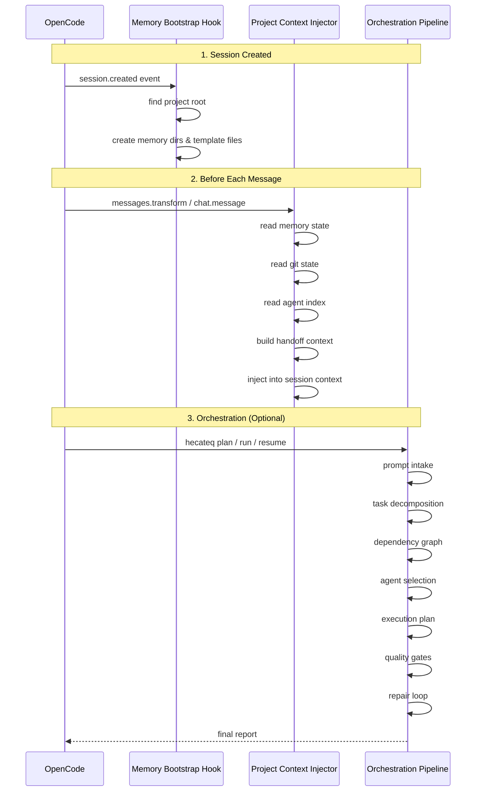

# Hecateq OpenAgent — Overview

This document describes the Hecateq-specific systems and their relationships within the Hecateq OpenAgent plugin. It is intended as a companion to the upstream documentation.

---

## Hecateq System Map

```mermaid
graph TD
    subgraph "Config Layer"
        HC[HecateqConfigSchema<br/>src/config/schema/hecateq.ts]
    end

    subgraph "CLI Layer"
        HP[hecateq plan]
        HR[hecateq run]
        HRS[hecateq resume]
        HS[hecateq status]
        HD[hecateq doctor]
    end

    subgraph "Hook Layer"
        HMB[Memory Bootstrap Hook<br/>src/hooks/hecateq-memory-bootstrap/]
        HPCI[Project Context Injector Hook<br/>src/hooks/hecateq-project-context-injector/]
    end

    subgraph "Shared Utilities"
        AI[Agent Indexer<br/>src/shared/hecateq-agent-indexer.ts]
        MB[Memory Bootstrap<br/>src/shared/memory-bootstrap.ts]
        MM[Memory Manifest<br/>src/shared/memory-manifest.ts]
        MP[Memory Pointer<br/>src/shared/memory-bootstrap.ts]
        MC[Memory Continuation<br/>src/shared/memory-continuation.ts]
        MR[Memory Resume<br/>src/shared/memory-resume.ts]
        GC[Git Checkpoint<br/>src/shared/git-checkpoint.ts]
    end

    subgraph "Orchestration Feature"
        ORCH[Orchestration Controller<br/>orchestration-controller.ts]
        PI[Prompt Intake<br/>prompt-intake.ts]
        TD[Task Decomposer<br/>task-decomposer.ts]
        DP[Dependency Planner<br/>dependency-planner.ts]
        AS[Agent Selector<br/>agent-selector.ts]
        EP[Execution Planner<br/>execution-planner.ts]
        QG[Quality Gate Runner<br/>quality-gate-runner.ts]
        RL[Repair Loop<br/>repair-loop-controller.ts]
        FR[Final Report<br/>final-report-generator.ts]
        RPE[Routing Policy Engine<br/>routing-policy-engine.ts]
        DC[Delegation Controller<br/>delegation-controller.ts]
        DE[Delegation Executor<br/>delegation-executor.ts]
        HF[Handoff System<br/>handoff-parser, handoff-role-policy, etc.]
    end

    HC --> HMB
    HC --> HPCI
    HC --> ORCH
    
    HMB --> MB
    HMB --> MM
    HPCI --> MB
    HPCI --> MM
    HPCI --> MC
    HPCI --> MR
    HPCI --> AI
    HPCI --> GC
    HPCI --> ORCH

    HP --> ORCH
    HR --> ORCH
    HRS --> ORCH
    HS --> ORCH
    HD --> ORCH

    ORCH --> PI
    ORCH --> TD
    ORCH --> DP
    ORCH --> AS
    ORCH --> EP
    ORCH --> QG
    ORCH --> RL
    ORCH --> FR
    ORCH --> RPE
    ORCH --> DC
    ORCH --> DE
    ORCH --> HF
```

---

## Key Hecateq Files

| File | Purpose |
|------|---------|
| `src/config/schema/hecateq.ts` | Hecateq config schema (341 lines, 9 sub-configs) |
| `src/cli/hecateq/plan.ts` | `hecateq plan` command |
| `src/cli/hecateq/run.ts` | `hecateq run` command |
| `src/cli/hecateq/resume.ts` | `hecateq resume` command |
| `src/cli/hecateq/status.ts` | `hecateq status` command |
| `src/cli/hecateq/doctor.ts` | `hecateq doctor` command |
| `src/cli/hecateq/runtime-adapter.ts` | OpenCode session adapter for orchestration |
| `src/cli/hecateq/shared.ts` | Shared CLI utilities |
| `src/hooks/hecateq-memory-bootstrap/index.ts` | Memory bootstrap hook |
| `src/hooks/hecateq-project-context-injector/index.ts` | Project context injector hook |
| `src/features/hecateq-orchestration/` | Full orchestration pipeline (46 files) |
| `src/features/hecateq-orchestration/orchestration-controller.ts` | Central orchestrator (937 lines) |
| `src/features/hecateq-orchestration/types.ts` | Core orchestration types (1054 lines) |
| `src/shared/hecateq-agent-indexer.ts` | Agent indexer (1681 lines) |
| `src/shared/memory-bootstrap.ts` | Memory bootstrap utilities |
| `src/shared/memory-manifest.ts` | Memory manifest utilities |
| `src/shared/memory-continuation.ts` | Session continuation utilities |
| `src/shared/memory-resume.ts` | Session resume utilities |
| `src/shared/git-checkpoint.ts` | Git checkpoint utilities |

---

## Hecateq-Specific Terms

| Term | Definition |
|------|------------|
| **Prompt Intake** | Analysis of a user prompt to determine intent, risk level, task size, and domains |
| **Task Node** | Atomic unit of work with id, label, domain, action type, dependencies, and status |
| **Dependency Graph** | DAG of task nodes with cycle detection and batch planning |
| **Batch** | Set of tasks that can execute in parallel (same dependency depth) |
| **Agent Selection** | Matching tasks to agents from a local AGENTS.md registry |
| **Execution Plan** | Ordered batches with injected contract/plan/verification stages for high-risk tasks |
| **Quality Gate** | Per-task verification step (typecheck, lint, test, build, doctor) |
| **Repair Loop** | Automatic retry of failed tasks with configurable attempt limit |
| **Handoff** | Structured STATUS/SIGNALS/HANDOFF block for agent-to-agent transfer |
| **Role Policy** | Rules governing which agent roles can hand off to which |
| **Memory Bootstrap** | Once-per-project creation of memory directories and template files |
| **Memory Manifest** | JSON metadata file tracking memory file versions and checksums |
| **Memory Pointer** | Points to the active memory directory (supports multiple worktrees) |
| **Context Injection** | Injection of memory state, git state, handoff context, and agent index into sessions |
| **Agent Index** | Runtime registry of available agents from AGENTS.md files |
| **Git Checkpoint** | Pre-task git state snapshot and dirty file tracking |
| **Auto-Spawn** | Autonomous spawning of subagents with rate limiting |
| **Delegation Chain** | Max depth/fan-out/iterations limits for delegation cascades |

---

## Hecateq Workflow

### Session Workflow with Hecateq Hooks

---

## Hecateq-Specific Doctor Checks

The `hecateq doctor` command runs 11 diagnostic categories:

| Category | File | What It Checks |
|----------|------|----------------|
| Agent Registration | `src/cli/doctor/checks/hecateq-workflow.ts` | Hecateq agents registered in OpenCode |
| Configuration | Same file | Hecateq config section validity |
| Orchestration | Same file | Orchestration state directory and files |
| Safety Hooks | Same file | Required Hecateq hooks enabled |
| Handoff State | Same file | Handoff files exist and parse |
| Role Policy | Same file | Handoff role policy consistency |
| Project Memory | Same file | Memory directory and files |
| Memory Manifest | Same file | Manifest freshness and pointer validity |
| Custom Agents | Same file | Custom agent definitions |
| Agent Index | Same file | Agent index freshness |
| Artifacts | Same file | Artifact directory structure |

See [cli-commands.md](./cli-commands.md) for usage.
