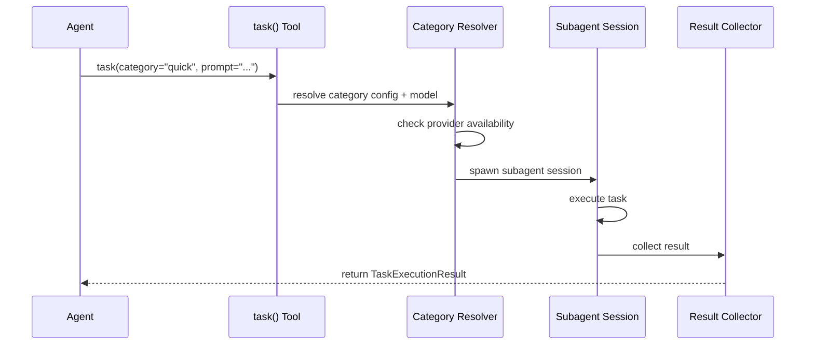

# Hecateq OpenAgent — Routing & Delegation

This document describes the Hecateq routing and delegation systems. **Status: Experimental.**

---

## Overview

Hecateq OpenAgent implements routing at multiple levels:

1. **Hecateq Routing Policy Engine** — signal-based routing from handoff blocks
2. **Upstream Task Delegation** — category-based routing via the `task()` tool
3. **Agent Resolution** — agent name resolution to OpenCode agent definitions

---

## Hecateq Routing Policy Engine

**File:** `src/features/hecateq-orchestration/routing-policy-engine.ts`

The routing policy engine reads structured `HANDOFF:` blocks from agent responses and makes routing decisions.

### Handoff Block Format

```markdown
STATUS: [DONE | IN_PROGRESS | BLOCKED]
SIGNALS_EMITTED: [{"signal":"<name>","payload":{}}]
HANDOFF: [return_to_caller | return_to_parent_for_routing | <agent-id>]
```

### Routing Decision

```typescript
interface RoutingDecision {
  targetAgent: string
  delegationChain: string[]
  requiresContract: boolean
  requiresPlan: boolean
  signals: Array<{ name: string; payload: Record<string, unknown> }>
}
```

### Decision Factors

| Factor | Source |
|--------|--------|
| Current phase | Session state |
| Task domain | Task node metadata |
| Required capabilities | SIGNALS_EMITTED payload |
| Agent availability | Agent registry |
| Handoff target | HANDOFF directive |
| Upstream agent identity | Handoff history |

---

## Task Delegation (`task()` tool)

**Files:** `src/tools/delegate-task/`, `src/tools/delegate-task/constants.ts`

The core delegation mechanism routes tasks to categories via the `task()` OpenCode tool.

### Category Reference

| Category | Model Preference | Use Case |
|----------|-----------------|----------|
| `quick` | Claude/GPT-mini | Fast, simple, low-cost tasks |
| `default` | Claude/GPT | General purpose |
| `deep` | Claude-thinking/GPT-o3 | Complex reasoning, analysis |
| `ultrabrain` | Claude/GPT-o3 | Maximum intelligence, hard problems |
| `unspecified-low` | Gemini/Claude-haiku | Budget-constrained tasks |
| `unspecified-high` | Claude-thinking/GPT-o3 | High-effort, thorough work |
| `artistry` | Claude/GPT-o3 | Creative, design, UI |
| `oracle` | Claude-thinking/GPT-o3 | Architecture, review, verification |

### Delegation Flow



### Skills in Delegation

Tasks can load skills for specialized behavior:

```typescript
task({
  category: "quick",
  load_skills: ["git-master"],
  prompt: "commit the changes",
})
```

---

## Agent Resolution

**File:** `src/shared/routing/resolve-agent-target.ts`

Resolves agent names to OpenCode agent definitions:

- Built-in agents (sisyphus, hephaestus, etc.)
- Custom agents from AGENTS.md
- Category-based routing via `subagent_type` field

### Agent Target Resolution

```typescript
function resolveAgentTarget(
  name: string,
  agentConfig: AgentConfig,
  customAgents: CustomAgent[]
): AgentTarget
```

---

## Delegation Chain

**File:** `src/features/hecateq-orchestration/delegation-controller.ts`

Circuit breaker for delegation cascades:

| Parameter | Default | Max |
|-----------|---------|-----|
| Max depth | 3 | — |
| Max fan-out | 10 | 50 |
| Max iterations per run | 10 | 100 |

The delegation controller validates each request against these limits before dispatching.

---

## Routing Contract

**File:** `src/shared/routing/routing-contract.ts`

Defines the contract between routing stages:

```typescript
interface RoutingContract {
  sourceAgent: string
  targetAgent: string
  taskId: string
  signals: Signal[]
  handoff: HandoffDirective
  metadata: Record<string, unknown>
}
```

---

## Runtime Delegation Consumer

**File:** `src/features/hecateq-orchestration/runtime-delegation-consumer.ts`

Listens for delegation requests at runtime and dispatches them through the execution adapter.

---

## Upstream Routing Files

| File | Purpose |
|------|---------|
| `src/shared/routing/index.ts` | Barrel exports |
| `src/shared/routing/routing-contract.ts` | Contract types |
| `src/shared/routing/routing-result.ts` | Result types |
| `src/shared/routing/routing-strategy.ts` | Strategy implementations |
| `src/shared/routing/task-intent-classifier.ts` | Intent classification |
| `src/shared/routing/resolve-agent-target.ts` | Agent resolution |
| `src/tools/delegate-task/subagent-resolver.ts` | Subagent selection |
| `src/tools/delegate-task/category-resolver.ts` | Category resolution |
| `src/tools/delegate-task/skill-resolver.ts` | Skill resolution |
