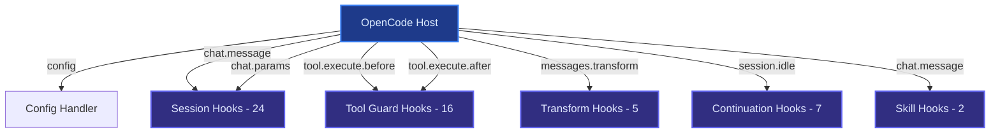
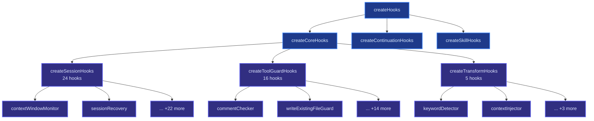
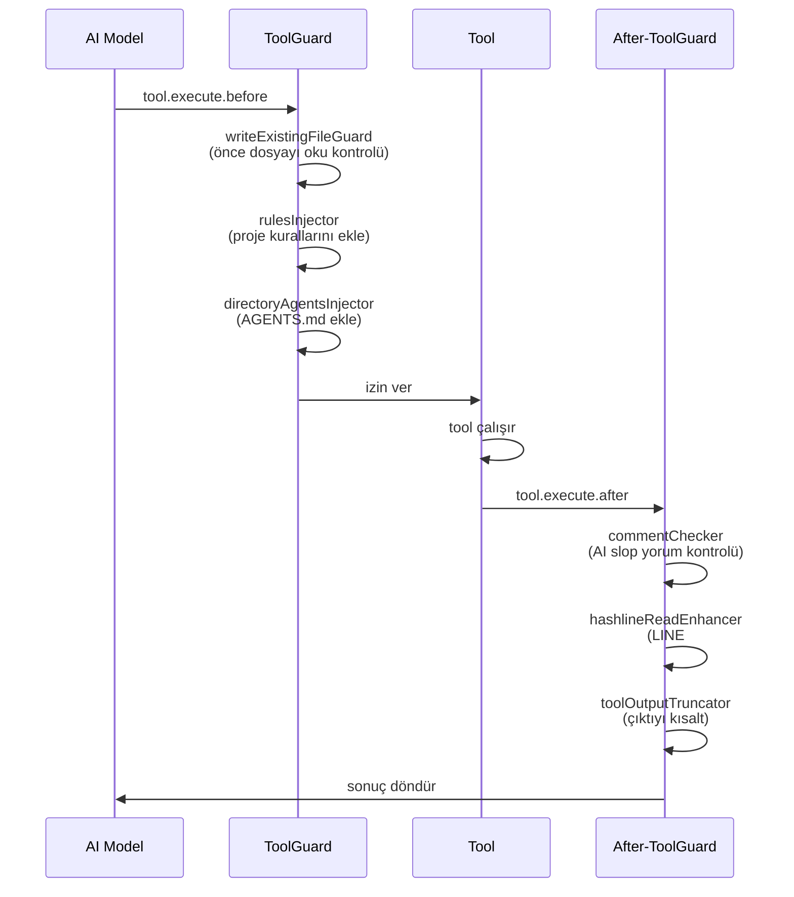

# 03 — Hook Sistemi

> **Kapsam:** Hecateq OpenAgent 5-katmanlı hook kompozisyonu
> **Toplam Hook:** 54 temel, 61 team-mode etkin
> **Hedef Kitle:** OpenCode plugin geliştiricileri ve Hecateq katkıcıları

---

## İçindekiler

1. [Hook Sistemi Genel Bakış](#hook-sistemi-genel-bakış)
2. [5 Katmanlı Hook Kompozisyonu](#5-katmanlı-hook-kompozisyonu)
3. [24 Session Hook](#24-session-hook)
4. [16 Tool Guard Hook](#16-tool-guard-hook)
5. [5 Transform Hook](#5-transform-hook)
6. [7 Continuation Hook](#7-continuation-hook)
7. [2 Skill Hook](#2-skill-hook)
8. [Hook Kayıt Mekanizması](#hook-kayıt-mekanizması)
9. [Team-Mode Delta](#team-mode-delta)
10. [Anahtar Hook'lar Derinlemesine](#anahtar-hooklar-derinlemesine)
11. [zauc-mocks-* Pattern](#zauc-mocks-pattern)
12. [Hook Çalışma Sırası](#hook-çalışma-sırası)
13. [Hook Kategorileri](#hook-kategorileri)

---

## Hook Sistemi Genel Bakış

Hecateq OpenAgent, OpenCode'un plugin lifecycle'ına **5 katmanlı bir hook kompozisyonu** ile entegre olur. Her katman, OpenCode'un farklı bir olayına (event) veya kesişim noktasına (interception point) bağlanır.

### Mimari Özet



### Sayısal Döküm

| Katman | Temel | +Team-Mode | Toplam |
|--------|-------|------------|--------|
| Session | 24 | 0 | 24 |
| Tool Guard | 16 | +1 | 17 |
| Transform | 5 | +2 | 7 |
| Continuation | 7 | 0 | 7 |
| Skill | 2 | 0 | 2 |
| **Ara Toplam** | **54** | **+3** | **57** |
| Direct event handlers | — | +4 | 4 |
| **Genel Toplam** | **54** | **+7** | **61** |

### OpenCode Plugin Lifecycle Entegrasyonu

Hook'lar, OpenCode'un 13 hook handler'ına bağlanır:

| Handler | OpenCode Hook | Kullanılan Katman |
|---------|---------------|-------------------|
| `config` | `config` | — (config pipeline, hook değil) |
| `tool` | `tool` | — (tool registry, hook değil) |
| `chat.message` | `chat.message` | Session, Skill |
| `chat.params` | `chat.params` | Session |
| `chat.headers` | `chat.headers` | Session |
| `command.execute.before` | `command.execute.before` | Session |
| `event` | `event` | Session, Continuation |
| `tool.execute.before` | `tool.execute.before` | Tool Guard |
| `tool.execute.after` | `tool.execute.after` | Tool Guard |
| `experimental.chat.messages.transform` | `experimental.chat.messages.transform` | Transform |
| `experimental.chat.system.transform` | `experimental.chat.system.transform` | Transform |
| `experimental.session.compacting` | `experimental.session.compacting` | Continuation |
| `experimental.compaction.autocontinue` | `experimental.compaction.autocontinue` | Continuation |

---

## 5 Katmanlı Hook Kompozisyonu

Hook'lar 3 ana fonksiyonda birleştirilir:

```
src/create-hooks.ts
  ├── createCoreHooks()        # Session (24) + ToolGuard (16) + Transform (5) = 45
  ├── createContinuationHooks() # 7
  └── createSkillHooks()       # 2
```

### createCoreHooks()

**Dosya:** `src/plugin/hooks/create-core-hooks.ts`

```typescript
// src/plugin/hooks/create-core-hooks.ts (özet)
export function createCoreHooks(args) {
  const session = createSessionHooks({ ctx, pluginConfig, ... })       // 24
  const tool = createToolGuardHooks({ ctx, pluginConfig, ... })        // 16
  const transform = createTransformHooks({ ctx, pluginConfig, ... })   // 5
  return { ...session, ...tool, ...transform }
}
```

### createContinuationHooks()

**Dosya:** `src/create-hooks.ts`

```typescript
// src/create-hooks.ts (özet)
export function createContinuationHooks(args) {
  return {
    stopContinuationGuard,        // /stop-continuation komutu
    compactionContextInjector,    // Compaction sonrası context geri yükleme
    compactionTodoPreserver,      // Compaction'da todo'ları koruma
    todoContinuationEnforcer,     // Boulder: yarım kalan todo'ları zorla devam ettir
    unstableAgentBabysitter,     // Kararsız ajanları izle
    backgroundNotificationHook,   // Background task bildirimleri
    atlasHook,                   // Atlas orchestrator
  }
}
```

### createSkillHooks()

**Dosya:** `src/plugin/hooks/create-skill-hooks.ts`

```typescript
// src/plugin/hooks/create-skill-hooks.ts (özet)
export function createSkillHooks(args) {
  return {
    subagentSkillReminder,   // Kategori çağrılarında skill önerisi
    autoSlashCommand,        // Kullanıcı mesajından /command otomatik çalıştırma
  }
}
```

### safeHook() Wrapper

Her hook, `safeHook()` fonksiyonu ile sarılır. Bu wrapper, bir hook'un fırlattığı hatanın diğer hook'ları etkilemesini engeller:

```typescript
// safeHook izolasyon mantığı
function safeHook(hookFn, hookName) {
  return async (input, output) => {
    try {
      await hookFn(input, output)
    } catch (error) {
      log(`[${hookName}] Hook hatası: ${error.message}`)
      // Diğer hook'lar çalışmaya devam eder
    }
  }
}
```

Her bir hook, `isHookEnabled()` fonksiyonu ile kontrol edilir. `disabled_hooks` config dizisinde adı geçen hook'lar çalıştırılmaz.

---

## 24 Session Hook

Session hook'ları, OpenCode oturumunun yaşam döngüsündeki olaylara (session.created, session.idle, session.error, chat.message, chat.params) tepki verir.

**Dosya:** `src/plugin/hooks/create-session-hooks.ts`

### Tam Tablo

| # | Hook Adı | Dosya Yolu | Amaç |
|---|----------|------------|------|
| 1 | `contextWindowMonitor` | `src/hooks/context-window-monitor/` | Context penceresi dolum oranını izler, taşma öncesi uyarı verir |
| 2 | `preemptiveCompaction` | `src/hooks/preemptive-compaction/` | Context limitine yaklaşıldığında otomatik compaction tetikler |
| 3 | `sessionRecovery` | `src/hooks/session-recovery/` | Session hatalarını kurtarır (4 hata tipi) |
| 4 | `sessionNotification` | `src/hooks/session-notification/` | OS bildirimi gönderir (tamamlanan session'lar için) |
| 5 | `thinkMode` | `src/hooks/think-mode/` | Claude için genişletilmiş düşünme modu |
| 6 | `modelFallback` | `src/hooks/model-fallback/hook` | Proaktif model yedekleme (API çağrısı öncesi) |
| 7 | `anthropicContextWindowLimitRecovery` | `src/hooks/anthropic-context-window-limit-recovery/` | Anthropic context limit hatasından kurtarma |
| 8 | `autoUpdateChecker` | `src/hooks/auto-update-checker/` | npm versiyon kontrolü, güncelleme bildirimi |
| 9 | `agentUsageReminder` | `src/hooks/agent-usage-reminder/` | Kullanıcıya ajanları kullanmasını hatırlatır |
| 10 | `nonInteractiveEnv` | `src/hooks/non-interactive-env/` | `run` komutu için interaktif olmayan ortam ayarları |
| 11 | `interactiveBashSession` | `src/hooks/interactive-bash-session/` | tmux ile interaktif bash oturumu yönetimi |
| 12 | `ralphLoop` | `src/hooks/ralph-loop/` | Kendi kendini referans alan geliştirme döngüsü |
| 13 | `editErrorRecovery` | `src/hooks/edit-error-recovery/` | Başarısız edit'leri yeniden dener |
| 14 | `delegateTaskRetry` | `src/hooks/delegate-task-retry/` | Başarısız delegasyonları yeniden dener |
| 15 | `startWork` | `src/hooks/start-work/` | `/start-work` komutunu işler |
| 16 | `prometheusMdOnly` | `src/hooks/prometheus-md-only/` | Prometheus'un sadece `.md` dosyalarını düzenlemesini zorunlu kılar |
| 17 | `sisyphusJuniorNotepad` | `src/hooks/sisyphus-junior-notepad/` | Sisyphus-Junior için notepad enjeksiyonu |
| 18 | `noSisyphusGpt` | `src/hooks/no-sisyphus-gpt/` | Sisyphus'u GPT dışı modellerde çalıştırmayı engeller |
| 19 | `noHephaestusNonGpt` | `src/hooks/no-hephaestus-non-gpt/` | Hephaestus'u GPT dışı modellerde çalıştırmayı engeller |
| 20 | `questionLabelTruncator` | `src/hooks/question-label-truncator/` | Soru etiketlerini kısaltır |
| 21 | `taskResumeInfo` | `src/hooks/task-resume-info/` | Devam eden session'larda task context'ini geri yükler |
| 22 | `anthropicEffort` | `src/hooks/anthropic-effort/` | Anthropic reasoning effort ayarını yapar |
| 23 | `runtimeFallback` | `src/hooks/runtime-fallback/` | Reaktif provider hata kurtarma (429, 500, 502, 503, 504) |
| 24 | `legacyPluginToast` | `src/hooks/legacy-plugin-toast/` | Eski plugin adı uyarısı (oh-my-opencode → oh-my-openagent) |

### Kritik Session Hook'lar

#### sessionRecovery (`src/hooks/session-recovery/`)
4 farklı hata tipini tanır ve kurtarma aksiyonu alır:

| Hata Tipi | Açıklama | Kurtarma |
|-----------|----------|----------|
| `tool_result_missing` | Tool sonucu eksik | Tool'u yeniden çalıştır |
| `thinking_block_order` | Thinking bloğu sırası bozuk | Mesaj sırasını düzelt |
| `content_too_large` | İçerik çok büyük | Compaction tetikle |
| `unknown` | Tanınmayan hata | Session'ı yeniden başlat |

#### runtimeFallback (`src/hooks/runtime-fallback/`)
Provider hatalarına karşı reaktif yedekleme. `runtime_fallback` config'inde yapılandırılır:

```jsonc
{
  "runtime_fallback": {
    "enabled": true,
    "max_retries": 3,
    "timeout_ms": 30000
  }
}
```

Tetikleyiciler: HTTP 429 (rate limit), 500/502/503/504 (sunucu hatası), session idle timeout.

#### thinkMode (`src/hooks/think-mode/`)
Claude'un genişletilmiş düşünme (extended thinking) modunu yönetir. `chat.params` hook'u üzerinden çalışır:

```typescript
// Kavramsal yapı
if (config.agents?.[agentName]?.thinking) {
  params.extendedThinking = {
    budgetTokens: config.agents[agentName].thinking.budgetTokens,
  }
}
```

---

## 16 Tool Guard Hook

Tool Guard hook'ları, her tool çağrısından **önce** (`tool.execute.before`) ve **sonra** (`tool.execute.after`) çalışır. Toplam 16 hook, team-mode etkinken +1 (teamToolGating) = 17.

**Dosya:** `src/plugin/hooks/create-tool-guard-hooks.ts`

### Tam Tablo

| # | Hook Adı | Dosya Yolu | Çalışma Zamanı | Amaç |
|---|----------|------------|----------------|------|
| 1 | `commentChecker` | `src/hooks/comment-checker/` | After | AI slop yorum bloklama (binary: `@code-yeongyu/comment-checker`) |
| 2 | `toolOutputTruncator` | `src/hooks/tool-output-truncator/` | After | Aşırı büyük çıktıları kısaltır |
| 3 | `directoryAgentsInjector` | `src/hooks/directory-agents-injector/` | Before | Dizin bazlı AGENTS.md enjeksiyonu |
| 4 | `directoryReadmeInjector` | `src/hooks/directory-readme-injector/` | Before | Dizin bazlı README enjeksiyonu |
| 5 | `emptyTaskResponseDetector` | `src/hooks/empty-task-response-detector/` | After | Boş task yanıtlarını tespit eder |
| 6 | `rulesInjector` | `src/hooks/rules-injector/` | Before | Proje kurallarını enjekte eder |
| 7 | `tasksTodowriteDisabler` | `src/hooks/tasks-todowrite-disabler/` | Before | TodoWrite tool'unu devre dışı bırakır |
| 8 | `writeExistingFileGuard` | `src/hooks/write-existing-file-guard/` | Before | Varolan dosyaya yazmadan önce Read zorunluluğu |
| 9 | `bashFileReadGuard` | `src/hooks/bash-file-read-guard/` | Before | cat/head/tail ile dosya okumayı guard'lar |
| 10 | `hashlineReadEnhancer` | `src/hooks/hashline-read-enhancer/` | After | Read çıktısına LINE#ID content hash'i ekler |
| 11 | `jsonErrorRecovery` | `src/hooks/json-error-recovery/` | After | JSON parse hatalarını tespit eder ve düzeltir |
| 12 | `readImageResizer` | `src/hooks/read-image-resizer/` | Before | Büyük görselleri yeniden boyutlandırır |
| 13 | `todoDescriptionOverride` | `src/hooks/todo-description-override/` | Before | Todo açıklamalarını geçersiz kılar |
| 14 | `webfetchRedirectGuard` | `src/hooks/webfetch-redirect-guard/` | Before | Webfetch yönlendirmelerini kontrol eder |
| 15 | `fsyncSkipWarning` | `src/hooks/fsync-skip-warning/` | After | fsync atlama uyarısı |
| 16 | `teamToolGating` | `src/hooks/team-tool-gating/` | Before | Team-mode tool'larını gater (team-mode etkinken) |

### Derinlemesine: 3 Kritik Tool Guard Hook

#### commentChecker (`src/hooks/comment-checker/`)

AI tarafından üretilen "slop" yorumları engeller. `@code-yeongyu/comment-checker` binary'sini kullanır:

```typescript
// Kavramsal kullanım
// Engellenen yorum kalıpları: "This function...", "Helper method to...", vb.
// @allow ile tek satır baypas
// // comment-checker-disable-file ile tüm dosyayı baypas
```

Engellenen yorum türleri:
- Açıklayıcı olmayan yorumlar (`// increment i`)
- AI tarzı gereksiz yorumlar (`// This function calculates the total`)
- Boş yorumlar (`// TODO: implement later` anlamsızsa)

#### writeExistingFileGuard (`src/hooks/write-existing-file-guard/`)

Varolan bir dosyaya yazmadan önce mutlaka `Read` tool'unun çağrılmış olmasını zorunlu kılar:

```bash
# ENGEL: Dosyayı okumadan yazmak
> Write src/config.ts (içeriği değiştir)

# GEÇER: Önce oku, sonra yaz
> Read src/config.ts
> Write src/config.ts (içeriği değiştir)
```

Bu guard, AI ajanlarının dosyaları körü körüne üzerine yazmasını engeller.

#### hashlineReadEnhancer (`src/hooks/hashline-read-enhancer/`)

Her `Read` tool çıktısına, her satır için **LINE#ID** content hash'i ekler:

```typescript
// Read çıktısındaki her satıra eklenen hash
// Hash alfabesi: ZPMQVRWSNKTXJBYH (16 karakter)
// Her satır: <line>:<content>  →  LINE#ID:<hash>

// Örnek:
// 1: const x = 5;    LINE#ID:ZPMQ
// 2: const y = 10;   LINE#ID:VRWS
```

Bu hash, `hashline_edit` tool'unun tutarlılık doğrulaması için kullanılır. Eğer bir satırın içeriği değişmişse (başka bir araç tarafından), hash eşleşmez ve edit reddedilir.

---

## 5 Transform Hook

Transform hook'ları, `experimental.chat.messages.transform` ve `experimental.chat.system.transform` noktalarında mesajları dönüştürür.

**Dosya:** `src/plugin/hooks/create-transform-hooks.ts`

### Hook Listesi

| # | Hook Adı | Dosya Yolu | Amaç |
|---|----------|------------|------|
| 1 | `claudeCodeHooks` | `src/hooks/claude-code-hooks/` | Claude Code uyumluluğu |
| 2 | `keywordDetector` | `src/hooks/keyword-detector/` | IntentGate: ultrawork/search/analyze/team |
| 3 | `contextInjectorMessagesTransform` | `src/hooks/context-injector/` | AGENTS.md/README enjeksiyonu |
| 4 | `thinkingBlockValidator` | `src/hooks/thinking-block-validator/` | Thinking bloğu yapı doğrulaması |
| 5 | `toolPairValidator` | `src/hooks/tool-pair-validator/` | Tool çağrısı/sonuç eşleme doğrulaması |

### IntentGate / keywordDetector

En önemli transform hook'u. Kullanıcının mesajındaki anahtar kelimeleri tespit ederek mode-specific prompt enjekte eder:

```typescript
// src/hooks/keyword-detector/ (kavramsal)
const INTENT_PATTERNS = {
  ultrawork: ["CODE RED", "ultrathink", "maximum precision", "ultrawork"],
  search: ["araştır", "dokümantasyon", "nedir", "nasıl", "find", "search"],
  analyze: ["analiz et", "incele", "değerlendir", "review", "analyze"],
  team: ["team", "ekip", "parallel", "birlikte", "swarm"],
}

export function detectIntent(userMessage: string): Intent | null {
  for (const [intent, patterns] of Object.entries(INTENT_PATTERNS)) {
    if (patterns.some(p => userMessage.toLowerCase().includes(p))) {
      return intent as Intent
    }
  }
  return null
}
```

Her intent, farklı bir sistem prompt'u ve model yapılandırması tetikler:

| Intent | Model Tercihi | Prompt | Kullanım |
|--------|---------------|--------|----------|
| `ultrawork` | Claude Opus | Maksimum hassasiyet, adım adım | Karmaşık, yüksek riskli görevler |
| `search` | Claude Haiku | Hafif, hızlı, özet | Dokümantasyon arama |
| `analyze` | Claude Sonnet | Detaylı analiz, kanıt | Kod inceleme, hata ayıklama |
| `team` | (team-mode) | Çoklu ajan koordinasyonu | Paralel görevler |

### contextInjectorMessagesTransform

Her mesaj transform'unda proje bağlamını enjekte eder:

1. Proje AGENTS.md dosyasını okur
2. Dizin README dosyalarını okur
3. İlgili `.omo/rules/*.md` kurallarını okur
4. Hepsini sistem mesajına ekler

### thinkingBlockValidator

Claude'un thinking bloklarının yapısal bütünlüğünü doğrular:

- Thinking bloğu açılmışsa kapanmış mı?
- Tool çağrısı ile thinking bloğu sırası doğru mu?
- İç içe thinking blokları var mı?

---

## 7 Continuation Hook

Continuation hook'ları, OpenCode'un compaction (sıkıştırma) mekanizması ve session devamlılığı ile ilgilenir.

**Dosya:** `src/create-hooks.ts` (createContinuationHooks)

### Hook Listesi

| # | Hook Adı | Dosya Yolu | Amaç |
|---|----------|------------|------|
| 1 | `stopContinuationGuard` | Built-in | `/stop-continuation` komutunu işler, tüm continuation'ları durdurur |
| 2 | `compactionContextInjector` | `src/hooks/compaction-context-injector/` | Compaction sonrası önemli context'i geri yükler |
| 3 | `compactionTodoPreserver` | `src/hooks/compaction-todo-preserver/` | Compaction sırasında todo listesini korur |
| 4 | `todoContinuationEnforcer` | `src/hooks/todo-continuation-enforcer/` | **Boulder sistemi:** bitmemiş todo'ları zorla devam ettirir |
| 5 | `unstableAgentBabysitter` | `src/hooks/unstable-agent-babysitter/` | Kararsız ajan davranışlarını izler, çok fazla hata yapan ajanı durdurur |
| 6 | `backgroundNotificationHook` | `src/hooks/background-notification/` | Background task tamamlanınca kullanıcıya bildirim gönderir |
| 7 | `atlasHook` | `src/agents/atlas/` | Atlas ajanı için master orchestrator |

### Boulder Sistemi (todoContinuationEnforcer)

Boulder, Hecateq'in **persistent work tracking** sistemidir. Amaç: Bir session yarım kalırsa, bir sonraki session'da kaldığı yerden devam etmek.

```typescript
// Kavramsal çalışma mantığı
// 1. Session compaction sırasında todo'lar bir dosyaya kaydedilir
// 2. Yeni session başladığında todoContinuationEnforcer devreye girer
// 3. Bitmemiş todo'ları tespit eder ve kullanıcıya sunar
// 4. Kullanıcı onaylarsa kaldığı yerden devam eder

// Boulder state dosyası: .omo/boulder/state.json
{
  "session_id": "ses_abc123",
  "unfinished_todos": [
    { "id": "todo_1", "description": "Add email validation", "status": "in_progress" }
  ],
  "completed_todos": [
    { "id": "todo_0", "description": "Setup project", "status": "completed" }
  ]
}
```

### Compaction Context Injector

OpenCode compaction, context penceresi dolduğunda eski mesajları sıkıştırır. Bu hook, compaction sonrası kritik bağlamın kaybolmamasını sağlar:

```typescript
// Kavramsal
// Kaybolmaması gereken bağlam: aktif görev, dosya değişiklikleri, kararlar
export function compactionContextInjector(input, output) {
  // Aktif görevin özetini koru
  // Değiştirilen dosya listesini koru
  // Alınan mimari kararları koru
  return { ...output, preservedContext }
}
```

---

## 2 Skill Hook

Skill hook'ları, skill/komut sistemini destekler.

**Dosya:** `src/plugin/hooks/create-skill-hooks.ts`

| # | Hook Adı | Amaç |
|---|----------|------|
| 1 | `subagentSkillReminder` | Kullanıcı belirli bir kategoriye task gönderdiğinde, o kategoriyle ilgili skill'leri hatırlatır. Örneğin "git" kategorisine task giderken `git-master` skill'ini önerir. |
| 2 | `autoSlashCommand` | Kullanıcının mesajı bir `/command` ile başlıyorsa, komutu otomatik olarak çalıştırır. Örneğin `/publish patch` mesajı publish komutunu trigger'lar. |

---

## Hook Kayıt Mekanizması

### Kompozisyon Mimarisi



### Kaynak Kod Yapısı

```
src/
├── plugin/
│   └── hooks/
│       ├── create-core-hooks.ts          # Session + ToolGuard + Transform birleştirici
│       ├── create-session-hooks.ts       # 24 session hook
│       ├── create-tool-guard-hooks.ts    # 16-17 tool guard hook
│       ├── create-transform-hooks.ts     # 5-7 transform hook
│       └── create-skill-hooks.ts         # 2 skill hook
├── hooks/
│   ├── context-window-monitor/           # Hook #1
│   ├── session-recovery/                 # Hook #3
│   ├── comment-checker/                  # ToolGuard #1
│   ├── keyword-detector/                 # Transform #2
│   └── ... (57 hook dizini)
└── create-hooks.ts                       # Üst düzey birleştirici
```

### Hook Kayıt Prototipi

```typescript
// Her hook factory'i benzer bir pattern izler:
// src/hooks/<hook-name>/index.ts
export function createSomeHook(args: {
  ctx: PluginContext
  pluginConfig: OhMyOpenCodeConfig
  isHookEnabled: (name: HookName) => boolean
  safeHookEnabled: boolean
}): HookFunction | null {
  const { isHookEnabled } = args

  if (!isHookEnabled("some-hook")) return null

  return safeHook(async (input, output) => {
    // Hook mantığı
  }, "some-hook")
}
```

### isHookEnabled Mekanizması

Hook'lar iki şekilde devre dışı bırakılabilir:

1. **Config ile:** `disabled_hooks` dizisine hook adını ekleyerek
2. **Koşullu kayıt:** Hook factory'i `null` dönerse kaydedilmez

```jsonc
{
  "disabled_hooks": [
    "auto-update-checker",
    "agent-usage-reminder",
    "legacy-plugin-toast"
  ]
}
```

---

## Team-Mode Delta

Team-mode etkinleştirildiğinde 7 yeni hook devreye girer:

### toolToolGating (+1 ToolGuard)

**Dosya:** `src/hooks/team-tool-gating/`

Team-mode tool'larının (team_create, team_send_message, vb.) sadece team-mode aktifken kullanılmasını sağlar. Ayrıca team-mode dışındaki ajanların bu tool'ları çağırmasını engeller.

### Transform Katmanı (+2)

| Hook | Dosya | Amaç |
|------|-------|------|
| `team-mode-status-injector` | `src/hooks/team-mode-status-injector/` | Her mesaj transform'unda mevcut team durumunu (üyeler, görevler, mailbox) enjekte eder |
| `team-mailbox-injector` | `src/hooks/team-mailbox-injector/` | Team mailbox'taki okunmamış mesajları context'e ekler |

### Direct Event Handlers (+4)

**Dosya:** `src/plugin/event.ts`

| Handler | Amaç |
|---------|------|
| `team-idle-wake-hint` | Team idle olduğunda wake mesajı gönderir |
| `team-lead-orphan-handler` | Team lideri kaybolursa (session hatası) yeni lider atar |
| `team-member-error-handler` | Team üyesi hata alırsa yeniden başlatma veya raporlama |
| `team-member-status-handler` | Team üyesi durum değişikliklerini (connected/disconnected) işler |

### Sayısal Özet

| Katman | Temel | Team-Mode | Toplam |
|--------|-------|-----------|--------|
| Session | 24 | 0 | 24 |
| Tool Guard | 16 | +1 (teamToolGating) | 17 |
| Transform | 5 | +2 (status, mailbox) | 7 |
| Continuation | 7 | 0 | 7 |
| Skill | 2 | 0 | 2 |
| Event handlers | 0 | +4 | 4 |
| **Toplam** | **54** | **+7** | **61** |

---

## Anahtar Hook'lar Derinlemesine

### rules-injector (`src/hooks/rules-injector/`)

Her tool çağrısı öncesinde proje kurallarını otomatik olarak enjekte eder. Hangi kuralların enjekte edileceğini **yakınlık bazlı (proximity-based)** bir algoritma ile belirler:

```typescript
// Kavramsal yakınlık bazlı kural tarama
// 1. Çalışma dizininden başlayarak yukarı doğru tara
// 2. .omo/rules/*.md — en yüksek öncelik
// 3. .claude/rules/*.md — ikincil
// 4. .cursor/rules/*.md — üçüncül
// 5. .github/instructions/* — dördüncül
// 6. .github/copilot-instructions.md — en düşük öncelik
```

Her kural dosyası, enjekte edildiğinde AI'ın mevcut davranışını etkiler. Örneğin `test-discipline.md` kuralı, test yazarken `setTimeout(resolve, N)` kullanımını yasaklar.

### runtime-fallback (`src/hooks/runtime-fallback/`)

**Proaktif** model-fallback'ten farklı olarak, runtime-fallback **reaktif** çalışır:

| Özellik | Model Fallback | Runtime Fallback |
|---------|---------------|------------------|
| Zamanlama | API çağrısı öncesi (chat.params) | API hatası sonrası (session.error) |
| Tetikleyici | Proaktif: model seçimi | Reaktif: HTTP hata kodları |
| Yapılandırma | `model_fallback: true` | `runtime_fallback: {}` |
| Zincir | Hardcoded per-agent | Configurable per-category |
| Devre dışı bırakma | `model_fallback: false` | `runtime_fallback: false` |

Tetikleyici hata kodları:
- `429` — Rate limit
- `500` — Internal server error
- `502` — Bad gateway
- `503` — Service unavailable
- `504` — Gateway timeout
- Session idle timeout (yapılandırılabilir)

### keyword-detector (IntentGate)

Dosya: `src/hooks/keyword-detector/`

Kullanıcının mesajındaki intent'i tespit eder ve uygun sistem prompt'unu enjekte eder:

```typescript
// Örnek ultrawork modu prompt enjeksiyonu
if (detectedIntent === 'ultrawork') {
  systemPrompt += `
[ULTRAWORK MODE AKTİF]
Maksimum hassasiyet gereklidir.
- Her adımı adım adım düşün
- Tahmin etme, kontrol et
- Hata toleransı sıfır
- Başlamadan önce %100 emin ol
`
}
```

### memory-bootstrap (src/hooks/hecateq-memory-bootstrap/)

Hecateq'e özel bir session hook'u. İlk session.created olayında **bir kereye mahsus** hafıza dizinlerini ve şablon dosyalarını oluşturur:

```
.opencode/state/memory/
├── memory.json           # Manifest (şema v2, checksum, lock state)
├── active-context.md     # Mevcut session bağlamı
├── progress.md           # Kilometre taşları
├── tasks.md              # Bekleyen/bloke/tamamlanan görevler
├── decisions.md          # Mimari kararlar
├── file-map.md           # Önemli dosya yolları
├── agent-routing.md      # Ajan yönlendirme kuralları
├── quality-history.md    # Kalite geçmişi
└── risk-profile.md       # Bilinen riskler
```

### project-context-injector (src/hooks/hecateq-project-context-injector/)

Hecateq'e özel transform hook'u. Her mesaj transform'unda şunları enjekte eder:

1. **Hafıza durumu:** memory.json'dan özet
2. **Git durumu:** branch, değişiklik sayısı
3. **Handoff bağlamı:** Önceki session'dan gelen handoff blokları
4. **Agent index:** Mevcut custom agent listesi

---

## zauc-mocks-* Pattern

### Nedir?

`zauc-mocks-*` dizinleri, **sort-order hack** olarak adlandırılan bir test düzenidir. Bunlar gerçek hook'lar DEĞİL, sadece test setup dosyalarıdır.

### Neden Var?

Bun test çerçevesi, test dosyalarını **alfabetik sırayla** yükler. `mock.module()` çağrıları, test edilen modülden önce yüklenmelidir. `zauc-` öneki, bu mock dosyalarının alfabetik sıralamada en başta yer almasını sağlar.

### Dizinler

| Dizin | Konum | İçerik |
|-------|-------|--------|
| `zauc-mocks-cache` | `src/hooks/zauc-mocks-cache/` | Cache modül mock'ları |
| `zauc-mocks-hook` | `src/hooks/zauc-mocks-hook/` | Hook modül mock'ları |
| `zauc-mocks-bg` | `src/hooks/zauc-mocks-bg/` | Background task mock'ları |
| `zauc-mocks-ws` | `src/hooks/zauc-mocks-ws/` | WebSocket mock'ları |

Ayrıca `src/tools/` (2), `src/mcp/` (1) ve `src/shared/` (1) altında da zauc-mocks dizinleri bulunur — toplam 9 adet.

```typescript
// Örnek zauc-mocks dosyası (kavramsal)
// Alfabetik olarak "zauc-mocks-cache" önce yüklendiği için,
// diğer testler bu modülü kullanırken mock'lar hazır olur.
import { mock } from "bun:test"

mock.module("../../shared/cache", () => ({
  getCache: () => null,
  setCache: () => {},
}))
```

---

## Hook Çalışma Sırası

### Intra-Tier Sıralama

Her katman içindeki hook'lar **kayıt sırasına göre** çalışır. Kayıt sırası, `createSessionHooks()`, `createToolGuardHooks()` vb. fonksiyonlardaki obje literal sırasıdır.

```typescript
// createToolGuardHooks örneği — kayıt sırası çalışma sırasıdır
return {
  commentChecker,                // 1. çalışır
  toolOutputTruncator,           // 2. çalışır
  directoryAgentsInjector,       // 3. çalışır
  // ...
}
```

### Inter-Tier Sıralama

Farklı katmanların aynı OpenCode hook'una bağlanması durumunda çalışma sırası:

| OpenCode Hook | Çalışma Sırası |
|---------------|----------------|
| `tool.execute.before` | Session → ToolGuard |
| `tool.execute.after` | Session → ToolGuard |
| `chat.message` | Session → Skill |
| `session.idle` | Session → Continuation |
| `session.error` | Session → Continuation |

### Örnek: Tool Çağrısı Lifecycle



---

## Hook Kategorileri

### Safety (Güvenlik)

Bu hook'lar AI ajanlarının istenmeyen davranışlarını engeller:

| Hook | Kategori | Açıklama |
|------|----------|----------|
| `writeExistingFileGuard` | Safety | Varolan dosyaları okumadan yazmayı engeller |
| `bashFileReadGuard` | Safety | cat/head/tail ile dosya okumayı guard'lar |
| `commentChecker` | Safety | AI slop yorum bloklama |
| `prometheusMdOnly` | Safety | Prometheus'u .md dışına çıkmaya zorlar |
| `noSisyphusGpt` | Safety | Sisyphus'u yanlış modelde çalıştırmayı engeller |
| `noHephaestusNonGpt` | Safety | Hephaestus'u yanlış modelde çalıştırmayı engeller |
| `webfetchRedirectGuard` | Safety | Zararlı yönlendirmeleri engeller |

### Performance (Performans)

| Hook | Kategori | Açıklama |
|------|----------|----------|
| `contextWindowMonitor` | Performance | Context taşmasını önler |
| `preemptiveCompaction` | Performance | Erken compaction tetikler |
| `toolOutputTruncator` | Performance | Büyük çıktıları kısaltır |
| `readImageResizer` | Performance | Görselleri küçültür |
| `toolPairValidator` | Performance | Gereksiz tool çağrılarını engeller |

### UX (Kullanıcı Deneyimi)

| Hook | Kategori | Açıklama |
|------|----------|----------|
| `sessionNotification` | UX | OS bildirimi gönderir |
| `agentUsageReminder` | UX | Ajan kullanımını hatırlatır |
| `autoUpdateChecker` | UX | Güncelleme bildirimi |
| `questionLabelTruncator` | UX | Etiketleri kısaltır |
| `taskResumeInfo` | UX | Task bağlamını geri yükler |
| `legacyPluginToast` | UX | Eski isim uyarısı |
| `todoDescriptionOverride` | UX | Todo açıklamalarını iyileştirir |

### Integration (Entegrasyon)

| Hook | Kategori | Açıklama |
|------|----------|----------|
| `ralphLoop` | Integration | Kendi kendini referans alan döngü |
| `interactiveBashSession` | Integration | tmux bash entegrasyonu |
| `claudeCodeHooks` | Integration | Claude Code uyumluluğu |
| `keywordDetector` | Integration | Intent tespiti |
| `rulesInjector` | Integration | Proje kuralları |
| `directoryAgentsInjector` | Integration | Dizin AGENTS.md |
| `directoryReadmeInjector` | Integration | Dizin README |

---

## Özet

Hecateq OpenAgent'in hook sistemi:

- **54 temel** + **7 team-mode** = **61 hook** ile OpenCode'un tüm lifecycle'ını kaplar
- **5 katmanlı** kompozisyon: Session → ToolGuard → Transform → Continuation → Skill
- Her hook **izole edilmiştir**: `safeHook()` bir hook'un hatası diğerlerini etkilemez
- **Config ile kapatılabilir**: `disabled_hooks` dizisi ile istenmeyen hook'lar devre dışı bırakılabilir
- **Team-mode** açıldığında otomatik olarak +7 hook eklenir
- **Hecateq özellikleri**: memory-bootstrap, project-context-injector, agent-indexer
- **Safety first**: write-existing-file-guard, comment-checker, bash-file-read-guard gibi güvenlik hook'ları önceliklidir
