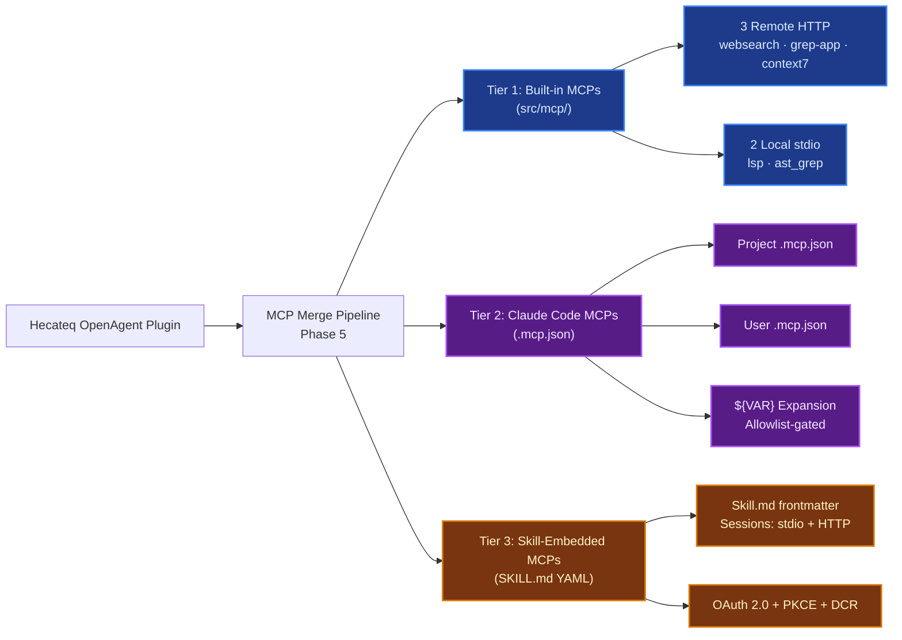

# 04 — Tools ve MCP Sistemi

> **Kapsam:** Hecateq OpenAgent tool registry ve 3-katmanlı MCP sistemi
> **Toplam Tool:** 20 her-zaman-açık, 19 koşullu (config-gated)
> **Hedef Kitle:** OpenCode plugin geliştiricileri ve sistem mimarları

---

## İçindekiler

1. [Tool Sistemi Genel Bakış](#tool-sistemi-genel-bakış)
2. [12 Her-Zaman-Açık Native Tool](#12-her-zaman-açık-native-tool)
3. [8 Her-Zaman-Açık MCP Tool (LSP + AST-grep)](#8-her-zaman-açık-mcp-tool)
4. [Koşullu Tool'lar](#koşullu-tool-lar)
5. [ToolRegistry Kompozisyonu](#toolregistry-kompozisyonu)
6. [3 Katmanlı MCP Sistemi](#3-katmanlı-mcp-sistemi)
7. [MCP Merge Pipeline](#mcp-merge-pipeline)
8. [Per-Session MCP İzolasyonu](#per-session-mcp-i̇zolasyonu)
9. [Built-in MCP Paketleri](#built-in-mcp-paketleri)
10. [Config-Gating Mekanizması](#config-gating-mekanizması)
11. [Tool Priority ve Trimming](#tool-priority-ve-trimming)

---

## Tool Sistemi Genel Bakış

Hecateq OpenAgent, OpenCode'un `tool` hook handler'ı üzerinden **20 ile 39 arasında** tool kaydeder. Bu tool'ların bir kısmı her zaman kullanılabilirken, bir kısmı config flag'lerine bağlıdır.

### Tool Türleri

```
20 Her-Zaman-Açık Tool
├── 12 Native (ToolRegistry'de doğrudan kayıtlı)
│   ├── grep, glob                     # Dosya içeriği ve yol arama
│   ├── session_list/read/search/info  # Session yönetimi
│   ├── background_output/cancel       # Background task
│   ├── call_omo_agent, task           # Delegasyon
│   ├── skill, skill_mcp               # Skill sistemi
│   └── ─
├── 8 MCP Aracılığıyla
│   ├── lsp_* (6 adet)                 # LSP tool'ları
│   └── ast_grep_* (2 adet)            # AST-grep tool'ları

19 Koşullu Tool (config-gated)
├── look_at                            # multimodal-looker disabled mı?
├── interactive_bash                   # tmux binary PATH'te mi?
├── edit (hashline)                    # hashline_edit: true mı?
├── task_* (4 adet)                    # experimental.task_system açık mı?
└── team_* (12 adet)                   # team_mode.enabled: true mı?
```

### Sayısal Döküm

| Kaynak | Sayı | Koşul |
|--------|------|-------|
| Native tools (ToolRegistry) | 12 | Her zaman |
| LSP tools (built-in MCP) | 6 | Her zaman |
| AST-grep tools (built-in MCP) | 2 | Her zaman |
| Subtotal: Her-zaman-açık | **20** | — |
| look_at | 1 | `multimodal-looker` disabled değilse |
| interactive_bash | 1 | `tmux` binary PATH'te |
| edit (hashline) | 1 | `hashline_edit: true` |
| task_create/get/list/update | 4 | `experimental.task_system` etkin |
| team_* (12 tool) | 12 | `team_mode.enabled: true` |
| Subtotal: Koşullu | 19 | Config-gated |
| **Maksimum Toplam** | **39** | — |

---

## 12 Her-Zaman-Açık Native Tool

Bu tool'lar `src/tools/` altında tanımlanır ve `ToolRegistry`'de doğrudan kayıtlıdır. Hiçbir config flag'ine bağlı değildirler.

### Tam Tablo

| # | Tool Adı | Kaynak Dosya | Amaç |
|---|----------|-------------|------|
| 1 | `grep` | `src/tools/grep/tools.ts:8` | Regex ile dosya içeriği arama |
| 2 | `glob` | `src/tools/glob/tools.ts:8` | Glob pattern ile dosya yolu arama |
| 3 | `session_list` | `src/tools/session-manager/tools.ts:73` | Session'ları listeleme |
| 4 | `session_read` | `src/tools/session-manager/tools.ts:102` | Session mesajlarını okuma |
| 5 | `session_search` | `src/tools/session-manager/tools.ts:137` | Session içinde tam metin arama |
| 6 | `session_info` | `src/tools/session-manager/tools.ts:179` | Session metadata görüntüleme |
| 7 | `background_output` | `src/tools/background-task/index.ts:1` | Background task çıktısı alma |
| 8 | `background_cancel` | `src/tools/background-task/index.ts:1` | Background task iptal etme |
| 9 | `call_omo_agent` | `src/tools/call-omo-agent/index.ts:3` | Doğrudan ajan çağırma (explore/librarian) |
| 10 | `task` | `src/tools/delegate-task/index.ts:1` | Kategoriye task delegate etme |
| 11 | `skill` | `src/tools/skill/index.ts:3` | Skill/komut yükleme |
| 12 | `skill_mcp` | `src/tools/skill-mcp/index.ts:3` | Skill-embedded MCP çağırma |

### Detaylı Tool Açıklamaları

#### grep (`src/tools/grep/tools.ts`)

```typescript
// Kullanım (AI tarafından)
// grep(pattern: "TODO|FIXME", include: "*.ts", path: "src/")
// Regex desteği: full regex syntax
// Output: content (satır bazlı), files_with_matches (sadece dosya), count (sayım)
```

Regex tabanlı içerik arama tool'u. Safety limitleri: 60s timeout, 256KB output. Üç output modu:
- `content`: Eşleşen satırları gösterir
- `files_with_matches`: Sadece dosya yollarını gösterir (default)
- `count`: Dosya başına eşleşme sayısını gösterir

#### glob (`src/tools/glob/tools.ts`)

```typescript
// Kullanım (AI tarafından)
// glob(pattern: "src/**/*.ts", path: "./")
// Safety limitleri: 60s timeout, 100 file cap
// Çıktı: modification time sıralı dosya listesi
```

Dosya yolu pattern matching. `**/*.ts`, `src/**/*.test.ts` gibi glob pattern'lerini destekler.

#### session_* tools (`src/tools/session-manager/tools.ts`)

```typescript
// Session yönetimi tool'ları (4 adet)
// session_list  → tüm session'ları listeler (limit, from_date, to_date filtreleriyle)
// session_read  → session mesajlarını okur (include_todos, include_transcript)
// session_search → session içi tam metin arama
// session_info  → session metadata (mesaj sayısı, tarih aralığı, kullanılan ajanlar)
```

OpenCode session geçmişine erişim sağlar. AI ajanlarının önceki çalışmaları incelemesine olanak tanır.

#### background_output / background_cancel (`src/tools/background-task/`)

Background task yönetimi. Bir task `task(category="...", run_in_background=true)` ile başlatıldığında, çıktısı `background_output` ile alınabilir.

```typescript
// background_output(task_id: "bg_abc123", block: false)
// background_cancel(task_id: "bg_abc123")  — tekli iptal
// NOT: background_cancel(all=true) YASAKLANMIŞTIR
```

#### call_omo_agent (`src/tools/call-omo-agent/index.ts`)

```typescript
// Doğrudan ajan çağırma
// Desteklenen ajan tipleri: explore, librarian
// NOT: task() tool'u category bazlı routing yaparken,
// call_omo_agent doğrudan bir ajanı adıyla çağırır.
call_omo_agent({
  subagent_type: "explore",
  prompt: "Find all route definitions in src/",
  run_in_background: true,
})
```

#### task (`src/tools/delegate-task/index.ts`)

Ana delegasyon mekanizması. Kategori bazlı routing yapar:

```typescript
task({
  category: "deep",
  prompt: "Analyze the authentication flow",
  load_skills: ["security-architect"],
  run_in_background: true,
})

// Mevcut kategoriler:
// - quick → hızlı, düşük maliyetli görevler (Claude Haiku/GPT-mini)
// - default → dengeli görevler
// - deep → karmaşık akıl yürütme (Claude-thinking/GPT-o3)
// - ultrabrain → maksimum zeka (en iyi modeller)
// - unspecified-low → bütçe görevleri
// - unspecified-high → yüksek çaba
// - artistry → yaratıcı/tasarım
// - oracle → mimari inceleme
```

---

## 8 Her-Zaman-Açık MCP Tool

LSP ve AST-grep tool'ları doğrudan ToolRegistry'de kayıtlı değildir. Bunlar **built-in MCP sunucuları** üzerinden sunulur. OpenCode, MCP tool'larını namespace'leriyle birlikte kullanılabilir hale getirir.

### LSP Tool'ları (6 adet)

| # | Tool Adı | MCP Sunucu | Amaç |
|---|----------|-----------|------|
| 1 | `lsp_goto_definition` | `lsp` (stdio MCP) | Bir sembolün tanımına git |
| 2 | `lsp_find_references` | `lsp` (stdio MCP) | Bir sembolün tüm referanslarını bul |
| 3 | `lsp_symbols` | `lsp` (stdio MCP) | Çalışma alanı sembollerini listele |
| 4 | `lsp_diagnostics` | `lsp` (stdio MCP) | Hata/uyarı teşhislerini al |
| 5 | `lsp_prepare_rename` | `lsp` (stdio MCP) | Yeniden adlandırma öncesi hazırlık |
| 6 | `lsp_rename` | `lsp` (stdio MCP) | Sembolü yeniden adlandır |

### AST-grep Tool'ları (2 adet)

| # | Tool Adı | MCP Sunucu | Amaç |
|---|----------|-----------|------|
| 1 | `ast_grep_search` | `ast_grep` (stdio MCP) | AST pattern ile kod arama |
| 2 | `ast_grep_replace` | `ast_grep` (stdio MCP) | AST pattern ile kod değiştirme |

### LSP vs AST-grep: Ne Zaman Hangisi?

```typescript
// LSP: Dil sunucusu tabanlı, sembol odaklı
// - Tanıma git, referans bul, sembol listele
// - 25+ dil desteği
// - Proje genelinde geçerli

// AST-grep: AST pattern tabanlı, yapı odaklı
// - Kod yapısına göre arama/değiştirme
// - Regex değil, AST düğümü eşleştirme
// - $VAR (tek düğüm) ve $$$ (çoklu düğüm) wildcard'ları

// Örnek AST-grep pattern:
// ast_grep_search(pattern: "console.log($MSG)", lang: "typescript")
// ast_grep_replace(pattern: "console.log($MSG)", rewrite: "logger.info($MSG)", lang: "typescript")
```

---

## Koşullu Tool'lar

Aşağıdaki tool'lar sadece belirli config flag'leri etkin olduğunda kullanılabilir.

### Config Gate Tablosu

| Tool Adı | Config Gate Açıklaması | Varsayılan | Sayı |
|----------|------------------------|-----------|------|
| `look_at` | `multimodal-looker` `disabled_agents`'da yoksa | Açık | 1 |
| `interactive_bash` | `tmux` binary'si PATH'te bulunabiliyorsa | OS'ye bağlı | 1 |
| `edit` | `hashline_edit: true` ise | Kapalı | 1 |
| `task_create` | `experimental.task_system` etkinse (config'de `new_task_system_enabled`) | Kapalı | 1 |
| `task_get` | " | Kapalı | 1 |
| `task_list` | " | Kapalı | 1 |
| `task_update` | " | Kapalı | 1 |
| `team_create` | `team_mode.enabled: true` ise | Kapalı | 1 |
| `team_delete` | " | Kapalı | 1 |
| `team_shutdown_request` | " | Kapalı | 1 |
| `team_approve_shutdown` | " | Kapalı | 1 |
| `team_reject_shutdown` | " | Kapalı | 1 |
| `team_send_message` | " | Kapalı | 1 |
| `team_task_create` | " | Kapalı | 1 |
| `team_task_list` | " | Kapalı | 1 |
| `team_task_update` | " | Kapalı | 1 |
| `team_task_get` | " | Kapalı | 1 |
| `team_status` | " | Kapalı | 1 |
| `team_list` | " | Kapalı | 1 |

### Config Örnekleri

```jsonc
// hashline_edit tool'unu aktifleştirme
{
  "hashline_edit": true
}

// Task sistemini aktifleştirme
{
  "new_task_system_enabled": true
}

// Team-mode'u aktifleştirme (12 yeni tool)
{
  "team_mode": {
    "enabled": true,
    "max_parallel_members": 4,
    "max_members": 8
  }
}

// Bir tool'u devre dışı bırakma
{
  "disabled_tools": ["look_at", "interactive_bash"]
}
```

### Özel Durum: interactive_bash

```typescript
// src/create-runtime-tmux-config.ts (kavramsal)
export function isInteractiveBashEnabled(): boolean {
  // tmux binary'sini PATH'te ara
  // Bulunursa → interactive_bash tool'u kullanılabilir
  // Bulunamazsa → tool kaydedilmez
  return findExecutable("tmux") !== null
}
```

---

## ToolRegistry Kompozisyonu

Tool'ların kaydı `src/plugin/tool-registry.ts` dosyasında `createToolRegistry()` fonksiyonu ile yapılır.

### Kayıt Mantığı

```typescript
// src/plugin/tool-registry.ts:186-390 (özet)
export function createToolRegistry(args): ToolRegistryResult {
  // 1. 6 partial record oluştur
  const backgroundTools = createBackgroundTools(...)     // 2 tools
  const callOmoAgent = createCallOmoAgent(...)            // 1 tool
  const delegateTask = createDelegateTask(...)             // 1 tool
  const sessionManagerTools = createSessionManagerTools()  // 4 tools
  const grepTools = createGrepTools()                      // 1 tool
  const globTools = createGlobTools()                      // 1 tool

  // 2. Koşullu blokları değerlendir
  const lookAt = isMultimodalLookerEnabled ? createLookAt() : null
  const interactiveBashTool = interactiveBashEnabled ? { interactive_bash } : {}
  const teamModeToolsRecord = team_mode.enabled ? { ...teamTools } : {}
  const taskToolsRecord = isTaskSystemEnabled ? { ...taskTools } : {}
  const hashlineToolsRecord = hashline_edit ? { edit: createHashlineEditTool() } : {}

  // 3. Tümünü birleştir
  const allTools = {
    ...grepTools,
    ...globTools,
    ...sessionManagerTools,
    ...backgroundTools,
    call_omo_agent,
    task: delegateTask,
    skill_mcp,
    skill,
    ...(lookAt ? { look_at: lookAt } : {}),
    ...(interactiveBashEnabled ? { interactive_bash } : {}),
    ...teamModeToolsRecord,   // +12
    ...taskToolsRecord,       // +4
    ...hashlineToolsRecord,   // +1
  }

  // 4. Schemaları normalize et
  for (const tool of Object.values(allTools)) {
    normalizeToolArgSchemas(tool)
  }

  // 5. Disabled tool'ları filtrele
  const filteredTools = filterDisabledTools(allTools, config.disabled_tools)

  // 6. Maksimum tool sayısını uygula
  if (maxTools) trimToolsToCap(filteredTools, maxTools)

  return { filteredTools, taskSystemEnabled }
}
```

### normalizeToolArgSchemas

Tool argument şemalarını OpenCode'un beklediği formata dönüştürür:

```typescript
// normalizeToolArgSchemas: JSON Schema → OpenCode ToolDefinition
// Her tool'un input schema'sını standartlaştırır
// - required alanları işaretler
// - type bilgilerini normalize eder
// - description alanlarını korur
```

### filterDisabledTools

`disabled_tools` config dizisinde adı geçen tool'ları kaldırır:

```jsonc
{
  "disabled_tools": [
    "background_output",
    "background_cancel",
    "look_at",
    "interactive_bash"
  ]
}
```

---

## 3 Katmanlı MCP Sistemi

Hecateq OpenAgent, **3 katmanlı** bir Model Context Protocol (MCP) sistemine sahiptir.

### Mimari Diyagram



### Katman Karşılaştırması

| Özellik | Tier 1: Built-in | Tier 2: Claude Code | Tier 3: Skill-Embedded |
|----------|-----------------|---------------------|----------------------|
| **Kaynak** | `src/mcp/` | `.mcp.json` (proje + user) | SKILL.md YAML frontmatter |
| **Yükleyici** | `createBuiltinMcps()` | `claude-code-mcp-loader` | `SkillMcpManager` (per-session) |
| **Transport** | HTTP + stdio | HTTP + stdio | stdio + HTTP |
| **Auth** | Yok | `${VAR}` env expansion | OAuth 2.0 + PKCE + DCR |
| **İzolasyon** | Global | Global | Per-session `${sessionID}:${skillName}:${serverName}` |
| **Config kontrolü** | `disabled_mcps` | `mcp_env_allowlist` (user-only) | Skill yükleyici |
| **Güvenlik** | Düşük | Orta (allowlist) | Yüksek (OAuth) |

### Tier 1: Built-in MCP'ler

**Dosya:** `src/mcp/`, `createBuiltinMcps()` ile yüklenir.

#### 3 Remote HTTP MCP

| MCP Adı | Kaynak Dosya | Transport | Amaç |
|---------|-------------|-----------|------|
| `websearch` | `src/mcp/websearch.ts` | HTTP | Web araması (Exa/Tavily provider) |
| `context7` | `src/mcp/context7.ts` | HTTP | Kütüphane dokümantasyonu sorgulama |
| `grep_app` | `src/mcp/grep-app.ts` | HTTP | GitHub kod araması |

```typescript
// createBuiltinMcps — src/mcp/index.ts (kavramsal)
export function createBuiltinMcps(disabledMcps, config, options) {
  const mcps: Record<string, McpConfig> = {}

  if (!disabledMcps.includes("websearch")) {
    mcps.websearch = {
      type: "remote",
      url: config.websearch?.provider === "tavily"
        ? "http://localhost:..."  // Tavily endpoint
        : "http://localhost:..."  // Exa endpoint
    }
  }

  if (!disabledMcps.includes("context7")) {
    mcps.context7 = {
      type: "remote",
      url: "http://localhost:..."
    }
  }

  if (!disabledMcps.includes("grep_app")) {
    mcps["grep_app"] = {
      type: "remote",
      url: "http://localhost:..."
    }
  }

  // LSP ve AST-grep (local stdio)
  // ...

  return mcps
}
```

#### 2 Local stdio MCP

| MCP Adı | Kaynak Paket | Transport | Amaç |
|---------|-------------|-----------|------|
| `lsp` | `packages/lsp-tools-mcp` | stdio (node/bun) | LSP tool'ları (goto_definition, find_references, vs.) |
| `ast_grep` | `packages/ast-grep-mcp` | stdio (node/bun) | AST-grep tool'ları (search, replace) |

```typescript
// LSP MCP başlatma — src/mcp/lsp.ts (kavramsal)
// Önce projede dist/ içinde arar
// Bulamazsa bun ile packages/lsp-tools-mcp'yi çalıştırır
// Git submodule bootstrap desteği
{
  type: "stdio",
  command: "bun",
  args: ["packages/lsp-tools-mcp/dist/index.js"],
  // Ancestor-walking path resolution:
  // Çalışma dizininden yukarı doğru tırmanarak paketi arar
}
```

### Tier 2: Claude Code MCP'ler

**Dosya:** `src/features/claude-code-mcp-loader/`

#### .mcp.json Keşif Sırası

```
1. ~/.claude.json                      → global Claude Code konfigürasyonu
2. ~/.config/opencode/.mcp.json        → OpenCode user MCP'leri
3. <cwd>/.mcp.json                     → Proje bazlı MCP'ler
4. <cwd>/.claude/.mcp.json             → Claude Code proje MCP'leri
```

#### Çevre Değişkeni Genişletme

```typescript
// src/features/claude-code-mcp-loader/env-expander.ts
// ${VAR} ve ${VAR:-default} pattern'lerini recursive olarak genişletir

// Örnek .mcp.json:
{
  "my-server": {
    "type": "remote",
    "url": "https://${API_HOST:-localhost}:${PORT:-8080}/api",
    "headers": {
      "Authorization": "Bearer ${API_KEY}"
    }
  }
}

// Genişletilmiş:
// API_HOST=example.com, PORT=9090, API_KEY=secret123
// → url: "https://example.com:9090/api"
// → Authorization: "Bearer secret123"
```

#### Güvenlik: mcp_env_allowlist

Sadece **kullanıcı config'inde** tanımlanabilir (project config'de tanımlanamaz):

```jsonc
// ~/.config/opencode/oh-my-openagent.jsonc
{
  "mcp_env_allowlist": [
    "PATH",
    "HOME",
    "USER",
    "API_HOST",
    "PORT",
    "NODE_ENV"
  ]
  // NOT: API_KEY eklenmemiş → genişletilmez!
}
```

Otomatik olarak engellenen pattern'ler:

```
/KEY|TOKEN|SECRET|PASSWORD|AUTH|CREDENTIAL/i
```

Bu pattern'lerden birini içeren env değişkenleri **asla** genişletilmez.

### Tier 3: Skill-Embedded MCP'ler

**Dosya:** `src/features/skill-mcp-manager/`

#### Skill.md YAML Frontmatter

Her `.md` skill dosyasının YAML frontmatter'ı MCP tanımı içerebilir:

```yaml
---
name: my-skill
description: Does something useful
mcp_servers:
  - name: my-server
    type: stdio
    command: node
    args: ["server.js"]
    env:
      API_KEY: "${API_KEY}"
  - name: my-http-server
    type: remote
    url: "https://api.example.com/mcp"
---
```

#### OAuth 2.0 + PKCE + DCR

```typescript
// src/features/skill-mcp-manager/oauth-handler.ts
// 3 aşamalı OAuth akışı:
// 1. Authorization: PKCE + DCR (Dynamic Client Registration)
// 2. Token exchange: authorization code → access + refresh token
// 3. Step-up: 403 hatası durumunda yeniden yetkilendirme
// 4. Refresh: 401/403 hatası durumunda token yenileme

// CLI ile MCP OAuth:
// npx hecateq-openagent mcp-oauth login <server-url>
// npx hecateq-openagent mcp-oauth logout
// npx hecateq-openagent mcp-oauth status
```

#### Per-Session MCP İzolasyonu

Her session, skill MCP sunucusuna ayrı bir client ile bağlanır:

```typescript
// src/features/skill-mcp-manager/manager.ts (kavramsal)
// İzolasyon anahtarı: `${sessionID}:${skillName}:${serverName}`
// Aynı skill iki farklı session'da kullanılıyorsa → iki ayrı MCP client
// Bu sayede session'lar birbirinin state'ini etkilemez

const clientKey = `${sessionID}:${skillName}:${serverName}`
const client = mcpClients.get(clientKey)

if (!client) {
  client = createMcpClient(serverConfig)
  mcpClients.set(clientKey, client)
}

return client
```

---

## MCP Merge Pipeline

MCP'ler, config yükleme pipeline'ının **5. fazında (Phase 5)** birleştirilir.

**Dosya:** `src/plugin-handlers/mcp-config-handler.ts`

```typescript
// src/plugin-handlers/mcp-config-handler.ts:28-69 (özet)
export async function applyMcpConfig(params) {
  // 1. Tier 2: Claude Code MCP'lerini yükle
  const mcpResult = await loadMcpConfigs(disabledMcps)

  // 2. Tier 1 + Tier 2 + User Config + Plugin MCP'lerini birleştir
  // Öncelik sırası (sonraki öncekini override eder):
  const merged = {
    ...createBuiltinMcps(...),    // Tier 1: Built-in (en düşük öncelik)
    ...mcpResult.servers,         // Tier 2: Claude Code
    ...(userMcp ?? {}),           // Kullanıcı config'i
    ...pluginComponents.mcpServers, // Plugin MCP'leri (en yüksek öncelik)
  }

  // 3. disabled_mcps config'inden kaldır
  for (const name of disabledMcps) {
    delete merged[name]
  }

  // 4. User tarafından devre dışı bırakılanları işaretle
  for (const name of userDisabledMcps) {
    merged[name] = { ...merged[name], enabled: false }
  }

  params.config.mcp = merged
}
```

### Merge Öncelik Sırası

| Sıra | Kaynak | Açıklama |
|------|--------|----------|
| 1 (en düşük) | Tier 1: Built-in MCP'ler | `createBuiltinMcps()` |
| 2 | Tier 2: Claude Code MCP'ler | `.mcp.json` dosyaları |
| 3 | Kullanıcı Config MCP'leri | `opencode.json` içindeki `mcp` alanı |
| 4 (en yüksek) | Plugin MCP'leri | Claude Code plugin'lerinden gelen MCP'ler |

### Disable Mekanizması

İki yöntem:

1. **`disabled_mcps` array:** MCP'yi tamamen kaldırır

```jsonc
{
  "disabled_mcps": ["websearch", "grep_app"]
}
```

2. **User config'de `enabled: false`:** MCP'yi pasifleştirir (ama kaldırmaz)

```jsonc
{
  "mcp": {
    "my-server": {
      "type": "remote",
      "url": "https://example.com/mcp",
      "enabled": false  // ← bu MCP pasif
    }
  }
}
```

---

## Per-Session MCP İzolasyonu

### Neden Önemli?

Aynı skill'in birden fazla session'da aynı anda kullanılması durumunda, MCP client'larının birbirini etkilememesi gerekir.

### Anahtar Formatı

```typescript
// `${sessionID}:${skillName}:${serverName}`
// Örnek:
// "ses_abc123:my-skill:my-server"
// "ses_def456:my-skill:my-server"  ← farklı session, farklı client
```

### İzolasyon Mimarisi

```mermaid
graph TD
    classDef s1 fill:#1e3a8a,stroke:#3b82f6,stroke-width:2px,color:#dbeafe;
    classDef s2 fill:#78350f,stroke:#d97706,stroke-width:2px,color:#fef3c7;

    SKYAML[SKILL.md<br/>YAML frontmatter] --> SM[SkillMcpManager]:::s1

    SM --> C1["Client: ses_abc123:my-skill:my-server<br/>Session A"]:::s1
    SM --> C2["Client: ses_def456:my-skill:my-server<br/>Session B"]:::s2

    C1 --> MCPServer[MCP Sunucu<br/>(stdio/HTTP)]
    C2 --> MCPServer
```

---

## Built-in MCP Paketleri

LSP ve AST-grep MCP'leri ayrı npm paketleri olarak `packages/` altında geliştirilir:

### packages/lsp-tools-mcp

**Yol:** `packages/lsp-tools-mcp/src/mcp.ts`

6 LSP tool'unu sağlar:

```typescript
// packages/lsp-tools-mcp/src/mcp.ts (kavramsal)
// MCP sunucu adı: "lsp"
// Tool'lar (MCP namespacing ile):
// - lsp_goto_definition
// - lsp_find_references
// - lsp_symbols
// - lsp_diagnostics
// - lsp_prepare_rename
// - lsp_rename

// Çalışma: Node.js/Bun ile stdio üzerinden
// Dil sunucusu: Projenin LSP'sini kullanır (TypeScript, ESLint, vb.)
```

### packages/ast-grep-mcp

**Yol:** `packages/ast-grep-mcp/src/mcp.ts`

2 AST-grep tool'unu sağlar:

```typescript
// packages/ast-grep-mcp/src/mcp.ts (kavramsal)
// MCP sunucu adı: "ast_grep"
// Tool'lar (MCP namespacing ile):
// - ast_grep_search
// - ast_grep_replace

// Desteklenen diller (25+):
// typescript, tsx, javascript, python, go, rust, c, cpp, java, kotlin, swift, vb.

// Pattern syntax'ı:
// - $VAR → tek AST düğümü yakalar
// - $$$ → sıfır veya daha fazla düğüm yakalar
// - Regex desteklenmez (AST yapısı bazlıdır)
```

### Paket Keşif Sırası

```typescript
// src/mcp/lsp.ts ve src/mcp/ast-grep.ts (kavramsal)
// 1. Proje dist/ klasöründe ara (build edilmiş sürüm)
// 2. Bulunamazsa bun packages/<name> çalıştır
// 3. Git submodule varsa bootstrap et
// 4. Hiçbiri yoksa hata fırlat
```

---

## Config-Gating Mekanizması

Hangi config flag'inin hangi tool'u etkilediğinin özeti:

```jsonc
{
  // ─── Tool Flag'leri ───

  "hashline_edit": true,
  // → edit tool'unu açar

  "new_task_system_enabled": true,
  // → task_create, task_get, task_list, task_update tool'larını açar

  "disabled_agents": ["multimodal-looker"],
  // → look_at tool'unu kapatır

  "disabled_tools": ["background_output", "interactive_bash"],
  // → belirtilen tool'ları kapatır

  "experimental": {
    "max_tools": 30
    // → tool sayısını sınırlar, düşük öncelikli tool'ları kırpar
  },

  // ─── Team Mode (12 tool) ───

  "team_mode": {
    "enabled": true
    // → team_* tool'larını açar (12 adet)
  },

  // ─── MCP Flag'leri ───

  "disabled_mcps": ["websearch", "grep_app"],
  // → built-in MCP'leri kapatır

  "mcp_env_allowlist": ["PATH", "HOME"],
  // → Claude Code MCP env genişletme izinleri
}
```

### isInteractiveBashEnabled() — Platform Bazlı

```typescript
// interactive_bash tool'unun açık/kapalı olması PATH'te tmux varlığına bağlıdır
// macOS: genellikle yüklü
// Linux: genellikle yüklü, container'larda olmayabilir
// Windows: Cygwin/MSYS2 ile yüklü olabilir
export function isInteractiveBashEnabled(): boolean {
  try {
    const result = Bun.which("tmux")
    return result !== null
  } catch {
    return false
  }
}
```

### isMultimodalLookerEnabled() — Agent Bazlı

```typescript
// look_at tool'u sadece multimodal-looker ajanı disabled değilse kullanılabilir
const isMultimodalLookerEnabled = !(config.disabled_agents ?? []).some(
  (agent) => agent.toLowerCase() === "multimodal-looker",
)
```

---

## Tool Priority ve Trimming

Config'de `experimental.max_tools` ayarlandığında, düşük öncelikli tool'lar kırpılır.

### LOW_PRIORITY_TOOL_ORDER

```typescript
// src/plugin/tool-registry.ts:120-148
const LOW_PRIORITY_TOOL_ORDER = [
  "session_list",        // En düşük öncelik
  "session_read",
  "session_search",
  "session_info",
  "interactive_bash",
  "look_at",
  "call_omo_agent",
  "task_create",
  "task_get",
  "task_list",
  "task_update",
  "background_output",
  "background_cancel",
  "edit",
  "ast_grep_replace",
  "ast_grep_search",
  "glob",
  "grep",
  "skill_mcp",
  "skill",
  "task",
  "lsp_rename",
  "lsp_prepare_rename",
  "lsp_find_references",
  "lsp_goto_definition",
  "lsp_symbols",
  "lsp_diagnostics",     // En yüksek öncelik
] as const
```

### PROTECTED_ORCHESTRATION_TOOLS

Asla kırpılamayacak tool'lar:

```typescript
const PROTECTED_ORCHESTRATION_TOOLS = new Set([
  "task",                // Delegasyon (olmazsa olmaz)
  "background_output",   // Background task çıktısı
  "background_cancel",   // Background task iptal
  "skill",               // Skill yükleme
  "call_omo_agent",      // Ajan çağırma
])
```

### Trimming Mantığı

```typescript
// src/plugin/tool-registry.ts:158-184
export function trimToolsToCap(filteredTools, maxTools) {
  // 1. LOW_PRIORITY_TOOL_ORDER'daki tool'ları sırayla sil
  // 2. Listede olmayan tool'ları alfabetik sırayla sil
  // 3. PROTECTED_ORCHESTRATION_TOOLS asla silinmez
  // 4. maxTools'a ulaşınca dur

  const removableToolNames = [
    ...LOW_PRIORITY_TOOL_ORDER.filter(name => name in filteredTools),
    ...Object.keys(filteredTools)
      .filter(name => !LOW_PRIORITY_TOOL_ORDER.includes(name))
      .sort(),
  ]

  for (const toolName of removableToolNames) {
    if (currentCount <= maxTools) break
    if (PROTECTED_ORCHESTRATION_TOOLS.has(toolName)) continue
    delete filteredTools[toolName]
    currentCount -= 1
  }
}
```

---

## Özet

### Tools

- **20 her-zaman-açık** + **19 koşullu** = **39 maksimum tool**
- 12 native tool doğrudan ToolRegistry'de kayıtlı
- 8 MCP tool (6 LSP + 2 AST-grep) built-in MCP'ler üzerinden sunulur
- 19 koşullu tool config flag'lerine bağlı (team-mode: 12, task system: 4, hashline: 1, look_at: 1, interactive_bash: 1)
- `trimToolsToCap()` ile `experimental.max_tools` sınırı uygulanabilir
- `PROTECTED_ORCHESTRATION_TOOLS` (task, background_output, background_cancel, skill, call_omo_agent) asla kırpılmaz

### MCP

- **3 katmanlı**: Built-in (Tier 1) → Claude Code (Tier 2) → Skill-Embedded (Tier 3)
- **5 built-in MCP**: 3 remote (websearch, context7, grep_app) + 2 local stdio (lsp, ast_grep)
- **Merge pipeline**: Phase 5'te Tier 1 + Tier 2 + user config + plugin MCP'leri birleştirilir
- **Per-session izolasyon**: Tier 3 MCP client'ları session bazında ayrıştırılır
- **OAuth 2.0 + PKCE + DCR**: Tier 3 MCP'ler için güvenli yetkilendirme
- **Allowlist**: `mcp_env_allowlist` ile env genişletme güvenliği
