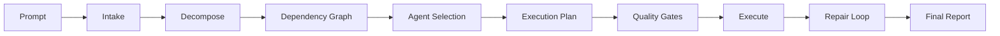
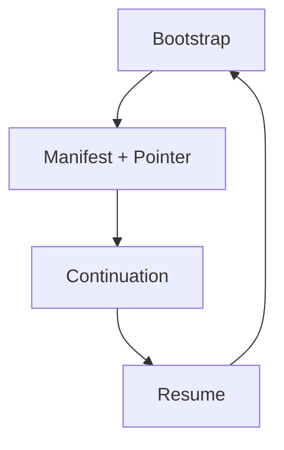

# Bölüm 5 — Özellikler ve Modüller (Feature Catalog)

> **Kapsam:** `src/features/` altındaki 26 dizin (21 aktif feature + 4 hecateq-orchestration alt modülü + AGENTS.md)
> **Ortam:** Hecateq OpenAgent — oh-my-openagent fork'u
> **Güncelleme:** 2026-06-30

---

## 5.1 Feature Modülleri Genel Bakış

Hecateq OpenAgent, `src/features/` dizini altında **21 aktif feature modülü** barındırır. Bunlardan **17'si** upstream oh-my-openagent'ten miras alınmış, **4'ü** (`hecateq-orchestration`, `hermes-state`, `prompt-renderer`, `task-toast-manager`) Hecateq fork'una özgüdür. Ayrıca `hecateq-orchestration` altında **4 alt modül** (handoff parser, routing policy engine, delegation controller, signal DAG executor) bulunur.

Her modül bağımsız bir dizinde yaşar, kendi `index.ts` barrel export'una sahiptir ve plugin'in `plugin/` katmanından wire edilir.

---

## 5.2 Tüm Feature Modülleri Tablosu

| # | Modül Adı | Dizin | Amaç | Yaklaşık Dosya | Bağımlılık |
|---|-----------|-------|------|---------------|------------|
| 1 | **hecateq-orchestration** | `src/features/hecateq-orchestration/` | 8 aşamalı pipeline: prompt intake → decompose → graph → select → execute → gates → repair → report | ~52 | Memory bootstrap, agent indexer, handoff system, quality gates |
| 2 | **team-mode** | `src/features/team-mode/` | Paralel multi-agent koordinasyonu (OFF varsayılan) | ~22 | Tmux, git worktree, session registry |
| 3 | **background-agent** | `src/features/background-agent/` | 5 eşzamanlı/provider-model, FIFO kuyruk, parent-wake notifier | ~83 | prompt-async-gate, session yönetimi |
| 4 | **skill-mcp-manager** | `src/features/skill-mcp-manager/` | Session-bazlı Tier-3 MCP izolasyonu, OAuth 2.0+PKCE+DCR | ~20 | Config loader, MCP altyapısı |
| 5 | **boulder-state** | `src/features/boulder-state/` | İş takibi state machine (persistent) | ~10 | File I/O, JSON retention |
| 6 | **opencode-skill-loader** | `src/features/opencode-skill-loader/` | 4 kapsamlı skill keşfi (project → opencode → user → global) | ~8 | Config, glob |
| 7 | **tmux-subagent** | `src/features/tmux-subagent/` | Tmux pane yönetimi, interactive bash | ~6 | Tmux binary, subprocess |
| 8 | **mcp-oauth** | `src/features/mcp-oauth/` | OAuth 2.0+PKCE+DCR Tier-2 MCP için | ~5 | HTTP, crypto |
| 9 | **claude-code-plugin-loader** | `src/features/claude-code-plugin-loader/` | Claude Code plugin uyumluluğu | ~4 | Config |
| 10 | **context-injector** | `src/features/context-injector/` | Memory state, handoff context, git state enjeksiyonu | ~7 | Memory system, git checkpoint |
| 11 | **hook-message-injector** | `src/features/hook-message-injector/` | Sistem mesajı enjeksiyonu (hook seviyesi) | ~3 | Transform hooks |
| 12 | **run-continuation-state** | `src/features/run-continuation-state/` | CLI `run` komutu için persistent state | ~4 | File I/O |
| 13 | **builtin-commands** | `src/features/builtin-commands/` | `/` komut şablonları (slash commands) | ~10 | Config |
| 14 | **builtin-skills** | `src/features/builtin-skills/` | Dahili skill implementasyonları | ~12 | Skill loader |
| 15 | **claude-code-agent-loader** | `src/features/claude-code-agent-loader/` | Plugin'lerden agent yükleme | ~3 | Config |
| 16 | **claude-code-command-loader** | `src/features/claude-code-command-loader/` | `/command` yükleme | ~3 | Config |
| 17 | **claude-code-mcp-loader** | `src/features/claude-code-mcp-loader/` | Tier-2 MCP yükleyici (`.mcp.json`) | ~5 | mcp_env_allowlist |
| 18 | **claude-tasks** | `src/features/claude-tasks/` | Task şeması ve tipleri | ~2 | Types |
| 19 | **dashboard** | `src/features/dashboard/` | API server + monitoring (Hermes) | ~5 | HTTP, openclaw |
| 20 | **autonomous-spawn** | `src/features/autonomous-spawn/` | Otonom subagent spawn etme, concurrency limit, rate limiting | ~7 | Background-agent, config |
| 21 | **tool-metadata-store** | `src/features/tool-metadata-store/` | Tool execution metadata cache | ~3 | Tool registry |
| 22 | **claude-code-session-state** | `src/features/claude-code-session-state/` | Claude Code session state yönetimi | ~3 | Config |
| 23 | **hermes-state** | `src/features/hermes-state/` | Hermes dashboard state yönetimi (Hecateq) | ~9 | Dashboard |
| 24 | **prompt-renderer** | `src/features/prompt-renderer/` | Prompt render motoru (Hecateq) | ~3 | Template engine |
| 25 | **task-toast-manager** | `src/features/task-toast-manager/` | Toast bildirim yönetimi (Hecateq) | ~4 | Notification system |

> **Not:** Modül 22–25 Hecateq fork'una özgüdür. 1–21 arası upstream'ten miras alınmıştır ancak `hecateq-orchestration` (1) ve `dashboard` (19) Hecateq tarafından yoğun şekilde değiştirilmiştir.

---

## 5.3 Hecateq Orchestration Pipeline (8 Aşama)

Hecateq orchestration sistemi, `src/features/hecateq-orchestration/` altında uçtan uca görev otomasyonu sağlar. Pipeline aktifleştirildiğinde (`orchestration.enabled: true`), her prompt 8 aşamadan geçer:



### Aşama 1: Prompt Intake

| Özellik | Detay |
|---------|-------|
| **Dosya** | `src/features/hecateq-orchestration/prompt-intake.ts` |
| **Girdi** | Kullanıcı prompt'u (ham metin) |
| **Çıktı** | Sınıflandırılmış intent: `{ intent, risk_level, task_size, domains }` |
| **Validasyon** | Intent boş olamaz, risk_level `low | medium | high | critical` |

İşlem adımları:
1. Intent sınıflandırma (keyword + pattern matching)
2. Risk seviyesi belirleme (sensitive path, destructive keyword)
3. Domain tespiti (frontend, backend, database, DevOps, docs)
4. Task büyüklüğü tahmini (small < 3 node, medium < 8, large ≥ 8)

### Aşama 2: Task Decomposition

| Özellik | Detay |
|---------|-------|
| **Dosya** | `src/features/hecateq-orchestration/task-decomposer.ts` |
| **Girdi** | Intent objesi |
| **Çıktı** | `TaskNode[]` (her node: id, description, domain, risk) |
| **Validasyon** | Her node unique ID, en az 1 node |

Prompt'u atomik task node'larına böler. Örneğin "add email validation" → `[validate-email-input, update-user-schema, add-server-validation, add-client-feedback]`.

### Aşama 3: Dependency Graph

| Özellik | Detay |
|---------|-------|
| **Dosya** | `src/features/hecateq-orchestration/dependency-planner.ts` |
| **Girdi** | `TaskNode[]` |
| **Çıktı** | `DependencyGraph` (DAG, stage'ler halinde topolojik batch) |
| **Validasyon** | 4 kontrollü task graph validation (aşağıya bak) |

Cycle detection: `src/features/hecateq-orchestration/cycle-detector.ts` — DFS tabanlı, cycle bulunduğunda path trace çıkarır (örn. `Task A → Task B → Task A`).

#### Task Graph Validation (4 Kontrol)

`validateTaskGraph()` içinde `src/shared/dependency-graph/types.ts`:

| Kontrol | Hata Kodu | Açıklama |
|---------|-----------|----------|
| **Empty Graph** | `empty_graph` | Hiç stage içermeyen graph reddedilir (sessiz no-op önlenir) |
| **Duplicate Node** | `duplicate_node` | Her task stage benzersiz ID'ye sahip olmalıdır |
| **Missing Dependency** | `missing_dependency` | `depends_on` içinde tanımlı olmayan node'a referans varsa hata |
| **Circular Dependency** | `circular_dependency` | DFS cycle detection — cycle bulunduğunda trace path raporlanır |

### Aşama 4: Agent Selection

| Özellik | Detay |
|---------|-------|
| **Dosya** | `src/features/hecateq-orchestration/agent-selector.ts` |
| **Girdi** | Task node'ları + domain bilgisi |
| **Çıktı** | `AgentTaskMap` (her node'a atanmış agent) |
| **Validasyon** | Her node için en az 1 uygun agent, yoksa fallback |

Eligibility registry üzerinden eşleme yapar: `AGENT_ELIGIBILITY_REGISTRY` içinde hangi agent'ların hangi domain'lerde çalışabileceği tanımlıdır.

### Aşama 5: Execution Plan

| Özellik | Detay |
|---------|-------|
| **Dosya** | `src/features/hecateq-orchestration/execution-planner.ts` |
| **Girdi** | Agent-task eşlemesi + dependency graph |
| **Çıktı** | `ExecutionPlan` (sıralı task listesi, paralel batch'ler) |
| **Validasyon** | High-risk task'ler için plan/contract/verification stage'leri eklenir |

Yüksek riskli task'lerde (`risk_level >= high`) otomatik olarak:
- **contract** aşaması: task başlamadan önce kabul kriterleri tanımlanır
- **verification** aşaması: task bittiğinde doğrulama yapılır

### Aşama 6: Quality Gates

| Özellik | Detay |
|---------|-------|
| **Dosya** | `src/features/hecateq-orchestration/quality-gate-runner.ts` |
| **Girdi** | Task sonucu + artifact'ler |
| **Çıktı** | `GateResult[]` (her gate için passed/failed) |

Varsayılan gate'ler:
```jsonc
{
  "quality_gates": {
    "typecheck": true,    // bun run typecheck
    "lint": true,         // lint kontrolü
    "test": true,         // ilgili testleri çalıştır
    "build": true,        // bun run build
    "doctor": false       // hecateq doctor (opsiyonel)
  }
}
```

Her gate bağımsız çalışır; başarısız gate'ler repair loop'a gider, başarılı gate'ler skip edilir.

### Aşama 7: Repair Loop

| Özellik | Detay |
|---------|-------|
| **Dosya** | `src/features/hecateq-orchestration/repair-loop-controller.ts` |
| **Girdi** | Başarısız task + hata detayı |
| **Çıktı** | Onarılmış task veya max_repair_attempts aşıldı raporu |
| **Validasyon** | `max_repair_attempts` (varsayılan 2) aşılınca task kalıcı failed |

```typescript
// Varsayılan yapılandırma
max_repair_attempts: 2
default_task_timeout_ms: 300000  // 5 dakika
```

Her repair denemesi şu stratejileri dener:
1. Hata mesajını analiz et, düzeltme önerisi üret
2. Farklı bir agent'a yönlendir (agent rotation)
3. Task'ı daha küçük alt task'lara böl (re-decompose)

### Aşama 8: Final Report

| Özellik | Detay |
|---------|-------|
| **Dosya** | `src/features/hecateq-orchestration/final-report-generator.ts` |
| **Girdi** | Tüm pipeline çıktısı |
| **Çıktı** | Yapılandırılmış rapor (summary, changed files, outcomes) |

```typescript
interface FinalReport {
  summary: string
  total_tasks: number
  completed: number
  failed: number
  gates_passed: number
  gates_failed: number
  changed_files: string[]
  execution_time_ms: number
  repair_attempts: number
}
```

#### Memory Hydration Engine

**Dosya:** `src/shared/memory-hydrator.ts`

Bootstrap işlemi, projeye özel zengin şablonlar oluşturmak için Memory Hydration Engine kullanır. İşlem şöyle işler:

1. **Placeholder Detection:** `src/shared/memory-manifest.ts` içindeki `detectPlaceholderContent()` fonksiyonu, mevcut bir dosyanın yalnızca varsayılan taslak mı yoksa gerçek içerik mi içerdiğini belirler.
2. **Template Hydration:** Placeholder tespit edilirse, hydrator proje adı, güncel tarih ve hedef dosyalar için template layout'lar ile yapılandırılmış markdown blokları enjekte eder. `active-context.md`, `progress.md`, `tasks.md` ve `file-map.md` gibi dosyalar çalışma alanına göre özelleştirilir.
3. **Safety Loop:** Hydrate edilmiş içerik tekrar `detectPlaceholderContent()`'ten geçirilerek yeni içeriğin placeholder olarak işaretlenmemesi garanti edilir.

---

## 5.4 Team Mode

| Özellik | Detay |
|---------|-------|
| **Dizin** | `src/features/team-mode/` |
| **Durum** | **Beta** — upstream'ten miras |
| **Varsayılan** | OFF (`team_mode.enabled: false`) |

### Storage Layout

```
~/.omo/teams/{name}/              # User scope (varsayılan)
<project>/.omo/teams/{name}/      # Project scope (project > user)
├── config.json                    # Team spec
├── state.json                     # Runtime state
├── mailbox/                       # Team mesajları
├── tasklist.jsonl                 # Task listesi
└── worktrees/{member}/            # Per-member git worktree
```

### Konfigürasyon

```jsonc
{
  "team_mode": {
    "enabled": true,
    "tmux_visualization": false,
    "max_parallel_members": 4,      // 1..8
    "max_members": 8,               // 1..8 hard cap
    "max_messages_per_run": 10000,
    "max_wall_clock_minutes": 120,
    "max_member_turns": 500,
    "base_dir": null,               // override ~/.omo/teams
    "message_payload_max_bytes": 32768,
    "recipient_unread_max_bytes": 262144,
    "mailbox_poll_interval_ms": 3000
  }
}
```

### Üye Uygunluğu (Eligibility Registry)

`AGENT_ELIGIBILITY_REGISTRY` (`src/features/team-mode/types.ts`):

| Statü | Agent'lar |
|-------|-----------|
| **eligible** | `sisyphus`, `atlas`, `sisyphus-junior` |
| **conditional** | `hephaestus` (teammate: "allow" permission gerektirir) |
| **hard-reject** | `oracle`, `librarian`, `explore`, `multimodal-looker`, `metis`, `momus`, `prometheus` |

### Member Kind'lar

| Kind | Açıklama | Kullanım |
|------|----------|----------|
| `subagent_type` | Doğrudan agent ataması | `kind: "subagent_type"` ile belirtilen agent |
| `category` | Sisyphus-Junior üzerinden yönlendirme | Rotalama kararı Sisyphus-Junior'a bırakılır |

### 12 Team Tool'u

| Tool Adı | Amaç |
|----------|------|
| `team_create` | Yeni team oluştur |
| `team_delete` | Team sil |
| `team_shutdown_request` | Team kapatma isteği |
| `team_approve_shutdown` | Kapatmayı onayla |
| `team_reject_shutdown` | Kapatmayı reddet |
| `team_send_message` | Team üyesine mesaj gönder |
| `team_task_create` | Team task'i oluştur |
| `team_task_list` | Team task'lerini listele |
| `team_task_update` | Team task'ini güncelle |
| `team_task_get` | Team task detayı |
| `team_status` | Team durumu |
| `team_list` | Team'leri listele |

---

## 5.5 Background Agent

| Özellik | Detay |
|---------|-------|
| **Dizin** | `src/features/background-agent/` (83 dosya) |
| **Concurrency** | 5 eşzamanlı task `${providerID}/${modelID}` anahtarı başına |
| **Kuyruk** | FIFO (slot doluyken sıraya ekle) |
| **Polling** | 3 saniye aralıklı |
| **Notification** | task → result-handler → parent-session-notifier |

### Parent-Wake Notifier

**Dosya:** `src/features/background-agent/parent-wake-notifier.ts` (587 LOC)

Dependency-injected client ve enqueue callback kullanır. Background task tamamlandığında parent session'ı uyarmak için:

1. Task sonucunu al
2. Parent session ID'sini çözümle
3. `prompt-async-gate` üzerinden parent'a mesaj gönder
4. Başarısızlık durumunda fallback retry

```typescript
// Concurrency yapılandırması
{
  "background_task": {
    "modelConcurrency": 5,
    "providerConcurrency": 5
  }
}
```

---

## 5.6 Memory Sistemi

Hecateq memory sistemi, 5 alt sistemden oluşan dosya tabanlı kalıcı bellek altyapısıdır:



### Bellek Dizin Yapısı

```
<project-root>/.opencode/state/memory/
├── memory.json               # Manifest (schema v2, checksum, lock state)
├── active-context.md          # Aktif session context
├── progress.md               # Milestone takibi
├── tasks.md                  # Pending/blocked/done tasks
├── decisions.md              # Mimari kararlar
├── file-map.md               # Önemli dosya yolları
├── agent-routing.md          # Agent yönlendirme kuralları
├── quality-history.md        # Quality gate sonuçları
├── risk-profile.md           # Bilinen riskler
├── contracts/                # Task contract dosyaları
└── task-graphs/              # Dependency graph dosyaları
```

### 5 Alt Sistem

| Alt Sistem | Dosya(lar) | Açıklama |
|-----------|-----------|----------|
| **Bootstrap** | `src/shared/memory-bootstrap.ts` | İlk session'da memory dizinlerini ve şablon dosyalarını oluşturur (once-per-project). Zengin template hydration ile placeholder'ları doldurur. |
| **Manifest** | `src/shared/memory-manifest.ts` | JSON manifest (schema v2). Version, checksum, file timestamp, lock state, placeholder detection içerir. |
| **Pointer** | `src/shared/memory-path-discovery.ts` | Aktif memory dizinini işaret eder. Multi-worktree desteği sağlar. Repo-root `.memory-manifest.json` → `memory.json` pointer zinciri. |
| **Continuation** | `src/shared/memory-continuation.ts` | Session state'ini özetleyerek handoff/resume için hazırlar. |
| **Resume** | `src/shared/memory-resume.ts` | Taşınabilir resume planı üretir. Kesilen session'ın kaldığı yerden devam etmesini sağlar. |

---

## 5.7 Handoff Sistemi

| Özellik | Detay |
|---------|-------|
| **Dizin** | `src/features/hecateq-orchestration/` (handoff-parser, handoff-role-policy, handoff-boulder-projection, handoff-context-injection) |
| **Durum** | **Experimental** (Hecateq) |

### Block Formatı

Her agent, görevi tamamladığında aşağıdaki bloğu çıktısına ekler:

```
STATUS: [DONE | IN_PROGRESS | BLOCKED]
SIGNALS_EMITTED: [{"signal":"<name>","payload":{...}}]
HANDOFF: [return_to_caller | return_to_parent_for_routing | <agent-id>]
```

### Routing Policy Engine

**Dosya:** `src/features/hecateq-orchestration/routing-policy-engine.ts`

Handoff block'larından gelen sinyalleri okuyarak routing kararları verir:

- **Sinyal tabanlı:** Hangi sinyalin hangi agent'a yönlendirileceği önceden tanımlıdır
- **Max depth:** Varsayılan 3 (circuit breaker — runaway delegation engellenir)
- **Max fan-out:** Varsayılan 10 (paralel delegasyon sınırı)
- **Max iterations per run:** Varsayılan 10

### Handoff Role Policy

**Dosya:** `src/features/hecateq-orchestration/handoff-role-policy.ts`

Agent rollerinin tutarlılığını denetler:
- Her agent'ın hangi rolleri üstlenebileceği önceden tanımlıdır
- Bir handoff sırasında rol değişikliği olursa validasyon hatası verir
- Rol ihlali durumunda handoff bloklanır ve orchestrator'a raporlanır

---

## 5.8 IntentGate (Keyword Detector)

| Özellik | Detay |
|---------|-------|
| **Dizin** | `src/hooks/keyword-detector/` |
| **Durum** | **Inherited** (upstream) |

### 4 Anahtar Kelime

| Keyword | Mode | Etki |
|---------|------|------|
| `ultrawork` / `ulw` | UltraWork | Maksimum hassasiyet, adım adım doğrulama, plan agent zorunlu |
| `search` | Search | Web/araştırma odaklı, kısa yanıt, bilgi toplama |
| `analyze` | Analyze | Derinlemesine analiz, artı/eksi listesi, öneriler |
| `team` | Team | Team mode aktivasyonu (team_mode.enabled ile birlikte) |

### Mode-Specific Injection

Her mode, session başlangıcında mode-specific prompt'lar enjekte eder:

```typescript
// Örnek: ultrawork mode prompt'u
"ULTRAWORK MODE ENABLED! Maximum precision required. Ultrathink before acting."
```

IntentGate, `chat.message` hook'u içinde (`src/plugin-interface.ts`) ilk mesaj varyantı belirleme sırasında devreye girer. Tespit edilen keyword'e göre:
1. Mode-specific system prompt enjekte edilir
2. Gerekli tool'lar otomatik etkinleştirilir (ultrawork'te plan agent zorunlu)
3. Session header'ları mode'a göre ayarlanır

---

## 5.9 Feature Bağımlılıkları (Graph)

Aşağıdaki bağımlılık grafiği, feature modülleri arasındaki ilişkiyi göstermektedir:

```
hecateq-orchestration
  ├── context-injector (memory state + git state enjeksiyonu)
  ├── autonomous-spawn (subagent spawn)
  ├── background-agent (task yürütme)
  ├── boulder-state (state tracking)
  └── memory system (bootstrap, manifest, pointer, continuation)

team-mode
  ├── tmux-subagent (pane yönetimi)
  ├── git-worktree (branch isolation)
  └── session-registry

background-agent
  ├── prompt-async-gate (güvenli prompt dispatch)
  └── session yönetimi

skill-mcp-manager
  ├── mcp-oauth (OAuth 2.0)
  └── claude-code-mcp-loader

context-injector
  ├── memory-bootstrap
  ├── memory-manifest
  ├── handoff-system
  └── git-checkpoint

dashboard (Hermes)
  ├── hermes-state
  └── openclaw (event dispatch)
```

---

## 5.10 Miras vs Hecateq-Özgü Ayrımı

| Kategori | Miras (Inherited) | Hecateq (Experimental) |
|----------|-------------------|----------------------|
| **Orchestration** | Task delegation (`task()`), Ralph loop, todo-continuation | 8-stage pipeline, quality gates, repair loop |
| **Memory** | Boulder state (work tracking) | Full memory system (bootstrap, manifest, pointer, continuation, resume) |
| **Config** | Multi-level JSONC, Zod v4, merge semantics | hecateq config block (9 sub-config) |
| **CLI** | install, run, doctor, boulder, mcp-oauth | hecateq plan/run/resume/status/doctor |
| **Routing** | Task category routing | Handoff system, routing policy engine, role policy |
| **Agent Selection** | Task → category mapping | Custom-agent-first routing, agent indexer |
| **Team** | Team mode (beta) | — |
| **Background** | Background agent, FIFO queue | Autonomous spawn, rate limiting |
| **MCP** | 3-tier MCP system | — |
| **Hooks** | 52 hooks (5 tier) | + Hecateq context injector, memory bootstrap hook |
| **Safety** | Built-in guards (write guard, comment checker, etc.) | Git checkpoint, sensitive path policy, handoff role validation |
| **IntentGate** | 4 keyword detection | — |
| **OpenClaw** | Discord/Telegram/HTTP integration | — |

### Durum Kategorileri

| Status | Açıklama | Kaç Feature |
|--------|----------|------------|
| **Inherited** | Upstream'ten aynen alınmış, değişiklik yok | ~12 |
| **Beta** | Upstream'ten alınmış, Hecateq tarafından stabilize edilmiş | ~5 |
| **Experimental** | Hecateq fork'una özgü, API değişebilir | ~8 |
| **Needs verification** | Upstream'te var, Hecateq'te durumu doğrulanmamış | ~2 |

---

## 5.11 Özet

Hecateq OpenAgent, upstream oh-my-openagent'in 21 feature modülünü miras alır ve üzerine **4 yeni Hecateq modülü** (orchestration pipeline, hermes-state, prompt-renderer, task-toast-manager) ekler. En kritik ekleme, 8 aşamalı **orchestration pipeline**'dır — bu pipeline, prompt'tan başlayarak task decomposition, dependency graph, agent selection, execution planning, quality gates, repair loop ve final report aşamalarıyla uçtan uca görev otomasyonu sağlar.

<!-- TODO: Feature sayıları ve bağımlılıklar hecateq-orchestration modülü tarafından doğrulanmalı -->
