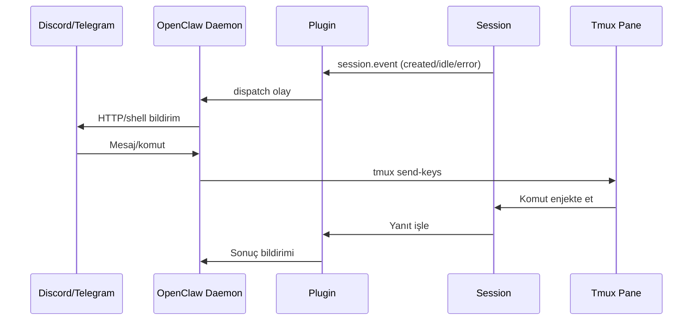

# Bölüm 8: Harici Entegrasyonlar

> **Hecateq OpenAgent** — Bu rehber, projenin dış sistemlerle entegrasyon noktalarını açıklar: OpenClaw bidirectional sistemi, GitHub Actions workflow'ları, model/provider davranışı, güvenlik, telemetri, auto-update ve lisans.
>
> **Güncelleme:** 2026-05-20 | **Branch:** dev | **Sürüm:** v0.1.0-beta.8

---

## 8.1 Harici Entegrasyonlara Genel Bakış

Hecateq OpenAgent, geliştirme ortamı dışındaki sistemlerle şu noktalarda entegre olur:

| Entegrasyon | Yön | Amaç |
|-------------|-----|------|
| **OpenClaw** | Çift yönlü (Bidirectional) | Discord/Telegram/HTTP üzerinden session event'leri ve komutlar |
| **GitHub Actions (9 workflow)** | CI/CD dışa | Test, build, publish, deploy, bakım |
| **Model Sağlayıcılar** | Dışa (API) | AI model servislerine API çağrıları |
| **models.dev API** | Dışa (API) | Model yetenek cache'ini güncelleme |
| **npm Registry** | Dışa | Auto-update versiyon kontrolü, yayın |
| **PostHog (opsiyonel)** | Dışa | Anonim telemetri |
| **Cloudflare Workers** | Deploy | Web paketini yayınlama |
| **OpenCode Host** | İçe (Plugin API) | 13 OpenCode hook handler |

---

## 8.2 OpenClaw — Bidirectional Integration

**Durum:** Beta

**Yol:** `src/openclaw/`

**Amaç:** Hecateq OpenAgent'in dış dünyayla çift yönlü iletişimi. Session event'lerini dışarıya bildirir ve dışarıdan gelen komutları session'a iletir.

### Mimarî Yapı

```
src/openclaw/
├── index.ts                       # Ana dışa aktarım
├── config.ts                      # OpenClaw config yapılandırması
├── daemon.ts                      # Arka plan dinleyici daemon
├── dispatcher.ts                  # Outbound event dağıtıcı
├── runtime-dispatch.ts            # Runtime dispatch mantığı
├── session-registry.ts            # Session kayıt ve durum yönetimi
├── tmux.ts                        # Tmux pane entegrasyonu
├── types.ts                       # Tip tanımları
├── gateway-url-validation.ts      # Gateway URL validasyonu
├── gateway-url-validation.test.ts # Testler
├── reply-listener.ts              # Reply dinleyici ana modül
├── reply-listener-discord.ts      # Discord reply dinleyici
├── reply-listener-telegram.ts     # Telegram reply dinleyici
├── reply-listener-startup.ts      | Reply dinleyici başlatma
├── reply-listener-state.ts        | Reply dinleyici state yönetimi
├── reply-listener-process.ts      | Reply dinleyici süreç yönetimi
├── reply-listener-spawn.ts        | Reply dinleyici spawn
├── reply-listener-log.ts          | Reply dinleyici log
├── reply-listener-paths.ts        | Reply dinleyici yol yönetimi
├── reply-listener-injection.ts    | Reply enjeksiyon mantığı
├── AGENTS.md                      | OpenClaw AGENTS dokümantasyonu
└── __tests__/                     | Test dosyaları
```

### Çift Yönlü İletişim Akışı



### Outbound (Dışa) Akışı

Session event'leri (`session.created`, `session.idle`, `session.error`) dış dünyaya HTTP çağrıları veya shell script'leri olarak bildirilir.

```typescript
// dispatcher.ts — Event dağıtıcı
// Session event tetiklendiğinde:
// 1. Event tipine göre dispatcher seç
// 2. HTTP dispatcher: Yapılandırılmış URL'lere POST
// 3. Shell dispatcher: Yapılandırılmış script'leri çalıştır
```

**Outbound hedefleri:**
- HTTP endpoint'leri (webhook)
- Shell script'leri
- OS bildirimleri

### Inbound (İçe) Akışı

Discord veya Telegram bot'ları üzerinden gelen mesajlar, **tmux send-keys** ile ilgili session pane'ine iletilir.

```typescript
// reply-listener-discord.ts — Discord bot dinleyici
// Discord mesajı → session'a yönlendirme
//
// reply-listener-telegram.ts — Telegram bot dinleyici
// Telegram mesajı → session'a yönlendirme
```

**Inbound kaynakları:**
- Discord bot mesajları
- Telegram bot mesajları
- HTTP webhook callback'leri

### Session Registry

```typescript
// session-registry.ts — Session kayıt ve durum yönetimi
// Aktif session'ların kaydını tutar
// Her session için: id, durum, tmux pane ID, başlangıç zamanı
```

### Yapılandırma

```jsonc
// oh-my-openagent.jsonc içinde
{
  "openclaw": {
    "discord_token": "your_discord_bot_token",
    "telegram_token": "your_telegram_bot_token",
    "http_endpoints": ["https://hooks.example.com/events"],
    "shell_commands": ["/path/to/notify.sh"]
  }
}
```

---

## 8.3 GitHub Workflow'ları (9 Workflow)

**Yol:** `.github/workflows/`

Tüm workflow'lar aşağıdaki tabloda özetlenmiştir:

| Workflow Dosyası | Trigger | Amaç | Secret Gereksinimi |
|-----------------|---------|------|-------------------|
| `ci.yml` | push/PR master/dev | Test, typecheck, build, auto-commit schema, draft release | `GITHUB_TOKEN` (built-in) |
| `publish.yml` | manual dispatch veya release published | Dual npm publish, platform binary, GitHub release, merge to master | `NPM_TOKEN` |
| `publish-platform.yml` | workflow_call (publish.yml'den) | 11 platform binary build + publish | `NPM_TOKEN` |
| `sisyphus-agent.yml` | @mention veya manual dispatch | AI agent issue/PR işleme | `GH_TOKEN` |
| `refresh-model-capabilities.yml` | weekly cron / dispatch | Model yetenek cache'ini yenile | — |
| `cla.yml` | issue_comment / PR | CLA imza asistanı | — |
| `lint-workflows.yml` | push/PR `.github/workflows/**` | actionlint (shellcheck kapalı) | — |
| `web-ci.yml` | push/PR master/dev (packages/web, docs) | Web paketi format/lint/type-check/build | — |
| `web-deploy.yml` | push master/dev veya manual | Cloudflare Workers deploy | `CLOUDFLARE_API_TOKEN`, `CLOUDFLARE_ACCOUNT_ID` |

### 8.3.1 `ci.yml` — Temel CI

**Dosya:** `.github/workflows/ci.yml`

**Trigger:** `push` veya `pull_request` → `master` veya `dev`

**Jobs:**

```
block-master-pr (PR target kontrol)
    ↓
test + test-windows + typecheck (paralel)
    ↓
build (test + typecheck sonrası)
    ↓
draft-release (sadece dev push)
```

**Job detayları:**

1. **block-master-pr:** PR'ların `master` branch pull request yapmasını engeller. Sadece `dev` branch'ine PR kabul edilir.
2. **test:** Ubuntu'da `bun test` çalıştırır. Testler non-blocking sinyaldir (tümü yeşil olmak zorunda değil).
3. **test-windows:** Windows runner'da `bun test` çalıştırır. Bun 1.3.14 kullanır.
4. **typecheck:** `bun run typecheck` + `bun run typecheck:script` çalıştırır.
5. **build:** `bun run build` + dist çıktısı doğrulama (`dist/index.js` ve `dist/index.d.ts` varlığı) + dist bundle test.
   - **master push:** Schema değişikliklerini auto-commit eder.
6. **draft-release:** `dev` push'ta "Upcoming Changes" draft release oluşturur/günceller.

```yaml
# build job — master branch'te schema auto-commit
- name: Auto-commit schema changes
  if: github.event_name == 'push' && github.ref == 'refs/heads/master'
  run: |
    if git diff --quiet assets/oh-my-opencode.schema.json; then
      echo "No schema changes to commit"
    else
      git config user.name "github-actions[bot]"
      git config user.email "github-actions[bot]@users.noreply.github.com"
      git add assets/oh-my-opencode.schema.json
      git commit -m "chore: auto-update schema.json"
      git push
    fi
```

### 8.3.2 `publish.yml` — npm Yayını

**Dosya:** `.github/workflows/publish.yml`

**Trigger:** `workflow_dispatch` (manuel) veya `release` → `published`

**Job akışı:**

```
version (versiyon çıkar)
    ↓
platform-packages (publish-platform.yml'i çağırır)
    ↓
publish (ana npm paketini yayınla)
```

**Yayın adımları:**

1. **version:** `package.json`'dan versiyon çıkarır ve semver doğrulaması yapar.
2. **platform-packages:** `publish-platform.yml` workflow'unu çağırır — 11 platform binary'sini npm'e yayınlar. Bu, ana paketin `optionalDependencies`'inin npm'de var olmasını sağlamak için **önce** çalışır.
3. **publish:** Ana `@hecateq/hecateq-openagent` paketini npm'e yayınlar.
   - TypeCheck çalıştırır
   - Build yapar
   - `npm pack --dry-run` ile paket doğrulaması yapar
   - `npm publish --access public --tag beta` ile yayınlar

```bash
# Yayın komutu
npm publish --access public --tag beta
```

**Gereksinimler:**
- `NPM_TOKEN` secret'ı (npm registry authentication)
- `id-token: write` permission (Trusted Publishing için)

**Preflight trust:** OIDC ile 24 paketi doğrular.

### 8.3.3 `publish-platform.yml` — Platform Binary Yayını

**Dosya:** `.github/workflows/publish-platform.yml` (656 satır)

**Trigger:** `workflow_call` (publish.yml'den) veya `workflow_dispatch`

**Platform build matrix:**

```yaml
strategy:
  matrix:
    platform:
      - darwin-arm64, darwin-x64, darwin-x64-baseline
      - linux-arm64, linux-arm64-musl
      - linux-x64, linux-x64-baseline, linux-x64-musl, linux-x64-musl-baseline
      - windows-x64, windows-x64-baseline
```

**Build yaklaşımı:**
- Windows: `windows-latest` runner (Bun cross-compile segfault'larını önlemek için)
- macOS: `macos-latest` runner
- Linux: `ubuntu-latest` runner

```yaml
runs-on: ${{ startsWith(matrix.platform, 'windows-') && 'windows-latest' 
            || startsWith(matrix.platform, 'darwin-') && 'macos-latest' 
            || 'ubuntu-latest' }}
```

### 8.3.4 `sisyphus-agent.yml` — AI Agent

**Dosya:** `.github/workflows/sisyphus-agent.yml`

**Trigger:** @mention veya `workflow_dispatch`

**Amaç:** GitHub issue/PR'leri otomatik işlemek için AI agent (Sisyphus) çağrısı.

### 8.3.5 `refresh-model-capabilities.yml` — Haftalık Cron

**Dosya:** `.github/workflows/refresh-model-capabilities.yml`

**Trigger:** `schedule` (weekly cron) veya `workflow_dispatch`

**Amaç:** Model yetenek cache'ini `models.dev` API'sinden düzenli olarak yeniler.

```yaml
on:
  schedule:
    - cron: '0 0 * * 0'  # Her Pazar
  workflow_dispatch:
```

### 8.3.6 `cla.yml` — CLA Asistanı

**Dosya:** `.github/workflows/cla.yml`

**Trigger:** `issue_comment` veya `pull_request`

**Amaç:** Katkıda bulunanların CLA (Contributor License Agreement) imzalamasını yönetir.

**Yapılandırma:** `signatures/cla.json` — CLA imza kaydı.

### 8.3.7 `lint-workflows.yml` — Workflow Lint

**Dosya:** `.github/workflows/lint-workflows.yml`

**Trigger:** push/PR → `.github/workflows/**`

**Amaç:** GitHub Actions workflow dosyalarının doğruluğunu kontrol eder (`actionlint`). Shellcheck **kapalı** (`shellcheck=""`).

### 8.3.8 `web-ci.yml` — Web Paketi CI

**Dosya:** `.github/workflows/web-ci.yml`

**Trigger:** push/PR master/dev → `packages/web/**` veya `docs/**`

**Adımlar:**
1. `format-check` — Kod format kontrolü
2. `lint` — Lint kontrolü
3. `type-check` — TypeScript tip kontrolü
4. `next build` — Next.js build
5. `opennextjs-cloudflare build` — Cloudflare Workers build

### 8.3.9 `web-deploy.yml` — Cloudflare Workers Deploy

**Dosya:** `.github/workflows/web-deploy.yml`

**Trigger:** push master/dev → `packages/web/**` veya `docs/**`, veya `workflow_dispatch`

**Araç:** `cloudflare/wrangler-action@v3`

**Gereksinimler:**
- `CLOUDFLARE_API_TOKEN` — Cloudflare API token (secret)
- `CLOUDFLARE_ACCOUNT_ID` — Cloudflare Account ID (secret)

---

## 8.4 Model & Provider Davranışı

Hecateq OpenAgent'in model ve provider yönetimi iki ayrı fallback sistemi üzerinden çalışır.

### 8.4.1 Model Fallback (Proactive)

**Durum:** Inherited, opsiyonel (`model_fallback: true` ile etkinleştirilir)

**Kaynak:** `src/cli/model-fallback-requirements.ts`

**Mekanizma:** Her ajan için **hardcoded fallback zincirleri** tanımlanmıştır. Birincil model başarısız olmadan **önce** (proactive) alternatif modeller denenir.

```typescript
// Örnek fallback zincirleri
sisyphus:    Claude → Gemini → Kimi → GLM-5
hephaestus:  Claude → OpenAI-compatible providers
librarian:   Claude → ZAI
oracle:      Claude-thinking → GPT-o3
```

**Yapılandırma:**

```jsonc
{
  "model_fallback": true,
  "agents": {
    "sisyphus": {
      "fallback_models": ["claude-sonnet-4", "gemini-2.5-pro", "kimi-latest"]
    }
  }
}
```

### 8.4.2 Runtime Fallback (Reactive)

**Durum:** Inherited, opsiyonel (`runtime_fallback` config ile)

**Kaynak:** `src/hooks/runtime-fallback/`

**Mekanizma:** API hatası **sonrası** (reactive) tetiklenir. Hata kodlarına göre provider değiştirir.

**Tetikleyiciler:**
- HTTP 429 (Rate Limit)
- HTTP 500, 502, 503, 504 (Server Error)
- Session idle timeout
- Provider connectivity hatası

```jsonc
{
  "runtime_fallback": {
    "enabled": true,
    "max_retries": 3,
    "retry_delay_ms": 1000
  }
}
```

### 8.4.3 İki Fallback Sistemi Karşılaştırması

| Özellik | Model Fallback (Proactive) | Runtime Fallback (Reactive) |
|---------|---------------------------|----------------------------|
| **Zamanlama** | API çağrısından önce | API hatasından sonra |
| **Yapılandırma** | `model_fallback: true` | `runtime_fallback: {}` |
| **Tetikleyici** | Config'de tanımlı zincir | API hata kodları, timeout |
| **Zincir** | Per-agent hardcoded | Configurable per-category |
| **Hook noktası** | `chat.params` | `session.error` |
| **Bağımsızlık** | Diğer sistemden bağımsız | Diğer sistemden bağımsız |

**Önemli:** İki fallback sistemi **birbirinden bağımsız** çalışır ve doğrudan entegrasyonları yoktur.

### 8.4.4 Provider Çözümleme Pipeline'ı

**Kaynak:** `packages/model-core/`

```typescript
// model-core/src/model-resolution.ts
// ProviderCache DI ile model çözümleme
// 1. Config'den model ID oku
// 2. ProviderCache'den provider'ı bul
// 3. model-capabilities cache'inden yetenek kontrolü
// 4. Fallback zincirini başlat
```

**Provider tespiti:** Kurulum sırasında `doctor` komutu provider bağlantılarını doğrular. `refresh-model-capabilities` komutu model cache'ini günceller.

---

## 8.5 Güvenlik

### 8.5.1 Built-in Guards (Inherited)

| Guard | Açıklama |
|-------|----------|
| `writeExistingFileGuard` | Varolan dosyaya yazmadan önce Read yapılmasını zorunlu kılar |
| `bashFileReadGuard` | cat/head/tail ile dosya okuyan bash komutlarını kısıtlar |
| `webfetchRedirectGuard` | Web fetch redirect davranışını kontrol eder |
| `prometheusMdOnly` | Prometheus ajanı sadece `.md` dosyalarını düzenleyebilir |
| `noSisyphusGpt` | Sisyphus'u non-GPT provider'lardan engeller |
| `noHephaestusNonGpt` | Hephaestus'u non-GPT modellerden engeller |
| `commentChecker` | AI-slop yorum kalıplarını tespit eder |
| `sensitivePathPolicy` | `.env`, secret, key hedefleyen taskları bloklar |

### 8.5.2 Hecateq Güvenlik Özellikleri

| Özellik | Açıklama |
|---------|----------|
| **Git checkpoint block_destructive_git** | Destructive git işlemlerini (force push, branch delete) engeller |
| **Dependency graph block_on_sensitive** | Hassas yolları hedefleyen task'ları bloklar |
| **Orchestration require_plan_for_high_risk** | Yüksek riskli prompt'lar için plan zorunluluğu getirir |
| **Sensitive task blocking** | `isSensitiveTask()`, `.env` gibi hassas dosyaları hedefleyen task'ları bloklar |
| **Handoff role policy** | Agent rollerinin handoff'lar arasında tutarlılığını doğrular |
| **Internal message injection gate** | `session.promptAsync` çağrılarını `prompt-async-gate` üzerinden yönlendirir |

### 8.5.3 Zorunlu Hook'lar (Safety Hooks)

Hecateq doctor, aşağıdaki güvenlik hook'larının varlığını kontrol eder:

```typescript
// hecateq-doctor kontrol ettiği hook'lar
- hecateq-memory-bootstrap      // Bellek başlatma
- hecateq-project-context-injector  // Context enjeksiyonu
```

---

## 8.6 Telemetri

### Politika

> **Gizlilik Önceliklidir:** Telemetri kesinlikle **opt-in**'dir ve varsayılan olarak **kapalıdır**.

### Etkinleştirme

```bash
# Telemetriyi etkinleştir
export HECATEQ_SEND_ANONYMOUS_TELEMETRY=1
export HECATEQ_POSTHOG_KEY=your_posthog_project_key
```

**PostHog key eksikse**, telemetri güvenli şekilde no-op yapar (hiçbir şey göndermez).

### Toplanan Veriler

| Event | Açıklama |
|-------|----------|
| `session_start` | Session başlangıcı (anonim) |
| `session_end` | Session bitişi (anonim) |
| `omo_doctor_run` | Doctor komutu çalıştırma (minimal config özeti) |

**Asla toplanmayan veriler:**
- Private anahtarlar
- Environment variable'lar
- Hassas kod blokları
- Dosya içerikleri
- Kullanıcı kimliği

---

## 8.7 Auto-Update

### Mekanizma

Auto-update checker, her session başlangıcında npm'deki en son versiyonu kontrol eder.

```typescript
// src/hooks/auto-update-checker/
// Session.created event'inde tetiklenir
// Yüklü versiyon ile npm latest karşılaştırılır
// Fark varsa bildirim gösterilir
```

### Yapılandırma

```jsonc
{
  "auto_update": true  // veya false
}
```

### Hecateq Kanalı

Auto-update, `@hecateq/hecateq-openagent` npm dağıtım kanalını hedefler. Upstream'den farklı olarak **beta tag**'i kullanır:

```bash
# Yayın kanalı
npm publish --access public --tag beta

# Versiyon formatı
0.1.0-hecateq.<n>
```

### Loglama

Logger, OS temp dizinine (`os.tmpdir()`) yazar:
- Linux: `/tmp/oh-my-opencode.log`
- macOS: `/var/folders/.../T/oh-my-opencode.log`
- Windows: `%TEMP%\oh-my-opencode.log`

**Rotasyon:** 50 MB cap, `.1` ve `.2` yedekleri (en eski silinir).

---

## 8.8 Lisans

### SUL-1.0 (Sustainable Use License v1.0)

Hecateq OpenAgent, **Sustainable Use License v1.0 (SUL-1.0)** ile lisanslanmıştır.

**Dosya:** `LICENSE.md`

**Temel hükümler:**
1. **Kullanım:** Yazılımı kullanma, değiştirme ve dağıtma hakkı verir
2. **Atıf:** Türev çalışmalarda orijinal kaynağa atıf zorunludur
3. **Ticari kullanım:** Sürdürülebilir kullanım koşullarına tabidir
4. **Sorumluluk reddi:** Yazılım "olduğu gibi" sunulur, hiçbir garanti verilmez

**Atıf zorunluluğu:**

```markdown
Bu proje, [oh-my-openagent](https://github.com/code-yeongyu/oh-my-openagent) 
(YeonGyu Kim) tabanlı bir fork'tur. Detaylar için NOTICE.md dosyasına bakın.
```

### İlişkili Dosyalar

| Dosya | İçerik |
|-------|--------|
| `LICENSE.md` | Tam lisans metni (SUL-1.0) |
| `NOTICE.md` | Atıf ve lisans bildirimi |
| `SECURITY.md` | Güvenlik politikası |
| `CLA.md` | Katkıda bulunan lisans sözleşmesi |
| `docs/legal/privacy-policy.md` | Gizlilik politikası |
| `docs/legal/terms-of-service.md` | Kullanım koşulları |

### Üçüncü Taraf Lisansları

```jsonc
// NOTICE.md'de belirtilen upstream projeler
- oh-my-openagent (YeonGyu Kim) — Apache 2.0 / MIT
- oh-my-opencode (upstream adı)
- Diğer npm bağımlılıkları
```

---

## 8.9 Entegrasyon Özet Tablosu

| Entegrasyon | Tip | Durum | Yapılandırma |
|-------------|-----|-------|-------------|
| OpenClaw (Discord/Telegram/HTTP) | Bidirectional | Beta | `openclaw` config bloğu |
| GitHub Actions (9 workflow) | CI/CD | Stable | `.github/workflows/` |
| npm Registry | Publishing | Stable | `NPM_TOKEN` secret |
| models.dev API | Model cache | Stable | `build:model-capabilities` |
| PostHog Telemetry | Analytics | Opt-in, kapalı | `HECATEQ_POSTHOG_KEY` env |
| Cloudflare Workers | Web deploy | Stable | `CLOUDFLARE_API_TOKEN` + `ACCOUNT_ID` |
| Auto-Update | Version check | Stable | `auto_update` config |
