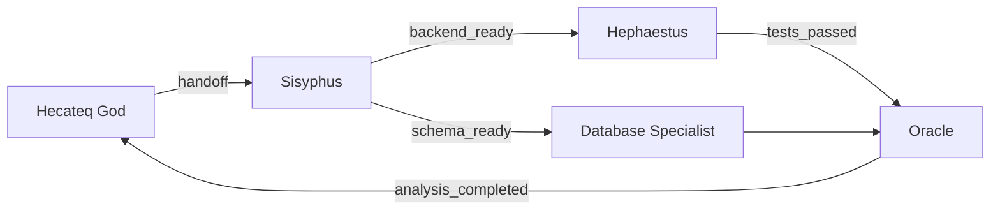

# 11 — Özellik Önerileri ve İyileştirmeler

> **Hecateq OpenAgent — Sistemi İşlevsel ve Geleceğe Hazır Yapacak Özellikler**
>
> "Projeyi geliştirebilecek ve sistemi işlevsel yapacak hangi özellik var? Hangisini geliştirmeliyiz?"
>
> Son güncelleme: 2026-07-05 | Fork: Hecateq | Temel: oh-my-openagent v4.2.0

---

## İçindekiler

1. [Yönetici Özeti](#1-yönetici-özeti)
2. [Mevcut Sistemin Olgunluk Haritası](#2-mevcut-sistemin-olgunluk-haritası)
3. [Yüksek Öncelikli Özellikler (HIGH)](#3-yüksek-öncelikli-özellikler-high)
4. [Orta Öncelikli Özellikler (MEDIUM)](#4-orta-öncelikli-özellikler-medium)
5. [Düşük Öncelikli / İleri Vizyon (LOW / FUTURE)](#5-düşük-öncelikli--ileri-vizyon-low--future)
6. [İyileştirme Önerileri (Mevcut Özelliklere)](#6-iyileştirme-önerileri-mevcut-özelliklere)
7. [Sistemi "İşlevsel" Yapacak Kritik Özellikler](#7-sistemi-i̇şlevsel-yapacak-kritik-özellikler)
8. [Topluluk ve Ekosistem Önerileri](#8-topluluk-ve-ekosistem-önerileri)
9. [Teknik Borç Temizleme Önceliği](#9-teknik-borç-temizleme-önceliği)
10. [Önceliklendirme Matrisi](#10-önceliklendirme-matrisi)
11. [Hangi Sırayla Yapmalıyız? (90 Gün Planı)](#11-hangi-sırayla-yapmalıyız-90-gün-planı)
12. [Sonuç ve Önerilen İlk Aksiyon](#12-sonuç-ve-önerilen-i̇lk-aksiyon)

---

## 1. Yönetici Özeti

Hecateq OpenAgent, ~2167 TypeScript dosyası ve 313k LOC ile **Beta** olgunluğunda bir OpenCode plugin fork'udur. 12 AI ajanı, 52+ lifecycle hook, 20-39 tool, 3 katmanlı MCP ve Hecateq orchestration pipeline ile teknik olarak yetenekli bir altyapıya sahiptir. Ancak **test kararlılığı, memory curator'un hook sistemine bağlanmamış olması ve orchestration E2E test eksikliği** sistemi gerçek anlamda "işlevsel" olmaktan alıkoymaktadır.

Bu belge, sistemi production-ready yapacak **6 HIGH, 7 MEDIUM, 5 LOW/FUTURE özellik önerisi** ve **9 iyileştirme** sunar. En kritik aksiyon: Memory curator'u hook pipeline'ına bağlamak ve test stabilizasyonunu tamamlamak. Bu iki adım, diğer tüm özelliklerin önünü açacak temel bloklardır.

**Önerilen ilk 30 gün:** Memory curator wiring + test stabilization + custom agent CLI.

---

## 2. Mevcut Sistemin Olgunluk Haritası

Aşağıdaki tablo, Hecateq OpenAgent'teki tüm özelliklerin olgunluk seviyesini göstermektedir. Detaylı feature kataloğu için [rehber/05-ozellikler-modulleri.md](./05-ozellikler-modulleri.md)'ye bakın.

### 2.1 Tam İşlevsel (Production-Ready)

| Özellik | Açıklama | Referans |
|---------|----------|----------|
| 12 built-in ajan | Hecateq God + 11 upstream ajan | [rehber/02](./02-ajanlar-sistemi.md) |
| 54-61 lifecycle hook | 5 katmanlı hook kompozisyonu | [rehber/03](./03-hooks-sistemi.md) |
| 20 her-zaman-açık tool | LSP, AST-grep, grep/glob, session mgmt | [rehber/04](./04-tools-ve-mcp.md) |
| 3 katmanlı MCP | Built-in + Claude Code + Skill-embedded | [rehber/04](./04-tools-ve-mcp.md) |
| Multi-level JSONC config | Zod v4 validasyon, merge hiyerarşisi | [rehber/06](./06-ortak-yardimcilar-ve-config.md) |
| Background agent | 5 eşzamanlı task, FIFO kuyruk | [rehber/05](./05-ozellikler-modulleri.md#55-background-agent) |
| IntentGate | ultrawork/search/analyze/team keyword tespiti | [rehber/05](./05-ozellikler-modulleri.md#58-intentgate-keyword-detector) |
| Memory bootstrap + manifest | Dosya tabanlı kalıcı bellek | [rehber/05](./05-ozellikler-modulleri.md#56-memory-sistemi) |
| Handoff sistemi | STATUS/SIGNALS_EMITTED/HANDOFF blokları | [rehber/05](./05-ozellikler-modulleri.md#57-handoff-sistemi) |
| Multi-level güvenlik | write guard, comment checker, prometheus-md-only | [rehber/01](./01-mimari-genel-bakis.md) |
| 12 CLI komutu | install/run/doctor/plan/resume/status/boulder | [rehber/07](./07-cli-build-ve-packages.md) |

### 2.2 İşlevsel Ama Sınırlı (Geliştirilmeli)

| Özellik | Sınırlama | Geliştirme Önerisi |
|---------|-----------|-------------------|
| **Memory curator** (`src/shared/memory-curator.ts`) | 6 fonksiyon var ama hook pipeline'ına bağlı değil; `decisions.md` deduplication **eksik**; yalnızca `task-completion-memory-commit.ts` üzerinden tetikleniyor | Hook'a bağla, decisions.md dedup ekle, auto-schedule |
| **Orchestration pipeline** (8 aşama) | E2E test harness yok; runtime adapter entegrasyonu test edilmemiş | PR8: E2E test suite + mock adapter |
| **Custom-agent-first routing** | Hot-reload yok; ajan ekleme/silme CLI'den yapılamıyor | Custom Agent Registry CLI |
| **Team mode** | Kapalı varsayılan; sadece 3 agent eligible; test kapsamı dar | Team mode'u stabilize et, eligibility registry'yi genişlet |
| **Boulder state** | Tek boulder desteği; multi-boulder yok | Multi-boulder support |
| **OpenClaw** | Beta statü; rate limiting yok; error isolation zayıf | OpenClaw hardening |
| **Doctor checks** | 37 check (11 Hecateq + 26 base); eksik otomatik fix önerileri | Doctor auto-fix |
| **Hashline edit** | Kapalı varsayılan; tool olarak mevcut | Varsayılan açık yap, diff viewer entegre et |

### 2.3 Eksik (Hiç Yok)

| Özellik | Neden Önemli | Referans |
|---------|-------------|----------|
| **Orchestration E2E test harness** | Pipeline değişikliklerinde regression güvencesi | [rehber/10](./10-ilerleme-plani.md#3c-orchestration-e2e-coverage-medium) |
| **decisions.md deduplication** | 1600+ satırın %70'i duplicate; memory curator'da fonksiyon yok | Bu belge, Bölüm 3 |
| **Custom Agent Registry CLI** | `hecateq agent add/list/remove` komutları yok | Bu belge, Bölüm 3 |
| **Web search cache & rate limiter** | Dış API maliyet kontrolü yok | Bu belge, Bölüm 3 |
| **Live handoff inspector** | `.opencode/state/handoffs/` için dashboard yok | Bu belge, Bölüm 3 |
| **Agent performance profiler** | Her ajan için latency/cost tracking yok | Bu belge, Bölüm 4 |
| **Session replay** | Session'ları sonradan tekrar oynatma yok | Bu belge, Bölüm 4 |
| **Cost dashboard** | Provider bazlı maliyet analizi yok | Bu belge, Bölüm 4 |
| **Provider health monitor** | Real-time provider status yok | Bu belge, Bölüm 4 |

### 2.4 Beta / Experimental (Durumu Netleştirilmeli)

| Özellik | Şu anki Durum | Öneri |
|---------|--------------|-------|
| Hecateq orchestration pipeline | **Experimental** | Stabilize et, API dondur |
| Hecateq CLI (plan/run/resume) | **Experimental** | Kullanıcı geri bildirimi topla |
| Custom-agent-first routing | **Experimental** | Edge case'leri test et |
| Memory system | **Experimental** | Curator'u bağla, sonra Stable |
| OpenClaw | **Beta** | Hardening yap, sonra Stable |
| Team mode | **Beta** | Test coverage'ı artır |
| Claude Code plugin compatibility | **Beta** | Upstream ile uyumluluğu doğrula |

---

## 3. Yüksek Öncelikli Özellikler (HIGH)

### H-01: Memory Curator Hook Wiring + decisions.md Dedup

**Problem:** Memory curator 6 fonksiyonla (`runMemoryCurator`) çalışır durumda ancak **yalnızca task completion'da tetikleniyor**. Session compaction, orchestration sonu, periyodik schedule gibi durumlarda çalışmıyor. Ayrıca `decisions.md` için **deduplication fonksiyonu hiç yok** — 1600+ satırın ~%70'i duplicate stack kararları ("Using go", "Using Next.js" gibi).

**Çözüm:**

```typescript
// 1. Hook wiring: src/hooks/memory-curator-trigger/index.ts
// Session.idle ve compaction sonrası curator'u tetikle

import { createSessionHook } from "../hook-factory"
import { scheduleMemoryCurator } from "../../shared/memory-curator-scheduler"

export const memoryCuratorTrigger = createSessionHook({
  hook: "session.idle",
  handler: async (session) => {
    if (session.messageCount % 10 === 0) {
      // Her 10 mesajda bir curator çalıştır
      void scheduleMemoryCurator(session.projectRoot)
    }
  },
})

// 2. decisions.md dedup: src/shared/memory-curator.ts — YENİ FONKSİYON
export function dedupeDecisions(
  projectRoot: string,
  options?: CuratorOptions,
): CuratorResult {
  // 1. decisions.md'yi oku
  // 2. "Using X" stack kararlarını tespit et (regex: /Using \w+/)
  // 3. Aynı metne sahip kararları teke indir (en sonuncuyu koru)
  // 4. Stack kararlarını ayrı bölümde topla
  // 5. 30 günden eski low-priority kararları arşivle
  // 6. Dedupe edilmiş versiyonu atomik yaz
}
```

**Etki:**
- `decisions.md` 1600+ satırdan ~500 satıra iner
- Memory curator otomatik çalışır, manuel müdahale gerekmez
- Tüm memory dosyaları düzenli kalır

**Efor:** 5-7 gün (3 gün hook wiring + 2 gün decisions.md dedup + 2 gün test)
**PR Önerisi:** PR7b — "feat(hecateq): wire memory curator into hook pipeline + add decisions.md dedup"
**Neden şimdi?** Curator'un temel kodu var, sadece bağlantı eksik. Minimal eforla maksimum etki.

---

### H-02: Test Stabilization Suite

**Problem:** `installAgentSortShim()` `Array.prototype.sort`'u patch'leyerek cross-test contamination yaratıyor. `agent-priority-order.test.ts` stale assertion içeriyor. `src/shared` ve `src/tools/delegate-task`'te pre-existing failure'lar normalize olmuş teknik borç.

Detaylı analiz için: [rehber/10 — Bölüm 3a](./10-ilerleme-plani.md#3a-test-kararlılığı-high)

**Çözüm:**

```typescript
// src/plugin-handlers/install-agent-sort-shim.ts — scope isolation
let originalSort: typeof Array.prototype.sort | null = null
let shimInstalled = false

export function installAgentSortShim(): void {
  if (shimInstalled) return
  originalSort = Array.prototype.sort
  Array.prototype.sort = function <T>(compareFn?: (a: T, b: T) => number): T[] {
    if (isCanonicalAgentArray(this)) {
      return applyCanonicalOrder(this as unknown as T[], compareFn)
    }
    return originalSort!.call(this, compareFn)
  }
  shimInstalled = true
}

export function restoreAgentSortShim(): void {
  if (!shimInstalled || !originalSort) return
  Array.prototype.sort = originalSort
  shimInstalled = false
}
```

```bash
# Test audit script
bun test 2>&1 | tee /tmp/test-audit-$(date +%Y%m%d).log
echo "=== Pre-existing failures ==="
grep -n "FAIL\|✗" /tmp/test-audit-*.log
```

**Etki:**
- `bun test` 0 pre-existing failure hedefi
- Yeni PR'lerde "bu test benim değişikliğimden mi kırıldı?" sorusu ortadan kalkar
- CI'da test sonuçları güvenilir hale gelir

**Efor:** 10-14 gün (5 gün shim isolation + 3 gün stale tests + 4 gün pre-existing audit + 2 gün env sensitivity)
**PR Önerisi:** PR5 — "test: stabilization suite — shim isolation, stale assertions, pre-existing failure audit"
**Neden şimdi?** Her yeni PR'de zaman kaybettiren bir blokerdır. Diğer tüm özelliklerin test güvencesini sağlar.

---

### H-03: Orchestration E2E Test Harness

**Problem:** 8 aşamalı orchestration pipeline için **tam entegrasyon testi yoktur**. Her aşama unit test edilmiş olabilir ancak aşamalar arası state geçişleri, hata senaryoları ve repair loop doğrulanmamıştır.

**Çözüm:**

```typescript
// src/features/hecateq-orchestration/e2e/__tests__/orchestration-e2e.test.ts
import { describe, it, expect } from "bun:test"
import { createMockRuntimeAdapter } from "./mock-runtime-adapter"
import { createOrchestrationPipeline } from "../orchestration-controller"

describe("Orchestration E2E", () => {
  it("should complete full 8-stage pipeline", async () => {
    const adapter = createMockRuntimeAdapter()
    const pipeline = createOrchestrationPipeline(adapter)

    const result = await pipeline.execute("fix typo in README")

    expect(result.stages.completed).toBe(8)
    expect(result.qualityGates.allPassed).toBe(true)
  })

  it("should trigger repair loop on stage 5 failure", async () => {
    const adapter = createMockRuntimeAdapter({ failAtStage: 5 })
    const pipeline = createOrchestrationPipeline(adapter)

    const result = await pipeline.execute("add validation")

    expect(result.repairLoop.triggered).toBe(true)
    expect(result.repairLoop.attempts).toBeLessThanOrEqual(2)
    expect(result.stages.completed).toBe(8) // repair sonrası tamamlanmalı
  })

  it("should reject destructive tasks without --force", async () => {
    const adapter = createMockRuntimeAdapter()
    const pipeline = createOrchestrationPipeline(adapter)

    await expect(
      pipeline.execute("drop production database")
    ).rejects.toThrow("HIGH_RISK_TASK_REQUIRES_FORCE")
  })
})
```

**Etki:**
- 8/8 stage test edilmiş olur
- Pipeline değişikliklerinde regression güvencesi
- Repair loop, quality gates, destructive task blocking doğrulanır

**Efor:** 3-5 gün (mock adapter + 3 temel test + CI entegrasyonu)
**PR Önerisi:** PR8 — "test(hecateq): orchestration E2E test harness"
**Neden şimdi?** Orchestration Experimental statüsünde; E2E test olmadan Stable'e geçemez.

---

### H-04: Custom Agent Registry CLI

**Problem:** Custom agent eklemek için manuel olarak `.opencode/agents/` dizinine `.md` dosyası oluşturmak gerekiyor. `hecateq agent add/list/remove` gibi CLI komutları yok. Agent indeks manuel yenileniyor.

**Çözüm:**

```bash
# Önerilen CLI arayüzü
hecateq-openagent hecateq agent add --name my-agent --mode subagent --prompt "You are a..."
hecateq-openagent hecateq agent list
hecateq-openagent hecateq agent remove my-agent
hecateq-openagent hecateq agent inspect my-agent
```

```typescript
// src/cli/hecateq/agent-commands.ts — önerilen implementasyon
export function registerAgentCommands(program: Command): void {
  const agentCmd = program.command("agent").description("Custom agent management")

  agentCmd
    .command("add")
    .requiredOption("--name <name>", "Agent name (kebab-case)")
    .option("--mode <mode>", "primary | subagent | all", "subagent")
    .option("--prompt <prompt>", "System prompt (file path or inline)")
    .option("--model <model>", "Model override")
    .option("--skills <skills>", "Comma-separated skill names")
    .action(async (opts) => {
      // 1. Validate name (kebab-case, unique)
      // 2. Create .opencode/agents/{name}.md with YAML frontmatter
      // 3. Re-generate agent index
      // 4. Run doctor check to verify
    })

  agentCmd
    .command("list")
    .option("--format <format>", "table | json", "table")
    .action(async (opts) => {
      // List all custom agents with status, mode, model
    })

  agentCmd
    .command("remove")
    .requiredOption("--name <name>", "Agent name to remove")
    .option("--force", "Skip confirmation")
    .action(async (opts) => {
      // 1. Confirm (unless --force)
      // 2. Remove agent file
      // 3. Re-generate agent index
    })
}
```

**Etki:**
- Custom agent ekleme süresi 5 dakikadan 10 saniyeye iner
- Agent index her eklemede otomatik yenilenir
- Kullanıcı hataları azalır (name validation, duplicate check)

**Efor:** 3-5 gün
**PR Önerisi:** PR10 — "feat(hecateq): custom agent registry CLI (add/list/remove)"
**Neden şimdi?** Custom-agent-first routing'in en büyük eksiklerinden biri. CLI olmadan kullanıcı deneyimi zayıf.

---

### H-05: Web Search Cache & Rate Limiter

**Problem:** Web search (Context7, Exa/Tavily) her çağrıda dış API'ye gider. Aynı sorgu tekrarlandığında gereksiz maliyet oluşur. Rate limiting yok — arka arkaya 10 sorgu gönderilirse API key bloklanabilir.

**Çözüm:**

```typescript
// src/features/websearch-cache/index.ts — önerilen tasarım

interface CacheEntry {
  result: string
  cachedAt: number
  expiresAt: number
  hitCount: number
}

export class WebSearchCache {
  private cache = new Map<string, CacheEntry>()
  private requestTimestamps: number[] = []
  
  constructor(
    private maxCacheSize = 100,
    private ttlMs = 5 * 60 * 1000, // 5 dakika
    private maxRequestsPerMinute = 10,
  ) {}

  async search(query: string): Promise<string> {
    // 1. Cache kontrolü
    const cached = this.get(query)
    if (cached) return cached

    // 2. Rate limit kontrolü
    this.enforceRateLimit()

    // 3. API çağrısı
    const result = await this.performSearch(query)

    // 4. Cache'e yaz
    this.set(query, result)
    return result
  }

  private enforceRateLimit(): void {
    const now = Date.now()
    const oneMinuteAgo = now - 60000
    this.requestTimestamps = this.requestTimestamps.filter(t => t > oneMinuteAgo)
    
    if (this.requestTimestamps.length >= this.maxRequestsPerMinute) {
      const oldest = this.requestTimestamps[0]
      const waitMs = 60000 - (now - oldest)
      throw new Error(`Rate limit exceeded. Wait ${Math.ceil(waitMs / 1000)}s.`)
    }
    
    this.requestTimestamps.push(now)
  }
}
```

```jsonc
// Config'e eklenecek alanlar
{
  "websearch": {
    "provider": "exa",           // "exa" | "tavily" | "context7"
    "cache_ttl_seconds": 300,
    "max_cache_entries": 100,
    "rate_limit_per_minute": 10,
    "cache_persist": false       // Disk'e cache yaz
  }
}
```

**Etki:**
- Aynı sorgu tekrarlandığında API maliyeti sıfırlanır
- Rate limiting ile API key bloklanması önlenir
- Ortalama sorgu süresi 2-3 sn'den 1 ms'ye iner (cache hit)

**Efor:** 2-3 gün
**PR Önerisi:** PR11 — "feat: web search cache with rate limiter"
**Neden şimdi?** Dış API maliyetleri kontrol edilemez şekilde büyüyebilir. Erken önlem almak gerek.

---

### H-06: Live Handoff Inspector

**Problem:** Handoff blokları `.opencode/state/handoffs/` dizininde `.json` dosyaları olarak saklanır. Bunları okumak için ya `cat` yapmak ya da `session_read` ile session'a girmek gerekir. **Anlık handoff durumunu gösteren bir dashboard yoktur.**

**Çözüm:**

```typescript
// src/cli/hecateq/handoff-inspector.ts — önerilen CLI komutu
// hecateq-openagent hecateq handoffs [--session-id <id>]

export function registerHandoffInspector(program: Command): void {
  program
    .command("handoffs")
    .description("Inspect handoff state")
    .option("--session-id <id>", "Filter by session")
    .option("--status <status>", "Filter: DONE | IN_PROGRESS | BLOCKED")
    .option("--format <format>", "table | json | graph", "table")
    .option("--watch", "Live refresh every 5s")
    .action(async (opts) => {
      // 1. Scan .opencode/state/handoffs/ for .json files
      // 2. Parse each handoff block (STATUS + SIGNALS + HANDOFF)
      // 3. Render as table or ASCII graph
      // 4. If --watch, re-scan every 5s
    })
}
```

Örnek çıktı:

```
=== HANDOFF DASHBOARD (3 active sessions) ===

ses_abc123 → ses_def456
  STATUS: IN_PROGRESS
  SIGNALS: [backend_ready, schema_ready]
  HANDOFF: return_to_caller
  AGE: 2m 34s

ses_ghi789 → (orphaned)
  STATUS: BLOCKED
  SIGNALS: [blocked]
  HANDOFF: return_to_parent_for_routing
  AGE: 15m 22s ⚠️
```

**Etki:**
- Orphaned handoff'ları tespit etme süresi 5 dakikadan 5 saniyeye iner
- Handoff zincirindeki darboğazlar görünür hale gelir
- `--watch` modu ile canlı takip mümkün

**Efor:** 3-4 gün
**PR Önerisi:** PR12 — "feat(hecateq): live handoff inspector CLI + dashboard"
**Neden şimdi?** Handoff sistemi stable ama görünürlük yok. Kullanıcılar "acaba handoff doğru çalışıyor mu?" sorusuna cevap alamıyor.

---

## 4. Orta Öncelikli Özellikler (MEDIUM)

### M-01: Agent Performance Profiler

**Problem:** Her ajanın ne kadar sürede yanıt verdiği, kaç token tükettiği, hangi provider'ların ne kadar maliyet yarattığı bilinmiyor. Performans sorunları subjektif değerlendirmelere dayanıyor.

**Çözüm:**

```typescript
// src/features/agent-profiler/index.ts

export interface AgentProfile {
  agentName: string
  totalCalls: number
  totalTokens: number
  totalLatencyMs: number
  avgLatencyMs: number
  costEstimateUsd: number
  errorRate: number
  providerBreakdown: Record<string, ProviderStats>
}

// Hook: her tool.execute sonrası profiler'a kayıt
// CLI: hecateq-openagent profile --agent <name> --format json
// Dashboard: Hermes'e entegre
```

**Etki:**
- Hangi agent'ın pahalı olduğu görünür
- Provider karşılaştırması mümkün
- Optimizasyon kararları veriye dayanır

**Efor:** 4-5 gün
**Neden şimdi?** Experimental'den Stable'e geçerken performans baseline'ı gerekli.

---

### M-02: Prompt Diff & Review Tool

**Problem:** Agent prompt'ları zamanla değişir. "Bu prompt'u kim değiştirdi, ne değişti?" sorusuna cevap vermek imkansız. System prompt değişikliklerinin review süreci yoktur.

**Çözüm:**

```bash
# Önerilen komut
hecateq-openagent hecateq prompt-diff --agent sisyphus --from v1 --to v2
```

```typescript
// src/cli/hecateq/prompt-diff.ts
// 1. src/agents/*/prompts/ içindeki prompt template'lerini snapshot'la
// 2. Git history'den eski versiyonu bul
// 3. unified diff formatında göster
// 4. --review flag'i ile PR review thread'i aç
```

**Etki:**
- Prompt değişiklikleri izlenebilir
- Code review'da prompt değişiklikleri de review edilir
- Regression durumunda prompt history'den dönülebilir

**Efor:** 2-3 gün
**Neden şimdi?** Agent davranışı değişikliklerinin kök neden analizi için kritik.

---

### M-03: Skill Composer

**Problem:** Birden fazla skill tek bir task'te kullanılamaz. `load_skills=['skill-a', 'skill-b']` yapılsa bile skill'ler birbiriyle çelişebilir, öncelik sırası belirsizdir.

**Çözüm:**

```typescript
// src/features/skill-composer/index.ts

export interface ComposedSkill {
  name: string
  skills: string[]
  mergeStrategy: "sequential" | "priority" | "section-merge"
  conflictResolution: "first-wins" | "last-wins" | "manual"
}
```

```jsonc
{
  "skills": {
    "compositions": [
      {
        "name": "fullstack-review",
        "skills": ["security-architect", "qa-test-engineer", "performance-specialist"],
        "mergeStrategy": "section-merge",
        "conflictResolution": "first-wins"
      }
    ]
  }
}
```

**Etki:**
- Karmaşık task'ler için özel skill kombinasyonları
- Skill çakışmaları otomatik çözülür
- "fullstack-review" gibi tek komutla çağrılabilir composition'lar

**Efor:** 3-5 gün
**Neden şimdi?** Skill sistemi olgunlaştı; composer doğal sonraki adım.

---

### M-04: MCP Marketplace Keşif Aracı

**Problem:** Kullanıcılar hangi MCP server'larının mevcut olduğunu, nasıl kurulacağını, hangi tool'ları sağladığını bilmiyor. Community MCP'lerini keşfetmek için merkezi bir yer yok.

**Çözüm:**

```bash
hecateq-openagent mcp-marketplace search "database"
hecateq-openagent mcp-marketplace install @modelcontextprotocol/postgres
hecateq-openagent mcp-marketplace list --installed
```

```typescript
// Kaynak: GitHub MCP Awesome list + npm registry
// Her MCP için: description, tools, setup guide, config template
// Install: .mcp.json'a otomatik ekle
```

**Etki:**
- MCP keşif süresi 30 dakikadan 1 dakikaya iner
- Doğru MCP'yi bulma oranı artar
- Kullanıcıların MCP kullanma oranı yükselir

**Efor:** 4-5 gün
**Neden şimdi?** MCP ekosistemi hızla büyüyor; keşif aracı olmazsa kullanıcılar kaybolur.

---

### M-05: Session Replay

**Problem:** Bir session'da ne olduğunu anlamak için session_read yapmak gerekir. Ancak session'ı "tekrar oynatmak" (replay) mümkün değildir — aynı prompt'ları tekrar göndermek, adım adım ilerlemek, hata anını yakalamak imkansızdır.

**Çözüm:**

```bash
# Önerilen komut
hecateq-openagent hecateq replay --session-id ses_abc123 --speed 2x
```

```typescript
// src/features/session-replay/index.ts
// 1. Session messages'larını oku
// 2. Her message'ı sırayla replay et
// 3. Tool call'ları mock'la (opsiyonel)
// 4. --speed ile hız kontrolü
// 5. --pause-at <message-id> ile hata anında dur
```

**Etki:**
- Hata ayıklama süresi hızlanır
- Session analizi kolaylaşır
- Eğitim/demo amaçlı kullanılabilir

**Efor:** 5-7 gün
**Neden şimdi?** Debugging için en çok istenen özelliklerden biri.

---

### M-06: Cost Dashboard

**Problem:** Her API çağrısının maliyeti bilinmiyor. Kullanıcılar "bu ay API'ye ne kadar harcadım?" sorusuna cevap veremiyor.

**Çözüm:**

```bash
hecateq-openagent cost --period this-month --format table
```

```typescript
// src/features/cost-tracker/index.ts
// 1. Her API çağrısında model + token sayısını kaydet
// 2. Pricing tablosu ile maliyet hesapla
// 3. Provider bazlı breakdown
// 4. Per-agent breakdown
// 5. Tahmini bütçe uyarısı (threshold config)
```

**Etki:**
- API maliyetleri şeffaf hale gelir
- Hangi agent'ın ne kadar harcadığı görünür
- Bütçe planlaması mümkün olur

**Efor:** 3-4 gün
**Neden şimdi?** Kullanıcıların en sık sorduğu sorulardan biri "bu ne kadara mal oluyor?"

---

### M-07: Provider Health Monitor

**Problem:** Provider (OpenAI, Anthropic, Google, etc.) kesintileri anlık olarak tespit edilemez. 429 (rate limit) veya 500 (server error) alındığında kullanıcıya sadece "API error" gösterilir — hangi provider'ın sorunlu olduğu, ne zaman düzeleceği belirtilmez.

**Çözüm:**

```typescript
// src/features/provider-health-monitor/index.ts

export interface ProviderHealth {
  provider: string
  status: "healthy" | "degraded" | "down"
  lastError: { code: number; message: string; timestamp: number } | null
  errorRate: number // son 5 dakikada
  avgLatencyMs: number
  rateLimitRemaining: number
  rateLimitResetAt: number | null
}

// Hook: tool.execute.after'da provider yanıtını analiz et
// CLI: hecateq-openagent provider-status
// Dashboard: Hermes'e entegre
```

**Etki:**
- Provider sorunları anında tespit edilir
- Fallback kararları otomatikleşir
- Kullanıcı "acaba API'de sorun mu var?" sorusuna anında cevap alır

**Efor:** 3-4 gün
**Neden şimdi?** Runtime fallback sistemi var ama provider health data'sı yok.

---

## 5. Düşük Öncelikli / İleri Vizyon (LOW / FUTURE)

### F-01: Multi-language Hecateq CLI

**Problem:** Hecateq CLI yalnızca İngilizce. Türkçe, Japonca, Korece gibi dillerde çıktı vermiyor. `i18n` config alanı var ancak CLI çıktıları için kullanılmıyor.

**Çözüm:** Mevcut `i18n` altyapısını CLI çıktılarına genişlet. `src/cli/` altındaki tüm string'leri locale dosyalarına taşı. `LANG` env variable ile dil seçimi.

**Efor:** 5-7 gün

---

### F-02: Pluggable Storage Backends

**Problem:** Memory ve handoff store yalnızca dosya sistemi kullanır. S3, SQLite, Redis gibi alternatif depolama backend'leri yoktur.

**Çözüm:** `StorageBackend` interface'i tanımla. Mevcut `fs` backend'i koru. S3, SQLite, Redis implementasyonlarını ekle. Config'den backend seçimi.

```typescript
export interface StorageBackend {
  read(key: string): Promise<string | null>
  write(key: string, data: string): Promise<void>
  delete(key: string): Promise<void>
  list(prefix: string): Promise<string[]>
}
```

**Efor:** 7-10 gün

---

### F-03: Voice Mode (Speech-to-Text)

**Problem:** IntentGate keyword'leri yazılı olarak girilmeli. Sesli komut desteği yoktur.

**Çözüm:** Web Speech API veya Whisper entegrasyonu. Ses girişini metne çevir, IntentGate'e ilet. "Ultrawork" demek yerine sesle "ultrawork" komutu.

**Efor:** 5-7 gün

---

### F-04: Agent Marketplace (Community Templates)

**Problem:** Custom agent tanımlarını paylaşmak için merkezi bir yer yoktur.

**Çözüm:** GitHub-based registry. `hecateq agent search "code review"` → GitHub'dan agent template'lerini bul, `hecateq agent install code-reviewer` → template'i `.opencode/agents/`'e kopyala.

**Efor:** 7-10 gün

---

### F-05: Graphical Pipeline Editor

**Problem:** Orchestration pipeline'ı yapılandırmak için JSONC düzenlemek gerekir. No-code editor yoktur.

**Çözüm:** Web-based pipeline editor (Hermes dashboard'ın parçası). Drag-and-drop ile stage ekleme, bağımlılık çizme, gate yapılandırma. JSONC çıktısı üretir.

**Efor:** 10-15 gün

---

## 6. İyileştirme Önerileri (Mevcut Özelliklere)

### I-01: Hecateq Doctor — Kategori Sayısını Artırma + Auto-Fix

**Mevcut:** 11 Hecateq doctor kategorisi.
**Öneri:** 20 kategoriye çıkar, her check için otomatik fix önerisi ekle.

```bash
# Mevcut
hecateq-openagent hecateq doctor  # SADECE raporlar

# Öneri
hecateq-openagent hecateq doctor --fix  # Raporlar + otomatik düzeltir
```

Yeni kategori önerileri:
- **Agent prompt staleness**: Prompt template'leri güncel mi?
- **Config drift**: Zod schema ile mevcut config uyumlu mu?
- **Test health**: Son `bun test` çıktısı, pre-existing failure var mı?
- **Cache health**: Snapshot cache boyutu, TTL ihlalleri
- **Git health**: Çözülmemiş merge conflict, dirty state
- **Disk usage**: `.opencode/` dizini boyutu, log rotation kontrolü

**Efor:** 3-5 gün

---

### I-02: Boulder State — Multi-Boulder Desteği

**Mevcut:** Tek boulder — tek bir iş takibi state machine'i.
**Öneri:** Birden fazla paralel boulder. Her boulder bağımsız state machine. `boulder create`, `boulder switch`, `boulder merge` komutları.

```bash
hecateq-openagent boulder create --name "refactor-auth"
hecateq-openagent boulder switch --name "refactor-auth"
hecateq-openagent boulder list
hecateq-openagent boulder merge --from "refactor-auth" --into "main"
```

**Efor:** 3-4 gün

---

### I-03: Background Agent — Result Streaming

**Mevcut:** Background task tamamlanana kadar beklenir, sonuç tek seferde gelir.
**Öneri:** Partial output streaming. Task devam ederken ara sonuçları göster.

```typescript
// BackgroundOutput'ta yeni opsiyon
const output = await background_output(taskId, {
  stream: true,          // YENİ: partial output akışı
  onPartial: (chunk) => {
    console.log("Task updating:", chunk)
  }
})
```

**Efor:** 3-5 gün

---

### I-04: Handoff Engine — Görsel Akış Diyagramı Export

**Mevcut:** Handoff blokları JSON formatında.
**Öneri:** Mermaid diyagramı export. `--format mermaid` ile handoff zincirini görselleştir.

```bash
hecateq-openagent hecateq handoffs --session-id ses_abc123 --format mermaid
```

Çıktı:


**Efor:** 2-3 gün

---

### I-05: Context Injector — Token Budget Prediction

**Mevcut:** Context injector çalışır ancak "bu injection kaç token" dediğimizde cevap yok.
**Öneri:** Her injection öncesi token sayısını tahmin et. Budget aşımı durumunda uyar.

```typescript
// Yeni fonksiyon
export function estimateInjectionTokens(
  memoryState: MemoryState,
  mode: "compact" | "expanded"
): { estimated: number; budget: number; overflow: number }
```

**Efor:** 1-2 gün

---

### I-06: Memory Manifest — Webhook Integration

**Mevcut:** Memory değişiklikleri yalnızca dosyaya yazılır.
**Öneri:** Memory değişikliklerinde webhook tetikle. CI/CD pipeline'ına entegre ol.

```jsonc
{
  "hecateq": {
    "memory_bootstrap": {
      "webhooks": {
        "on_memory_change": "https://api.example.com/memory-update",
        "on_risk_added": "https://hooks.slack.com/..."
      }
    }
  }
}
```

**Efor:** 2-3 gün

---

### I-07: IntentGate — Custom Keyword Registration

**Mevcut:** 4 built-in keyword (ultrawork/search/analyze/team).
**Öneri:** Kullanıcı kendi keyword'lerini tanımlayabilsin.

```jsonc
{
  "keyword_detector": {
    "custom_keywords": {
      "deep-research": {
        "mode": "analyze",
        "prompt": "You are in deep research mode. Focus on academic sources."
      },
      "quick-fix": {
        "mode": "ultrawork",
        "priority": "speed"
      }
    }
  }
}
```

**Efor:** 1-2 gün

---

### I-08: Tool Registry — Tool Usage Analytics

**Mevcut:** Tool'lar çalışır ama hangi tool'un ne sıklıkta çağrıldığı bilinmez.
**Öneri:** Her tool.execute sonrası bir analytics event'i kaydet.

```typescript
interface ToolUsageEvent {
  toolName: string
  sessionId: string
  agentName: string
  durationMs: number
  success: boolean
  timestamp: number
}

// CLI: hecateq-openagent tools stats --period 7d
```

**Efor:** 2-3 gün

---

### I-09: Custom Agents — Hot-Reload Desteği

**Mevcut:** Custom agent eklemek için OpenCode'u yeniden başlatmak gerekir.
**Öneri:** File watcher ile `.opencode/agents/` dizinini izle. Dosya değişikliğinde agent index'i otomatik yenile.

```typescript
// src/features/custom-agent-hot-reload/index.ts
import { watch } from "node:fs"

export function startAgentWatcher(projectRoot: string): void {
  const agentsDir = join(projectRoot, ".opencode", "agents")
  watch(agentsDir, (eventType, filename) => {
    if (filename?.endsWith(".md")) {
      // Agent index'i yenile
      // Session'lara hot-reload bilgisi gönder
    }
  })
}
```

**Efor:** 2-3 gün

---

## 7. Sistemi "İşlevsel" Yapacak Kritik Özellikler

Bu bölüm, kullanıcının **"sistemi işlevsel yapacak özellik"** sorusuna doğrudan cevap verir. Aşağıdaki 6 özellik, Hecateq OpenAgent'in Beta'dan Stable'e geçmesi için **olmazsa olmaz** olarak değerlendirilmiştir.

| # | Kritik Özellik | Tip | Neden "İşlevsel" Yapar? | Bağımlılık |
|---|---------------|-----|------------------------|-----------|
| 1 | **Memory Curator + Auto-Cleanup** | 🔴 EN KRİTİK | Memory dosyaları şişer, duplicate dolar, noise/signal oranı düşer. Curator olmadan sistem zamanla kullanılamaz hale gelir. | Curator kodu var, hook wiring gerekli |
| 2 | **Test Stabilization** | 🔴 Blocker | Cross-test contamination yeni PR'leri bloklar. Güvenilir test olmadan hiçbir özellik güvenle eklenemez. | Yok |
| 3 | **Orchestration E2E Coverage** | 🟡 Blocker | Pipeline değişikliklerinde regression riski. E2E test olmadan production güveni oluşmaz. | Test stabilization |
| 4 | **Custom Agent Hot-Reload** | 🟡 Developer Exp. | Custom agent eklemek için OpenCode restart gerekir. Geliştirici deneyimini baltalar. | Custom Agent Registry CLI |
| 5 | **Public API Stability Freeze** | 🟡 Governance | Experimental API'ler değişebilir. Kullanıcı güveni için SemVer disiplini + deprecation policy şart. | API audit |
| 6 | **Beta → RC → Stable Geçiş Planı** | 🟡 Release | Ne zaman "stable" denileceği tanımlı değil. Release criteria, checklist, gate'ler belirlenmeli. | Tüm yukarıdakiler |

### Öncelik Sırası

```
GÜN 1-30:
┌─────────────────────────────────────────────────┐
│  1. Memory Curator Hook Wiring                  │ ← En hızlı kazanç
│  2. Test Stabilization (shim isolation)         │ ← En kritik blocker
│  3. Custom Agent Hot-Reload MVP                 │ ← Developer experience
├─────────────────────────────────────────────────┤
GÜN 31-60:
│  4. Orchestration E2E Harness                   │ ← Production güveni
│  5. Custom Agent Registry CLI                   │ ← Kullanıcı deneyimi
│  6. API Stability Freeze Dokümanı               │ ← Governance
├─────────────────────────────────────────────────┤
GÜN 61-90:
│  7. Beta → RC Geçiş Planı                       │ ← Release readiness
│  8. decisions.md Dedup (memory curator eklentisi)│ ← Data quality
└─────────────────────────────────────────────────┘
```

---

## 8. Topluluk ve Ekosistem Önerileri

### 8.1 Community Agent Template Registry

```bash
# Öneri: GitHub-based registry
hecateq-openagent agent search "code-review"           # GitHub'da ara
hecateq-openagent agent install code-reviewer @community/awesome-agents
hecateq-openagent agent publish ./my-agent.md          # Registry'e gönder
```

**Neden?** Custom agent'ların gücü, topluluk katkısıyla katlanarak artar. Herkes kendi agent'ını yazıp paylaşabilmeli.

### 8.2 Public GitHub Projects Roadmap

**Mevcut:** `rehber/10-ilerleme-plani.md` — plan var ama GitHub Projects'te görünür değil.
**Öneri:** GitHub Projects'te public board. Kullanıcılar "şu özellik hangi aşamada?" sorusuna cevap bulabilir.

| Sütun | Açıklama |
|-------|----------|
| 📋 Backlog | Değerlendirilmeyi bekleyen öneriler |
| 🔍 Investigating | Teknik fizibilite çalışması devam eden |
| 📝 Planning | Tasarım ve spesifikasyon aşaması |
| 👩‍💻 In Progress | Geliştirme devam ediyor |
| ✅ Done | Merge edilmiş ve release'lenmiş |

### 8.3 RFC Process

Her büyük özellik değişikliği için RFC (Request for Comments) süreci:

1. **RFC draft**: GitHub issue'da template doldur
2. **Comment period**: 7 gün topluluk yorumu
3. **Hecateq review**: Oracle + assumption-breaker review
4. **Decision**: Accept / Reject / Modify
5. **Implementation**: RFC etiketiyle PR aç

### 8.4 Plugin Marketplace

Upstream oh-my-openagent'in plugin sistemi var ama keşif mekanizması yok. npm'de `oh-my-opencode-plugin-*` namespace'i oluştur.

```bash
npx hecateq-openagent plugin search "notifications"
npx hecateq-openagent plugin install oh-my-opencode-plugin-slack
```

### 8.5 Showcase Projects

Topluluk tarafından Hecateq ile yapılmış projeleri sergile. `docs/showcase/` dizini + GitHub Discussions Showcase kategorisi.

### 8.6 Discord / Forum

Gerçek zamanlı tartışma için Discord sunucusu. Uzun vadeli tartışmalar için GitHub Discussions.

---

## 9. Teknik Borç Temizleme Önceliği

[rehber/10-ilerleme-plani.md](./10-ilerleme-plani.md)'de detaylandırılan teknik borç kalemleri, öncelik sırasıyla:

| # | Borç | Öncelik | Tahmini Efor | Referans |
|---|------|---------|-------------|----------|
| 1 | **Test isolation (installAgentSortShim cross-contamination)** | 🔴 HIGH | 3 gün | [rehber/10 — 3a](./10-ilerleme-plani.md#3a-test-kararlılığı-high) |
| 2 | **agent-priority-order.test.ts stale assertion** | 🔴 HIGH | 0.5 gün | [rehber/10 — 3a](./10-ilerleme-plani.md#3a-test-kararlılığı-high) |
| 3 | **Pre-existing failure audit + fix** | 🟡 MEDIUM | 3-5 gün | [rehber/10 — 3a](./10-ilerleme-plani.md#3a-test-kararlılığı-high) |
| 4 | **Snapshot TTL cache-key mode-agnostic** | 🟡 MEDIUM | 1 gün | [rehber/10 — 3g](./10-ilerleme-plani.md#3g-performance--caching-low) |
| 5 | **Snapshot cache unbounded (memory leak risk)** | 🟡 MEDIUM | 1 gün | [rehber/10 — 3g](./10-ilerleme-plani.md#3g-performance--caching-low) |
| 6 | **Runtime-trace flush test fix** | 🟡 MEDIUM | 1 gün | [rehber/10 — 3a](./10-ilerleme-plani.md#3a-test-kararlılığı-high) |
| 7 | **Context injector environment sensitivity** | 🟡 MEDIUM | 2 gün | [rehber/10 — 3a](./10-ilerleme-plani.md#3a-test-kararlılığı-high) |
| 8 | **file-map.md semantic grouping (şu an ham entry)** | 🟢 LOW | 1 gün | [rehber/10 — 3b](./10-ilerleme-plani.md#3b-memory-curator-phase-4-medium) |
| 9 | **risk-profile.md duplicate entry dedup** | 🟢 LOW | 1 gün | [rehber/10 — 3b](./10-ilerleme-plani.md#3b-memory-curator-phase-4-medium) |
| 10 | **decisions.md duplicate stack kararları** | 🟢 LOW | 2 gün | [rehber/10 — 3b](./10-ilerleme-plani.md#3b-memory-curator-phase-4-medium) |

```bash
# Toplam teknik borç: ~18 gün
# Bunun ~4 günü HIGH (hemen yapılmalı)
# ~8 günü MEDIUM (bu ay içinde)
# ~6 günü LOW (çeyrek sonuna kadar)
```

---

## 10. Önceliklendirme Matrisi

### Effort vs Impact

```
                     YÜKSEK ETKİ
                         │
                         │
    Big Bets             │         Quick Wins
    ┌──────────────┐     │     ┌──────────────┐
    │ • Orchest.   │     │     │ • Memory      │
    │   E2E test   │     │     │   curator     │
    │ • Web cache  │     │     │   hook wiring │
    │ • Session    │     │     │ • Test shim   │
    │   replay     │     │     │   isolation   │
    └──────────────┘     │     └──────────────┘
                         │
    YÜKSEK EFOR ─────────┼──────── DÜŞÜK EFOR
                         │
    Money Pits           │         Fill-Ins
    ┌──────────────┐     │     ┌──────────────┐
    │ • Voice mode │     │     │ • IntentGate  │
    │ • Graphical  │     │     │   custom kw   │
    │   pipeline   │     │     │ • Token       │
    │   editor     │     │     │   budget pred │
    │ • Pluggable  │     │     │ • Tool usage  │
    │   storage    │     │     │   analytics   │
    └──────────────┘     │     └──────────────┘
                         │
                     DÜŞÜK ETKİ
```

### 10.1 Quick Wins (Düşük Efor, Yüksek Etki) — HEMEN YAP

| Özellik | Efor | Etki | Neden Quick Win? |
|---------|------|------|------------------|
| Memory curator hook wiring | 3 gün | 🔴 Kritik | Kod var, sadece bağlantı eksik |
| Test shim isolation | 3 gün | 🔴 Kritik | Cross-test contamination'ı bitirir |
| IntentGate custom keyword | 1 gün | 🟡 Orta | Config'den ekleme, kod değişikliği yok |
| Token budget prediction | 1-2 gün | 🟢 Düşük | Context injector'a küçük ekleme |
| Tool usage analytics | 2-3 gün | 🟡 Orta | Tool registry'e küçük ekleme |

### 10.2 Big Bets (Yüksek Efor, Yüksek Etki) — PLANLI YAP

| Özellik | Efor | Etki | Neden Big Bet? |
|---------|------|------|----------------|
| Orchestration E2E test | 5 gün | 🔴 Kritik | Pipeline güvencesi |
| Web search cache + rate limiter | 3 gün | 🟡 Orta | Maliyet kontrolü |
| Session replay | 5-7 gün | 🟡 Orta | En çok istenen debug özelliği |

### 10.3 Fill-Ins (Düşük Efor, Düşük Etki) — ZAMAN KALINCA

| Özellik | Efor | Etki |
|---------|------|------|
| Handoff Mermaid export | 2 gün | 🟢 Küçük |
| Yeni doctor check kategorileri | 2 gün | 🟢 Küçük |
| Tool usage CLI | 1 gün | 🟢 Küçük |
| `--fix` flag for doctor | 1 gün | 🟢 Küçük |
| Multi-boulder destek (başlangıç) | 2 gün | 🟢 Küçük |

### 10.4 Money Pits (Yüksek Efor, Düşük Etki) — KAÇIN

| Özellik | Efor | Etki | Alternatif |
|---------|------|------|-----------|
| Voice mode (STT) | 5-7 gün | 🟢 Küçük | Önce CLI'ı diller arası yap |
| Graphical pipeline editor | 10-15 gün | 🟡 Orta | CLI-first yaklaşım yeterli |
| Pluggable storage backends | 7-10 gün | 🟢 Küçük | Dosya sistemi çoğu kullanım için yeterli |

---

## 11. Hangi Sırayla Yapmalıyız? (90 Gün Planı)

Aşağıdaki plan, [rehber/10-ilerleme-plani.md](./10-ilerleme-plani.md)'deki Faz 1/Faz 2/Faz 3 yapısını tamamlar. Bu plan **özellik merkezli** (feature-focused) iken, rehber/10 **operasyonel** (test/KPI/risk) odaklıdır. Birlikte okunmalıdır.

### İlk 30 Gün: "Temel Sağlam, Sistem Çalışır"

Bu fazda hedef: Memory curator otomatik çalışır, testler güvenilir, custom agent eklemek kolay.

| Hafta | Yapılacak | Çıktı | İlgili Özellik |
|-------|-----------|-------|----------------|
| 1 | **Memory curator hook'larını bağla** | Curator session.idle + compaction'da otomatik çalışır | H-01 |
| 1 | **decisions.md dedup fonksiyonunu yaz** | 1600 → 500 satır | H-01 |
| 2 | **Test shim isolation** | Cross-test contamination biter | H-02 |
| 2 | **Stale assertion'ları güncelle** | agent-priority-order testi yeşil | H-02 |
| 3 | **Custom Agent Registry CLI MVP** | `hecateq agent add/list/remove` | H-04 |
| 3 | **Custom Agent Hot-Reload (basit)** | File watcher ile otomatik index yenileme | I-09 |
| 4 | **Pre-existing failure audit** | Tüm failure'lar kataloglandı, fix veya ticket | H-02 |
| 4 | **Snapshot cache fix** | Mode-aware + size-bound | Teknik Borç |

**30 gün sonunda:**
- Memory curator otomatik çalışır, memory dosyaları düzenli kalır
- `bun test` 0 pre-existing failure
- `hecateq agent add` ile 10 saniyede custom agent eklenebilir
- Snapshot cache güvenli

### 60. Gün: "Güvenilir ve Genişletilebilir"

Bu fazda hedef: Orchestration test edilebilir, web maliyetleri kontrol altında, el ile yapılan işlemler CLI'a taşınmış.

| Hafta | Yapılacak | Çıktı | İlgili Özellik |
|-------|-----------|-------|----------------|
| 5 | **Orchestration E2E test harness** | Mock adapter + 3 temel test | H-03 |
| 5 | **Web search cache + rate limiter** | API maliyet kontrolü | H-05 |
| 6 | **Agent Performance Profiler** | Her ajan için latency/cost verisi | M-01 |
| 6 | **Provider Health Monitor** | Real-time provider status | M-07 |
| 7 | **Live Handoff Inspector** | `hecateq handoffs` CLI + dashboard | H-06 |
| 7 | **Skill Composer MVP** | Skill composition config | M-03 |
| 8 | **MCP Marketplace keşif aracı** | `mcp-marketplace search/install` | M-04 |

**60 gün sonunda:**
- Orchestration pipeline'ı test edilebilir durumda
- Web maliyetleri kontrol altında
- Handoff durumu anlık görülebilir
- Skill composer ile karmaşık iş akışları

### 90. Gün: "Production'a Hazır"

Bu fazda hedef: Experimental → Stable geçişi, ekosistem başlangıcı, topluluk katkısına açık.

| Hafta | Yapılacak | Çıktı | İlgili Özellik |
|-------|-----------|-------|----------------|
| 9 | **Cost Dashboard** | Provider/agent bazlı maliyet | M-06 |
| 9 | **Prompt Diff & Review** | `prompt-diff` CLI | M-02 |
| 10 | **API Stability Freeze dokümanı** | Hangi API'ler donduruldu, deprecation policy | Kritik #5 |
| 10 | **Beta → RC geçiş planı** | Release criteria, checklist, gate'ler | Kritik #6 |
| 11 | **GitHub Projects public roadmap** | Topluluk görünürlüğü | Ekosistem |
| 11 | **RFC process template + guide** | İlk RFC'yi başlat | Ekosistem |
| 12 | **Community agent template (örnek)** | `docs/examples/custom-agent-template.md` | Ekosistem |

**90 gün sonunda:**
- Hecateq OpenAgent RC (Release Candidate) statüsünde
- API'ler dondurulmuş, deprecation policy tanımlı
- Topluluk katkısına açık altyapı hazır
- Maliyet ve performans şeffaf

---

## 12. Sonuç ve Önerilen İlk Aksiyon

Hecateq OpenAgent, teknik olarak güçlü bir temele sahiptir. 12 ajan, 52 hook, 20-39 tool ve 8 aşamalı orchestration pipeline ile **yapısal olarak yeteneklidir**. Ancak bu yetenekleri **işlevsel** kılmak için üç kritik adım atılmalıdır:

1. **Memory curator'u hook pipeline'ına bağlayın** — kod var, bağlantı yok. Bu, en hızlı kazançtır.
2. **Test stabilizasyonunu tamamlayın** — cross-test contamination, her yeni özelliğin önündeki blokerdır.
3. **Custom agent eklemeyi 10 saniyeye indirin** — CLI olmadan custom-agent-first routing'in anlamı yoktur.

**Önerilen ilk aksiyon:**

```bash
# HEMEN ŞİMDİ:
# 1. Memory curator hook wiring'e başla
cd /home/berkay/Masaüstü/Projeler/forks/oh-my-openagent-hecateq
mkdir -p src/hooks/memory-curator-trigger

# 2. Test audit'ini başlat
bun test 2>&1 | tee /tmp/test-audit-$(date +%Y%m%d).log

# 3. Custom Agent Registry CLI için branch aç
git checkout -b feat/custom-agent-cli
```

**Her geciken gün, teknik borcu büyütür ve upstream ile drift'i artırır. İlk adımı bugün atın.**

---

> **rehber/ serisi (11 dosya):**
> | # | Dosya | Amaç |
> |---|-------|------|
> | [README](./README.md) | Ana indeks, istatistikler, sözlük, okuma sırası |
> | [01](./01-mimari-genel-bakis.md) | Mimari genel bakış, teknoloji stack, başlatma akışı |
> | [02](./02-ajanlar-sistemi.md) | 12 ajan sistemi, prompt mimarisi, model gereksinimleri |
> | [03](./03-hooks-sistemi.md) | 5 katmanlı hook kompozisyonu, kayıt mekanizması |
> | [04](./04-tools-ve-mcp.md) | 20-39 tool, 3 katmanlı MCP, ToolRegistry |
> | [05](./05-ozellikler-modulleri.md) | 21 feature modülü, 8 aşamalı orchestration pipeline |
> | [06](./06-ortak-yardimcilar-ve-config.md) | 297 shared/ dosyası, 30 Zod schema, 9 sub-config |
> | [07](./07-cli-build-ve-packages.md) | Tüm CLI, doctor, build pipeline, platform binary |
> | [08](./08-harici-entegrasyonlar.md) | OpenClaw, GitHub workflows, güvenlik, telemetri |
> | [09](./09-dokumantasyon-ve-proje-yapilandirmasi.md) | Dizin yapısı, test konvansiyonları, anti-patterns |
> | [10](./10-ilerleme-plani.md) | İlerleme planı, yol haritası, risk matrisi, eylem planı |
> | **11** (bu dosya) | **Özellik önerileri, iyileştirmeler, önceliklendirme matrisi** |

> Bu belge, Hecateq OpenAgent v0.1.0-beta.8 (dev branch, commit `39aadbf9f`) için hazırlanmıştır.
> Güncelleme önerileri için PR açınız veya `rehber/` dizininde issue oluşturunuz.
> Özellik takibi: [GitHub Projects](https://github.com/hecateq/hecateq-openagent/projects) (planlanan)
