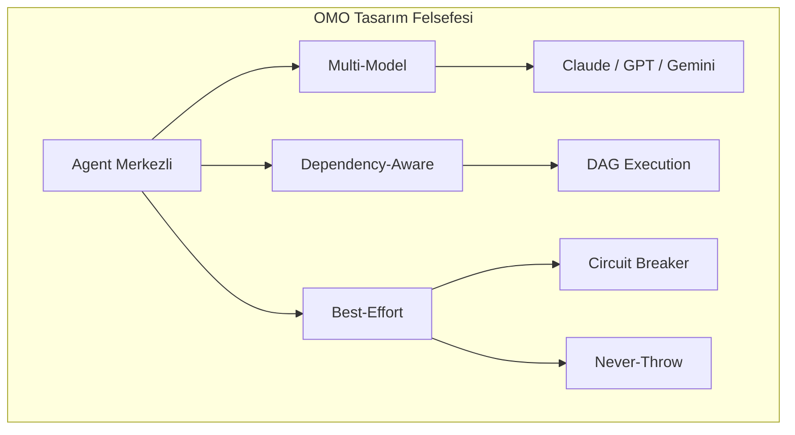
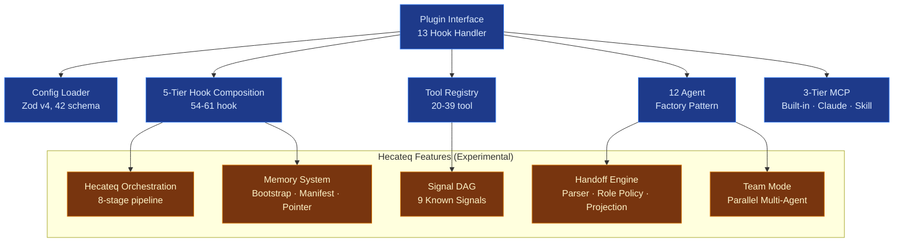
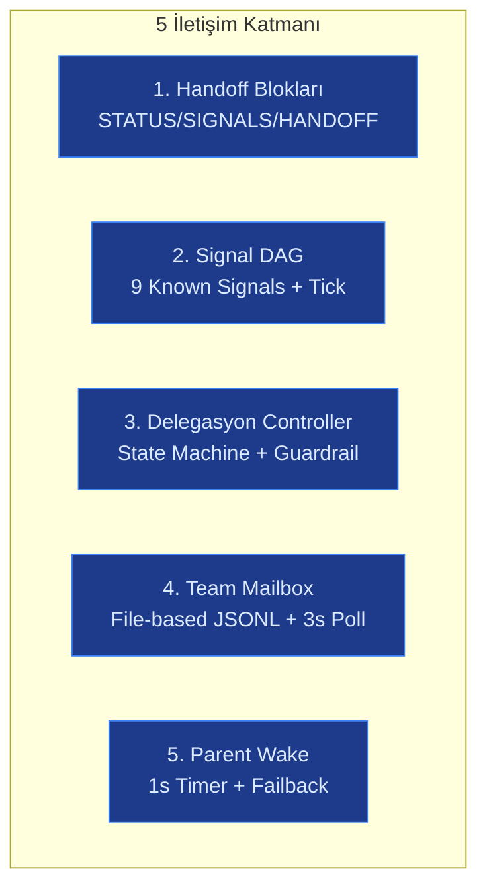
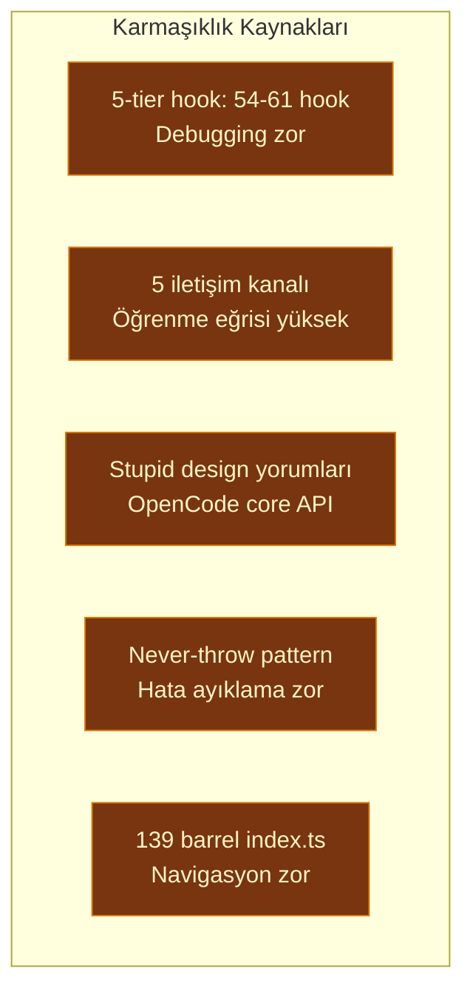

# OMO Agent Sistemi — Kapsamlı Mimari Değerlendirme Raporu

> **Soru:** "OMO agent sistemi mimari olarak ne sunuyor, ne kadar olgun, ne zaman uygun, ne zaman uygun değil?"
>
> **Hedef Kitle:** Multi-agent sistem mimarları, teknisyenler ve karar vericiler
> **Dil:** Türkçe (teknik terimler İngilizce)
> **Tarih:** 2026-06-21
> **Sürüm:** OMO Hecateq fork `0.1.0-beta.8` (upstream v4.2.0 tabanlı)

---

## İçindekiler

1. [Yönetici Özeti](#1-yonetici-ozeti-executive-summary)
2. [OMO'nun Mimari Kimliği](#2-omonun-mimari-kimligi)
3. [Agent Mimarisi](#3-agent-mimarisi)
4. [Tool Sistemi](#4-tool-sistemi)
5. [İletişim Altyapısı (5 Katman)](#5-iletisim-altyapisi-5-katman)
6. [Özellik Modülleri](#6-ozellik-modulleri-26-feature)
7. [Mimari Güçlü Yönler](#7-mimari-guclu-yonler)
8. [Mimari Zayıf Yönler](#8-mimari-zayif-yonler)
9. [Olgunluk Değerlendirmesi](#9-olgunluk-degerlendirmesi)
10. [Uygunluk Değerlendirmesi](#10-uygunluk-degerlendirmesi)
11. [Alternatif Karşılaştırma](#11-alternatif-karsilastirma)
12. [Somut Öneriler](#12-somut-oneriler)
13. [Sonuç ve Tavsiye](#13-sonuc-ve-tavsiye)
14. [Ekler](#14-ekler)

---

## 1. Yönetici Özeti (Executive Summary)

OMO, OpenCode IDE/terminal ortamında çalışan, 12 uzman AI agent'ı 54-61 lifecycle hook ve 20-39 tool ile orchestre eden, **çok-modelli bir agent orchestration plugin'idir**. Sistem, upstream `oh-my-openagent` (YeonGyu Kim, v4.2.0) tabanlı olup Hecateq fork'u olarak `@hecateq/hecateq-openagent` adıyla yayınlanmaktadır.

### Ne Kadar Olgun?

**Genel puan: 6/10 (Beta seviyesinde).** Upstream altyapı (12 agent, tool registry, hook sistemi, MCP 3-tier) **üretimde kanıtlanmış** ve 4 major release görmüştür. Ancak Hecateq eklentileri (orchestration pipeline, memory system, handoff engine) **deneysel** statüdedir, test kapsamı zayıftır ve CI'da 41 adet başarısız test bulunmaktadır.

| Boyut | Puan | Gerekçe |
|-------|------|---------|
| Core altyapı (upstream) | 8/10 | 4 major release, 888+ test, üretimde kanıtlanmış |
| Hecateq eklemeleri | 3/10 | Deneysel, test yok/az, API değişebilir |
| Test kalitesi | 4/10 | 41 fail güven aşındırır, Hecateq feature'ların testi yok |
| Dokümantasyon | 7/10 | Kapsamlı (~395 .md dosya), deneysel işaretli |
| CI/CD | 8/10 | 7 workflow, OIDC publishing, multi-platform |
| Güvenlik | 7/10 | Devralınmış guard'lar, Hecateq safety feature'ları eklendi |
| Topluluk | 3/10 | Tek maintainer fork, upstream'ten ayrılmış |

### En Önemli 3 Mimari Karar ve Etkileri

| Karar | Etki |
|-------|------|
| **5-tier Hook Composition** (54-61 hook) | Aşırı esneklik → yüksek öğrenme eğrisi, debugging zorluğu |
| **Signal DAG + Handoff Blocks** | Agent'lar arası structured iletişim → format coupling riski |
| **Prompt-Async-Gate** | Race condition koruması → 214+ LOC'luk ek karmaşıklık |

### En Kritik 3 Risk

1. **41 başarısız test** — CI'da bloklayıcı değil, üretim güvenini aşındırır
2. **Fork sapması** — Upstream'ten ayrılmış, hata düzeltmeleri manuel birleştirme gerektirir
3. **Hecateq orchestration deneysel** — API değişebilir, test yok, production'a hazır değil

---

## 2. OMO'nun Mimari Kimliği

### 2.1 Hangi Katmanda Bir Sistem?

OMO bir **IDE plugin**'idir. OpenCode runtime'ına eklenen bir eklenti olarak çalışır:

```
OpenCode Host (IDE/Terminal)
  └── Plugin Interface (13 hook handler)
       └── OMO Plugin
            ├── 12 Agent
            ├── 54-61 Hook
            ├── 20-39 Tool
            ├── 3-tier MCP
            └── Hecateq Orchestration (Experimental)
```

**Teknik Künye:**

| Özellik | Değer |
|---------|-------|
| Tür | OpenCode plugin (IDE extension) |
| Runtime | Bun (≥ 1.3.12) |
| Dil | TypeScript strict mode |
| Boyut | ~5,285 `.ts` dosya, ~1.9M LOC (tüm repo) |
| Barrel `index.ts` | 139 adet |
| Test dosyası | ~1,044 `.test.ts` |
| Lisans | SUL-1.0 (Sustainable Use License) |
| Package | `@hecateq/hecateq-openagent` |
| Versiyon | `0.1.0-beta.8` (upstream: v4.2.0) |
| Fork | Hecateq fork, upstream: `code-yeongyu/oh-my-openagent` |

### 2.2 Tasarım Felsefesi

Sistemin temel prensipleri `AGENTS.md` ve `ROADMAP.md` dosyalarında belirtilmiştir:

1. **Agent merkezli çalışma:** İnsan işçi değil, agent işçidir. İnsan sadece başlatır.
2. **Multi-model orchestration:** Claude, GPT, Gemini, Kimi ve diğer sağlayıcılar arasında routing.
3. **Custom-agent-first routing:** Özel agent'lar built-in agent'lardan önce tercih edilir.
4. **Dependency-aware execution:** Task'lar arası bağımlılık DAG ile yönetilir.
5. **Best-effort + circuit breaker:** Asla throw etme, her zaman kurtar.
6. **Two-tier fallback:** Proaktif (model) ve reaktif (runtime) olmak üzere iki ayrı fallback sistemi.
7. **Agent performansı tek metriktir:** Kod okunabilirliğinden önce gelir.



### 2.3 Temel Bileşenler (Hiyerarşi)



| Bileşen | Açıklama | Durum |
|---------|----------|-------|
| Plugin Interface | 13 OpenCode hook handler (config, tool, event, chat, command) | Inherited |
| Config Loader | 42 Zod v4 schema, JSONC multi-level merge (user → project → defaults) | Inherited |
| 5-Tier Hook | Session (24) + ToolGuard (16-17) + Transform (5-7) + Continuation (7) + Skill (2) | Inherited |
| Tool Registry | 20 always-on + 19 conditional tool | Inherited |
| Agent Factory | `createXXXAgent(model)` pattern, 12 agent | Inherited + Hecateq |
| MCP 3-tier | Built-in (5) + Claude Code + Skill-embedded | Inherited |
| Hecateq Features | 16 dosya, ~19.6K LOC | **Experimental** |
| Memory System | 8 dosya, bootstrap/manifest/pointer | **Experimental** |
| Handoff Engine | 6 dosya, ~1,495 LOC | **Experimental** |
| Signal DAG | 3 dosya, ~620 LOC | **Experimental** |
| Team Mode | 60+ dosya, ~14.4K LOC | **Beta** |

---

## 3. Agent Mimarisi

### 3.1 Agent Factory Pattern

OMO, tüm agent'larını **Factory Pattern** ile oluşturur:

```typescript
// src/agents/types.ts
export type AgentFactory = ((model: string) => AgentConfig) & {
  mode: AgentMode; // "primary" | "subagent" | "all"
};

// Kullanım:
export const createSisyphusAgent: AgentFactory = (model: string) => ({
  name: "sisyphus",
  model,
  temperature: 0.1,
  // ...
});
createSisyphusAgent.mode = "primary";
```

**Statik `mode` property'si** sayesinde agent'ın bir instance oluşturmadan hangi modda çalışacağı bilinir. `buildAgent()` fonksiyonu tüm agent'ları `agentSources` registry'sinden toplar ve OpenCode'a kaydeder.

### 3.2 12 Agent Detaylı Listesi

Agent'lar üç kategoride toplanır: **Orchestrator** (primary), **Worker** (primary/subagent), **Specialist** (subagent).

| # | Agent | Source Path | Mode | Default Model | Temp. | Tool Restrictions | Fallback Chain | Purpose |
|---|-------|-------------|------|---------------|-------|-------------------|----------------|---------|
| 1 | **Hecateq God** | `src/agents/builtin-agents/hecateq-orchestrator-agent.ts` | all | Claude | — | Custom-agent-first routing | — | Hecateq workflow orchestrator (custom-agent-first) |
| 2 | **Sisyphus** | `src/agents/sisyphus/` | primary, subagent, all | Claude | 0.1 | No non-GPT (gpt-apply-patch-guard) | Claude → Gemini → Kimi → GLM-5 | Master orchestrator, planning, delegation |
| 3 | **Hephaestus** | `src/agents/hephaestus/` | primary, subagent, all | Claude | 0.1 | OpenAI-only (noHephaestusNonGpt) | Claude → OpenAI-compatible | Implementation, coding, debugging |
| 4 | **Prometheus** | `src/agents/prometheus/` | primary, subagent | Claude | — | **.md ONLY** (prometheus-md-only) | — | Prompt engineering, system prompts |
| 5 | **Atlas** | `src/agents/atlas/` | primary | Claude | 0.1 | Background orchestrator | — | Boulder, ralph loop, background sessions |
| 6 | **Oracle** | `src/agents/oracle.ts` | subagent | Claude-thinking | 0.1 | Read-only, review | — | Architectural review, code quality |
| 7 | **Librarian** | `src/agents/librarian.ts` | subagent | Claude | 0.1 | Read-only, research | → ZAI | Documentation lookup, code examples |
| 8 | **Explore** | `src/agents/explore.ts` | subagent | Claude | 0.1 | Read-only, grep/glob | — | Codebase exploration |
| 9 | **Multimodal-Looker** | `src/agents/multimodal-looker.ts` | subagent | Claude-vision | 0.1 | Visual only | — | Image/PDF/diagram analysis |
| 10 | **Metis** | `src/agents/metis.ts` | subagent | Claude | 0.3 | Read-only | — | Safety, compliance, security audit |
| 11 | **Momus** | `src/agents/momus.ts` | subagent | Claude | 0.1 | Read-only, critique | — | Plan critic, assumption breaker |
| 12 | **Sisyphus-Junior** | `src/agents/sisyphus-junior/` | subagent | Claude | 0.1 | Lightweight | — | Lightweight delegation |

> **Not:** Hecateq God (`hecateq-orchestrator`), upstream'deki 11 agent'a eklenen **12. agent**'dır ve canonical agent ordering'de **ilk sıradadır**.

### 3.3 Tool Restrictions

Agent'ların hangi tool'ları kullanabileceği iki mekanizmayla kontrol edilir:

1. **`gpt-apply-patch-guard`** (`src/agents/gpt-apply-patch-guard.ts`): GPT-native Sisyphus modelleri için apply_patch tool'unu kontrol eder.
2. **`frontier-tool-schema-guard`** (`src/agents/frontier-tool-schema-guard.ts`): Frontier modeller için tool şemasını daraltır.

Enforcement seviyeleri:
- **Config-level:** `agents.<name>.tools` ile allow/block list
- **Prompt-level:** Agent prompt'unda hangi tool'ların kullanılabileceği belirtilir
- **Hook-level:** `tool.execute.before` hook'ları ile runtime'da tool kullanımı engellenir

```typescript
// Örnek: Read-only agent'lar için tool kısıtlaması (tool-restrictions.test.ts)
const restrictedAgentNames = [
  "explore", "librarian", "oracle", "metis",
  "momus", "multimodal-looker", "sisyphus-junior"
];
// Bu agent'lar FILE_WRITE_TOOLS ve TEAM_TOOL_NAMES kullanamaz
```

### 3.4 Dynamic Prompt Builder

Agent prompt'ları **7 fazlı** dinamik bir builder ile oluşturulur (`src/agents/dynamic-agent-prompt-builder.ts`):

1. Core identity (rol tanımı)
2. Policy sections (kurallar)
3. Category skills (kategori bazlı yetenekler)
4. Tool categorization (tool kategorizasyonu)
5. Custom agent summaries (özel agent özetleri)
6. Environment context (ortam bilgisi)
7. Delegation trust prompt (yetki devri)

**Model Adapter Sistemi:** 7 farklı model ailesi için adaptör (Claude, GPT, Gemini, Kimi, GLM, ZAI, DeepSeek) — her adaptör, modelin native formatına uygun prompt yapısı üretir.

---

## 4. Tool Sistemi

### 4.1 Tool Registry

Tool'lar `createToolRegistry()` factory fonksiyonu ile oluşturulur. `ToolsRecord` tipi ile tüm tool'ların tip güvenliği sağlanır. Gating mekanizması config flag'lerine göre tool'ları açar/kapatır.

```typescript
// create-tools.ts mantığı:
const tools: ToolDefinition[] = [];
tools.push(...createAlwaysOnTools());
if (config.hashline_edit) tools.push(createHashlineEditTool());
if (config.team_mode.enabled) tools.push(...createTeamModeTools());
if (config.experimental.task_system) tools.push(...createTaskSystemTools());
```

### 4.2 Always-On Tools (20)

| # | Tool | Source Path | Parametre | Purpose |
|---|------|-------------|-----------|---------|
| 1 | `lsp_goto_definition` | `src/mcp/lsp.ts` | symbol, position | Kod tanımına git |
| 2 | `lsp_find_references` | `src/mcp/lsp.ts` | symbol | Referansları bul |
| 3 | `lsp_symbols` | `src/mcp/lsp.ts` | query | Sembolleri listele |
| 4 | `lsp_diagnostics` | `src/mcp/lsp.ts` | file | Diagnostic al |
| 5 | `lsp_prepare_rename` | `src/mcp/lsp.ts` | symbol | Rename hazırlığı |
| 6 | `lsp_rename` | `src/mcp/lsp.ts` | symbol, newName | Sembol yeniden adlandır |
| 7 | `grep` | `src/tools/grep/` | pattern, include | İçerik arama |
| 8 | `glob` | `src/tools/glob/` | pattern | Dosya arama |
| 9 | `ast_grep_search` | `src/mcp/ast-grep.ts` | pattern, lang | AST desen arama |
| 10 | `ast_grep_replace` | `src/mcp/ast-grep.ts` | pattern, rewrite | AST desen değiştirme |
| 11 | `session_list` | `src/tools/session-manager/` | filters | Oturumları listele |
| 12 | `session_read` | `src/tools/session-manager/` | session_id | Oturum oku |
| 13 | `session_search` | `src/tools/session-manager/` | query | Oturumlarda ara |
| 14 | `session_info` | `src/tools/session-manager/` | session_id | Oturum metadatası |
| 15 | `background_output` | `src/tools/background-task/` | task_id | Arkaplan çıktısı |
| 16 | `background_cancel` | `src/tools/background-task/` | task_id | Arkaplan iptal |
| 17 | `call_omo_agent` | `src/tools/call-omo-agent/` | agent, prompt | Subagent çağır |
| 18 | `task` | `src/tools/delegate-task/` | category, prompt | Kategoriye task ata |
| 19 | `skill` | `src/tools/skill/` | name | Skill yükle |
| 20 | `skill_mcp` | `src/tools/skill-mcp/` | mcp_name | Skill MCP çağır |

### 4.3 Conditional Tools (19)

| Tool | Koşul | Eklenen |
|------|-------|---------|
| `look_at` | `multimodal-looker` disabled değilse | +1 |
| `interactive_bash` | `tmux` binary PATH'te varsa | +1 |
| `edit` (hashline) | `hashline_edit: true` ise | +1 |
| `task_create`, `task_get`, `task_list`, `task_update` | `experimental.task_system` açıksa | +4 |
| `team_*` (12 tool) | `team_mode.enabled: true` ise | +12 |

### 4.4 Hashline Edit

Hashline edit sistemi, her `Read` tool çıktısına `LINE#ID` hash'leri ekler ve `edit` tool'u bu hash'i doğrular:

```
# Hash karakter seti: ZPMQVRWSNKTXJBYH
# Read çıktısında: 142: LINE#ZPMQ const x = 42;
# Edit'te: eski hash doğrulanır, uyuşmazsa reddedilir
```

**11 adımlı pipeline:**
1. Read tool çalışır → her satıra hash eklenir
2. Agent hash'li çıktıyı okur
3. Agent edit kararı verir
4. Hash doğrulanır (stale detection)
5. Hash güncel → edit uygulanır
6. Hash eski → reject + re-read önerisi

### 4.5 MCP 3-Tier Karşılaştırma

| Tier | Kaynak | Yükleyici | Mekanizma | Örnekler | LOC |
|------|--------|-----------|-----------|----------|-----|
| **1. Built-in** | `src/mcp/` | `createBuiltinMcps()` | 3 remote HTTP + 2 local stdio | websearch, context7, grep-app, lsp, ast_grep | 16 dosya |
| **2. Claude Code** | `.mcp.json` (proje + kullanıcı) | `claude-code-mcp-loader` | `${VAR}` env expansion (allowlist) | Kullanıcı tanımlı MCP'ler | — |
| **3. Skill-embedded** | SKILL.md YAML frontmatter | `SkillMcpManager` (per-session) | stdio + HTTP, OAuth 2.0 + PKCE + DCR | Skill içinde gömülü MCP'ler | 11 dosya |

> **Not:** LSP ve AST-grep tool'ları, v4.2.0+ ile built-in MCP'lere taşınmıştır. Eski tool isimleri (`lsp_*`, `ast_grep_*`) MCP namespacing ile korunmaktadır.

### 4.6 Delegate Task Tool

`task()` tool'u, OMO'nun temel delegasyon mekanizmasıdır:

```typescript
// Kullanım: task(category="quick", prompt="...", run_in_background=true)
```

**8 Built-in kategori:**
| Kategori | Model Tercihi | Kullanım |
|----------|---------------|----------|
| `quick` | Claude/GPT-mini | Hızlı, düşük maliyetli |
| `default` | Claude/GPT | Dengeli |
| `deep` | Claude-thinking/GPT-o3 | Karmaşık mantık |
| `ultrabrain` | Claude/GPT-o3 | Maksimum zeka |
| `unspecified-low` | Gemini/Claude-haiku | Düşük bütçe |
| `unspecified-high` | Claude-thinking/GPT-o3 | Yüksek efor |
| `artistry` | Claude/GPT-o3 | Yaratıcı/tasarım |
| `oracle` | Claude-thinking/GPT-o3 | Mimari/review |

**Routing mantığı:** Kategori → model requirement → agent selection. Eğer bir kategori doğrudan bir agent adıyla eşleşirse, o agent'a yönlendirilir.

---

## 5. İletişim Altyapısı (5 Katman)

OMO, agent'lar arası iletişim için **5 farklı kanal** kullanır. Her kanalın belirli bir nişi vardır.



### 5.1 Handoff Blokları

Handoff blokları, agent'lar arası structured iletişimin temelidir. 6 dosyada ~1,495 LOC ile uygulanmıştır:

```
STATUS: [DONE | IN_PROGRESS | BLOCKED]
SIGNALS_EMITTED: [{"signal":"schema_ready","payload":{}}]
HANDOFF: [return_to_caller | agent-name]
BLOCKERS: ["Database migration required"]
CONFIDENCE: 0.85
CHANGED_FILES: ["src/foo.ts"]
QUALITY_NOTES: ["All tests pass"]
NEXT_RECOMMENDED_AGENT: "hephaestus"
```

**Bileşenler:**
| Dosya | LOC | Görev |
|-------|-----|-------|
| `handoff-parser.ts` | 364 | Blokları parse et |
| `handoff-role-policy.ts` | 258 | Rol tutarlılığını doğrula |
| `handoff-boulder-projection.ts` | 114 | Boulder state'e yansıt |
| `handoff-context-injection.ts` | 75 | Context'e inject et |
| **Toplam** | **811** | |

**8 Guardrail:**
1. STATUS format doğrulama
2. SIGNALS_EMITTED JSON geçerlilik
3. HANDOFF hedef geçerlilik
4. BLOCKERS array format
5. CONFIDENCE range (0-1)
6. CHANGED_FILES path güvenliği
7. Role policy consistency
8. Cycle detection

### 5.2 Signal DAG

Signal DAG, agent'lar arası event-driven iletişim sağlar:

**9 KNOWN_SIGNALS:**
| Sinyal | Emitted By | Consumed By |
|--------|-----------|-------------|
| `schema_ready` | database-specialist | backend-developer |
| `backend_ready` | nodejs-backend-developer | frontend |
| `ui_specs_ready` | design-translator | frontend |
| `auth_audit_passed` | security-architect | backend |
| `infra_provisioned` | devops | all |
| `pipeline_secured` | devsecops | devops |
| `tests_passed` | qa-test-engineer | release-manager |
| `performance_verified` | performance-specialist | release-manager |
| `compliance_signed` | compliance-specialist | all |

**signalDagTick() akışı:**
1. Gelen sonuçlardan sinyalleri tüket
2. Yeni sinyalleri kaydet
3. Bekleyen task'ları sinyallere göre ilerlet
4. DAG mutasyonlarını uygula (ekleme/silme/yeniden yazma)
5. Cycle detection çalıştır

### 5.3 Delegasyon Controller

Pending delegation state machine:

```
IDLE → PENDING → DISPATCHED → COMPLETED
                         → FAILED → RETRY → ...
```

**8 Guardrail:** max depth (3), max fan-out (10), max iterations (10), cycle detection, timeout, rate limit, circuit breaker, dead letter.

### 5.4 Team Mode Mailbox

File-based JSONL mesajlaşma sistemi:
- **Depolama:** `~/.omo/teams/{name}/mailbox/`
- **Poll aralığı:** 3s
- **Payload limit:** 32KB
- **Inbox limit:** 256KB
- **Format:** Her satır bir JSON mesajı

### 5.5 Parent Wake

Background agent'ların parent session'ı uyandırma mekanizması:
- **LOC:** 830 (`parent-wake-notifier.ts`)
- **Timer:** 1s unref'd interval
- **consecutiveFailures:** max 10 (circuit breaker)
- **Kullanım:** Background task tamamlandığında parent'ı bilgilendir

### 5.6 Senkronizasyon Primitifleri

OMO'da race condition'ları önlemek için 5 farklı senkronizasyon mekanizması:

| Primitif | LOC | Kullanım |
|----------|-----|----------|
| **Prompt-Async-Gate** | 214 (shared) + 51 (hooks/shared) | Session.promptAsync çağrılarını tekleştirir |
| **Atomic File Locks** | — | File-based state yazmalarını korur |
| **Cycle Detection** | 3 yerde | Signal DAG, handoff, delegation'da |
| **Reservation + Dedup** | prompt-async-gate içinde | Aynı mesajın 2 kere gönderilmesini engeller |
| **Circuit Breaker** | background-agent | consecutiveFailure > 10 → pause 60s |

> **⚠️ Kritik Uyarı (AGENTS.md'den):** "Internal message injection is dangerous." OpenCode'un `session.promptAsync` API'si, çağrı döndükten sonra mesajın kabul edildiğini garanti etmez. Bu nedenle tüm internal mesaj gönderimleri **Prompt-Async-Gate** üzerinden yapılmalıdır. Gate dışı ham `session.promptAsync` çağrıları **yasaktır** ve meta-audit testleri ile denetlenir.

---

## 6. Özellik Modülleri (26+ Feature)

OMO 25 feature modülüne sahiptir. Bunlar `src/features/` altında organize edilmiştir.

### 6.1 Feature Modülleri

```
src/features/
├── hecateq-orchestration/     # ~19.6K LOC, 50 dosya (Deneysel)
├── team-mode/                 # ~14.4K LOC, 60+ dosya (Beta)
├── background-agent/          # ~28K LOC, 30 dosya
├── skill-mcp-manager/         # ~11 dosya
├── opencode-skill-loader/     # ~25 dosya
├── builtin-skills/            # Built-in skill'ler
├── builtin-commands/          # Built-in komutlar
├── claude-code-*/             # Claude Code uyumluluk (4 modül)
├── mcp-oauth/                 # OAuth 2.0 + PKCE + DCR
├── boulder-state/             # Work tracking
├── context-injector/          # Context injection
├── dashboard/                 # Dashboard
├── ... (diğer)
└── tmux-subagent/             # Tmux integration
```

### 6.2 Hecateq Orchestration Pipeline

8 aşamalı pipeline:


| Aşama | Dosya | LOC | Açıklama |
|-------|-------|-----|----------|
| Prompt Intake | `prompt-intake.ts` | — | Intent, risk, task size sınıflandırması |
| Task Decompose | `task-decomposer.ts` | — | Prompt'u atomic task node'larına böl |
| Dependency Graph | `dependency-planner.ts` | — | DAG + cycle detection + validation |
| Agent Select | `agent-selector.ts` | 200+ | Agent-task matching |
| Execution Plan | `execution-planner.ts` | 200+ | Task ordering |
| Quality Gates | `quality-gate-runner.ts` | — | typecheck/lint/test/build/doctor |
| Repair Loop | `repair-loop-controller.ts` | — | max_repair_attempts (default: 2) |
| Final Report | `final-report-generator.ts` | — | Özet rapor |

**Toplam LOC:** ~19.6K (50 dosya)

**Task Graph Validation (Commit `1f6e910e66`):**
- Empty graph detection
- Duplicate node check
- Missing dependency detection
- Circular dependency prevention (DFS cycle detection)

### 6.3 Konfigürasyon

42 schema dosyası (`src/config/schema/`) ile Zod v4 doğrulaması:

```
config/schema/
├── agent-definitions.ts
├── agent-names.ts
├── agent-overrides.ts
├── babysitting.ts
├── background-task.ts
├── browser-automation.ts
├── categories.ts
├── claude-code.ts
├── commands.ts
├── comment-checker.ts
├── default-mode.ts
├── dynamic-context-pruning.ts
├── experimental.ts
├── fallback-models.ts
├── git-env-prefix.ts
├── git-master.ts
├── hecateq.ts              # 9 sub-config
├── hooks.ts
├── i18n.ts
├── keyword-detector.ts
├── model-capabilities.ts
├── notification.ts
├── oh-my-opencode-config.ts
├── openclaw.ts
├── ralph-loop.ts
├── runtime-fallback.ts
├── sisyphus-agent.ts
├── sisyphus.ts
├── skills.ts
├── start-work.ts
├── team-mode.ts
├── tmux.ts
├── websearch.ts
├── internal/               # Internal schema'lar
```

**Hecateq Config (9 sub-config):**
```jsonc
{
  "hecateq": {
    "enabled": true,
    "context_injection": { /* mode, max chars, etc. */ },
    "agent_index": { /* runtime discovery */ },
    "memory_bootstrap": { /* auto-create memory */ },
    "doctor": { /* 11 check categories */ },
    "git_checkpoint": { /* suggest/auto_clean_only/off */ },
    "dependency_graph": { /* off/warn/enforce */ },
    "orchestration": { /* 12+ field */ },
    "auto_spawn": { /* 10+ field */ },
    "delegation_chain": { /* max_depth, max_fan_out */ }
  }
}
```

**Multi-level merge:**
```
Project-level (.opencode/oh-my-openagent.jsonc)  ← en yakın
    ↓ merged onto
User-level (~/.config/opencode/oh-my-openagent.jsonc)
    ↓ falls back to
Defaults (Zod safeParse)
```

### 6.4 CLI

```
Hecateq OpenAgent CLI
├── Base (Inherited)
│   ├── install        # Interactive setup
│   ├── run            # Session launcher
│   ├── doctor         # 4-category health check
│   ├── version
│   ├── get-local-version
│   ├── mcp-oauth      # login/logout/status
│   ├── refresh-model-capabilities
│   ├── boulder        # State inspector
│   └── dashboard      # Dashboard
├── Hecateq (Experimental)
│   ├── hecateq plan   # Analyze + plan only
│   ├── hecateq run    # Auto-execute (low-risk)
│   ├── hecateq resume # Recovery
│   ├── hecateq status # State summary
│   └── hecateq doctor # 11-category diagnostics
└── Diğer
    ├── setup (alias)
    └── dashboard serve
```

### 6.5 Doctor

**4 base check (inherited):** System, Config, Tools, Models
**11 Hecateq check (experimental):**

| Kategori | Ne Kontrol Eder |
|----------|----------------|
| Agent Registration | Hecateq agent kaydı |
| Configuration | Hecateq config geçerliliği |
| Orchestration | Orchestration state bütünlüğü |
| Safety Hooks | Gerekli güvenlik hook'ları |
| Handoff State | Handoff dosya bütünlüğü |
| Role Policy | Handoff rol tutarlılığı |
| Project Memory | Memory dosya varlığı/kalitesi |
| Memory Manifest | Manifest freshness + pointer |
| Custom Agents | Custom agent konfigürasyonu |
| Agent Index | Agent index freshness |
| Artifacts | Artifact dizin yapısı |

---

## 7. Mimari Güçlü Yönler

### 7.1 Olgun Altyapı

| Gösterge | Değer | Açıklama |
|----------|-------|----------|
| Upstream release | v4.2.0 | 4 major release, üretimde kanıtlanmış |
| Test dosyası | ~1,044 `.test.ts` | Kapsamlı test suite'i |
| Meta-audit test | 2 adet | TS compiler API ile arş. invariant denetimi |
| Platform binary | 4 (Hecateq) / 11 (upstream) | Native binary dağıtımı |
| CI workflow | 7 adet | test, publish, lint, deploy |
| Barrel index | 139 adet | Modül sınırları net |
| TypeScript | strict mode | Tip güvenliği |
| 200 LOC limit | Genelde uygulanır | Dosya boyutu disiplini |

### 7.2 İletişim Tasarımı

5 farklı iletişim kanalı, her birinin net bir nişi var:

| Kanal | Güçlü Yön | Kullanım |
|-------|-----------|----------|
| Handoff Blocks | Structured, parse edilebilir | Agent → agent |
| Signal DAG | Event-driven, cycle detection | Pipeline orchestration |
| Delegation Controller | State machine, 8 guardrail | Task yönetimi |
| Team Mailbox | File-based, basit, çalışır | Parallel agent iletişimi |
| Parent Wake | Timer-based, circuit breaker | Background wake |

### 7.3 Operasyonel Olgunluk

- **Process cleanup:** Background agent hatalarında force-exit yok, log-only
- **Logger rotation:** 50MB cap, `.1`/`.2` backup
- **Doctor checks:** 4 base + 11 Hecateq
- **Multi-platform:** Linux x64, Windows x64 (baseline + AVX2)
- **OIDC publishing:** Trusted publishing, 24 package doğrulama
- **Postinstall:** Platform binary + OpenCode version kontrolü
- **Auto-update:** npm version check

### 7.4 Kod Kalitesi

- **TypeScript strict mode** — `as any`, `@ts-ignore` yasak
- **Factory pattern** — Her şey `createXXX()` ile oluşturulur
- **Kebab-case** — Dosya/dizin adlandırma
- **Barrel index.ts** — Modül sınırları, 120+ dosya
- **Given/when/then** — Test stili, Arrange-Act-Assert yasak
- **`test-discipline.md`** — `setTimeout(resolve, N)` yasak (zaman SUT değilse)
- **No catch-all files** — `utils.ts`, `helpers.ts` yasak

---

## 8. Mimari Zayıf Yönler

### 8.1 Test Sorunları (KRİTİK)

```bash
# CI test sonuçları
4,239 pass / 41 fail / 0 skip
```

| Sorun | Etki | Detay |
|-------|------|-------|
| **41 başarısız test** | Güven aşındırır | CI'da non-blocking signal olarak işaretlenmiş |
| **7 Hecateq-specific fail** | Fork kalitesi | handoff, mock-module, agent names |
| **Hecateq feature'ların testi yok** | Deneysel risk | Orchestration pipeline'ının sıfır özel testi |
| **CI non-blocking** | False sense of security | Test failure'ları CI'ı bloklamaz |

### 8.2 Bilinen Engelleyiciler

| ID | Sorun | Statü |
|----|-------|-------|
| BLOCKER-4 | Delegate-task early-failure-fallback | **Resolved** in v4.2.1 |
| #4225 | Custom LSP konfigürasyonu sessizce ignore ediliyor | **Open** (upstream) |
| — | Prompt-Async-Gate 214+51 = 265 LOC | 200 LOC limitini aşıyor |
| — | parent-wake-notifier.ts 830 LOC | 200 LOC limitini aşıyor |
| — | Hecateq orchestration 19.6K LOC | Büyük, test yok |

### 8.3 Karmaşıklık



> **AGENTS.md'den alıntı:** "OpenCode'un stupid tasarımı nedeniyle plugin `session.prompt` API'si ile ana sistemi bozabilir."

### 8.4 Vendor Dependency

| Bağımlılık | Risk |
|------------|------|
| **OpenCode runtime** | Plugin, OpenCode'a sıkı bağımlı. Cursor/Windsurf'te çalışmaz |
| **Bun runtime** | Sadece Bun (≥ 1.3.12). npm/yarn/pnpm yasak |
| **TypeScript 6.x** | Experimental TypeScript sürümü |
| **Platform binary** | Hecateq sadece 4 platform (upstream 11) |
| **OpenCode SDK** | `@opencode-ai/sdk` tip ve API bağımlılığı |

### 8.5 Fork Sapması

| Sorun | Etki |
|-------|------|
| Upstream'ten ayrılmış kod | `oh-my-opencode` ↔ `@hecateq/hecateq-openagent` |
| Hata düzeltmeleri manuel | Upstream fix'leri elle birleştirilmeli |
| Tek maintainer | Hecateq fork, tek kişi tarafından yönetiliyor |
| Multi-harness refactor devam ediyor | ROADMAP.md: "HOLD THE FUCK UP. THIS ENTIRE GODDAMN CODEBASE IS BEING RIPPED APART" |

---

## 9. Olgunluk Değerlendirmesi

### 9.1 Puan Tablosu

| Boyut | Puan | Açıklama |
|-------|------|----------|
| **Core Altyapı** (upstream) | **8/10** | 4 major release, üretimde kanıtlanmış |
| **Hecateq Eklemeleri** | **3/10** | Deneysel, test yok, API değişebilir |
| **Test Kalitesi** | **4/10** | 41 fail güven aşındırır |
| **Dokümantasyon** | **7/10** | Kapsamlı (~395 .md), deneysel işaretli |
| **CI/CD** | **8/10** | 7 workflow, OIDC, multi-platform |
| **Güvenlik** | **7/10** | Devralınmış + Hecateq safety feature'ları |
| **Topluluk** | **3/10** | Tek maintainer fork |
| **Entegrasyon Kolaylığı** | **5/10** | OpenCode'a sıkı bağımlı |
| **Performans** | **7/10** | Background task, FIFO queue, 5/key concurrency |
| **Hata Yönetimi** | **6/10** | Never-throw pattern, circuit breaker, fallback |

### 9.2 Genel Puan: 6/10 (Beta)

**Ağırlıklı Ortalama Hesaplama:**
```
Upstream altyapı (8/10 × 0.7) = 5.6
Hecateq eklentileri (3/10 × 0.3) = 0.9
Toplam: 6.5/10 → Yuvarlama: 6/10
```

### 9.3 Geçişe Hazırlık

| Senaryo | Puan | Açıklama |
|---------|------|----------|
| Bireysel geliştirici (CLI/IDE) | **7/10** | OpenCode ile sorunsuz çalışır |
| Takım/CI/CD | **5/10** | 41 fail, fork sapması risk |
| Hecateq orchestration | **2/10** | Deneysel, kullanmayın |
| Sadece tool/hook modülleri | **7/10** | Seçerek alınabilir |
| Production deployment | **4/10** | Sadece upstream modülleri güvenli |

---

## 10. Uygunluk Değerlendirmesi

### 10.1 Ne Zaman UYGUN?

- ✅ **OpenCode kullanıyorsanız** — Doğrudan plugin olarak entegre olur
- ✅ **Çok-agent'lı workflow ihtiyacı** — 12 agent, structured handoff
- ✅ **Dependency-aware execution** — DAG ile task sıralama
- ✅ **Custom agent registry** — AGENTS.md ile yeni agent tanımlama
- ✅ **Multi-model routing** — Claude + GPT + Gemini + ... arasında geçiş
- ✅ **Background parallel agent** — explore/librarian async çalıştırma
- ✅ **LSP + AST-grep** — IDE seviyesinde kod analizi
- ✅ **Skill sistemi** — YAML frontmatter ile özelleştirilebilir skill'ler

### 10.2 Ne Zaman UYGUN DEĞİL?

- ❌ **OpenCode kullanmıyorsanız** — Cursor, Windsurf, VS Code native'de çalışmaz
- ❌ **Basit tek-agent task'lar** — Aşırı karmaşık, overhead yüksek
- ❌ **Farklı runtime** — Python, Java, .NET projeleri için uygun değil
- ❌ **Standalone multi-agent framework** — IDE plugin'i, bağımsız değil
- ❌ **Production Hecateq orchestration** — Deneysel, API değişebilir
- ❌ **Handoff format bağımsızlığı** — OMO'nun handoff formatına bağımlısınız
- ❌ **Takım/Güvenlik/Skalabilite** — Fork, tek maintainer

### 10.3 Entegrasyon Zorlukları

| Zorluk | Seviye | Açıklama |
|--------|--------|----------|
| Handoff format coupling | Yüksek | HANDOFF/STATUS/SIGNALS formatı OMO'ya özgü |
| Tool registry bağımlılığı | Orta | Tool'lar OMO registry'sine kayıtlı |
| Memory manifest schema v2 | Orta | Schema sürümüne bağımlı |
| Prompt-Async-Gate | Yüksek | Race condition koruması OMO'ya özgü |
| File path conventions | Düşük | `.omo/`, `.opencode/` dizin yapısı |
| Config format (JSONC) | Düşük | Zod v4 doğrulaması |

---

## 11. Alternatif Karşılaştırma

| Boyut | OMO | LangGraph | CrewAI | AutoGen | Semantic Kernel |
|-------|-----|-----------|--------|---------|-----------------|
| **Tür** | IDE Plugin | Framework | Framework | Framework | Framework |
| **Multi-Agent** | ✅ 12 | ✅ State graph | ✅ Sequential | ✅ | ✅ |
| **Handoff** | ✅ Structured blocks | ✅ State-based | ⚠️ Sıralı | ✅ | ✅ |
| **Signal DAG** | ✅ 9 sinyal | ❌ (built-in graph) | ❌ | ❌ | ⚠️ |
| **Tool System** | ✅ 20-39 | ✅ | ✅ | ✅ | ✅ |
| **Runtime** | Bun | Python | Python | Python | .NET/Python |
| **Açık Kaynak** | ✅ SUL-1.0 | ✅ MIT | ✅ MIT | ✅ MIT | ✅ MIT |
| **Olgunluk** | 6/10 (Beta) | 8/10 | 7/10 | 7/10 | 8/10 |
| **OpenCode Plugin** | ✅ Native | ❌ | ❌ | ❌ | ❌ |
| **IDE Entegrasyonu** | ✅ Full | ⚠️ Kısmi | ❌ | ❌ | ❌ |
| **Öğrenme Eğrisi** | Yüksek | Yüksek | Düşük | Orta | Orta |
| **Topluluk** | Küçük | Büyük | Büyük | Büyük | Çok Büyük |

### OMO'ya Göre Avantajlar

| Sisteme Göre | OMO'nun Üstün Olduğu | OMO'nun Zayıf Olduğu |
|--------------|----------------------|----------------------|
| **LangGraph** | IDE entegrasyonu, handoff formatı, tool zenginliği | Python desteği, topluluk, olgunluk |
| **CrewAI** | Signal DAG, dependency-aware, multi-model | Basitlik, API stabilitesi |
| **AutoGen** | Custom agent, MCP 3-tier, OpenCode native | Microsoft desteği, araştırma odaklı |
| **Semantic Kernel** | Plugin mimarisi, hook sistemi | Enterprise desteği, .NET entegrasyonu |

---

## 12. Somut Öneriler

### 12.1 Tipik Bir Multi-Agent Sisteme Entegre Etmek İsterseniz

```typescript
// Önerilen: Sadece belirli modülleri al
import { HandoffParser } from "./handoff-parser";
import { SignalDagExecutor } from "./signal-dag-executor";
// OpenCode bağımlılığını soyutla (interface layer)
interface AgentHost {
  prompt(message: string): Promise<string>;
  readFile(path: string): Promise<string>;
  writeFile(path: string, content: string): Promise<void>;
}
```

**Adımlar:**
1. Sadece `handoff-parser` + `signal-dag-executor` modüllerini al (~1.5K LOC)
2. OpenCode bağımlılığını `AgentHost` interface ile soyutla
3. Handoff formatını kendi standardına çevir (format adapter)
4. Prompt-Async-Gate yerine kendi race condition çözümünü yaz

### 12.2 Eğer Geçiş Yapmak İsterseniz

1. Mevcut agent'ları OMO factory pattern'ine (`createXXXAgent`) dönüştür
2. Handoff formatına migrate et (`STATUS` / `SIGNALS_EMITTED` / `HANDOFF`)
3. Memory manifest initialize et (`memory.json` schema v2)
4. Quality gate'leri kendi CI'ına bağla (typecheck → lint → test → build)

### 12.3 Eğer Birlikte Çalıştırmak İsterseniz

```
┌─────────────────────────────────────┐
│       Kendi Sistemi (Basit)         │
│  Routing: basit task → kendi sistem │
│           karmaşık → OMO            │
└──────────────────┬──────────────────┘
                   │ Shared Memory Contract
┌──────────────────▼──────────────────┐
│       OMO (Gelişmiş)                │
│  12 agent + DAG + Handoff + Signal  │
└─────────────────────────────────────┘
```

### 12.4 Hecateq'i Kullanmak İçin

- **Hecateq orchestration'a güvenme** — Deneysel, açık state işaretle
- **Custom agent'ları tercih et** — Built-in agent'lar yerine AGENTS.md ile kendi agent'larını tanımla
- **Memory manifest'i initialize et** — Bootstrap çalıştır, dosyaları oluştur
- **Quality gate'leri dry-run modunda çalıştır** — Non-blocking
- **Hecateq doctor'u düzenli çalıştır** — 11 kategori sağlık kontrolü

---

## 13. Sonuç ve Tavsiye

### 13.1 Tek Satır Özet

> **OMO, OpenCode üzerinde çok-agent'lı workflow için olgun bir framework'tür; Hecateq eklentileri deneyseldir, üretimde dikkatli kullanılmalıdır.**

### 13.2 Mimari Puan: 6/10

| Bileşen | Puan |
|---------|------|
| Upstream (oh-my-openagent v4.2.0) | 8/10 |
| Hecateq eklentileri | 3/10 |
| **Ağırlıklı Toplam** | **6/10** |

### 13.3 Tavsiye

| Durum | Tavsiye |
|-------|---------|
| **OpenCode üzerinde çalışıyorsanız** | **Kesinlikle değerlendirin.** 12 agent, 54 hook, 20-39 tool ile güçlü bir ekosistem |
| **Çok-agent'lı workflow istiyorsanız** | **Hecateq God + custom agent pattern** ile başlayın. Team Mode'u beta olarak değerlendirin |
| **Production kullanım** | **Hecateq orchestration'ı BEKLETİN.** Upstream modüllerini (tool, hook, MCP) kullanabilirsiniz |
| **Sadece tool/hook ihtiyacı** | Sadece o modülleri alın. Handoff, Signal DAG, Memory gerekmez |
| **Farklı IDE/Runtime** | **Tercih etmeyin.** OpenCode/Bun bağımlılığı çok sıkı |
| **Araştırma/Öğrenme** | **İnceleyin.** Multi-agent orchestration için 5 farklı iletişim deseni öğretici |

### 13.4 Son Söz

OMO, OpenCode ekosisteminde multi-agent orchestration için **en kapsamlı çözüm**dür. Ancak bir IDE plugin'i olarak doğduğu için bağımsız bir framework kadar esnek değildir. Hecateq fork'u, upstream'in olgun altyapısını alıp üzerine deneysel orchestration feature'ları eklemiştir. Eğer OpenCode kullanıyorsanız ve çok-agent'lı workflow'a ihtiyacınız varsa, upstream altyapısını temel alarak Hecateq feature'larını dikkatle değerlendirmeniz önerilir.

> **ROADMAP.md'den alıntı:** "HOLD THE FUCK UP. THIS ENTIRE GODDAMN CODEBASE IS BEING RIPPED APART AND REBUILT RIGHT NOW." — Bu refactor tamamlanana kadar Hecateq feature'larına tam güvenmeyin.

---

## 14. Ekler

### 14.1 Terimler Sözlüğü

| Terim | Açıklama |
|-------|----------|
| **Handoff** | Agent'lar arası structured iletişim bloğu (STATUS/SIGNALS/HANDOFF) |
| **Signal DAG** | Event-driven task akışı için Directed Acyclic Graph |
| **Custom Agent** | AGENTS.md ile tanımlanan kullanıcı agent'ı |
| **Lifecycle Hook** | OpenCode olaylarına takılan fonksiyon (session, tool, message) |
| **MCP** | Model Context Protocol — model'lerin tool/veri kaynağına erişim protokolü |
| **Team Mode** | Paralel multi-agent koordinasyon modu (OFF default) |
| **Boulder** | Session'lar arası work tracking state machine |
| **Hashline Edit** | LINE#ID content hash ile doğrulanmış edit mekanizması |
| **Prompt-Async-Gate** | `session.promptAsync` çağrılarını tekleştiren gate |
| **Ralph Loop** | Self-referential development loop |
| **IntentGate** | Kullanıcı intent'ini sınıflandıran keyword detector |
| **OpenClaw** | Harici entegrasyon (Discord/Telegram/HTTP) |
| **Agent Factory** | `createXXXAgent(model) → AgentConfig` pattern'i |
| **Barrel Index** | Modül sınırlarını belirleyen `index.ts` dosyası |
| **Lifecycle Hook Tier** | Hook'ların kategorize edildiği 5 seviye (Session/ToolGuard/Transform/Continuation/Skill) |

### 14.2 Karar Matrisi

| Feature | OpenCode Var mı? | IDE Bağımsız | Test Var mı? | Production Ready | Öneri |
|---------|-----------------|--------------|--------------|------------------|-------|
| 12 Agent | ✅ | ❌ | ✅ (upstream) | ✅ | Kullan |
| 54-61 Hook | ✅ | ❌ | ✅ | ✅ | Kullan |
| 20-39 Tool | ✅ | ❌ | ✅ | ✅ | Kullan |
| MCP 3-tier | ✅ | ❌ | ⚠️ | ✅ | Kullan |
| Hashline Edit | ✅ | ❌ | ✅ | ✅ | Kullan |
| Team Mode | ✅ | ❌ | ⚠️ | ⚠️ | Beta, dikkatle |
| Background Agent | ✅ | ❌ | ✅ | ✅ | Kullan |
| Handoff Engine | ✅ | ❌ | ⚠️ | ❌ | Deneysel |
| Signal DAG | ✅ | ❌ | ⚠️ | ❌ | Deneysel |
| Hecateq Orchestration | ✅ | ❌ | ❌ | ❌ | BEKLET |
| Memory System | ✅ | ❌ | ❌ | ❌ | Deneysel |
| Routing Policy | ✅ | ❌ | ⚠️ | ❌ | Deneysel |

### 14.3 Açık Sorular

Bu raporu okurken kendinize sormanız gereken sorular:

1. **Hangi runtime kullanıyorsunuz?** Bun ↔ OpenCode → OMO uygun. Python/Java → alternatif bakın.
2. **Hangi IDE kullanıyorsunuz?** OpenCode → OMO doğrudan. Cursor/Windsurf → uygun değil.
3. **Hangi model sağlayıcıları kullanıyorsunuz?** Claude/GPT/Gemini → OMO multi-model. Tek model → aşırı karmaşık.
4. **Multi-agent ihtiyacı gerçekten var mı?** 2+ agent parallel → OMO değerlendirin. Tek agent → gereksiz.
5. **Production mu development mı?** Development → OMO uygun. Production → upstream modülleri güvenli, Hecateq feature'ları değil.
6. **Takım mı bireysel mi?** Bireysel → OMO ideal. Takım → fork riski, upstream'i tercih edin.
7. **Kaç platformda çalışacak?** Linux/Mac → OMO uygun. Windows → kısmi destek.

### 14.4 Kaynak Kod Referansları

| Referans | Dosya | LOC |
|----------|-------|-----|
| Plugin entry | `src/testing/create-plugin-module.ts` | 182 |
| Plugin interface | `src/plugin-interface.ts` | — |
| Agent types | `src/agents/types.ts` | — |
| Agent builder | `src/agents/agent-builder.ts` | — |
| Tool registry | `src/create-tools.ts` | — |
| Hook composition | `src/create-hooks.ts` | — |
| Config schema (hecateq) | `src/config/schema/hecateq.ts` | — |
| Handoff parser | `src/features/hecateq-orchestration/handoff-parser.ts` | 364 |
| Signal DAG executor | `src/features/hecateq-orchestration/signal-dag-executor.ts` | 472 |
| Signal registry | `src/features/hecateq-orchestration/signal-registry.ts` | 148 |
| Delegation controller | `src/features/hecateq-orchestration/delegation-controller.ts` | 356 |
| Prompt async gate | `src/shared/prompt-async-gate.ts` | 214 |
| Parent wake notifier | `src/features/background-agent/parent-wake-notifier.ts` | 830 |
| Dynamic prompt builder | `src/agents/dynamic-agent-prompt-builder.ts` | — |
| Tool restrictions | `src/agents/tool-restrictions.test.ts` | — |
| Known issues | `docs/reference/known-issues.md` | — |
| Roadmap | `ROADMAP.md` | — |
| AGENTS.md (dev reference) | `AGENTS.md` | 295 |

---

> **Raporu Hazırlayan:** Technical Writer & Documentarian Agent
>
> **Veri Kaynakları:**
> - AGENTS.md (Plugin Developer Reference, 295 satır)
> - README.md (User Documentation, 1,355 satır)
> - ROADMAP.md (Architecture Direction)
> - docs/reference/known-issues.md
> - docs/hecateq/ (14 doküman)
> - Kaynak kod (`src/` altındaki tüm dizinler)
> - Test sonuçları (bun test output)
> - CI workflow konfigürasyonları
>
> **Son Güncelleme:** 2026-06-21
> **OMO Sürümü:** `0.1.0-beta.8` (upstream v4.2.0 fork)
