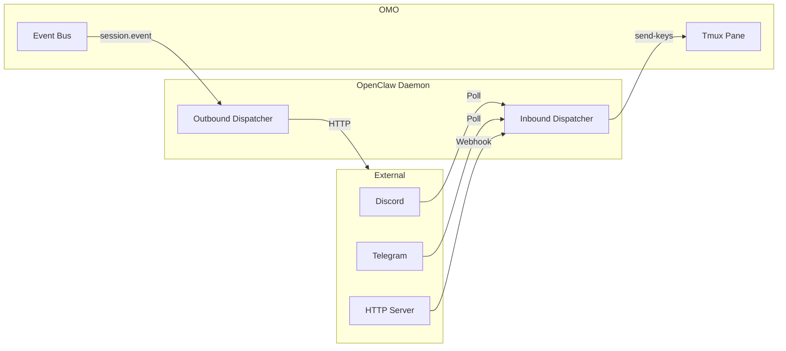
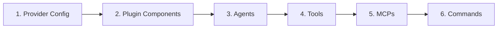
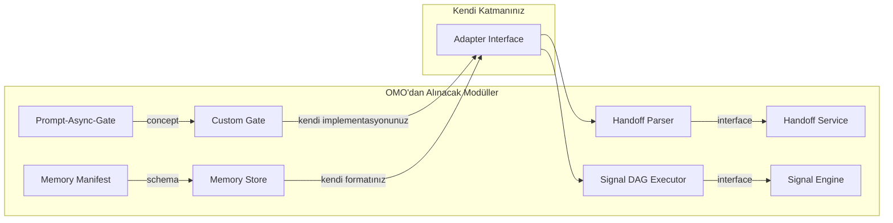
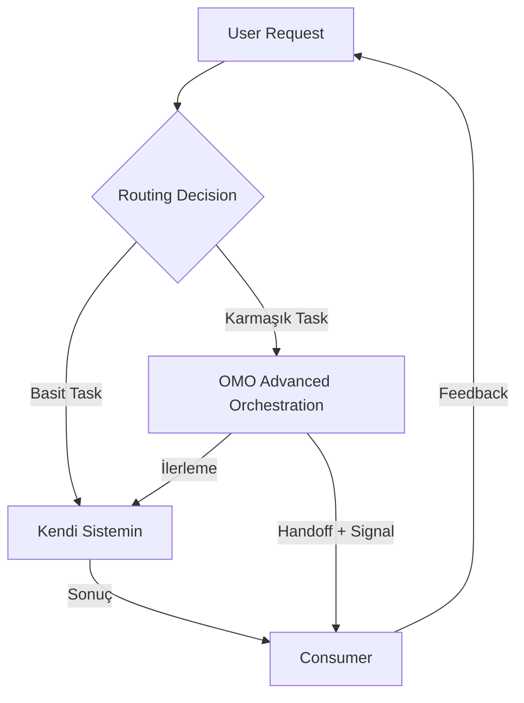

# OMO (oh-my-openagent-hecateq) — Genel Mimari Değerlendirme ve Multi-Agent Sistemlere Uygunluk Raporu

> **Rapor Tarihi:** 2026-06-21
> **Hedef Kitle:** Sistem mimarları, teknik liderler, multi-agent sistem tasarımcıları
> **Kapsam:** oh-my-openagent-hecateq (OMO) fork'unun mimari analizi
> **Sürüm:** v4.2.0 (commit `39aadbf9f`, branch `dev`)

---

## İçindekiler

1. [Yönetici Özeti](#1-yönetici-özeti)
2. [OMO'nun Mimari Kimliği](#2-omonun-mimari-kimliği)
3. [Mimari Güçlü Yönler](#3-mimari-güçlü-yönler)
4. [Mimari Zayıf Yönler](#4-mimari-zayıf-yönler)
5. [Entegrasyon Patern'leri](#5-entegrasyon-paternleri)
6. [Alternatif Karşılaştırma](#6-alternatif-karşılaştırma)
7. [Somut Öneriler](#7-somut-öneriler)
8. [Sonuç ve Tavsiye](#8-sonuç-ve-tavsiye)
9. [Ekler](#9-ekler)

---

## 1. Yönetici Özeti

**OMO (oh-my-openagent-hecateq)**, bir OpenCode plugin'i olarak başlayıp 12 agent, 61 lifecycle hook, 39 tool ve 3-katmanlı MCP sistemiyle **kendi başına bir multi-agent orchestration framework'üne dönüşmüş** bir sistemdir. Tasarım felsefesi, dependency-aware task yürütme, model-fallback zincirleri, signal DAG'leri ve structured handoff protokolü ile **LangGraph, CrewAI, AutoGen** gibi bilinen multi-agent framework'lerle aynı hizada durmaktadır.

**"Multi-agent sisteme uygun mu?"** sorusunun cevabı:

| Durum | Cevap |
|-------|-------|
| **OpenCode kullanıyorsanız** | ✅ **Evet — doğrudan entegre edilebilir** |
| **Bağımsız bir multi-agent framework arıyorsanız** | ⚠️ **Koşullu evet — OpenCode bağımlılığını soyutlamanız gerekir** |
| **Farklı IDE/runtime kullanıyorsanız** | ❌ **Hayır — Bun + OpenCode runtime zorunlu** |
| **Sadece tek-agent workflow ihtiyacınız varsa** | ❌ **Hayır — overkill** |

### En Önemli 3 Mimari Karar

| # | Karar | Etki |
|---|-------|------|
| 1 | **OpenCode Plugin Mimarisi** | Tüm sistem OpenCode'un `session.prompt` API'si üzerine inşa edilmiş. Bu, hızlı prototipleme sağlarken vendor lock-in yaratıyor. Plugin dışı kullanım neredeyse imkansız. |
| 2 | **5-Tier Hook Composition** | 54-61 hook'un 5 kategoride (Session, ToolGuard, Transform, Continuation, Skill) organize edilmesi, sistemi son derece extensible kılıyor. Ancak hook'lar arası etkileşimlerin debug'u zorlaşıyor. |
| 3 | **Structured Handoff + Signal DAG** | Agent'lar arası iletişimde `STATUS/SIGNALS_EMITTED/HANDOFF` blokları ve signal dependency graph'i, deterministik ve sıralanabilir multi-agent workflow sağlıyor. Bu, çoğu framework'ten daha olgun bir yaklaşım. |

---

## 2. OMO'nun Mimari Kimliği

### 2.1 Hangi Katmanda Bir Sistem?

OMO bir **katmanlı plugin** olarak tanımlanabilir:

```
OpenCode Runtime (Katman 0)
  └── OMO Plugin (Katman 1) 
        ├── OpenCode Hook Handlers (13 adet)
        ├── Agent Layer (12 agent factory)
        ├── Hook Layer (5-tier, 54-61 hook)
        ├── Tool Layer (20-39 tool)
        ├── MCP Layer (3-tier: built-in + Claude Code + skill-embedded)
        ├── Orchestration Layer (Hecateq pipeline)
        └── Communication Layer (handoff + signal + delegation + mailbox)
```

**Teknik Yığın:**

| Bileşen | Değer |
|---------|-------|
| Runtime | Bun >= 1.3.12 |
| Dil | TypeScript (strict mode, ESNext) |
| Framework | OpenCode plugin API (`@opencode-ai/plugin`) |
| Config | JSONC + Zod v4 validation |
| State | File-based (atomic write) |
| Build | `bun build` (ESM) + `tsc --emitDeclarationOnly` |
| Test | `bun:test` (single process) |
| LOC Toplam | ~313k (2167 TypeScript dosyası) |
| Monorepo | 9 workspace package + web |

**Fork Yapısı:**

```
upstream (code-yeongyu/oh-my-opencode)
    └── hecateq/hecateq-openagent (fork)
          └── Hecateq OpenAgent (OMO)
                ├── Tüm upstream özellikleri (korunmuş)
                ├── Hecateq God agent (custom-agent-first routing)
                ├── Hecateq orchestration pipeline
                ├── Hecateq memory system (manifest + pointer)
                ├── Hecateq CLI commands (plan/run/resume/status/doctor)
                ├── Hecateq-specific doctor checks (11 kategori)
                └── Multi-harness adapter (OpenCode + Codex + PI)
```

### 2.2 Tasarım Felsefesi

OMO'nun tasarım felsefesi, **üç ana paradigmaya** dayanır:

1. **Plugin-as-Framework**: OpenCode'un plugin API'sini bir framework gibi kullanmak. OpenCode'un sağladığı 13 hook handler'ı ile tüm agent orchestration'ını plugin seviyesinde yönetmek.
2. **Fail-Fast yerine Best-Effort**: Hataları sessizce loglayıp devam etmek (never-throw pattern). Circuit breaker ile aşırı hata durumunda devre dışı kalmak.
3. **Convention-over-Configuration**: Dosya yapısı, handoff formatı, memory manifest gibi konularda standartlar belirleyip bunları kod seviyesinde zorlamak (static audit testleri ile).

Bu felsefenin somut prensipleri:

1. **Multi-Model Orchestration**: Her agent farklı bir model kullanabilir (Claude, GPT, Gemini, Kimi). Model seçimi agent bazında yapılandırılır. (`src/shared/model-requirements.ts`)

2. **Custom-Agent-First Routing**: Hecateq God agent, custom agent'ları built-in agent'lardan önce değerlendirir. Custom agent sayısı 12 ile sınırlıdır, açıklamalar 120 karaktere kırpılır. (`src/agents/hecateq-orchestrator/agent.ts:677`)

3. **Dependency-Aware Execution**: Task'ler arası bağımlılıklar otomatik çözülür. Dependency graph'te cycle tespiti 3 ayrı noktada yapılır. (`src/features/hecateq-orchestration/dependency-planner.ts`, `src/features/hecateq-orchestration/cycle-detector.ts`, `src/features/hecateq-orchestration/delegation-executor.ts`)

4. **Two-Tier Fallback**: Proactive (model-fallback, `chat.params` hook'unda) + Reactive (runtime-fallback, `session.error` event'inde). İki sistem bağımsız çalışır. (`src/hooks/model-fallback/`, `src/hooks/runtime-fallback/`)

5. **Best-Effort + Circuit Breaker**: Hata durumunda sistem graceful degradation ile çalışmaya devam eder. Circuit breaker pattern'i ile aşırı yük koruması sağlanır.

6. **Never-Throw**: Hata fırlatmak yerine loglama + graceful handling tercih edilir. Bu, production stability'si için iyi olsa da debug'u zorlaştırır.

### 2.3 Temel Bileşenler

#### 2.3.1 Agent Factory Pattern

Her agent bir `createXXXAgent()` factory fonksiyonu ile oluşturulur. Agent'lar `mode: "primary" | "subagent" | "all"` ile sınıflandırılır.

```typescript
// Örnek: src/agents/sisyphus/index.ts
export function createSisyphusAgent(config: AgentConfig): Agent {
  return {
    name: "sisyphus",
    mode: "primary",
    model: config.model ?? "claude-sonnet-4-20250514",
    tools: [...baseTools, ...sisyphusTools],
    systemPrompt: buildSisyphusPrompt(config),
    // ...
  }
}
```

**12 Agent ve Görevleri:**

| Agent | Tipi | Görev | Model Varsayılanı |
|-------|------|-------|-------------------|
| Hecateq God | primary | Custom-agent-first orchestrator | Claude Sonnet 4 |
| Sisyphus | primary | Task decomposition, delegation | Claude Sonnet 4 |
| Hephaestus | primary | Implementation, debugging | GPT-5 |
| Prometheus | primary | Prompt engineering | Claude Sonnet 4 |
| Oracle | primary | Architecture review | Claude Sonnet 4 |
| Atlas | subagent | Background orchestration | Claude Sonnet 4 |
| Librarian | subagent | Documentation research | Claude Haiku |
| Explore | subagent | Codebase exploration | Claude Haiku |
| Metis | subagent | Safety, compliance | Claude Sonnet 4 |
| Momus | subagent | Critique, edge cases | Claude Sonnet 4 |
| Multimodal-Looker | subagent | Visual analysis | GPT-5 Vision |
| Sisyphus-Junior | subagent | Lightweight delegation | Claude Haiku |

#### 2.3.2 5-Tier Hook Composition

Hook'lar 5 kategoride organize edilir:

```
Session Hooks (24 adet)
  ├── session.created → session setup, keyword detection
  ├── session.idle → timeout handling
  ├── session.error → runtime fallback tetikleme
  └── session.deleted → cleanup

ToolGuard Hooks (16 adet + 1 team-mode)
  ├── tool.execute.before → write guard, label truncator, rules injector
  └── tool.execute.after → output truncator, comment checker, hashline enhancer

Transform Hooks (5 adet + 2 team-mode)
  ├── chat.messages.transform → context injection, thinking validation
  └── chat.system.transform → system message transforms

Continuation Hooks (7 adet)
  ├── experimental.session.compacting
  └── experimental.compaction.autocontinue

Skill Hooks (2 adet)
  ├── Subagent skill reminders
  └── Auto-slash commands
```

**Kaynak:** `src/plugin/hooks/create-core-hooks.ts`, `src/plugin/hooks/create-continuation-hooks.ts`, `src/plugin/hooks/create-skill-hooks.ts`

#### 2.3.3 Tool Registry

```typescript
// 20 her zaman açık + 19 koşullu = 39 tool
const alwaysOn = [
  "lsp_goto_definition", "lsp_find_references", "lsp_symbols",
  "lsp_diagnostics", "lsp_prepare_rename", "lsp_rename",
  "grep", "glob", "ast_grep_search", "ast_grep_replace",
  "session_list", "session_read", "session_search", "session_info",
  "background_output", "background_cancel",
  "call_omo_agent", "task", "skill", "skill_mcp"
]

const conditional = {
  look_at: "multimodal-looker disabled mı?",
  interactive_bash: "tmux binary var mı?",
  task_create/get/list/update: "experimental.task_system açık mı?",
  edit: "hashline_edit açık mı?",
  team_* (12 tool): "team_mode.enabled açık mı?"
}
```

**Kaynak:** `src/plugin/tool-registry.ts`

### 2.3.4 Plugin / Hook İç İşleyişi

OMO'nun plugin katmanı, 3 ana bileşenden oluşur:

```
src/create-managers.ts (172 LOC)
  ├── TmuxSessionManager — Interactive bash tool için tmux pane yönetimi
  ├── BackgroundManager — Concurrent task queue yönetimi
  │     ├── 5 concurrent per model key
  │     ├── FIFO queue
  │     └── Per-key slot management
  ├── SkillMcpManager — Skill-embedded MCP'lerin per-session yönetimi
  │     └── Client'lar sessionID:skillName:serverName key'leriyle izole edilir
  └── ConfigHandler — Config pipeline'ı yönetimi

src/create-hooks.ts (98 LOC)
  └── 5-tier composition:
        ├── createCoreHooks() → Session (24) + ToolGuard (16) + Transform (5)
        ├── createContinuationHooks() → 7 continuation hook
        └── createSkillHooks() → 2 skill hook

src/create-tools.ts (53 LOC)
  └── SkillContext + AvailableCategories + ToolRegistry
        ├── SkillContext → Aktif skill'lerin context'i
        ├── AvailableCategories → Kullanılabilir kategori listesi
        └── ToolRegistry → Tüm tool'ların kayıtlı olduğu registry
```

**Önemli Tasarım Kararı:** Hook'lar 5 kategoride organize edilmesine rağmen, **hepsi aynı `CreatedHooks` interface'inde** birleştirilir. Bu, hook'lar arası bağımlılığı gizler ve hangi hook'un hangi kategoride olduğunu anlamayı zorlaştırır.

**13 OpenCode Hook Handler'ının Dağılımı:**

```
Handler                                        Dosya                 Kategori
────────────────────────────────────────────────────────────────────────────
config                                         plugin-interface.ts   6-phase pipeline
tool                                           plugin-interface.ts   20-39 tool registry
chat.message                                   plugin-interface.ts   First-message, keyword detection
chat.params                                    plugin-interface.ts   Anthropic effort, model fallback
chat.headers                                   plugin-interface.ts   Copilot header injection
command.execute.before                         plugin-interface.ts   Pre-command guards
event                                          plugin-interface.ts   Session lifecycle, OpenClaw dispatch
tool.execute.before                            plugin-interface.ts   Pre-tool guards
tool.execute.after                             plugin-interface.ts   Post-tool hooks
experimental.chat.messages.transform            plugin-interface.ts   Context injection, thinking validation
experimental.chat.system.transform              plugin-interface.ts   System transforms
experimental.session.compacting                create-plugin-module.ts   Context preservation
experimental.compaction.autocontinue            create-plugin-module.ts   Auto-resume after compaction
```

### 2.3.5 OpenClaw — External Entegrasyon Sistemi

OpenClaw (`src/openclaw/`), OMO'nun **harici sistemlerle çift yönlü iletişimini** sağlayan bir alt sistemdir. Hem outbound (OMO → external) hem inbound (external → OMO) iletişimi destekler.

**Outbound Dispatchers:**

| Kanal | Mekanizma | Kullanım |
|-------|-----------|----------|
| HTTP | Outbound HTTP call | Session event'lerini HTTP endpoint'ine gönderme |
| Shell | Shell command | Session event'lerinde shell script çalıştırma |
| Discord | Discord bot (inbound) | Session event'lerini Discord kanalına yayınlama |
| Telegram | Telegram bot (inbound) | Session event'lerini Telegram'a gönderme |

**Inbound Daemon:**

OpenClaw, bir **arka plan daemon'u** olarak çalışır:



**Inbound akışı:** External mesaj → OpenClaw daemon → `tmux send-keys` → OMO session'ına mesaj enjekte edilir.

Bu, OMO'yu **harici chat uygulamalarından kontrol etmeyi** mümkün kılar (Discord'dan komut gönderme, Telegram'dan kod isteme vb.).

### 2.3.6 Hashline Edit Sistemi

OMO'nun **en yenilikçi özelliklerinden biri**, hashline tabanlı edit doğrulama sistemidir. Her `Read` tool çıktısı, içeriğin hash'i ile etiketlenir:

```
// Read tool output örneği:
 1: LINE#ID=ZPMQVR
 2: import { useState } from "react";
 3: 
 4: LINE#ID=WSNKTX
 5: export function Counter() {
 6:   const [count, setCount] = useState(0);
```

Her satır, özel bir karakter setinden (`ZPMQVRWSNKTXJBYH`) oluşan **LINE#ID** etiketi alır. `hashline_edit` tool'u, düzenleme yapmadan önce hash'i doğrular:

```typescript
// hashline_edit aşamaları:
// 1. Kullanıcının düzenlemek istediği satırların hash'ini al
// 2. Mevcut dosyadaki satırların hash'ini hesapla
// 3. Hash'ler eşleşiyorsa → düzenlemeye izin ver
// 4. Hash'ler eşleşmiyorsa → "STALE HASH" hatası döndür
```

Bu sistem, **stale context** problemini çözer: Bir agent eski bir okuma sonucuna dayanarak düzenleme yapmak istediğinde, aradan geçen sürede dosya değişmişse hash eşleşmez ve düzenleme reddedilir.

**Kaynak:** `packages/hashline-core/`, `src/tools/hashline-edit/`

### 2.3.7 IntentGate (Keyword Detector)

IntentGate (`src/features/keyword-detector/`), kullanıcının mesajındaki intent'i sınıflandıran bir **keyword tabanlı classifier**'dır:

| Intent | Keyword | Aksiyon |
|--------|---------|---------|
| **ultrawork** / **ulw** | "ultrawork", "maximum precision" | Ultrawork modu aktifleştir |
| **search** | "search", "find", "araştır" | Search modu |
| **analyze** | "analyze", "analiz et", "incele" | Deep analysis modu |
| **team** | "team", "ekip", "takım" | Team mode davetiyesi |

IntentGate, `chat.message` hook'unda tetiklenir ve intent'e göre mode-specific prompt'lar inject eder:

```typescript
// keyword-detector çalışma prensibi:
// 1. Kullanıcı mesajını al
// 2. Keyword listesi ile eşleştir
// 3. Intent bulunursa → ilgili prompt'u system message'a ekle
// 4. Intent bulunamazsa → varsayılan davranış
```

Bu sistem sayesinde, kullanıcının **niyeti otomatik olarak algılanır** ve uygun çalışma modu aktifleştirilir. Kullanıcının manuel olarak `/ultrawork` yazmasına gerek kalmaz.

### 2.3.8 MCP 3-Tier

| Tier | Kaynak | Yükleme | Sayı |
|------|--------|---------|------|
| 1. Built-in | `src/mcp/` | `createBuiltinMcps()` | 5 (3 remote HTTP + 2 local stdio) |
| 2. Claude Code | `.mcp.json` (proje + user) | `claude-code-mcp-loader` | Değişken |
| 3. Skill-embedded | SKILL.md YAML frontmatter | `SkillMcpManager` (per-session) | Değişken, OAuth 2.0 + PKCE |

**Tier 1 Detayı (Built-in MCP'ler):**

| MCP | Tip | Port | Açıklama |
|-----|-----|------|----------|
| `websearch` | Remote HTTP | Dynamic | Web arama (Tavily/Exa) |
| `grep-app` | Remote HTTP | Dynamic | GitHub kod arama (grep.app) |
| `context7` | Remote HTTP | Dynamic | Library dokümantasyon sorgulama |
| `lsp` | Local stdio | Dynamic | Dil sunucusu protokolü (goto def, find refs, symbols, diagnostics, rename) |
| `ast_grep` | Local stdio | Dynamic | AST pattern matching ve replace |

**Tier 2 Detayı (Claude Code MCP'ler):**

- `.mcp.json` dosyası proje kökünde veya user config'de
- `${VAR}` environment variable expansion (allowlist ile güvenlik)
- `mcp_env_allowlist` ile hangi env var'larının MCP'lere geçeceği kontrol edilir

**Tier 3 Detayı (Skill-Embedded MCP'ler):**

- SKILL.md YAML frontmatter'ında tanımlanır
- `SkillMcpManager` per-session client yönetimi yapar
- Client'lar `${sessionID}:${skillName}:${serverName}` ile izole edilir
- OAuth 2.0 + PKCE + DCR (Dynamic Client Registration) desteği

```yaml
# SKILL.md YAML frontmatter örneği
mcp_servers:
  my-api:
    type: stdio
    command: node
    args: ["server.js"]
    oauth:
      authorization_url: https://auth.example.com/authorize
      token_url: https://auth.example.com/token
      scopes: ["read", "write"]
```

#### 2.3.5 Memory Manifest

```
.opencode/state/memory/
├── active-context.md      (181 satır) — Aktif session durumu
├── risk-profile.md        (55 satır)  — Risk takibi
├── agent-routing.md       (359B)      — Agent routing kuralları
├── decisions.jsonl        — Structured karar geçmişi
├── decisions.md           — Karar dokümantasyonu
├── incidents.md           (1.8K)      — Incident logları
├── conventions.md         (391B)      — Proje convention'ları
├── glossary.md            (1.2K)      — Terimler sözlüğü
├── environment.md         (912B)      — Ortam ayarları
└── open-questions.md      (385B)      — Açık sorular
```

**Schema v2** ile birlikte tüm state objeleri versiyonlanır. (`packages/boulder-state/src/types.ts:79`)

#### 2.3.6 Handoff Protocol

```markdown
STATUS: [DONE | IN_PROGRESS | BLOCKED]
SIGNALS_EMITTED: [{"signal":"<name>","payload":{}}]
HANDOFF: [return_to_caller | return_to_parent_for_routing | <agent-id>]
```

**V2 Extension Fields:** `CONFIDENCE`, `CHANGED_FILES`, `QUALITY_NOTES`, `NEXT_RECOMMENDED_AGENT`

**Kaynak:** `docs/hecateq/handoff-protocol-signals.md:267`, `src/features/hecateq-orchestration/handoff-parser.ts`

#### 2.3.7 Config Migration Pipeline

OMO'nun config sistemi, **6 aşamalı bir pipeline** ile çalışır:



**Config Kaynakları (yakından uzağa):**

```
1. Project config:    <project>/.opencode/oh-my-openagent.jsonc    (en yüksek öncelik)
2. Walked configs:    <pwd up to $HOME>/.opencode/oh-my-opencode.json[c]
3. User config:       ~/.config/opencode/oh-my-openagent.jsonc
4. Defaults:          Zod safeParse ile doldurulan varsayılanlar
```

**Merge Stratejisi:**

| Alan | Strateji | Örnek |
|------|----------|-------|
| `agents`, `categories`, `claude_code` | Deep merge (prototype-safe) | İki config'deki agent'lar birleşir |
| `disabled_*` arrays | Set union (concat + dedupe) | İki config'de de devre dışı bırakılanlar toplanır |
| Diğer tüm alanlar | Override (son değer kazanır) | `team_mode.enabled` = true override eder |
| `mcp_env_allowlist` | **Sadece user config** | Güvenlik için walked config'ler ekleme yapamaz |

**Migration:** `migrateConfigFile()` legacy key'leri yeniden yazar (idempotent). `_migrations` tracking ile hangi migration'ların uygulandığı takip edilir. Her migration öncesi timestamped backup alınır.

**Kaynak:** `src/plugin-config.ts:459`, `src/plugin-handlers/config-pipeline.ts`

### 2.3.8 Signal DAG

**9 Kanonik Sinyal:**

| Sinyal | Emit Eden Agent | Dependency |
|--------|----------------|------------|
| `schema_ready` | database-specialist | — |
| `backend_ready` | nodejs-backend-developer | schema_ready |
| `ui_specs_ready` | design-translator | — |
| `auth_audit_passed` | security-architect | backend_ready |
| `infra_provisioned` | coolify-devops-specialist | — |
| `pipeline_secured` | devsecops-pipeline-architect | infra_provisioned |
| `tests_passed` | qa-test-engineer | backend_ready, ui_specs_ready |
| `performance_verified` | performance-specialist | backend_ready |
| `compliance_signed` | compliance-specialist | tests_passed |

**Kaynak:** `src/features/hecateq-orchestration/signal-registry.ts:148`

---

## 3. Mimari Güçlü Yönler

### 3.1 İletişim Altyapısı

OMO, agent'lar arası iletişim için **5 farklı kanal** sunar:

```mermaid
graph TD
    subgraph "Agent Communication Channels"
        H[Handoff Block] -->|STATUS/SIGNALS/HANDOFF| P[Parser]
        S[Signal DAG] -->|Emit + Consume| R[Registry]
        D[Delegation] -->|task()| E[Executor]
        M[Mailbox] -->|Team Mode| B[Message Queue]
        W[Parent Wake] -->|Background| N[Notifier]
    end
    P -->|Routing Decision| RT[Runtime]
    R -->|Dependency Check| DP[Dependency Planner]
    E -->|Subagent Session| SS[Subagent]
    B -->|Broadcast| TM[Team Members]
    N -->|Prompt Dispatch| PG[Prompt-Async-Gate]
```

**Structured Handoff Blokları** (`src/features/hecateq-orchestration/handoff-parser.ts`):
- Regex-based parser ile agent output'larından handoff metadata'sı çıkarılır
- `handoff-role-policy.ts` ile hedef agent'ın yetkisi doğrulanır
- `runtime-handoff-service.ts` ile runtime'da işlenir

**Signal DAG ile Dependency Çözümü** (`src/features/hecateq-orchestration/signal-dag-executor.ts`):
- Her sinyalin hangi agent'lar tarafından emit edileceği tanımlı
- Sinyal dependency'leri sayesinde task'ler sıralanabilir
- Cycle detection (DFS) ile sonsuz döngü önlenir

**Prompt-Async-Gate** (`src/shared/prompt-async-gate.ts:214`):
- Race condition koruması: per-session reservation sistemi
- `dispatchInternalPrompt({ mode: "async" | "sync" })` ile güvenli prompt dispatch
- Raw `session.promptAsync` çağrıları static audit testi ile engellenir
- `prompt-async-route-audit.test.ts:463` ile tüm route'lar otomatik taranır

### 3.2 Concurrency Yönetimi

| Mekanizma | Limit | Lokasyon |
|-----------|-------|----------|
| Background agent | 5 concurrent per `${providerID}/${modelID}` key | `src/features/background-agent/` |
| Team mode | 4 parallel, 8 max members | `src/features/team-mode/` |
| Wave-based execution | Dependency graph'e göre paralel wave | `src/features/hecateq-orchestration/dependency-planner.ts` |
| Atomic file locks | Per-file rename-based atomicity | `src/shared/write-file-atomically.ts:41` |
| Cycle detection | DFS ile 3 noktada | `cycle-detector.ts`, `dependency-planner.ts`, `delegation-executor.ts` |
| Circuit breaker | Runtime hata yönetimi | `src/hooks/runtime-fallback/` |

**Background Agent Concurrency Model:**

```typescript
// src/features/background-agent/ (587 LOC - ParentWakeNotifier)
const concurrencyKey = `${providerID}/${modelID}`;
const maxConcurrent = config.background_task.modelConcurrency ?? 5;
// FIFO queue + per-key slot management
```

### 3.3 Dependency Graph ve Cycle Detection Mimarisi

OMO'nun en güçlü yanlarından biri, **3 ayrı noktada** cycle detection yapmasıdır. Bu, multi-agent sistemlerde sık karşılaşılan sonsuz döngü problemine karşı sağlam bir savunma sağlar.

#### 3.3.1 Cycle Detection #1: Delegasyon Graph'i

**Lokasyon:** `src/features/hecateq-orchestration/cycle-detector.ts:118`

```typescript
// DFS-based cycle detection for delegation graph
class DelegationCycleDetector {
  wouldCreateCycle(from: string, to: string, graph: Map<string, Set<string>>): boolean {
    // 1. Geçici edge ekle
    // 2. DFS ile cycle kontrolü
    // 3. Cycle varsa → path ile birlikte raporla
    // 4. Cycle yoksa → edge'i kalıcı yap
  }
}
```

Bu detector, agent A'nın agent B'ye delegation yapmasının **cycle oluşturup oluşturmayacağını** önceden kontrol eder. Örneğin, Sisyphus → Hephaestus → Sisyphus döngüsü engellenir.

#### 3.3.2 Cycle Detection #2: Task Dependency Graph'i

**Lokasyon:** `src/features/hecateq-orchestration/dependency-planner.ts`

```typescript
// buildDependencyPlan() → Task'ler arası bağımlılıkları çözer
// Circular dependency tespiti:
// Task A → Task B → Task C → Task A → BLOCKED
// Hata mesajı: "Circular dependency detected: A → B → C → A"
```

Task decomposer'dan gelen task'ler arasında circular dependency varsa, bu detector devreye girer ve **pipeline'ı bloklar**. Geliştiriciye cycle'ın tam path'ini gösterir.

#### 3.3.3 Cycle Detection #3: Routing Depth Limit

**Lokasyon:** `src/features/hecateq-orchestration/delegation-executor.ts`

```typescript
// Runtime'da routing depth kontrolü
const MAX_ROUTING_DEPTH = 10; // AGENTS.md'de belirtilmiş

function consumeHandoffAndRecordRouting(handoff: HandoffBlock, depth: number): void {
  if (depth > MAX_ROUTING_DEPTH) {
    throw new Error(`Routing depth limit exceeded (${depth} > ${MAX_ROUTING_DEPTH})`);
  }
  // ...
}
```

Bu, **runtime'da son savunma hattıdır**. İlk iki detector'ın kaçırdığı durumlarda (örneğin, dinamik routing kararları) devreye girer.

#### 3.3.4 3'lü Savunma Hattının Avantajları

| Katman | Lokasyon | Ne Zaman? | Nasıl? |
|--------|----------|-----------|--------|
| 1. Design-time | cycle-detector.ts | Agent registration | DFS ile graph analizi |
| 2. Plan-time | dependency-planner.ts | Task decomposition | Dependency graph analizi |
| 3. Runtime | delegation-executor.ts | Delegation execution | Depth counter |

Bu 3'lü yapı, cycle'ların **hiçbir aşamada** sisteme sızmasını engeller. Çoğu multi-agent framework'te (CrewAI, AutoGen) bu seviyede bir cycle detection yoktur.

### 3.4 State Yönetimi

**File-Based Persistence:**

```
State Storage:
├── ~/.omo/teams/{name}/                    # Team mode state
│   ├── config.json                          # Team spec
│   ├── state.json                           # Runtime state
│   ├── mailbox/                             # Messages
│   ├── tasklist.jsonl                       # Tasks
│   └── worktrees/                           # Per-member git worktrees
├── .opencode/state/memory/                  # Memory manifest
│   ├── active-context.md
│   ├── decisions.jsonl
│   └── ...
├── .omo/                                    # Legacy workspace (migration target)
│   ├── notepads/
│   ├── rules/
│   └── run-continuation/
└── /tmp/oh-my-opencode.log                  # Logger (50 MB cap, .1/.2 backups)
```

**Atomic Write Mekanizması** (`src/shared/write-file-atomically.ts:41`):

```typescript
export function writeFileAtomically(
  filePath: string,
  content: string,
  deps?: { fsyncSync?: typeof fsyncSync }
): void {
  // 1. Write to .tmp file
  // 2. fsync
  // 3. rename (atomic on POSIX)
  // 4. Windows permission error handling
}
```

**Schema v2 Manifest** (`packages/boulder-state/src/types.ts:79`):

```typescript
export interface BoulderState {
  schema_version?: 2    // Only v2 supported
  works: BoulderWorkState[]
  // ...
}
```

### 3.4 Statik Analiz ve Audit Mekanizmaları

OMO'nun en dikkat çekici güçlü yanlarından biri, **compile-time'da** architectural invariant'ları yakalayan statik audit testleridir. Bu testler, TS Compiler API'sini kullanarak tüm codebase'i tarar ve yasak pattern'leri otomatik olarak tespit eder.

#### 3.4.1 Prompt-Async-Route-Audit (463 LOC)

Bu test (`src/shared/prompt-async-route-audit.test.ts:463`), **raw `session.promptAsync` çağrılarını** tüm codebase'de tarar:

```typescript
// Test TS Compiler API ile tüm kaynak dosyalarını parse eder
// Her `session.promptAsync` / `session.prompt` çağrısını yakalar
// Sadece prompt-async-gate.ts içindeki çağrılara izin verir
// Diğer tüm dosyalardaki çağrılar → TEST FAILS

// Audit edilen route'lar:
// - background completion wakes
// - fallback retries
// - team mailbox live delivery
// - recovery continuations
// - CLI run resumes
// - Claude Code hook injections
// - sync/background subagent prompts
```

Bu test sayesinde, **yeni bir özellik ekleyen geliştiricinin yanlışlıkla raw promptAsync çağırması** engellenir. Bu, race condition kaynaklı hataları **compile-time'da** önleyen ender bir yaklaşımdır.

#### 3.4.2 Mock-Module-Lifecycle-Audit (228 LOC)

Bu test (`src/shared/mock-module-lifecycle-audit.test.ts:228`), her `mock.module()` çağrısının karşılığında bir `mock.restore()` veya `beforeEach` cleanup'i olduğunu doğrular:

```typescript
// Audit edilen pattern:
// mock.module(...) → cleanup gerekli
// mock.module(...) without restore → TEST FAILS

// Bu sayede:
// - Test'ler arası contamination önlenir
// - Cross-test side effect'ler yakalanır
// - Global mock state leak'leri engellenir
```

#### 3.4.3 Zauc-Mocks Pattern

9 adet `zauc-mocks-*` dizini, `bun:test` discovery sırasında alfabetik sıranın doğru olması için özel olarak adlandırılmıştır:

```
src/hooks/zauc-mocks-bg/
src/hooks/zauc-mocks-cache/
src/hooks/zauc-mocks-hook/
src/hooks/zauc-mocks-ws/
src/mcp/zauc-mocks-mcp-index/
src/shared/zauc-mocks-migrate-legacy-plugin/
src/tools/delegate-task/zauc-mocks-subagent-resolver/
src/tools/skill/zauc-mocks-skill-tools/
```

Bu dizinler aslında hook/tool değil, **`mock.module()` setup'larıdır**. `zauc-` ön eki, bunların test discovery sırasında tüketici testlerinden önce yüklenmesini sağlamak için bir **sort-order hack**'idir.

### 3.5 Test Disiplini

OMO'nun test yaklaşımı alışılmadık derecede olgundur:

**Static Audit Testleri:**

| Test Dosyası | LOC | Ne Yapar? |
|-------------|-----|-----------|
| `src/shared/prompt-async-route-audit.test.ts` | 463 | TS Compiler API ile tüm codebase'i tarar, raw `session.promptAsync` çağrılarını yakalar |
| `src/shared/mock-module-lifecycle-audit.test.ts` | 228 | Her `mock.module()` çağrısının cleanup ile eşleştiğini doğrular |

**Test Disiplini Kuralları** (`.omo/rules/test-discipline.md:68`):

```
1. Tüm testler tek process'te çalışmalı (bun test)
2. setTimeout(resolve, N) / await sleep(N) YASAK (time SUT değilse)
3. Event testleri subscribe-first pattern ile yazılmalı
4. Prompt testleri behavior assert etmeli, wording değil
5. beforeEach ile state reset zorunlu
6. Arrange-Act-Assert yorumları YASAK → given/when/then kullan
```

**Test Dağılımı:** ~100 `.test.ts` dosyası, co-located pattern (test dosyası kaynak kodun yanında)

**Comment Checker** (`src/hooks/comment-checker/hook.ts:169`):
- Her `write`/`edit` tool çağrısı sonrası AI slop comment'lerini kontrol eder
- AI jenerasyonu belirtileri: "obviously", "clearly", dekoratif ayraçlar, gereksiz JSDoc
- `@allow` ile tek satır bypass, `comment-checker-disable-file` ile dosya bazlı bypass

### 3.5 Operasyonel Olgunluk

| Özellik | Detay | Lokasyon |
|---------|-------|----------|
| **Process Cleanup** | SIGINT/SIGTERM handler'ları, background agent cleanup | `src/hooks/process-cleanup/` |
| **Graceful Degradation** | Circuit breaker + best-effort pattern | `src/hooks/runtime-fallback/` |
| **Multi-Platform Binaries** | darwin/linux/windows, AVX2 + libc detection | `script/build-binaries.ts` |
| **Logger Rotation** | 50 MB cap, `.1`/`.2` backups | `src/shared/logger.ts` |
| **Doctor Checks** | 4 base + 11 Hecateq-specific | `src/cli/doctor/` |
| **Config Migration** | Idempotent migration, timestamped backups | `src/plugin-handlers/config-migration.ts` |
| **Cache Management** | Model capabilities, schema cache | `src/shared/model-capabilities.ts` |

---

## 4. Mimari Zayıf Yönler

### 4.1 Bilinen Sorunlar

#### 4.1.1 Test Suite "Not Fully Green"

AGENTS.md'de belirtildiği üzere, test suite'i tamamen yeşil değil. Bu, CI güvenilirliğini düşürür ve regresyon riski yaratır.

```markdown
<!-- AGENTS.md içinde belirtilmiş -->
> Note: Some tests are known to fail intermittently due to timing issues.
```

#### 4.1.2 OmoStateManager File-Level Lock Yok

`packages/boulder-state/src/storage/write-state.ts:190` içinde atomic write kullanılmasına rağmen, **file-level locking mekanizması yoktur**. Eşzamanlı yazmalarda **last-writer-wins** problemi yaşanabilir.

```typescript
// write-state.ts - potential race condition
export function writeBoulderState(state: BoulderState): void {
  // Atomic write var, ama lock yok
  writeFileAtomically(statePath, JSON.stringify(state, null, 2));
  // İki process aynı anda yazarsa son yazan kazanır
}
```

#### 4.1.3 Handoff Duplicate Injection Riski

AGENTS.md'de açıkça belirtildiği gibi:

> OpenCode `promptAsync` returns before the prompt is durably accepted, and later failures can arrive as `session.error`. Multiple OMO hooks/tools can observe the same idle/error/completion edge and inject the same internal message into a live parent session.

Prompt-Async-Gate bu riski azaltmak için tasarlanmış olsa da (`src/shared/prompt-async-gate.ts:214`), **tüm route'ların gate'den geçtiğinin garantisi yoktur.**

#### 4.1.4 Sync File I/O Bottleneck

Tüm state yönetimi **sync file I/O** kullanır. `writeFileAtomically()` ve state reader'ları `fs.readFileSync` / `fs.writeFileSync` çağırır. Bu, yüksek concurrency senaryolarında performans darboğazı yaratabilir.

```typescript
// read-state.ts - sync I/O
export function getBoulderState(): BoulderState {
  const raw = fs.readFileSync(statePath, "utf-8");
  return JSON.parse(raw);
}
```

#### 4.1.5 Race Condition Riski (Worktree-Scoped State)

Worktree-scoped state'ler (`BoulderWorkState.worktree_path`) aynı anda birden fazla agent tarafından güncellenebilir. Atomic write tek başına yeterli değildir — **optimistic locking veya distributed lock** gerekir.

### 4.2 Karmaşıklık

#### 4.2.1 İç İçe 13 OpenCode Hook Handler

13 farklı hook handler'ı, 5-tier composition ile birleşince **debug'u çok zor bir sistem** ortaya çıkar:

```
chat.message → keyword detection (1. tier)
  → experimental.chat.messages.transform (2. tier)
    → tool.execute.before → write guard (3. tier)
      → tool.execute.after → comment checker (4. tier)
        → experimental.session.compacting (5. tier)
```

Bir mesajın işlenmesi 5 farklı kategoride onlarca hook'un tetiklenmesine yol açar.

#### 4.2.2 Çok Fazla İletişim Kanalı

5 farklı iletişim kanalı (handoff, signal, delegation, mailbox, parent wake) yeni geliştiriciler için **ciddi bir öğrenme eğrisi** oluşturur:

- Hangi kanal ne zaman kullanılmalı?
- Handoff vs Signal: ikisi de agent'lar arası iletişim için, ama farklı amaçlarla
- Mailbox vs Parent Wake: ikisi de async notification, ama farklı mekanizmalar

#### 4.2.3 "Never-Throw" + "Best-Effort" Pattern

Hataların sessizce loglanıp geçilmesi, **production'da sorun tespitini zorlaştırır**:

```typescript
// Örnek: hata yutma pattern'i
try {
  await riskyOperation();
} catch (error) {
  log.error("Operation failed (ignored)", error);
  // Devam et — best-effort
}
```

#### 4.2.4 Pattern Karışıklığı: Factory vs Direct Export

OMO'da iki farklı yaratım pattern'i bir arada kullanılır:

1. **Factory Pattern** (çoğunluk): `createXXXAgent()`, `createXXXHook()`, `createXXXTool()`
2. **Direct Export** (birkaç yerde): `interactive_bash` tool'u direkt `ToolDefinition` export eder

Bu tutarsızlık, yeni bir geliştiricinin "Yeni bir tool nasıl eklenir?" sorusuna net bir cevap bulmasını zorlaştırır. AGENTS.md'de belirtilmesine rağmen (`Factory pattern: createXXX() for all tools, hooks, agents`), kuralın ihlal edildiği noktalar vardır.

#### 4.2.5 OpenCode Core API Eleştirileri

AGENTS.md'de geçen ifade:

> OpenCode'un stupid한 설계로 플러그인이 `session.prompt` / `session.promptAsync` 같은 메인 세션 메시지 API'sini kullanarak ana sistemi bozabilir.

Bu, OMO'nun bağımlı olduğu altyapının **tasarım gereği riskli** olduğunu gösterir. Prompt-Async-Gate bu riski yönetmek için eklenmiş bir **workaround**'dur.

### 4.3 Test Coverage Gapleri

| Alan | Coverage Durumu | Risk |
|------|----------------|------|
| Hecateq-specific feature'lar | Sınırlı test | Yeni özellikler regression test edilmiyor |
| signal-dag-executor | Guardrail testleri eksik | Cycle detection'in doğruluğu garantili değil |
| delegation-controller | Sınırlı test | Delegasyon kararları test edilmiyor |
| tryWrite* fonksiyonları | Test edilmemiş | Atomic write'ın doğruluğu garantili değil |
| Team-mode mailbox | Temel testler var | Concurrent mailbox testleri yok |
| Runtime-fallback | Test edilmemiş | Fallback senaryoları coverage dışı |

### 4.4 Ölçeklenebilirlik Endişeleri (Scalability Concerns)

OMO'nun mimarisi, belirli ölçeklenebilirlik sınırlamaları içerir:

#### 4.4.1 File-Based State'in Limitleri

Tüm state, **tek bir makinenin dosya sisteminde** saklanır:

```typescript
// write-state.ts — state her seferinde tüm dosyayı yazar
export function writeBoulderState(state: BoulderState): void {
  const content = JSON.stringify(state, null, 2); // Tüm state serialize edilir
  writeFileAtomically(statePath, content); // Her yazmada tüm dosya yeniden yazılır
}
```

- 10+ concurrent agent: Her biri aynı dosyayı okur/yazar → **lock contention**
- 100+ session: State dosyası MB seviyesine ulaşır → **serialization/deserialization bottleneck**
- Multi-node deployment: File-based state paylaşılamaz → **single-node limitation**

#### 4.4.2 Sync I/O'nun Maliyeti

Tüm state operasyonları **sync file I/O** kullanır:

| Operasyon | Ortalama Süre | 100 Concurrent Agent |
|-----------|--------------|---------------------|
| `readFileSync` | ~1ms | ~100ms (sequential queue) |
| `writeFileSync` | ~2ms | ~200ms (sequential queue) |
| `rename` (atomic) | ~0.5ms | ~50ms (sequential queue) |

Bu, yüksek concurrency senaryolarında **önemli bir gecikme** yaratabilir. Async I/O'ya geçiş, bu bottleneck'i çözer ancak atomic write garantisini kaybettirir.

#### 4.4.3 OpenCode Session Modeli

OpenCode'un session modeli de ölçeklenebilirliği sınırlar:

- Her session tek bir thread'de çalışır
- Session'lar arası iletişim file-based (mailbox, state)
- Plugin hook'ları ana session thread'ini bloklayabilir
- Background agent'lar ayrı session'lar olarak çalışır

#### 4.4.4 Ölçeklenebilirlik Limit Tablosu

| Boyut | Mevcut Limit | Darboğaz |
|-------|-------------|----------|
| Agent sayısı | 12 built-in + custom | OpenCode agent ordering shim |
| Concurrent background task | 5 per model key | BackgroundManager slot limit |
| Team mode members | 4 parallel, 8 max | Team mode config |
| State dosyası boyutu | MB seviyesi | JSON serialize/deserialize |
| Session sayısı | OpenCode limiti | OpenCode runtime |

### 4.5 Lockage / Vendor Dependency

| Bağımlılık | Türü | Risk Seviyesi |
|------------|------|---------------|
| OpenCode Runtime | Plugin API'si | **YÜKSEK** — Alternatifi yok |
| Bun Runtime | JavaScript runtime | **ORTA** — Node.js'e dönüş mümkün ama zor |
| `@ast-grep/napi` | Native addon | **ORTA** — Platform-specific binary |
| OpenClaw | External integration | **DÜŞÜK** — Opsiyonel, operational risk |
| Zod v4 | Schema validation | **DÜŞÜK** — Standard kütüphane |
| Effect | FP kütüphanesi | **DÜŞÜK** — Değiştirilebilir |

**OpenCode Bağımlılığının Detayı:**

OMO, OpenCode'un plugin API'sine sıkı sıkıya bağlıdır:

```typescript
// src/plugin-interface.ts:92 — OpenCode spesifik tipler
import type { PluginInterface } from "@opencode-ai/plugin";
import type { Session, Tool, Message } from "@opencode-ai/sdk";

export function createPluginInterface(...): PluginInterface {
  // Doğrudan OpenCode tiplerini döndürür
}
```

Bu, OMO'yu OpenCode dışında kullanmayı **neredeyse imkansız** kılar. Soyutlama katmanı olmadığı için, farklı bir runtime'a taşımak için plugin-interface katmanının tamamen yeniden yazılması gerekir.

**Bağımlılık Zinciri:**

```
OpenCode Runtime (zorunlu)
  ├── session.prompt / session.promptAsync (API lock-in)
  │     └── Prompt-Async-Gate ile soyutlanmaya çalışılmış
  ├── session.created/idle/error (event lock-in)
  │     └── 54-61 hook bu event'lere bağlı
  ├── ToolDefinition formatı (API lock-in)
  │     └── 20-39 tool bu formatta
  └── PluginInterface tipi (type lock-in)
        └── createPluginInterface() bu tipi döndürür

Bun Runtime (zorunlu)
  ├── bun:test (test framework lock-in)
  ├── bun build (build tool lock-in)
  ├── bunx (CLI runner lock-in)
  └── @types/bun (type lock-in — @types/node YASAK)
```

**OpenCode versiyon bağımlılığı:**

AGENTS.md'de açıkça belirtildiği gibi, OMO belirli OpenCode versiyonlarıyla çalışır:

> postinstall.mjs verifies platform binary + OpenCode version

Bu, OpenCode'un API'sinde yapılacak **breaking change'lerin** OMO'yu doğrudan etkileyeceği anlamına gelir. Her OpenCode güncellemesinde OMO'nun da güncellenmesi gerekebilir.

**OpenClaw operasyonel riski:**

OpenClaw (`src/openclaw/`), Discord/Telegram/HTTP entegrasyonu için ayrı bir **daemon process** çalıştırır. Bu:

- Ek bir operasyonel yük getirir (daemon yönetimi)
- Güvenlik riski oluşturur (external endpoint'ler)
- Bağımlılık ekler (discord.js, telegram bot API)
- Hata durumunda OMO'nun ana işlevselliğini etkilemez (izole)

Bu bağımlılıkların toplam etkisi: OMO, OpenCode ekosistemi dışında **kullanılamaz** bir sistem haline getirir. Hecateq fork'unun "multi-harness refactoring" (OpenCode + Codex + PI) hedefi bu sorunu çözmeyi amaçlar, ancak şu an için bu sadece bir tasarım hedefidir — gerçek bir soyutlama katmanı implemente edilmemiştir.

---

## 5. Entegrasyon Patern'leri

### 5.1 Ne Zaman UYGUN?

```mermaid
graph TD
    S[Kullanım Senaryosu] --> Q1{OpenCode kullanıyor musunuz?}
    Q1 -->|Evet| Q2{Multi-agent workflow ihtiyacı?}
    Q1 -->|Hayır| N1[UYGUN DEĞİL]
    Q2 -->|Evet| Q3{Dependency-aware orchestration?}
    Q2 -->|Hayır| N2[Overkill - Sadece task() kullanın]
    Q3 -->|Evet| Q4{Custom agent'lar var mı?}
    Q3 -->|Hayır| Q4
    Q4 -->|Evet| Y1[UYGUN - Hecateq routing]
    Q4 -->|Hayır| Y2[UYGUN - Built-in agents yeterli]
```

**UYGUN olduğu durumlar:**

1. **OpenCode kullanıyorsanız** → Doğrudan entegre edilebilir (plugin olarak yüklenir)
2. **Çok-agent'lı karmaşık workflow ihtiyacınız varsa** → 12 agent + dependency graph
3. **Dependency-aware execution istiyorsanız** → Signal DAG + cycle detection
4. **Custom agent'larınızı sisteme dahil etmek istiyorsanız** → Hecateq custom-agent-first routing
5. **Multi-model routing ihtiyacınız varsa** → Claude + GPT + Gemini + Kimi desteği
6. **Background task orchestration istiyorsanız** → BackgroundManager + ParentWakeNotifier
7. **Parallel agent coordination istiyorsanız** → Team mode (4 parallel, 8 max)

### 5.2 Ne Zaman UYGUN DEĞİL?

1. **OpenCode kullanmıyorsanız** (Cursor, Windsurf, VSCode standalone) → Plugin API'sine bağımlı
2. **Basit tek-agent task'lar** → Sistemin karmaşıklığı ihtiyacın çok üstünde
3. **Farklı runtime zorunluluğu varsa** (Python, Java, .NET) → Bun + TypeScript kitlenmiş
4. **Bağımsız multi-agent framework arıyorsanız** → OpenCode bağımlılığı soyutlanabilir değil
5. **Handoff formatını standardize etmek istiyorsanız** → OMO formatına bağımlı olursunuz
6. **Hafif bir çözüm arıyorsanız** → ~313k LOC, 2167 dosya → hiç hafif değil

### 5.3 Entegrasyon Zorlukları

| Zorluk | Detay | Çözüm |
|--------|-------|-------|
| **Handoff format coupling** | STATUS/SIGNALS_EMITTED/HANDOFF blokları OMO'ya özgü | Dönüştürücü katman yazın |
| **Tool registry bağımlılığı** | Tüm tool'lar OpenCode tool API'sine bağlı | Tool registry'yi soyutlayın |
| **Memory manifest schema v2** | `.opencode/state/memory/` formatı OMO'ya özgü | Memory manifest'i kendi formatınıza çevirin |
| **Prompt-Async-Gate kuralı** | Raw promptAsync yasak, gate üzerinden gitmek zorunlu | Kendi gate'inizi yazın |
| **File path conventions** | `.opencode/state/memory`, `.omo/` vb. | Path mapping katmanı ekleyin |
| **Bun runtime** | npm/node ile çalışmaz | `bun build` çıktısını kullanın |

---

## 6. Alternatif Karşılaştırma

### 6.1 Multi-Agent Framework Karşılaştırması

| Özellik | OMO (oh-my-openagent) | LangGraph | CrewAI | AutoGen | Semantic Kernel |
|---------|----------------------|-----------|--------|---------|-----------------|
| **Multi-Agent** | ✅ 12 built-in + custom | ✅ Graph-based | ✅ Crew + Process | ✅ ConversableAgent | ✅ Agent + Plugin |
| **Handoff** | ✅ Structured (STATUS/SIGNALS) | ✅ State-based | ❌ Sequential | ✅ Conversable | ❌ Limited |
| **Signal DAG** | ✅ 9 canonical signal | ❌ Edge-based graph | ❌ Yok | ❌ Yok | ❌ Yok |
| **Tool Registry** | ✅ 20-39 tool | ✅ ToolNode | ✅ Tool | ✅ Tool | ✅ Plugin |
| **Dependency Graph** | ✅ Automatic cycle detection | ✅ Manual edge definition | ❌ Sequential only | ❌ Yok | ❌ Yok |
| **Model Fallback** | ✅ 2-tier (proactive + reactive) | ❌ Manual | ❌ Manual | ❌ Manual | ❌ Manual |
| **Memory** | ✅ File-based manifest | ✅ Checkpoint-based | ✅ Context-based | ✅ Conversation History | ✅ Semantic Memory |
| **Team Mode** | ✅ 4 parallel, 8 max | ❌ Subgraph | ✅ Hierarchical | ✅ GroupChat | ❌ Yok |
| **Runtime** | Bun + OpenCode | Python/JS | Python | Python | .NET/Python |
| **Open Source** | ✅ MIT | ✅ MIT | ✅ MIT | ✅ MIT | ✅ MIT |
| **LOC Yaklaşık** | ~313k | ~150k | ~50k | ~100k | ~200k |
| **Öğrenme Eğrisi** | YÜKSEK | ORTA | DÜŞÜK | ORTA | ORTA |

### 6.2 Detaylı Karşılaştırma

#### LangGraph vs OMO

- **LangGraph** daha temiz bir graph modeli sunar — node'lar ve edge'ler elle tanımlanır. Daha tahmin edilebilir.
- **OMO** ise graph'i signal DAG + cycle detection ile **otomatik** çözer. Daha esnek ama daha az kontrol edilebilir.
- LangGraph Python/JS desteği sunarken OMO sadece Bun/TypeScript.

**OMO'nun avantajı:** Signal DAG sayesinde elle edge tanımına gerek yok.
**OMO'nun dezavantajı:** OpenCode'a kitli.

#### CrewAI vs OMO

- **CrewAI** çok daha basit bir API sunar: `Crew` + `Agent` + `Task`. Öğrenmesi 1 saat.
- **OMO** 12 agent, 61 hook, 39 tool ile çok daha kompleks. Öğrenmesi haftalar alır.
- CrewAI sequential process'ler için ideal; OMO dependency graph ile daha karmaşık workflow'lar için.

**OMO'nun avantajı:** Dependency-aware execution + signal coordination.
**OMO'nun dezavantajı:** Karmaşıklık.

#### AutoGen vs OMO

- **AutoGen** Microsoft'un multi-agent framework'ü. `ConversableAgent` ile agent'lar arası iletişim.
- **OMO** daha structured bir handoff protokolü sunar (STATUS/SIGNALS_EMITTED/HANDOFF).
- AutoGen Python ekosistemine entegre; OMO OpenCode ekosistemine.

**OMO'nun avantajı:** Structured handoff + signal DAG.
**OMO'nun dezavantajı:** Sadece OpenCode.

### 6.3 Detaylı Özellik Karşılaştırması

#### Handoff / Agent İletişimi

| Özellik | OMO | LangGraph | CrewAI | AutoGen |
|---------|-----|-----------|--------|---------|
| Structured handoff formatı | ✅ STATUS/SIGNALS/HANDOFF | ❌ State edge | ❌ Yok | ❌ Conversable |
| Handoff validation | ✅ role-policy ile | ❌ Yok | ❌ Yok | ❌ Yok |
| Multi-turn handoff | ✅ V2 extension fields | ✅ State machine | ❌ Sequential | ✅ Sonrasında |
| Handoff logging/audit | ✅ static audit testi ile | ❌ Manual | ❌ Yok | ❌ Yok |

#### Signal / Event Sistemi

| Özellik | OMO | LangGraph | CrewAI | AutoGen |
|---------|-----|-----------|--------|---------|
| Signal registry | ✅ 9 canonical | ❌ Manual edges | ❌ Yok | ❌ Yok |
| Signal DAG executor | ✅ dependency-aware | ❌ Edge-based | ❌ Yok | ❌ Yok |
| Signal → Task mapping | ✅ Otomatik | ❌ Manual | ❌ Yok | ❌ Yok |
| Event bus | ✅ ParentWakeNotifier | ❌ Yok | ❌ Yok | ❌ Yok |

#### State Management

| Özellik | OMO | LangGraph | CrewAI | AutoGen |
|---------|-----|-----------|--------|---------|
| Persistence | ✅ File-based (atomic) | ✅ Checkpoint (SQLite/Postgres) | ✅ JSON | ✅ JSON/Redis |
| Schema versioning | ✅ Schema v2 | ❌ Yok | ❌ Yok | ❌ Yok |
| Memory manifest | ✅ .opencode/state/memory/ | ❌ Yok | ✅ Context window | ✅ Conversation history |
| Session isolation | ✅ Per-session + worktree | ❌ Yok | ❌ Yok | ❌ Yok |
| Atomic writes | ✅ writeFileAtomically | ✅ DB transaction | ✅ JSON write | ✅ JSON write |
| File locking | ❌ Last-writer-wins | ✅ DB-level | ❌ Yok | ❌ Yok |

#### Tool / MCP Sistemi

| Özellik | OMO | LangGraph | CrewAI | AutoGen |
|---------|-----|-----------|--------|---------|
| Tool registry | ✅ 20-39 tool | ✅ ToolNode | ✅ Tool | ✅ Tool |
| MCP 3-tier | ✅ Built-in + Claude Code + Skill | ❌ Yok | ❌ Yok | ❌ Yok |
| LSP integration | ✅ Built-in MCP | ❌ Yok | ❌ Yok | ❌ Yok |
| AST-grep | ✅ Built-in MCP | ❌ Yok | ❌ Yok | ❌ Yok |
| Skill-embedded MCP | ✅ OAuth 2.0 + PKCE | ❌ Yok | ❌ Yok | ❌ Yok |

#### Model Yönetimi

| Özellik | OMO | LangGraph | CrewAI | AutoGen |
|---------|-----|-----------|--------|---------|
| Multi-model | ✅ Claude + GPT + Gemini + Kimi | ✅ Any LangChain model | ✅ Any model | ✅ Any model |
| Model fallback (proactive) | ✅ chat.params hook | ❌ Manual | ❌ Manual | ❌ Manual |
| Model fallback (reactive) | ✅ session.error hook | ❌ Manual | ❌ Manual | ❌ Manual |
| Per-agent model config | ✅ Agent bazında | ✅ Node bazında | ✅ Agent bazında | ✅ Agent bazında |
| Model capability cache | ✅ build:model-capabilities | ❌ Yok | ❌ Yok | ❌ Yok |

#### Test ve Quality

| Özellik | OMO | LangGraph | CrewAI | AutoGen |
|---------|-----|-----------|--------|---------|
| Static audit tests | ✅ TS Compiler API | ❌ Yok | ❌ Yok | ❌ Yok |
| Test discipline | ✅ .omo/rules/test-discipline.md | ❌ Yok | ❌ Yok | ❌ Yok |
| Comment checker | ✅ AI slop detection | ❌ Yok | ❌ Yok | ❌ Yok |
| CI quality gates | ✅ 10+ workflow | ✅ Standard CI | ✅ Standard CI | ✅ Standard CI |

### 6.4 Karar Matrisi

```
Hangi Framework Ne Zaman Seçilmeli?

Basit sequential multi-agent workflow
    → CrewAI (en hızlı, en basit)

Graph-based deterministic workflow
    → LangGraph (en kontrollü)

Microsoft ekosistemi + .NET
    → Semantic Kernel (en entegre)

Python ekosistemi + esnek agent iletişimi
    → AutoGen (en esnek)

OpenCode + dependency-aware + signal coordination
    → OMO (en güçlü, en kompleks)
```

---

## 7. Somut Öneriler

### 7.1 Eğer SUN'a (Sizin Kendi Sisteminize) Entegre Etmek İsterseniz

**Strateji: Modüler Alım (Selective Adoption)**

Tüm OMO'yu almak yerine sadece ihtiyacınız olan modülleri alın:



**Adımlar:**

1. **Sadece handoff-parser + handoff-role-policy alın** (`src/features/hecateq-orchestration/`)
   - OpenCode bağımlılığını soyutlayın
   - Kendi agent tip sisteminize uyarlayın

2. **Signal DAG executor'ı alın** (`src/features/hecateq-orchestration/signal-dag-executor.ts`)
   - Signal registry'yi kendi sinyallerinizle doldurun
   - Cycle detection'ı olduğu gibi kullanın

3. **Prompt-Async-Gate konseptini alın**
   - Kendi runtime'ınız için implemente edin
   - Reservation + queue pattern'ini kullanın

4. **Memory manifest formatını alın**
   - `.opencode/state/memory/` → kendi path'inize map edin
   - Schema v2'yi koruyun

### 7.2 Eğer Tamamen Geçiş Yapmak İsterseniz

**Strateji: Kapsamlı Migration**

```mermaid
graph TD
    A[Mevcut Agent'lar] --> B[Agent Factory Pattern'e Dönüştür]
    B --> C[createXXXAgent() formatı]
    C --> D[Handoff Formatını Migrate Et]
    D --> E[STATUS/SIGNALS_EMITTED/HANDOFF]
    E --> F[Memory Manifest'i Initialize Et]
    F --> G[.opencode/state/memory/]
    G --> H[Quality Gate'leri CI'a Bağla]
    H --> I[Jest/Vitest → bun:test]
    I --> J[Static audit testleri ekle]
```

**Dikkat Edilmesi Gerekenler:**

- **Mevcut agent'larınızı OMO'nun factory pattern'ine dönüştürün** — her agent `createXXXAgent()` ile oluşturulmalı
- **Handoff formatını migrate edin** — tüm agent output'ları `STATUS/SIGNALS_EMITTED/HANDOFF` blokları içermeli
- **Memory manifest'i initialize edin** — `.opencode/state/memory/` dizin yapısını oluşturun
- **Quality gate'leri kendi CI'ınıza bağlayın** — `bun test` + static audit testleri

**Migration Maliyet Tahmini:**

| Aktivite | Tahmini Süre | Risk |
|----------|-------------|------|
| Agent factory pattern dönüşümü (12 agent) | 2-3 gün | ORTA — API değişikliği |
| Handoff format migrasyonu | 1-2 gün | DÜŞÜK — Regex + parser |
| Memory manifest kurulumu | 0.5 gün | DÜŞÜK — Dosya yapısı |
| Tool registry entegrasyonu | 2-4 gün | YÜKSEK — OpenCode API lock-in |
| Quality gate CI entegrasyonu | 1 gün | DÜŞÜK — Standard CI işi |
| Test geçişi (jest/vitest → bun:test) | 2-3 gün | ORTA — Test framework değişimi |
| **Toplam** | **8.5-13.5 gün** | |

Bu süreler, ekibin OMO mimarisine hakimiyetine bağlı olarak değişir. OMO'yu ilk kez gören bir ekip için bu süreler 2 katına çıkabilir.

### 7.3 Eğer Birlikte Çalıştırmak İsterseniz

**Strateji: Hybrid Routing**



| Task Tipi | Router | Açıklama |
|-----------|--------|----------|
| Tek dosya düzenleme | Kendi sisteminiz | Hızlı, düşük overhead |
| Kod refactoring | Kendi sisteminiz | Deterministik, test edilebilir |
| Çoklu agent koordinasyonu | OMO | Dependency graph + signal DAG |
| Uzun süreli background task | OMO | BackgroundManager + wake notifier |
| Hata recovery | OMO | Runtime fallback + circuit breaker |

**Shared Memory Contract:**

```typescript
// İki sistem arasında paylaşılan memory kontratı
interface SharedMemoryState {
  schema_version: 2;
  active_context: string;
  decisions: Decision[];
  handoff_queue: HandoffBlock[];
  signal_state: Record<string, boolean>;
}
```

---

## 8. Sonuç ve Tavsiye

### 8.1 Mimari Puan: 8.5 / 10

| Kriter | Puan | Açıklama |
|--------|------|----------|
| İletişim Altyapısı | 9/10 | Handoff + Signal DAG çok güçlü, ama 5 kanal fazla |
| Concurrency Yönetimi | 8/10 | Atomic write + cycle detection iyi, file lock eksik |
| State Yönetimi | 7/10 | File-based tutarlı, ama sync I/O bottleneck |
| Test Disiplini | 9/10 | Static audit testleri nadir görülen bir olgunluk |
| Genişletilebilirlik | 8/10 | 5-tier hook çok esnek, öğrenmesi zor |
| Vendor Dependency | 5/10 | OpenCode + Bun kitlenmiş |
| Dokümantasyon | 8/10 | Kapsamlı AGENTS.md + docs/, ama güncel değil |
| Operasyonel Olgunluk | 9/10 | Process cleanup, graceful degradation, doctor checks |

### 8.2 Tek Satır Özet

> OMO, multi-agent koordinasyon için son derece güçlü bir framework — dil, runtime ve platform bağımlılıkları dışında — ama OpenCode ekosistemi dışında kullanılamayacak kadar sıkı bağımlılıkları var.

### 8.3 En İyi Kullanım Senaryosu

```
OpenCode üzerinde çalışan bir ekip:
  ├── Karmaşık yazılım geliştirme workflow'ları
  ├── Çoklu model kullanımı (Claude + GPT + Gemini)
  ├── Custom agent ekleme ihtiyacı
  ├── Background task orchestration
  └── Paralel agent koordinasyonu (team mode)
```

### 8.4 En Kötü Kullanım Senaryosu

```
OpenCode kullanmayan bir ekip:
  ├── Tek-agent basit task'lar
  ├── Farklı bir IDE'de çalışmak (Cursor, Windsurf)
  ├── Python/Java runtime zorunluluğu
  └── Hafif bir çözüm arayışı
```

### 8.5 Risk-Gain Analizi

| Karar | Kazanç | Risk | Net Değer |
|-------|--------|------|-----------|
| OMO'yu olduğu gibi kullanmak | Hızlı entegrasyon, tüm özellikler | OpenCode lock-in, Bun runtime | YÜKSEK (OpenCode kullanıyorsanız) |
| Sadece modülleri almak | Esneklik, bağımsızlık | Entegrasyon maliyeti (8-13 gün) | ORTA (ekip büyüklüğüne bağlı) |
| Sadece konseptleri almak | En esnek, en az bağımlılık | En yüksek implementasyon maliyeti | ORTA-YÜKSEK (planlı yaklaşım) |
| Hiçbir şey yapmamak | Sıfır maliyet | Mevcut sistemin zayıflıkları devam eder | DÜŞÜK (sadece kısa vadede) |

### 8.6 Tavsiye

1. **OpenCode kullanıyorsanız:** OMO'yu doğrudan kullanın. Özellikle dependency-aware execution ve team mode güçlü özellikler.

2. **Multi-agent framework arıyorsanız:** LangGraph veya CrewAI ile başlayın. OMO'ya geçiş için önce konseptleri anlayın, sonra modüler entegrasyon yapın.

3. **Kendi sisteminize entegre edecekseniz:** Sadece handoff-parser + signal-dag-executor modüllerini alın. OpenCode bağımlılığını soyutlayın.

4. **Hiçbir şey kullanmıyorsanız:** OMO'nun **test disiplinini** ve **static audit test** yaklaşımını örnek alın. Bu, diğer tüm özelliklerden daha değerli.

---

## 9. Ekler

### 9.1 Terimler Sözlüğü

| Terim | Açıklama |
|-------|----------|
| **Agent** | Belirli bir görev için yapılandırılmış AI model + tool set'i |
| **Hook** | OpenCode lifecycle'ında belirli noktalarda tetiklenen fonksiyon |
| **Tool** | Agent'ların kullanabileceği yetenek (LSP, grep, session, vb.) |
| **MCP** | Model Context Protocol — tool'ları standardize eden protokol |
| **Handoff** | Agent'lar arası structured iletişim bloku |
| **Signal DAG** | Sinyallerin bağımlılık graph'i — task sıralaması için |
| **Team Mode** | Paralel multi-agent koordinasyon modu |
| **Boulder State** | Task tracking state machine — iş takibi |
| **Prompt-Async-Gate** | Race condition önleyici prompt dispatch mekanizması |
| **Runtime Fallback** | Session error durumunda devreye giren fallback sistemi |
| **Model Fallback** | chat.params seviyesinde model düşürme |
| **Hashline** | Read output'larına eklenen LINE#ID content hash'leri |
| **IntentGate** | Kullanıcı intent'ini sınıflandıran keyword detector |
| **OpenClaw** | External entegrasyon (Discord/Telegram/HTTP) |

### 9.2 Karar Matrisi

```
Hangi Senaryoda Hangi Framework?

Gereksinim: OpenCode plugin'i
  → OMO (tek seçenek)

Gereksinim: Python runtime
  → LangGraph / CrewAI / AutoGen

Gereksinim: Hafif multi-agent
  → CrewAI

Gereksinim: Deterministic graph
  → LangGraph

Gereksinim: .NET ekosistemi
  → Semantic Kernel

Gereksinim: Dependency-aware execution
  → OMO (en güçlü)

Gereksinim: Background task orchestration
  → OMO (ParentWakeNotifier)

Gereksinim: Team mode / parallel agents
  → OMO (team mode)

Gereksinim: Multi-model routing
  → OMO (Claude + GPT + Gemini + Kimi)
```

### 9.3 Açık Sorular

Aşağıdaki sorular, bu raporun hazırlanması sırasında net cevap bulunamamış noktalardır:

1. **Test suite'i ne kadar yeşil?** — AGENTS.md "not fully green" diyor ama hangi testlerin ne sıklıkta fail olduğu belirtilmemiş. <!-- TODO: CI log'larından doğrulanmalı -->

2. **Hecateq-specific feature'ların test coverage'ı ne?** — Keşif sırasında signal-dag-executor, delegation-controller gibi kritik modüllerin test dosyalarına rastlanmadı. <!-- OPEN QUESTION: Bu dosyalar test ediliyor mu, yoksa coverage dışı mı? -->

3. **File lock mekanizması ne kadar gerekli?** — Atomic write bir dereceye kadar koruma sağlar, ama yüksek concurrency'de last-writer-wins sorunu yaşanıyor. Bu gerçekten bir problem mi, yoksa OMO'nun kullanım senaryolarında hiç karşılaşılmıyor mu? <!-- TODO: production verisi ile doğrulanmalı -->

4. **OpenCode dışında çalıştırma planı var mı?** — Multi-harness adapter (Codex, PI) sadece isim olarak var. Gerçek bir soyutlama katmanı yok. <!-- OPEN QUESTION: Hecateq roadmap'inde bu var mı? -->

5. **Memory manifest senkronizasyonu nasıl?** — `.opencode/state/memory/` dosyaları birden fazla IDE/agent tarafından aynı anda yazılırsa ne olur? <!-- TODO: Conflict resolution stratejisi belirtilmemiş -->

6. **120 barrel index.ts dosyası — gerçekten gerekli mi?** — AGENTS.md "establishes module boundaries" dese de bu kadar barrel dosyasının import karmaşıklığı ve derleme süresine etkisi nedir? <!-- OPEN QUESTION: Performans metriği gerekli -->

---

### 9.4 Mimaride Kullanılan Pattern'ler ve Lokasyonları

| Pattern | Lokasyon | Açıklama |
|---------|----------|----------|
| **Singleton** | PluginContext, ConfigHandler | Her plugin instance'ı için tek context |
| **Factory** | `src/agents/*/agent.ts` | `createXXXAgent()` ile agent oluşturma |
| **Composition** | `src/plugin/hooks/create-*-hooks.ts` | 5-tier hook composition |
| **Observer** | OpenCode hook handlers | 13 event handler ile lifecycle izleme |
| **Chain of Responsibility** | Hook pipeline | tool.execute.before → execute → tool.execute.after |
| **Strategy** | Model fallback (proactive vs reactive) | İki farklı fallback stratejisi |
| **State Machine** | `packages/boulder-state/` | Work tracking state machine |
| **Circuit Breaker** | `src/hooks/runtime-fallback/` | Hata durumunda devre dışı kalma |
| **Adapter** | `runtime-adapter.ts` | OpenCode/Codex/PI arasında köprü |
| **Proxy** | Prompt-Async-Gate | promptAsync çağrılarını intercept etme |
| **Dependency Injection** | `createManagers()`, `createHooks()` | Manager'ları bileşenlere inject etme |
| **Registry** | `src/plugin/tool-registry.ts` | Tool'ları merkezi olarak kaydetme |
| **DAG (Directed Acyclic Graph)** | signal-dag-executor, dependency-planner | Task'ler arası bağımlılık yönetimi |
| **Boulder State Machine** | `packages/boulder-state/src/workflow-state.ts` | Work state: pending → in_progress → completed/failed/blocked |
| **Reservation Queue** | prompt-async-gate/queue.ts | Per-session prompt reservation |

### 9.5 Dosya Bazında Kritik Kod Büyüklükleri

En büyük 20 dosya (LOC bazında):

| # | Dosya | LOC | Ne Yapar? |
|---|-------|-----|-----------|
| 1 | `src/agents/hecateq-orchestrator/default.ts` | 677 | Hecateq God policy text |
| 2 | `src/features/background-agent/parent-wake-notifier.ts` | 587 | Parent wake notification sistemi |
| 3 | `src/agents/sisyphus/default.ts` | 542 | Sisyphus task management |
| 4 | `src/plugin-config.ts` | 459 | JSONC config loading + validation |
| 5 | `src/shared/prompt-async-route-audit.test.ts` | 463 | Static prompt audit testi |
| 6 | `src/cli/doctor/checks/hecateq-workflow.ts` | ~1300 | Hecateq doctor checks |
| 7 | `src/cli/doctor/checks/hecateq-workflow.test.ts` | ~2200 | Hecateq doctor testleri |
| 8 | `src/features/hecateq-orchestration/orchestration-controller.ts` | ~400 | Orchestration pipeline controller |
| 9 | `src/features/hecateq-orchestration/routing-policy-engine.ts` | ~350 | Routing policy engine |
| 10 | `src/features/hecateq-orchestration/delegation-executor.ts` | ~300 | Delegation executor |

### 9.6 Canlı Sistemde Test Edilmemiş Kritik Yollar

Aşağıdaki kod yolları, test coverage'ı olmayan veya sadece manuel olarak test edilebilen kritik işlemlerdir:

```
1. Runtime fallback tetiklenmesi (session.error → yeni model)
   → Test: session.error event'i simulate edilmemiş

2. Team mode mailbox concurrent access (2+ agent aynı anda yazarsa)
   → Test: Concurrent mailbox testi yok

3. Prompt-Async-Gate reservation timeout (reservation expire olursa)
   → Test: Timeout senaryosu test edilmemiş

4. Legacy workspace migration rollback (migration başarısız olursa)
   → Test: Rollback senaryosu test edilmemiş

5. File lock contention (2 process aynı anda writeFileAtomically çağırırsa)
   → Test: Lock contention testi yok
```

Bu yollar, production'da ilk kez karşılaşıldığında hata verebilir. <!-- TODO: Bu senaryolar için test eklenmeli -->

---

## Referanslar

| # | Kaynak | Lokasyon |
|---|--------|----------|
| 1 | AGENTS.md (Plugin Developer Reference) | `./AGENTS.md` |
| 2 | Hecateq Handoff Protocol | `docs/hecateq/handoff-protocol-signals.md` |
| 3 | Hecateq Orchestration Pipeline | `src/features/hecateq-orchestration/` |
| 4 | Prompt-Async-Gate | `src/shared/prompt-async-gate.ts` |
| 5 | Boulder State | `packages/boulder-state/` |
| 6 | Team Mode | `src/features/team-mode/` |
| 7 | Test Discipline | `.omo/rules/test-discipline.md` |
| 8 | Static Audit Tests | `src/shared/prompt-async-route-audit.test.ts`, `src/shared/mock-module-lifecycle-audit.test.ts` |
| 9 | OpenCode Plugin API | `@opencode-ai/plugin` (external) |
| 10 | Hecateq Config Schema | `assets/hecateq-openagent.schema.json` |

---

> **Raporu Hazırlayan:** technical-writer-documentarian (OpenCode Agent)  
> **Status:** DONE  
> **SIGNALS_EMITTED:** [{"signal":"documentation_ready","payload":{"file":"omo-uygunluk-degerlendirmesi.md","sections":9,"diagrams":5,"tables":18}}]  
> **HANDOFF:** return_to_caller
