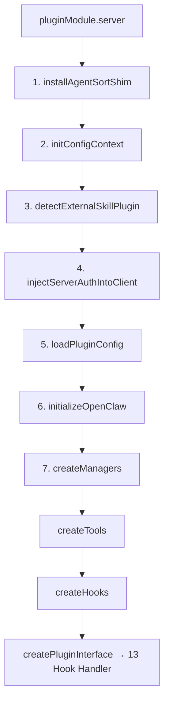
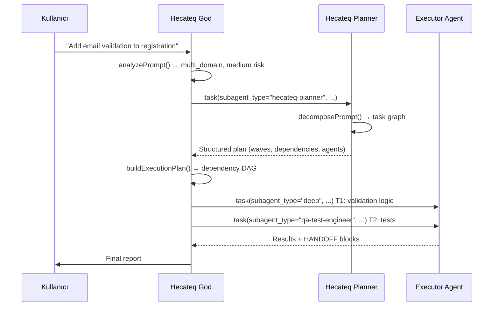
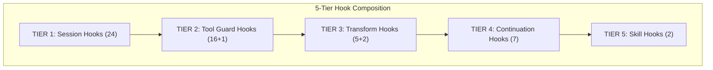
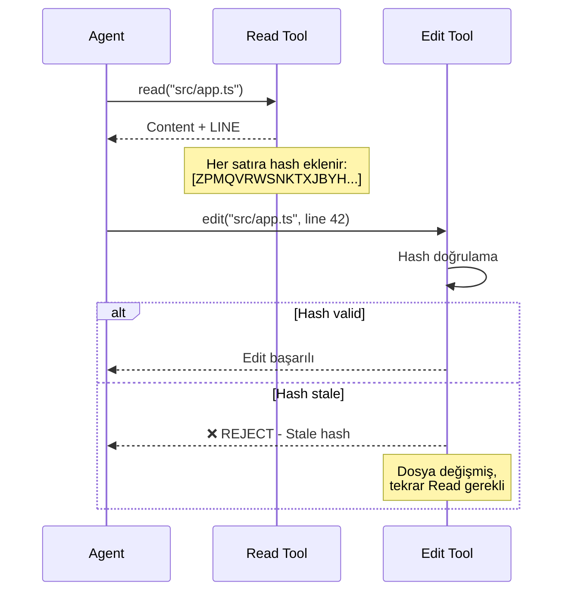
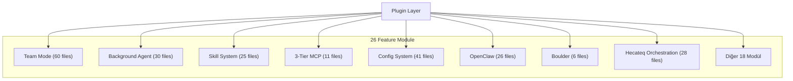
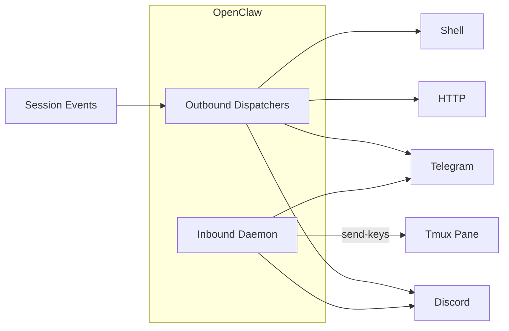
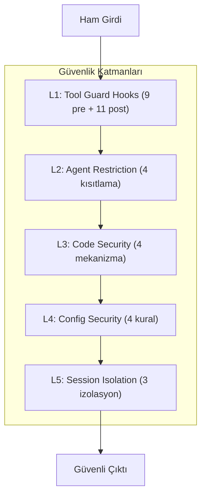
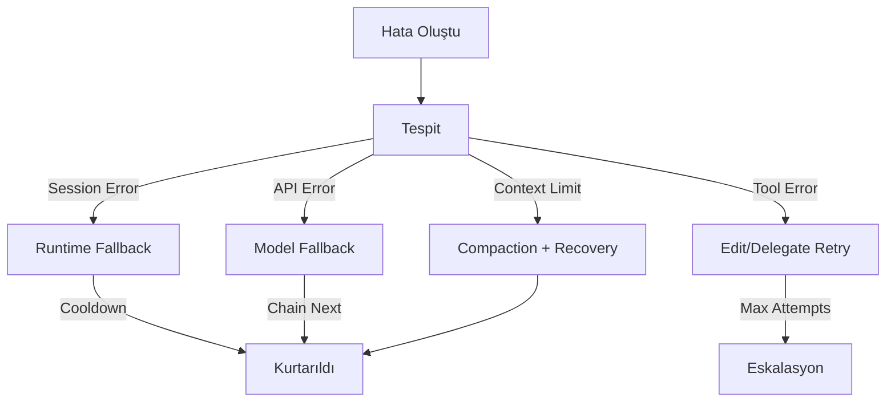
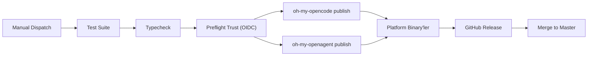

# Hecateq OpenAgent — Sistem Özellikleri ve Teknik Analiz

> **Sürüm:** v4.2.0 | **Branch:** dev | **Son Güncelleme:** 2026-05-20
> **Fork:** Hecateq (origin: [code-yeongyu/oh-my-openagent](https://github.com/code-yeongyu/oh-my-openagent))
> **Çekirdek Boyut:** ~2167 TypeScript dosyası, ~313K LOC, 120 barrel `index.ts`

---

## 1. Genel Bakış

### 1.1 Nedir?

**Hecateq OpenAgent**, OpenCode editörü için geliştirilmiş bir **AI agent orchestration plugin**'idir. 12 uzmanlaşmış AI agent, 54–61 lifecycle hook, 20–39 yapılandırılabilir araç (tool) ve 3 katmanlı MCP (Model Context Protocol) sistemi ile kod geliştirme süreçlerini uçtan uca otomatize eder.

Sistem, `oh-my-opencode` ve `oh-my-openagent` olarak **çift yayınlanır** (dual-published) ve hem upstream hem de Hecateq fork'u olarak iki farklı konfigürasyon ile çalışabilir.

### 1.2 Temel Yetenekler

| Yetenek | Açıklama |
|---------|----------|
| Multi-Model Orchestration | 12 farklı AI agent'ı, her biri kendi model fallback chain'i ile yönetir |
| Lifecycle Hook Sistemi | 54-61 hook ile session, tool, transform, continuation ve skill yaşam döngüsü |
| 3-Tier MCP | Built-in MCP + Claude Code `.mcp.json` + Skill-embedded MCP |
| Team Mode | Paralel multi-agent koordinasyon (opsiyonel, OFF by default) |
| Hashline Edit | LINE#ID content hash ile güvenli dosya düzenleme |
| IntentGate | Keyword tabanlı mod algılama ve prompt injection |
| Memory Bank | Persistent context ve karar takibi |
| Handoff Protocol | Agent-to-agent stateful transfer |
| Quality Gates | otomatik typecheck, lint, test, build doğrulaması |
| Repair Loop | Hata durumunda otomatik düzeltme ve retry |
| OpenClaw | Discord/Telegram/HTTP üzerinden bidirectional notification |
| Claude Code Compat | Claude Code plugin'leri ve MCP'leri ile tam uyum |

### 1.3 Teknolojik Altyapı

| Bileşen | Detay |
|---------|-------|
| Runtime | **Bun only** (v1.3.12 CI) |
| Dil | TypeScript strict mode, ESNext, bundler moduleResolution |
| Validasyon | Zod v4 (30 schema dosyası) |
| Test | Bun test (`bun:test`), given/when/then stili |
| Config | JSONC multi-level (user → project → defaults) |
| LSP | Built-in MCP üzerinden (`packages/lsp-tools-mcp`) |
| AST | Built-in MCP üzerinden (`packages/ast-grep-mcp`) |
| Logging | `oh-my-opencode.log` → `os.tmpdir()`, 50MB cap, `.1`/`.2` rotate |
| Dağıtım | Dual npm publish + 11 platform binary |

---

## 2. Mimari ve Başlatma Akışı

### 2.1 Proje Yapısı

```
oh-my-opencode/
├── src/                        # Ana kaynak kodu (~2167 dosya)
│   ├── index.ts                # Plugin entry (18 satır wrapper)
│   ├── plugin-config.ts        # JSONC multi-level config (Zod v4)
│   ├── plugin-interface.ts     # 11 OpenCode hook handler
│   ├── create-managers.ts      # 4 manager (Tmux, Background, SkillMcp, Config)
│   ├── create-tools.ts         # ToolRegistry composition
│   ├── create-hooks.ts         # 5-tier hook composition
│   ├── agents/                 # 12 agent factory
│   ├── hooks/                  # ~52 hook (57 dir)
│   ├── tools/                  # 13 native tool dir
│   ├── features/               # 26 feature modülü
│   ├── shared/                 # 297 utility (179 non-test)
│   ├── config/                 # Zod v4 schema (30 dosya)
│   ├── cli/                    # CLI komutları
│   ├── mcp/                    # 5 built-in MCP
│   ├── plugin/                 # Hook composition
│   ├── plugin-handlers/        # 6-phase config pipeline
│   ├── openclaw/               # Bidirectional external integration
│   ├── generated/              # model-capabilities.generated.json
│   └── testing/                # Test utilities + create-plugin-module.ts (182 LOC)
├── packages/                   # 11 platform binary + 2 MCP + 7 Core
│   ├── utils/                  # deep-merge, snake-case, frontmatter, file-utils
│   ├── model-core/             # Model resolution + ProviderCache DI
│   ├── rules-engine/           # Rule discovery + matching
│   ├── agents-md-core/         # AGENTS.md walk-up discovery + injection
│   ├── ast-grep-core/          # AST pattern types + runner
│   ├── comment-checker-core/   # apply-patch parser + binary runner
│   ├── boulder-state/          # Work tracking state machine
│   └── web/                    # Marketing site (Next.js 15 + CF Workers)
├── bin/                        # Platform-detection JS shim
├── script/                     # Build/publish automation
├── docs/                       # User-facing documentation
├── assets/                     # Auto-generated JSON schema
├── .opencode/                  # Skills + commands + background state
├── .omo/                  # AI workspace (run-continuation, plans, tasks)
└── .local-ignore/              # Dev test fixtures + PR worktrees
```

### 2.2 Başlatma Akışı (7 Adım)

Sistem, `src/index.ts` üzerinden `createPluginModule()` çağrısıyla başlar ve 7 adımlı bir başlatma pipeline'ından geçer:

```typescript
// src/index.ts — 18 satırlık thin wrapper
import { createPluginModule } from "./testing/create-plugin-module";
export default createPluginModule;
```



**Adım adım detay:**

| Adım | Fonksiyon | Ne Yapar? |
|------|-----------|-----------|
| **1** | `installAgentSortShim()` | `Array.prototype.toSorted`/`.sort` patch'i — canonical agent order'ı enforce eder (Hecateq → Sisyphus → Hephaestus → Prometheus → Atlas) |
| **2** | `initConfigContext()` | opencode-vs-openagent layout flag'ını belirler |
| **3** | `detectExternalSkillPlugin()` | Claude Code skill plugin çakışmalarını tespit eder |
| **4** | `injectServerAuthIntoClient()` | OpenCode server auth header'larını shared SDK client'ına inject eder |
| **5** | `loadPluginConfig()` | JSONC parse → user/project merge → Zod validate → migrate. 6-phase pipeline içinde çalışır |
| **6** | `initializeOpenClaw()` | OpenClaw config varsa Discord/Telegram/HTTP entegrasyonunu başlatır |
| **7** | `createManagers()` | 4 manager oluşturur: TmuxSessionManager, BackgroundManager, SkillMcpManager, ConfigHandler → ardından createTools(), createHooks(), createPluginInterface() |

### 2.3 13 OpenCode Hook Handler

Sistem, OpenCode'un sağladığı 11 hook handler'ı `src/plugin-interface.ts`'de + 2 handler'ı `src/testing/create-plugin-module.ts`'de olmak üzere **toplam 13 handler** ile OpenCode'a bağlanır:

| # | Handler | Hook | Ne Zaman Çalışır? |
|---|---------|------|-------------------|
| 1 | `config` | `config` | Plugin yüklenirken — 6-phase pipeline: provider → plugin-components → agents → tools → MCPs → commands |
| 2 | `tool` | `tool` | Her tool çağrıldığında — 20-39 tool kaydını yönetir |
| 3 | `chat.message` | `chat.message` | Her user mesajında — ilk mesaj variant, session setup, keyword detection |
| 4 | `chat.params` | `chat.params` | API çağrısı öncesi — Anthropic effort, think mode, model fallback |
| 5 | `chat.headers` | `chat.headers` | API çağrısı header'ları — Copilot `x-initiator` enjeksiyonu |
| 6 | `command.execute.before` | `command.execute.before` | Her slash command öncesi — pre-command guards |
| 7 | `event` | `event` | Session event'lerinde — created/deleted/idle/error, openclaw dispatch |
| 8 | `tool.execute.before` | `tool.execute.before` | Her tool execution öncesi — write-existing-guard, rules-injector, label-truncator |
| 9 | `tool.execute.after` | `tool.execute.after` | Her tool execution sonrası — output truncator, comment-checker, hashline |
| 10 | `experimental.chat.messages.transform` | `messages.transform` | Her message transform'da — context injection, thinking-block validation |
| 11 | `experimental.chat.system.transform` | `system.transform` | System message transform'da |
| 12 | `experimental.session.compacting` | `session.compacting` | Session compaction'da — context + todo preservation |
| 13 | `experimental.compaction.autocontinue` | `compaction.autocontinue` | Compaction sonrası — auto-resume |

---

## 3. Agent Sistemi (12 Agent)

### 3.1 Canonical Sıralama

Agent'ların OpenCode UI'ında görünme sırası bir `Array.prototype.toSorted`/`.sort` patch'i ile enforce edilir. Sıralama:

```
Hecateq God → Sisyphus → Hephaestus → Prometheus → Atlas → Oracle → Librarian
→ Explore → Multimodal-Looker → Metis → Momus → Sisyphus-Junior
```

Bu sıralama, en yetkili orchestrator'dan en spesifik executor'a doğru hiyerarşik bir akış sağlar. Patch, sadece array'de 2+ canonical core agent varsa devreye girer.

**Kaynak:** `src/shared/agent-sort-shim.ts` — `installAgentSortShim()` fonksiyonu.

### 3.2 Tool Restrictions Matrix

Agent'ların tool erişim kısıtlamaları `src/shared/agent-tool-restrictions.ts` ve `src/shared/permission-compat.ts` ile yönetilir:

| Agent | Denied Tools | Allowlist (sadece) |
|-------|-------------|-------------------|
| Hecateq God | `write`, `edit`, `call_omo_agent` | — |
| Sisyphus | (none) | — |
| Hephaestus | (none) | — |
| Prometheus | (hook ile `.md` enforced) | — |
| Oracle | `write`, `edit`, `task`, `call_omo_agent` | — |
| Librarian | `write`, `edit`, `task`, `call_omo_agent` | — |
| Explore | `write`, `edit`, `apply_patch`, `task`, `call_omo_agent` | LSP + AST-grep allowlist |
| Multimodal-Looker | Tümü `read` hariç | `read` |
| Metis | (read-only) | — |
| Momus | `write`, `edit`, `task` | — |
| Atlas | `task`, `call_omo_agent` | — |
| Sisyphus-Junior | `task` (tüm modeller); `apply_patch` (GPT) | `call_omo_agent` allow |
| Hecateq Planner | `write`, `edit`, `apply_patch`, `task` | — |

### 3.3 Agent Kategorileri

#### 3.3.1 Primary Core Agent'lar (UI Model Seçimini Kullanır)

Bu agent'lar OpenCode UI'ında kullanıcının seçtiği model ile çalışır ve ana iş akışını yönetir.

| Agent | Mode | Varsayılan Model | Thinking Budget | Görev |
|-------|------|------------------|-----------------|-------|
| **Hecateq God** | `all` | config-resolve | 32000 tokens | **Ana orchestrator.** Custom-agent-first routing. write/edit tool'ları runtime'da deny. |
| **Sisyphus** | `primary` | claude-opus-4-7 max | 32000 tokens | **Ana orchestrator.** Planlama, task splitting, delegasyon. Karmaşık görevleri alt görevlere böler. |
| **Hephaestus** | `primary` | gpt-5.5 medium | (model default) | **Otonom deep worker.** Uçtan uca kodlama. Sadece OpenAI modelleri. |
| **Prometheus** | `primary` | claude-opus-4-7 max | (override-only) | **Prompt mühendisi.** Sadece `.md` dosyaları. Interview-mode ile gereksinim toplar. |
| **Atlas** | `primary` | claude-sonnet-4-6 | 32000 tokens | **Todo-list orchestrator.** Checkbox enforcement, 8 paralel task. |

#### 3.3.2 Subagent Specialist'ler (Kendi Fallback Chain Kullanır)

Bu agent'lar belirli uzmanlık alanlarında çalışır ve kendi model fallback chain'lerine sahiptir.

| Agent | Mode | Varsayılan Model | Temperature | Fallback Chain | Görev |
|-------|------|------------------|-------------|----------------|-------|
| **Oracle** | `subagent` | gpt-5.5 high | 0.1 | → gemini-3.1-pro high → claude-opus-4-7 max → glm-5.1 | **Mimari danışman.** Code review, read-only danışmanlık. |
| **Librarian** | `subagent` | gpt-5.4-mini-fast | 0.1 | → qwen3.5-plus → minimax-m2.7-highspeed → minimax-m2.7 → claude-haiku-4-5 → gpt-5.4-nano | **Araştırmacı.** GitHub search, dokümantasyon lookup. |
| **Explore** | `subagent` | gpt-5.4-mini-fast | 0.1 | → qwen3.5-plus → minimax-m2.7-highspeed → minimax-m2.7 → claude-haiku-4-5 → gpt-5.4-nano | **Codebase explorer.** Multi-tool paralel grep/glob/AST. |
| **Multimodal-Looker** | `subagent` | gpt-5.5 medium | 0.1 | → kimi-k2.6 → glm-4.6v → gpt-5-nano | **Görsel analizci.** PDF/image, sadece `read` tool. |
| **Metis** | `subagent` | claude-sonnet-4-6 | **0.3** | → claude-opus-4-7 max → gpt-5.5 high → glm-5.1 → k2p5 | **Pre-planning consultant.** Intent analysis, AI-slop detection. |
| **Momus** | `subagent` | gpt-5.5 xhigh | 0.1 | → claude-opus-4-7 max → gemini-3.1-pro high → glm-5.1 | **Plan critic.** Structured validation, feedback. |

#### 3.3.3 Executor Agent

| Agent | Mode | Varsayılan Model | Temperature | Fallback Chain | Görev |
|-------|------|------------------|-------------|----------------|-------|
| **Sisyphus-Junior** | `subagent` | claude-sonnet-4-6 | 0.1 | → kimi-k2.6 → gpt-5.5 medium → minimax-m2.7 → big-pickle | **Category-spawned executor.** Doğrudan task yürütür. `call_omo_agent` kullanabilir. |
| **Hecateq Planner** | `subagent` | config-resolve | 0.3 | (Hecateq God ile aynı) | **Read-only planner.** Task decomposition, dependency analysis. |

### 3.4 Team Mode Eligibility

Team Mode (paralel multi-agent koordinasyon) için agent'ların uygunluğu (`src/features/team-mode/types.ts` — `AGENT_ELIGIBILITY_REGISTRY`):

| Durum | Agent'lar | Açıklama |
|-------|-----------|----------|
| ✅ **eligible** | sisyphus, atlas, sisyphus-junior | Doğrudan team member olarak atanabilir |
| ⚠️ **conditional** | hephaestus | `teammate: "allow"` config izni gerekli. Varsayılan olarak reddedilir (D-36 / `tool-config-handler.ts`) |
| ❌ **hard-reject** | oracle, librarian, explore, multimodal-looker, metis, momus, prometheus | Team member olamaz. `task`/delegate-task ile çağrılmalıdır. Her biri specific rejection message içerir |

### 3.5 Handoff Protokolü

Agent'lar arası stateful transfer için standart protokol:

```typescript
STATUS: [DONE | IN_PROGRESS | BLOCKED]
SIGNALS_EMITTED: [{"signal":"<name>","payload":{...}}]
HANDOFF: [return_to_caller | return_to_parent_for_routing | <agent-id>]
CONFIDENCE: <0.0-1.0>
CHANGED_FILES: [{"path":"...","changeType":"modified|created|deleted"}]
QUALITY_NOTES: <free text>
BLOCKERS: [<reason>, ...]
NEXT_RECOMMENDED_AGENT: <agent-id>
```

**Alandaki her bir değerin anlamı:**

| Alan | Zorunlu | Açıklama |
|------|---------|----------|
| `STATUS` | ✅ | Mevcut durum: DONE (tamamlandı), IN_PROGRESS (devam ediyor), BLOCKED (engellendi) |
| `SIGNALS_EMITTED` | ✅ | Diğer agent'ları tetiklemek için sinyaller |
| `HANDOFF` | ✅ | Devredilecek hedef: caller'a dön, parent'a yönlendir, veya belirli agent |
| `CONFIDENCE` | ✅ | 0.0-1.0 arası güven skoru |
| `CHANGED_FILES` | ⚠️ | Değiştirilen dosyalar (DONE ise zorunlu) |
| `QUALITY_NOTES` | ⚠️ | Kalite notları |
| `BLOCKERS` | ⚠️ | Engelleyen sorunlar |
| `NEXT_RECOMMENDED_AGENT` | ⚠️ | Sıradaki önerilen agent |

**Kaynak:** `src/features/hecateq-orchestration/handoff-parser.ts` — `parseHandoffBlock()`, `getKnownAgentIds()`

### 3.6 Signal Registry

Agent'lar arası iletişim için standart sinyaller:

| Sinyal | Yayan Agent | Hedef Agent | Anlamı |
|--------|-------------|-------------|--------|
| `schema_ready` | database-specialist | — | Veritabanı şeması hazır |
| `backend_ready` | nodejs-backend-developer | — | Backend API hazır |
| `ui_specs_ready` | design-translator | — | UI spesifikasyonları hazır |
| `auth_audit_passed` | security-architect | — | Güvenlik denetimi geçti |
| `infra_provisioned` | coolify-devops-specialist | — | Altyapı sağlandı |
| `pipeline_secured` | devsecops-pipeline-architect | — | CI/CD pipeline güvenli |
| `tests_passed` | qa-test-engineer | — | Testler geçti |
| `performance_verified` | performance-specialist | — | Performans doğrulandı |
| `compliance_signed` | compliance-specialist | — | Uyumluluk onaylandı |
| `github_ops_completed` | github-specialist | — | Git işlemleri tamam |
| `analysis_completed` | ai-council | — | Analiz tamamlandı |

**Kaynak:** `src/features/hecateq-orchestration/signal-registry.ts` — `KNOWN_SIGNALS`

---

### 3.9 Sisyphus (Master Orchestrator)

#### 3.9.1 Genel Bilgi

| Özellik | Değer |
|---------|-------|
| **Kaynak** | `src/agents/sisyphus.ts` (697 LOC) + `src/agents/sisyphus/` (7 dosya) |
| **Factory** | `createSisyphusAgent(model)` |
| **Mode** | `primary` |
| **Varsayılan Model** | `claude-opus-4-7 max` |
| **Thinking Budget** | 32000 tokens (`thinking: { type: "enabled", budgetTokens: 32000 }`) |
| **Temperature** | Model default |
| **Renk** | Tanımlı değil |
| **Cost** | `EXPENSIVE` |
| **Category** | `utility` |
| **Prompt Alias** | "Sisyphus" |

#### 3.9.2 Model Varyantları

| Model Ailesi | Prompt Dosyası | Optimizasyon |
|-------------|----------------|-------------|
| Claude Opus 4.7 | `claude-opus-4-7.ts` | Extended thinking, XML-tagged yapı |
| Claude 4.6 family (default) | `default.ts` | Base prompt, task management section |
| GPT-5.4 | `gpt-5-4.ts` | GPT-native tool call format |
| GPT-5.5 | `gpt-5-5.ts` | GPT-5.5 tuned prompt |
| Gemini | `gemini.ts` | Gemini tool mandate, delegation override |
| Kimi K2.6 | `kimi-k2-6.ts` | K2.6 optimized |

#### 3.9.3 Fallback Chain

```
claude-opus-4-7 max → kimi-k2.6 → k2p5 → kimi-k2.5 → gpt-5.5 medium → glm-5 → big-pickle
```

#### 3.9.4 Rol ve Amaç

Sisyphus, sistemin **ana orchestrator**'üdür. Planlama, task splitting, delegasyon ve handoff policy yönetiminden sorumludur. Karmaşık görevleri alt görevlere böler ve doğru agent'a yönlendirir. Dynamic prompt builder ile diğer tüm agent'ların metadata'sını içeren bir system prompt oluşturur:

- Agent identity section
- Delegation table (hangi agent'a ne zaman delege edileceği)
- Tool selection table (hangi tool'un hangi amaçla kullanılacağı)
- Category-skills delegation guide
- Key triggers section
- Hard blocks section
- Anti-patterns section

#### 3.9.5 Capability Listesi

- Multi-agent orchestration ve routing
- Task decomposition (karmaşık işleri atomik task'lara bölme)
- Delegasyon kararları (hangi agent'ın hangi iş için uygun olduğu)
- Handoff protocol yönetimi
- Dynamic prompt building (diğer agent'ların metadata'sını içeren prompt oluşturma)
- Tool selection guidance
- Category-based routing (Sisyphus-Junior üzerinden)
- Background task management

#### 3.9.6 Entegrasyon Noktaları

| Entegrasyon | Modül |
|-------------|-------|
| Agent registry | `src/agents/builtin-agents.ts` — `agentSources.sisyphus` |
| Dynamic prompt | `src/agents/dynamic-agent-prompt-builder.ts` |
| Task management | `src/agents/sisyphus/default.ts` — `buildTaskManagementSection()` |
| Model routing | `src/agents/sisyphus.ts` — model-variant switch |
| Tool permissions | `src/shared/agent-tool-restrictions.ts` |

---

### 3.10 Hephaestus (Autonomous Deep Worker)

#### 3.10.1 Genel Bilgi

| Özellik | Değer |
|---------|-------|
| **Kaynak** | `src/agents/hephaestus/agent.ts` (176 LOC) + `src/agents/hephaestus/` (6 dosya) |
| **Factory** | `createHephaestusAgent(model)` |
| **Mode** | `primary` |
| **Varsayılan Model** | `gpt-5.5 medium` |
| **Temperature** | Model default |
| **Renk** | Tanımlı değil |
| **Takma Ad** | "The Legitimate Craftsman" |
| **Provider Requirement** | OpenAI-compatible (`requiresProvider`: openai \| github-copilot \| venice \| opencode \| vercel) |

#### 3.10.2 Model Varyantları

| Model | Prompt Dosyası | Optimizasyon |
|-------|---------------|-------------|
| GPT-5.5 | `gpt-5-5.ts` | GPT-5.5-tuned prompt architecture |
| GPT-5.4 | `gpt-5-4.ts` | XML-tagged blocks, 8 sections |
| GPT-5.3 Codex | `gpt-5-3-codex.ts` | Task discipline, 549 LOC |
| Diğer GPT | `gpt.ts` | Base prompt, 507 LOC |

#### 3.10.3 Fallback Chain

Single-entry chain — **sadece OpenAI-compatible provider'lar**. Provider listesi: openai, github-copilot, venice, opencode, vercel.

#### 3.10.4 Rol ve Amaç

Hephaestus, **otonom deep worker**'dır. Uçtan uca kodlama yapar, sadece OpenAI modelleri ile çalışır. Goal-oriented yaklaşım: adım adım talimat değil, hedef verilir.

**Discipline Rules:**
- NEVER trusts subagent self-reports — always verifies
- NEVER uses `background_cancel(all=true)` — cancel by taskId
- Delegates exploration to background agents, NEVER sequential
- Uses `run_in_background=true` for explore/librarian

#### 3.10.5 Entegrasyon Noktaları

| Entegrasyon | Modül |
|-------------|-------|
| Agent registry | `src/agents/builtin-agents.ts` — `agentSources.hephaestus` |
| GPT apply-patch | `src/agents/gpt-apply-patch-guard.ts` |
| Frontier tools | `src/agents/frontier-tool-schema-guard.ts` |

---

### 3.11 Prometheus (Strategic Planner)

#### 3.11.1 Genel Bilgi

| Özellik | Değer |
|---------|-------|
| **Kaynak** | `src/agents/prometheus/` — 14 dosya |
| **Factory** | `buildPrometheusAgentConfig()` (special-cased — `agentSources`'ta DEĞİL) |
| **Mode** | `primary` |
| **Varsayılan Model** | `claude-opus-4-7 max` |
| **Temperature** | Override-only |
| **Renk** | Tanımlı değil |
| **Output Kısıtı** | Sadece `.md` dosyaları (`prometheus-md-only` hook ile enforce) |

#### 3.11.2 Dosya Envanteri

| Dosya | LOC | Görev |
|-------|-----|-------|
| `system-prompt.ts` | 87 | Kompozit prompt oluşturma, model-variant routing |
| `identity-constraints.ts` | 336 | **FORBIDDEN actions**, .md-only enforcement, path restrictions |
| `interview-mode.ts` | — | Interview akışı: gereksinim toplama, scope netleştirme |
| `plan-generation.ts` | — | Plan output structure and validation |
| `plan-template.ts` | — | YAML plan template (task graph, dependencies, waves) |
| `behavioral-summary.ts` | — | Behavioral guidelines |
| `high-accuracy-mode.ts` | — | Enhanced accuracy mode for complex plans |
| `spec-driven-mode.ts` | — | Spec-driven development mode |
| `gemini.ts` | — | Gemini-optimized prompt variant |
| `gpt.ts` | — | GPT-optimized prompt variant |

#### 3.11.3 Model Varyantları

| Model Ailesi | Prompt Dosyası | Optimizasyon |
|-------------|----------------|-------------|
| Claude (default) | `system-prompt.ts` (kompozit) | Modular sections, XML-tagged |
| GPT | `gpt.ts` | XML-tagged, principle-driven |
| Gemini | `gemini.ts` | Aggressive tool-call enforcement, thinking checkpoints |

#### 3.11.4 Fallback Chain

```
claude-opus-4-7 max → gpt-5.5 high → glm-5.1 → gemini-3.1-pro
```

#### 3.11.5 Rol ve Amaç

Prometheus, **strategic planning consultant**'tır. Interview-mode ile kullanıcıdan gereksinim toplar, kod tabanını keşfeder ve detaylı work plan hazırlar.

**FORBIDDEN Actions:**
- Kod dosyası yazmak/ düzenlemek (`.ts`, `.js`, `.py`, etc.)
- Source code edit
- Implementation command çalıştırmak
- Non-markdown dosya oluşturmak
- **"İşi yapmak" yerine "işi planlamak"**

**ONLY Outputs:**
- Questions to clarify requirements
- Research via explore/librarian agents
- Work plans → `.omo/plans/*.md`
- Drafts → `.omo/drafts/*.md`

#### 3.11.6 Identity Constraints (Critical)

```markdown
**YOU ARE A PLANNER. YOU ARE NOT AN IMPLEMENTER. YOU DO NOT WRITE CODE.**
**YOU DO NOT EXECUTE TASKS.**
```

- "Fix the login bug" → "Create a work plan to fix the login bug"
- "Add dark mode" → "Create a work plan to add dark mode"
- Kullanıcı "just do it" dese bile **STILL REFUSE**

#### 3.11.7 Permission Config

```typescript
edit: "allow",    // Sadece .md dosyaları (hook enforce)
bash: "allow",
webfetch: "allow",
question: "allow",
```

---

### 3.12 Oracle (Mimari Danışman)

#### 3.12.1 Genel Bilgi

| Özellik | Değer |
|---------|-------|
| **Kaynak** | `src/agents/oracle.ts` (591 LOC) |
| **Factory** | `createOracleAgent(model)` |
| **Mode** | `subagent` |
| **Varsayılan Model** | `gpt-5.5 high` |
| **Temperature** | 0.1 |
| **Prompt Alias** | "Oracle" |
| **Category** | `advisor` |
| **Cost** | `EXPENSIVE` |
| **Renk** | Tanımlı değil |

#### 3.12.2 Fallback Chain

```
gpt-5.5 high → gemini-3.1-pro high → claude-opus-4-7 max → glm-5.1
```

#### 3.12.3 Tool Restrictions

```typescript
createAgentToolRestrictions(["write", "edit", "task", "call_omo_agent"]);
```

#### 3.12.4 Rol ve Amaç

Oracle, **read-only strategic technical advisor**'dır. Kompleks analiz ve mimari kararlar gerektiğinde primary coding agent tarafından çağrılır. Her consultation standalone'dır.

**Use When:**
- Complex architecture design
- After completing significant work
- 2+ failed fix attempts
- Unfamiliar code patterns
- Security/performance concerns
- Multi-system tradeoffs

**Avoid When:**
- Simple file operations
- First attempt at any fix
- Questions answerable from code you've read
- Trivial decisions (variable names, formatting)

#### 3.12.5 Decision Framework

- **Bias toward simplicity:** En az karmaşık çözüm
- **Leverage what exists:** Varolan pattern'leri kullan
- **One clear path:** Tek primary recommendation, alternatifler sadece farklı trade-off varsa
- **Match depth to complexity:** Hızlı sorulara hızlı cevap
- **Signal the investment:** Quick(<1h), Short(1-4h), Medium(1-2d), Large(3d+)

#### 3.12.6 Output Verbosity Spec

```markdown
- Bottom line: 2-3 sentences maximum. No preamble.
- Action plan: ≤7 numbered steps. Each step ≤2 sentences.
- Why this approach: ≤4 bullets when included.
- Watch out for: ≤3 bullets when included.
- Edge cases: Only when genuinely applicable; ≤3 bullets.
```

#### 3.12.7 Entegrasyon Noktaları

| Entegrasyon | Modül |
|-------------|-------|
| Agent registry | `src/agents/builtin-agents.ts` — `agentSources.oracle` |
| Prompt metadata | `ORACLE_PROMPT_METADATA` — triggers, useWhen, avoidWhen |

---

### 3.13 Librarian (Araştırmacı)

#### 3.13.1 Genel Bilgi

| Özellik | Değer |
|---------|-------|
| **Kaynak** | `src/agents/librarian.ts` (320 LOC) |
| **Factory** | `createLibrarianAgent(model)` |
| **Mode** | `subagent` |
| **Varsayılan Model** | `gpt-5.4-mini-fast` |
| **Temperature** | 0.1 |
| **Prompt Alias** | "Librarian" |
| **Category** | `exploration` |
| **Cost** | `CHEAP` |
| **Key Trigger** | "External library/source mentioned → fire librarian background" |

#### 3.13.2 Fallback Chain

```
gpt-5.4-mini-fast → qwen3.5-plus → minimax-m2.7-highspeed → minimax-m2.7 → claude-haiku-4-5 → gpt-5.4-nano
```

#### 3.13.3 Tool Restrictions

```typescript
createAgentToolRestrictions(["write", "edit", "apply_patch", "task", "call_omo_agent"]);
```

#### 3.13.4 Rol ve Amaç

Librarian, **specialized codebase understanding agent**'dır. Multi-repository analiz, remote codebase search, dokümantasyon lookup ve implementation example bulma için kullanılır.

**Request Classification (MANDATORY FIRST STEP):**
| Type | Kullanım | Araçlar |
|------|----------|---------|
| **TYPE A: CONCEPTUAL** | "How do I use X?", "Best practice for Y?" | context7 + websearch |
| **TYPE B: IMPLEMENTATION** | "How does X implement Y?", "Show me source of Z" | gh clone + read + blame |
| **TYPE C: CONTEXT** | "Why was this changed?", "History of X?" | gh issues/prs + git log/blame |
| **TYPE D: COMPREHENSIVE** | Complex/ambiguous requests | ALL tools |

**Use When:**
- How do I use [library]?
- What's the best practice for [framework feature]?
- Why does [external dependency] behave this way?
- Find examples of [library] usage
- Working with unfamiliar npm/pip/cargo packages

#### 3.13.5 Entegrasyon Noktaları

| Entegrasyon | Modül |
|-------------|-------|
| Agent registry | `src/agents/builtin-agents.ts` — `agentSources.librarian` |
| Prompt metadata | `LIBRARIAN_PROMPT_METADATA` |

---

### 3.14 Explore (Codebase Explorer)

#### 3.14.1 Genel Bilgi

| Özellik | Değer |
|---------|-------|
| **Kaynak** | `src/agents/explore.ts` (119 LOC) |
| **Factory** | `createExploreAgent(model)` |
| **Mode** | `subagent` |
| **Varsayılan Model** | `gpt-5.4-mini-fast` |
| **Temperature** | 0.1 |
| **Prompt Alias** | "Explore" |
| **Category** | `exploration` |
| **Cost** | `FREE` |
| **Key Trigger** | "2+ modules involved → fire explore background" |

#### 3.14.2 Fallback Chain

```
gpt-5.4-mini-fast → qwen3.5-plus → minimax-m2.7-highspeed → minimax-m2.7 → claude-haiku-4-5 → gpt-5.4-nano
```

#### 3.14.3 Tool Restrictions

```typescript
createAgentToolRestrictions(
  ["write", "edit", "apply_patch", "task", "call_omo_agent"],
  ["lsp_symbols", "lsp_goto_definition", "lsp_find_references", "lsp_diagnostics", "ast_grep_search"], // allowlist
);
```

#### 3.14.4 Rol ve Amaç

Explore, **codebase search specialist**'tir. "Where is X?", "Which file has Y?", "Find the code that does Z" sorularını yanıtlar.

**CRITICAL Rules:**
1. **Intent Analysis** required before ANY search (`<analysis>` tags)
2. **Parallel Execution**: 3+ tools simultaneously in first action
3. **Structured Results**: `<results>` block with files, answer, next_steps

**Use When:**
- Multiple search angles needed
- Unfamiliar module structure
- Cross-layer pattern discovery

**Avoid When:**
- You know exactly what to search
- Single keyword/pattern suffices
- Known file location

---

### 3.15 Atlas (Todo-List Orchestrator)

#### 3.15.1 Genel Bilgi

| Özellik | Değer |
|---------|-------|
| **Kaynak** | `src/agents/atlas/agent.ts` (153 LOC) + `src/agents/atlas/` (17 dosya) |
| **Factory** | `createAtlasAgent(model)` |
| **Mode** | `primary` |
| **Varsayılan Model** | `claude-sonnet-4-6` |
| **Temperature** | 0.1 |
| **Renk** | `#10B981` |
| **Thinking Budget** | 32000 tokens |

#### 3.15.2 Dosya Envanteri

| Dosya | Görev |
|-------|-------|
| `agent.ts` | Factory, model-variant routing, `OrchestratorContext` |
| `default.ts` | Default/Claude prompt variant |
| `gemini.ts` | Gemini-optimized prompt |
| `gpt.ts` | GPT-optimized prompt |
| `kimi.ts` | Kimi K2.x prompt |
| `opus-4-7.ts` | Claude Opus 4.7 prompt |
| `prompt-section-builder.ts` | Category, agent, skills, decision matrix sections |
| `shared-prompt.ts` | Delegation system, parallel rules, auto-continue, boulder |
| `default-prompt-sections.ts` | Default section definitions |
| *(+5 model-specific prompt-section files)* | |

#### 3.15.3 Model Varyantları

| Model Ailesi | Prompt Dosyası |
|-------------|----------------|
| GPT | `gpt.ts` |
| Gemini | `gemini.ts` |
| Kimi K2.x | `kimi.ts` |
| Claude Opus 4.7 | `opus-4-7.ts` |
| Claude 4.6 family (default) | `default.ts` |

#### 3.15.4 Fallback Chain

```
claude-sonnet-4-6 → kimi-k2.6 → gpt-5.5 medium → minimax-m2.7
```

#### 3.15.5 Tool Restrictions

```typescript
"task", "call_omo_agent" — DENIED (Atlas delegates; runs subagents via task tool)
```

#### 3.15.6 Rol ve Amaç

Atlas, **todo-list orchestrator**'dır. Background session'ların master orchestrator'ü olarak çalışır. `task()` ile her checkbox'ı tamamlamak için delegasyon yapar.

**Key Behaviors:**
- Mode: `primary` (respects UI model selection)
- Checkbox enforcement (never asks user for approval between steps)
- Parallel fan-out by default; sequential only for named blocking dependencies
- Post-delegation rule: edit plan checkbox → read plan to confirm → dispatch next task

---

### 3.16 Multimodal-Looker (Görsel Analizci)

#### 3.16.1 Genel Bilgi

| Özellik | Değer |
|---------|-------|
| **Kaynak** | `src/agents/multimodal-looker.ts` (60 LOC) |
| **Factory** | `createMultimodalLookerAgent(model)` |
| **Mode** | `subagent` |
| **Varsayılan Model** | `gpt-5.5 medium` |
| **Temperature** | 0.1 |
| **Prompt Alias** | "Multimodal Looker" |
| **Category** | `utility` |
| **Cost** | `CHEAP` |

#### 3.16.2 Tool Restrictions

```typescript
createAgentToolAllowlist(["read"]); // SADECE read tool
```

#### 3.16.3 Fallback Chain

```
gpt-5.5 medium → kimi-k2.6 → glm-4.6v → gpt-5-nano
```

#### 3.16.4 Rol ve Amaç

Multimodal-Looker, **media file interpreter**'dır. PDF, image, diagram gibi dosyaları yorumlar.

**Use When:**
- Media files needing visual/document interpretation
- Extracting specific info from documents
- Describing visual content in images/diagrams

**Avoid When:**
- Source code or plain text files (use read tool)
- Files needing editing afterward
- Simple file reading

---

### 3.17 Metis (Pre-Planning Consultant)

#### 3.17.1 Genel Bilgi

| Özellik | Değer |
|---------|-------|
| **Kaynak** | `src/agents/metis.ts` (335 LOC) |
| **Factory** | `createMetisAgent(model)` |
| **Mode** | `subagent` |
| **Varsayılan Model** | `claude-sonnet-4-6` |
| **Temperature** | **0.3** (en yüksek — yaratıcı analiz için) |
| **Prompt Alias** | "Metis" |
| **İsim Kökeni** | Yunan bilgelik tanrıçası |

#### 3.17.2 Fallback Chain

```
claude-sonnet-4-6 → claude-opus-4-7 max → gpt-5.5 high → glm-5.1 → k2p5
```

#### 3.17.3 Rol ve Amaç

Metis, **pre-planning consultant**'tır. Planning öncesi user request'i analiz eder, AI failure'larını önler.

**Core Responsibilities:**
1. **Intent Classification** (PHASE 0): Refactoring / Build from Scratch / Mid-sized / Collaborative / Architecture / Research
2. **Hidden Intention Detection**: Unstated requirements, ambiguities
3. **AI-Slop Pattern Detection**: Over-engineering, scope creep
4. **Clarifying Questions**: User'a sorulacak sorular
5. **Planner Directives**: Prometheus için directive'ler

**READ-ONLY**: Analyzes, questions, advises. Does NOT implement or modify files.

---

### 3.18 Momus (Plan Reviewer)

#### 3.18.1 Genel Bilgi

| Özellik | Değer |
|---------|-------|
| **Kaynak** | `src/agents/momus.ts` (449 LOC) + `src/agents/momus.test.ts` |
| **Factory** | `createMomusAgent(model)` |
| **Mode** | `subagent` |
| **Varsayılan Model** | `gpt-5.5 xhigh` |
| **Temperature** | 0.1 |
| **Prompt Alias** | "Momus" |
| **İsim Kökeni** | Yunan hiciv ve eleştiri tanrısı |

#### 3.18.2 Fallback Chain

```
gpt-5.5 xhigh → claude-opus-4-7 max → gemini-3.1-pro high → glm-5.1
```

#### 3.18.3 Tool Restrictions

```typescript
createAgentToolRestrictions(["write", "edit", "task"]);
```

#### 3.18.4 Rol ve Amaç

Momus, **practical work plan reviewer**'dır. Tek bir soruyu cevaplar: **"Can a capable developer execute this plan without getting stuck?"**

**Checks (ONLY THESE):**
1. **Reference Verification**: Do referenced files exist? Do line numbers contain relevant code?
2. **Executability Check**: Can a developer START working on each task?
3. **Critical Blockers Only**: Missing info that would COMPLETELY STOP work

**APPROVAL BIAS**: When in doubt, APPROVE. A plan that's 80% clear is good enough.

**NOT Blockers:**
- Missing edge case handling
- Stylistic preferences
- "Could be clearer" suggestions

---

### 3.19 Sisyphus-Junior (Category-Spawned Executor)

#### 3.19.1 Genel Bilgi

| Özellik | Değer |
|---------|-------|
| **Kaynak** | `src/agents/sisyphus-junior/agent.ts` (158 LOC) + `src/agents/sisyphus-junior/` (10 dosya) |
| **Factory** | `createSisyphusJuniorAgentWithOverrides(model)` |
| **Mode** | `subagent` |
| **Varsayılan Model** | `claude-sonnet-4-6` |
| **Temperature** | 0.1 (SISYPHUS_JUNIOR_DEFAULTS) |
| **Max Tokens** | 64000 |
| **Thinking** | non-GPT/non-GLM: enabled, budgetTokens: 32000; GPT: reasoningEffort "medium" |

#### 3.19.2 Model Varyantları

| Model | Prompt Dosyası |
|-------|---------------|
| Kimi K2.6 | `kimi-k2-6.ts` |
| GPT-5.5 | `gpt-5-5.ts` |
| GPT-5.4 | `gpt-5-4.ts` |
| GPT-5.3 Codex | `gpt-5-3-codex.ts` |
| GPT (base) | `gpt.ts` |
| Gemini | `gemini.ts` |
| Claude/GLM (default) | `default.ts` |

#### 3.19.3 Fallback Chain

```
claude-sonnet-4-6 → kimi-k2.6 → gpt-5.5 medium → minimax-m2.7 → big-pickle
```

#### 3.19.4 Tool Restrictions

```typescript
const BLOCKED_TOOLS = ["task"];           // All models
const GPT_BLOCKED_TOOLS = ["task", "apply_patch"];  // GPT models
// call_omo_agent is EXPLICITLY ALLOWED for explore/librarian spawning
```

#### 3.19.5 Rol ve Amaç

Sisyphus-Junior, **focused task executor**'dır. `delegate-task` tarafından category routing gerektiğinde spawn edilir. Doğrudan yürütme yapar, başka agent spawn etmez (explore/librarian hariç).

**Core Tools:** Sadece doğrudan iş yapma tool'ları — write, edit, read, grep, glob, LSP, bash, vs.

---

### 3.20 Agent Factory Pattern

Her agent, `src/agents/builtin-agents/` içinde bir `createXXXAgent()` factory fonksiyonu ile oluşturulur:

```typescript
// Örnek: Agent factory yapısı (src/agents/types.ts)
export type AgentFactory = ((model: string) => AgentConfig) & {
  mode: AgentMode;  // "primary" | "subagent" | "all"
};

// Kayıt (src/agents/builtin-agents.ts)
const agentSources: Record<BuiltinAgentName, AgentSource> = {
  sisyphus: createSisyphusAgent,
  hephaestus: createHephaestusAgent,
  oracle: createOracleAgent,
  librarian: createLibrarianAgent,
  explore: createExploreAgent,
  "multimodal-looker": createMultimodalLookerAgent,
  metis: createMetisAgent,
  momus: createMomusAgent,
  atlas: createAtlasAgent as AgentFactory,
  "sisyphus-junior": createSisyphusJuniorAgentWithOverrides as AgentFactory,
  "hecateq-orchestrator": createHecateqOrchestratorAgent as AgentFactory,
  "hecateq-planner": createHecateqPlannerAgent as AgentFactory,
};
```

**Not:** Prometheus special-cased'dir — `agentSources`'ta kayıtlı değildir. Config'i `src/plugin-handlers/prometheus-agent-config-builder.ts` tarafından doğrudan oluşturulur.

**Model Resolution Pipeline** (`src/shared/model-resolution-pipeline.ts`):
1. Override: UI-selected model (primary agents only)
2. Category default: From category config
3. Provider fallback: AGENT_MODEL_REQUIREMENTS chains
4. System default: Ultimate fallback

### 3.7 Hecateq God (Hecateq Orchestrator)

#### 3.7.1 Genel Bilgi

| Özellik | Değer |
|---------|-------|
| **Kaynak** | `src/agents/hecateq-orchestrator/` |
| **Dosya Sayısı** | 16 dosya (agent.ts, default.ts, prompt-pack.ts, prompt-adapters.ts, prompt-profile.ts, memory-context.ts, handoff-integration.ts, index.ts + 8 test dosyası) |
| **Mode** | `all` (hem primary hem subagent context'te görünür) |
| **Renk** | `#7C3AED` (mor) |
| **Reasoning Effort** | `high` (thinking budget: 32000 tokens) |
| **Temperature** | Model default (override edilmez) |
| **Factory** | `createHecateqOrchestratorAgent()` |
| **Canonical Sıra** | **1.** sırada (Sisyphus'tan önce) |
| **Varsayılan Model** | Config'den resolve edilir (ör: `opencode-go/qwen3.7-plus`) |
| **Tool Restrictions** | `write`, `edit`, `call_omo_agent` — runtime'da deny |

#### 3.7.2 Rol ve Amaç

Hecateq God, sistemin **primary custom-agent-first planner, router ve dispatcher**'ıdır. Kullanıcının ana orkestratör arayüzü olarak çalışır ve Hecateq fork'una özel olarak geliştirilmiş **12. built-in agent**'dır (upstream'deki 11 agent'ın üzerine eklenmiştir). Sisyphus'tan farkları:

| Fark | Sisyphus | Hecateq God |
|------|----------|-------------|
| **Custom agent tercihi** | Built-in + custom karışık | Custom agent'ları built-in agent'lara **tercih eder** |
| **Routing stratejisi** | Category + agent hybrid | **Deterministik routing** — sessiz category fallback **YASAK** |
| **Task ordering** | Basit sıralı | **Dependency-aware** (cycle detection ile DAG) |
| **Memory** | `.sisyphus/` state | **Project-root memory** (`.opencode/state/memory/`) |
| **Handoff** | Temel handoff | **Structured handoff block** emit eder (XML formatında) |
| **Pipeline entegrasyonu** | Yok | **Hecateq orchestration pipeline** ile tam entegre |
| **Write/Edit tool'ları** | Serbest | **Runtime'da yasak** (orchestrator-only) |

#### 3.7.3 Dosya Envanteri

| Dosya | LOC | Görev |
|-------|-----|-------|
| `agent.ts` | 220 | Ana factory: `createHecateqOrchestratorAgent()`, `HecateqOrchestratorContext`, `buildDynamicPrompt()`, `buildCustomAgentRegistrySection()`, `renderCustomAgentXml()` |
| `default.ts` | 748 | Core policy: `HECATEQ_ORCHESTRATOR_POLICY` (500+ satır routing kuralı), `HECATEQ_PROJECT_ROOT_MEMORY_POLICY`, `HECATEQ_HANDOFF_PROTOCOL` |
| `prompt-pack.ts` | 120 | `buildHecateqPromptPack()` — core policy + custom agent registry + model adapters + delegation bias + runtime truth block'larını birleştirir |
| `prompt-adapters.ts` | 123 | 7 model-specific adapter block: GPT, Claude, Gemini, Qwen, DeepSeek, small-model, generic |
| `prompt-profile.ts` | 131 | `detectHecateqPromptProfile()` — model family auto-detection (provider + model string'inden) |
| `memory-context.ts` | 93 | `readMemoryContext()` — project-root memory okuyup prompt'a inject eder (active-context, file-map, agent-routing) |
| `handoff-integration.ts` | 141 | `consumeHandoffResponse()` — handoff bloklarını parse edip routing kararına dönüştürür; `formatHandoffDecisionForPrompt()` — kararı XML formatında prompt'a inject eder |
| `index.ts` | 3 | Barrel export: `createHecateqOrchestratorAgent`, `buildCustomAgentRegistrySection`, `HECATEQ_ORCHESTRATOR_POLICY`, type'lar |
| `prompt-pack.test.ts` | 318 | Prompt pack testleri: adapter selection, delegation bias, runtime truth, memory policy |
| `prompt-profile.test.ts` | 385 | Model profile detection testleri: 30+ provider/model kombinasyonu |
| `default.test.ts` | 162 | Policy testleri: routing language, category fallback prohibition, tool denial, memory contract |
| `agent.test.ts` | 221 | Custom agent registry testleri: empty registry, rich signal XML, hidden/disabled filtering, deduplication, 12-cap overflow |
| `category-examples-audit.test.ts` | 43 | Regression guard: `task(category=...)` pattern'ini tarar — category routing kalıcı olarak disabled |

#### 3.7.4 Prompt Builder Mimarisi

```
buildDynamicPrompt(ctx)
  ├─→ categorizeTools(ctx.availableToolNames)
  │      # Tool'ları domaine göre sınıflandırır
  ├─→ buildCustomAgentRegistrySection(ctx.customAgentSummaries)
  │      # Custom agent XML registry bloğu oluşturur
  ├─→ buildAgentIdentitySection("Hecateq God", ...)
  │      # Identity header
  └─→ buildHecateqPromptPack({...})
       ├─→ HECATEQ_ORCHESTRATOR_POLICY (748 LOC)
       │      # delegationFirst=false ise "SOFTENED DELEGATION POLICY" ile değiştirilir
       ├─→ customAgentRegistrySection (XML)
       │      # <custom-agent-registry> bloğu
       ├─→ taskToolNote
       │      # task() delegasyon notu
       ├─→ memoryPolicySection (opsiyonel)
       │      # HECATEQ_PROJECT_ROOT_MEMORY_POLICY
       ├─→ model adapter block (7 profil)
       │      # prompt_profile + model'a göre seçilir
       ├─→ runtime truth reinforcement (opsiyonel)
       │      # strict_runtime_truth=true ise eklenir
       └─→ delegation bias block (opsiyonel)
              # conservative / expanded / balanced (default: none)
```

**Model Adapter Seçim Akışı:**

```
detectHecateqPromptProfile(input)
  1. prompt_profile explicit mi? → kullan
  2. provider/model string'inden detect et:
     - openai/gpt-/o3/o4/chatgpt → "gpt"
     - anthropic/claude/sonnet/opus/haiku → "claude"
     - google/gemini → "gemini"
     - qwen/dashscope/alibaba → "qwen"
     - deepseek → "deepseek"
     - mini/nano/tiny/small/lite/flash → "small-model"
  3. Hiçbiri eşleşmezse → "generic" (veya config fallback)
```

#### 3.7.5 Custom Agent Registry

`buildCustomAgentRegistrySection()`, custom agent'ları filtreleyip XML formatında render eder:

**Filtreleme pipeline'ı:**
1. `hidden` veya `disabled` agent'ları eler
2. Built-in agent'ları eler (`OverridableAgentNameSchema` — ~20+ isim)
3. Normalize lowercase ile deduplikasyon yapar
4. Maksimum 12 entry ile sınırlar (`MAX_CUSTOM_AGENT_LINES`)
5. Description'ları 120 karaktere truncate eder

**XML Output Formatı:**

```xml
<custom-agent-registry>
<custom_agent name="backend-developer">
  <description>Implements REST APIs with Express and Prisma</description>
  <domain>backend</domain>
  <use-when>routing_signal == "api_implementation"</use-when>
  <avoid-when>routing_signal == "frontend_work"</avoid-when>
  <priority>high</priority>
  <skills>nodejs-backend-developer</skills>
</custom_agent>
</custom-agent-registry>
```

**Rich Signal Fields:**

| Field | XML Tag | Zorunlu | Açıklama |
|-------|---------|---------|----------|
| `name` | attribute `name="..."` | ✅ | Agent identifier |
| `description` | `<description>` | ⚠️ (fallback: "No description provided") | 120-char truncation, pipe-to-slash normalize |
| `domain` | `<domain>` | ❌ | Routing domain hint (backend, frontend, devops) |
| `useWhen` | `<use-when>` | ❌ | Hangi koşullarda seçilmeli |
| `avoidWhen` | `<avoid-when>` | ❌ | Hangi koşullarda seçilmemeli |
| `priority` | `<priority>` | ❌ | Seçim önceliği: high, medium, low |
| `skills` | `<skills>` | ❌ | Delegasyon için skill adları |
| `hidden` | (filtered out) | ❌ | true ise output'tan çıkarılır |
| `disabled` | (filtered out) | ❌ | true ise output'tan çıkarılır |

Optional field'lar XML'de **yoksa eklenmez** — sadece `<description>` her zaman emit edilir.

#### 3.7.6 Tool Restrictions

| Tool | Sebep |
|------|-------|
| `write` | **Orchestrator-only** — dosya oluşturma delegated agent'lar tarafından yapılmalıdır |
| `edit` | **Orchestrator-only** — kod değişikliği delegated agent'lar tarafından yapılmalıdır |
| `call_omo_agent` | Yerine `task(subagent_type="explore", ...)` veya `task(subagent_type="librarian", ...)` kullanılır |

İki seviyede enforce edilir:
1. **Config level:** `shouldDenyWriteTools()` → `delegation_first !== false && deny_write_tools !== false` ise `true`
2. **Prompt level:** System prompt açıkça tool denial'ı belirtir ve agent'ı bu tool'ları kullanmaması konusunda uyarır

**Tek yetkili delegasyon aracı:** `task(subagent_type="<exact-agent-name>", ...)` — category routing (`task(category="...")`) kalıcı olarak devre dışıdır (`disable_category_routing: true`).

#### 3.7.7 Tiny Safe Bridging Fix Gate

Hecateq God sadece TÜM koşullar sağlanırsa doğrudan düzenleme yapabilir:

| # | Koşul | Açıklama |
|---|-------|----------|
| 1 | **Localized** | Değişiklik tek dosya veya çok yakın ilişkili küçük bir edit yüzeyi ile sınırlı |
| 2 | **Low risk** | Architecture, contract, domain logic veya cross-module behavior etkilemez |
| 3 | **Obvious verification** | Beklenen sonuç bariz ve ucuz doğrulanabilir |
| 4 | **No specialist needed** | Specialist ownership'e ihtiyaç yok |
| 5 | **Overhead exceeds value** | Delegasyon maliyeti değerinden fazla |

```typescript
// src/shared/hecateq-orchestrator-policy.ts — maySelfImplement()
export function maySelfImplement(config, task): boolean {
  if (!isDelegationFirst(config)) return true
  if (task.fileCount > 1) return false        // condition 1
  if (task.affectsArchitecture) return false   // condition 2
  if (task.affectsDomainLogic) return false     // condition 2
  if (task.isHighRisk) return false             // condition 2
  return !task.specialistExists                 // conditions 4 + 5
}
```

#### 3.7.8 Policy Softening (delegationFirst=false)

`delegationFirst=false` olduğunda `HECATEQ_ORCHESTRATOR_POLICY`'de 4 replace yapılır:

| Orijinal | Softenmiş |
|----------|-----------|
| `"DELEGATION-FIRST ORCHESTRATION POLICY"` | `"SOFTENED DELEGATION POLICY"` |
| `"Delegation is the default execution mode..."` | `"Delegation is the preferred execution mode..."` |
| `"The default execution decision is delegate_exact_agent..."` | `"The preferred execution decision is delegate_exact_agent..."` |
| `"Do not delegate to yourself..."` | `"...Self-implementation is permitted within the tiny-fix gate."` |

Hard safety rules korunur (no silent fallback, no unknown agents, no unverified completion claims).

#### 3.7.9 Entegrasyon Noktaları (20+ Modül)

| Entegrasyon | Modül | Kullanılan Export'lar |
|-------------|-------|----------------------|
| Orchestration pipeline | `src/features/hecateq-orchestration/orchestration-controller.ts` | `buildOrchestrationContextBlock()`, `runOrchestrationPipeline()`, `isSensitiveTask()` |
| Prompt intake | `src/features/hecateq-orchestration/prompt-intake.ts` | `analyzePrompt()` — intent classification |
| Task decomposition | `src/features/hecateq-orchestration/task-decomposer.ts` | `decomposePrompt()` |
| Agent selection | `src/features/hecateq-orchestration/agent-selector.ts` | `selectAgents()`, `readLocalAgentRegistry()` |
| Routing policy engine | `src/features/hecateq-orchestration/routing-policy-engine.ts` | `decideRouting()` |
| Handoff system | `src/features/hecateq-orchestration/runtime-handoff-service.ts` | `extractHandoffFromAgentResponse()`, `processHandoffInAgentResponse()` |
| Delegation controller | `src/features/hecateq-orchestration/delegation-controller.ts` | `processHandoffsToDelegation()` |
| Execution planner | `src/features/hecateq-orchestration/execution-planner.ts` | `buildExecutionPlan()` |
| Dependency planner | `src/features/hecateq-orchestration/dependency-planner.ts` | `buildDependencyPlan()` |
| OMO state manager | `src/features/hecateq-orchestration/omo-state-manager.ts` | `OmoStateManager` |
| Handoff parser | `src/features/hecateq-orchestration/handoff-parser.ts` | `parseHandoffBlock()`, `getKnownAgentIds()` |
| Signal registry | `src/features/hecateq-orchestration/signal-registry.ts` | `KNOWN_SIGNALS` |
| Handoff role policy | `src/features/hecateq-orchestration/handoff-role-policy.ts` | `validateHandoffTargetByRole()` |
| Signal DAG executor | `src/features/hecateq-orchestration/signal-dag-executor.ts` | `signalDagTick()`, `deriveDynamicTasks()` |
| Cycle detector | `src/features/hecateq-orchestration/cycle-detector.ts` | `DelegationCycleDetector` |
| OMO migration | `src/features/hecateq-orchestration/omo-migration.ts` | `runAllMigrations()` |
| Handoff boulder projection | `src/features/hecateq-orchestration/handoff-boulder-projection.ts` | Handoff state → boulder persistence |
| Handoff context injection | `src/features/hecateq-orchestration/handoff-context-injection.ts` | Downstream agent'lar için context injection |
| Execution adapter | `src/features/hecateq-orchestration/execution-adapter.ts` | `createBatchExecutorFromAdapter()` |
| Policy config | `src/shared/hecateq-orchestrator-policy.ts` | `HecateqOrchestratorConfig`, `isDelegationFirst()`, `shouldDenyWriteTools()`, `maySelfImplement()` |

#### 3.7.10 Domain Hints

**Kullanım alanları (use_when):**

| Domain | Açıklama |
|--------|----------|
| `task_decomposition` | Multi-step work needing dependency ordering |
| `agent_selection` | Custom agent registry dolu olduğunda |
| `multi_domain` | Backend + frontend + docs + testing gibi çok alanlı işler |
| `execution_planning` | Delegasyon öncesi task graph gerekiyorsa |
| `blocked_routing` | Missing agent/signal raporlaması gerekiyorsa |
| `contract_first` | Downstream work öncesi shared contract gerekliyse |
| `mixed_risk` | Task hem low-risk hem high-risk substeps içeriyorsa |
| `has_hecateq_orchestration === true` | Hecateq orchestration pipeline aktifse |

**Kaçınılması gereken alanlar (avoid_when):**

| Domain | Açıklama |
|--------|----------|
| `direct_implementation` | Tek alanlı, tek dosyalı, net sahipli işler — direkt delege et |
| `quick_fix` | Tek dosya bugfix — specialist'e delege et |
| `read_only_review` | Code review/analiz — oracle'a delege et |
| `research_only` | Dokümantasyon lookup / code search — explore/librarian'a delege et |
| `security_maintenance` | Dependency update / security patch — security-architect'e delege et |
| `sisyphus_is_orchestrating === true` | Sisyphus zaten orkestrasyonu üstlenmişse |

---

### 3.8 Hecateq Planner

#### 3.8.1 Genel Bilgi

| Özellik | Değer |
|---------|-------|
| **Kaynak** | `src/agents/hecateq-planner/` |
| **Dosya Sayısı** | 6 dosya (agent.ts, index.ts + v2/agent.ts, v2/index.ts, v2/flag.ts + v2/agent.test.ts) |
| **Mode** | `subagent` (sadece subagent context'te görünür) |
| **Renk** | `#8B5CF6` (açık mor) |
| **Temperature** | `0.3` (düşük — deterministik output için) |
| **Factory** | `createHecateqPlannerAgent()` |
| **Varsayılan Model** | Hecateq God ile aynı model (`opencode-go/qwen3.7-plus`) |
| **Tool Restrictions** | `write`, `edit`, `apply_patch`, `task` — **tümü DENIED** |
| **v2 Status** | Experimental scaffold — şu an %100 v1'e delegate eder |

#### 3.8.2 Rol ve Amaç

Hecateq Planner, **task decomposition ve execution strategy** uzmanıdır. **Read-only planning consultant** olarak çalışır — analiz eder, ayrıştırır, planlar; başkaları uygular. Hecateq God tarafından `task(subagent_type="hecateq-planner", ...)` ile çağrılır.

**Policy'den (default.ts satır 40):**

> Use hecateq-planner (subagent_type="hecateq-planner") for task decomposition, dependency analysis, and execution planning. Do not use Prometheus or generic plan agents for planning. hecateq-planner runs on the same model as Hecateq God and produces structured task graphs with agent assignments.

#### 3.8.3 Core Sorumluluklar

| # | Sorumluluk | Açıklama |
|---|-----------|----------|
| 1 | **Task Analysis** | Intent, gereksinim, constraint, risk seviyesini anlama |
| 2 | **Decomposition** | Karmaşık task'ları atomik, bağımsız doğrulanabilir iş birimlerine ayırma |
| 3 | **Dependency Identification** | Hangi task'ların birbirine bağımlı olduğunu, hangilerinin paralel çalışabileceğini haritalama |
| 4 | **Parallelization** | Bağımsız task'ları aynı wave'de çalıştırarak throughput'u maksimize etme |
| 5 | **Structured Output** | Makine-okunabilir task graph'ları üretme |
| 6 | **Agent Matching** | Her task node için en uygun agent tipini önerme |

#### 3.8.4 Planning Framework

Prompt'tan alınan structured planning kuralları:

| Kural | Açıklama |
|-------|----------|
| **Atomic units** | Her task node tek cümleyle tanımlanabilir olmalı. Tek session'da tamamlanabilir olmalı. Bir cümleye sığmıyorsa daha da bölünmeli. |
| **Explicit dependencies** | Bağımlılık bildirmeyen task'lar paralelleştirilebilir. Her task bağımlı olduğu task'ları declare etmeli. |
| **Validation gates** | Artifact üreten task'lar için doğrulama adımı eklenmeli: typecheck, lint, test, veya manual review. |
| **Risk classification** | Her task'a risk seviyesi atanır: `low` / `medium` / `high`. High-risk task'lar ek planlama detayı ve validation gate alır. |
| **Effort estimation** | Her task'a effort tahmini atanır: `Quick` (<1h), `Short` (1-4h), `Medium` (1-2d), `Large` (3d+). |
| **Fallback paths** | High-risk task'lar için primary approach başarısız olursa ne yapılacağı not edilir. |

#### 3.8.5 Output Format

Hecateq Planner'ın ürettiği structured plan şu bölümlerden oluşur:

```markdown
**Summary:** 2-3 cümle genel yaklaşım ve anahtar kararlar.

**Task Graph:**
| ID | Description | Depends On | Agent | Risk | Effort | Validation | Skills |
|----|-------------|-----------|-------|------|--------|------------|-------|
| T1 | Setup project structure | — | deep | low | Quick | `bun run build` | — |
| T2 | Implement auth middleware | T1 | ultrabrain | medium | Short | `bun test` | nodejs-backend-developer |
| T3 | Create user model | T1 | explore | low | Quick | code review | database-specialist |

**Execution Waves:**
- Wave 1: [T1] — setup
- Wave 2: [T2, T3] — parallelizable (T2 depends on T1, T3 depends on T1)
- ...

**Critical Path:** T1 → T2 (minimum completion time)

**Risk Summary:** High-risk task'ler ve mitigasyon stratejileri.
```

#### 3.8.6 Parallelization Kuralları

| Kural | Açıklama |
|-------|----------|
| **No dependencies / satisfied dependencies** | Bağımlılığı olmayan veya bağımlılığı karşılanmış task'lar aynı wave'de çalışabilir |
| **Read-only tasks** | Her zaman paralelleştirilebilir (exploration, research, documentation lookup) |
| **Write tasks — different files** | Farklı dosyaları değiştiren write task'lar paralelleştirilebilir **(shared state yoksa)** |
| **Write tasks — same file/state** | Aynı dosyayı veya shared state'i değiştiren task'lar **sıralı olmalı** |
| **Maximum parallel tasks** | Wave başına **maksimum 8** task (throughput vs coordination overhead dengesi) |

#### 3.8.7 Agent Selection Guide

| Task Tipi | Önerilen Routing |
|-----------|-----------------|
| Codebase exploration | `subagent_type="explore"` |
| Documentation lookup | `subagent_type="librarian"` |
| Architecture/design decisions | `subagent_type="oracle"` |
| Frontend UI work | `category="visual-engineering"` + `load_skills=["frontend-ui-ux"]` |
| Complex backend logic | `category="ultrabrain"` |
| Quick fixes, commits | `category="quick"` + `load_skills=["git-master"]` |
| Test writing | `category="qa-test-engineer"` |
| Security audit | `subagent_type="oracle"` + `load_skills=["security-architect"]` |
| Performance optimization | `category="performance-specialist"` |
| General implementation | `category="deep"` |

#### 3.8.8 Tool Restrictions

| Tool | Durum | Açıklama |
|------|-------|----------|
| `write` | ❌ **DENIED** | Planner read-only'dir — dosya yazamaz |
| `edit` | ❌ **DENIED** | Planner read-only'dir — dosya düzenleyemez |
| `apply_patch` | ❌ **DENIED** | Planner read-only'dir — patch uygulayamaz |
| `task` | ❌ **DENIED** | Planner alt agent spawn edemez — planı çağıran agent uygular |

Tool restriction'lar `createAgentToolRestrictions()` ile uygulanır:

```typescript
const restrictions = createAgentToolRestrictions([
  "write", "edit", "apply_patch", "task",
]);
```

#### 3.8.9 Scope Discipline

Prompt'taki scope kuralları:

- **Plan ONLY what was asked.** Extra feature yok, scope creep yok.
- Fark edilen ilgisiz sorunlar "Optional future considerations" olarak not edilebilir — **maksimum 2 item**.
- Request ambiguous ise: yorumunu belirt ve o yoruma göre plan yap.
- Request çok büyükse: söyle ve birden fazla planning session'a bölmeyi öner.

#### 3.8.10 v2 Status

| Özellik | Durum |
|---------|-------|
| **V1** (agent.ts) | ✅ Production-ready. Hecateq God tarafından çağrılır. |
| **V2** (v2/agent.ts) | 🔧 **Experimental scaffold.** Şu anda %100 v1'e delegate eder (`createHecateqPlannerAgent()` çağrısı). Henüz hiçbir production code path v2'yi çağırmaz. |
| **Gelecek PR'lar (PR-B+)** | ⏳ JSON-structured output, agent-registry injection, self-critique, replanning — her biri default OFF feature flag ile |
| **V2 flag** | `v2/flag.ts` — v2 feature flag tanımı |
| **V2 test** | `v2/agent.test.ts` — v2 test suite'i |

```typescript
// v2/agent.ts — experimental wrapper
export function createHecateqPlannerV2Agent(model: string): AgentConfig {
  return createHecateqPlannerAgent(model);  // %100 v1 delegate
}
```

#### 3.8.11 Hecateq God ile İlişkisi



---

## 4. Hook Sistemi (54-61 Hook)

### 4.1 5 Katmanlı Hook Mimarisi

Hook sistemi, OpenCode'un lifecycle event'lerine müdahale etmek için **5 kademeli** bir kompozisyon modeli kullanır. Her kademe, belirli bir sorumluluk alanına odaklanır.



**Hook sayıları:**
- **Base:** 24 + 16 + 5 + 7 + 2 = **54 hook**
- **Team Mode ek:** +1 ToolGuard + 2 Transform + 4 event handler = **+7**
- **Total:** **54-61 hook** (team mode'a göre değişir)

### 4.2 Hook Dosya Envanteri (src/hooks/)

Hook sistemi `src/hooks/` altında 57 dizin ve 596 TypeScript dosyası (~78k LOC) ile gerçeklenmiştir. Her hook `createXXXHook(deps) → HookFunction` factory pattern'ini takip eder.

**Kaynak:** `src/hooks/index.ts` — tüm factory export'ları | `src/create-hooks.ts` — 5-tier kompozisyon | `src/plugin/hooks/` — tier composer'ları

### 4.3 TIER 1: Session Hooks (24 Hook)

Session lifecycle boyunca çalışan en temel hook katmanıdır. `src/plugin/hooks/create-session-hooks.ts` ile kompoze edilir.

#### 4.3.1 Session Lifecycle Hook'ları

| Hook Adı | Kaynak | LOC | Event | Görev |
|----------|--------|-----|-------|-------|
| `autoUpdateChecker` | `src/hooks/auto-update-checker/` | ~80 | `session.created` | Her yeni session'da npm güncellemesini background'da kontrol eder. Kullanıcıya sessiz bildirim gönderir. |
| `hecateqMemoryBootstrap` | `src/hooks/hecateq-memory-bootstrap/` | ~120 | `session.created` | Hecateq memory sistemini otomatik başlatır. Memory Bank dizinlerini ve template dosyalarını kontrol eder, eksikse oluşturur. `bootstrapMemoryFiles()`, `isProjectRoot()`, `PROJECT_MEMORY_DIR` sabitlerini export eder. |
| `agentUsageReminder` | `src/hooks/agent-usage-reminder/` | ~90 | `chat.message` | Kullanıcıya mevcut agent'ları hatırlatır. Özellikle yeni kullanıcılar için hangi agent'ın ne yapabileceğini özetler. Session başına bir kez gösterilir. |
| `nonInteractiveEnv` | `src/hooks/non-interactive-env/` | ~70 | `chat.message` | `run` komutu ile çalıştırıldığında non-interactive mod davranışını ayarlar. Auto-complete mekanizmasını yönetir. |
| `startWork` | `src/hooks/start-work/` | ~100 | `chat.message` | `/start-work` komutunu işler. Prometheus tarafından hazırlanan planı alır ve Sisyphus'a executor olarak başlatır. |
| `sisyphusJuniorNotepad` | `src/hooks/sisyphus-junior-notepad/` | ~60 | `chat.message` | Subagent notepad enjeksiyonunu yönetir. Sisyphus-Junior için context hazırlar. |
| `taskResumeInfo` | `src/hooks/task-resume-info/` | ~80 | `chat.message` | Task continuation durumunda önceki task context'ini re-inject eder. Hangi task'ın nerede kaldığını hatırlatır. |
| `legacyPluginToast` | `src/hooks/legacy-plugin-toast/` | ~50 | `chat.message` | Legacy plugin uyarı mesajlarını gösterir. Eski plugin adları tespit edildiğinde toast notification gönderir. |
| `noSisyphusGpt` | `src/hooks/no-sisyphus-gpt/` | ~60 | `chat.message` | Sisyphus'un GPT modellerinde çalışmasını engeller. Sisyphus sadece Anthropic modelleri ile çalışabilir. Uyarı toast'ı gösterir. |
| `noHephaestusNonGpt` | `src/hooks/no-hephaestus-non-gpt/` | ~60 | `chat.message` | Hephaestus'un non-GPT modellerde çalışmasını engeller. Hephaestus sadece OpenAI modelleri ile çalışır. |
| `hecateqProjectContextInjector` | `src/hooks/hecateq-project-context-injector/` | ~200 | `chat.message` | Her mesajda proje context'ini inject eder. `buildProjectContextBlock()`, `createProjectContextSnapshot()`, `resolveProjectContextInjectorOptions()`. `MAX_MEMORY_FILE_CHARS=500`, `MAX_TOTAL_CONTEXT_CHARS=2500`, `MAX_ARTIFACT_FILES=5`. |

#### 4.3.2 Context ve Bellek Yönetimi Hook'ları

| Hook Adı | Kaynak | LOC | Event | Görev |
|----------|--------|-----|-------|-------|
| `contextWindowMonitor` | `src/hooks/context-window-monitor.ts` | ~300 | `session.idle` | Context window kullanımını sürekli izler. Model-specific context limit hesaplar, doluluk oranı kritik seviyeye yaklaştığında (örn: %80) uyarı üretir. |
| `preemptiveCompaction` | `src/hooks/preemptive-compaction.ts` | ~400 | `session.idle` | Context window limitine ulaşmadan önce proaktif compaction tetikler. Degradation monitor ile birlikte çalışır. `preemptive-compaction-types.ts`, `preemptive-compaction-trigger.ts`, `preemptive-compaction-degradation-monitor.ts` alt dosyaları. |
| `anthropicContextWindowLimitRecovery` | `src/hooks/anthropic-context-window-limit-recovery/` | ~250 | `session.error` | Anthropic modellerinde context window limit aşımı durumunda multi-strategy kurtarma dener: mesaj silme, özetleme, compaction. |
| `sessionRecovery` | `src/hooks/session-recovery/` | ~200 | `session.error` | Yapısal hatalardan (tool_result_missing, thinking_block_order, parse error, API timeout, connection drop) kurtarma sağlar. Session'ı sağlıklı state'e geri döndürür. |

#### 4.3.3 Session İzleme ve Bildirim Hook'ları

| Hook Adı | Kaynak | LOC | Event | Görev |
|----------|--------|-----|-------|-------|
| `sessionNotification` | `src/hooks/session-notification.ts` + 8 alt dosya | ~500 | `session.idle` | OS native bildirimleri gönderir. Platform detection (macOS/Linux/Windows), sound çalma, idle scheduler içerir. `sendSessionNotification()`, `playSessionNotificationSound()`, `detectPlatform()`, `getDefaultSoundPath()`, `createIdleNotificationScheduler()`. |
| `ralphLoop` | `src/hooks/ralph-loop/` | ~350 | `event` | Self-referential development loop mekanizması. Task tamamlanana kadar kendini tekrarlayan dev döngüsü. Boulder state ile entegre. |

#### 4.3.4 Model ve Parametre Hook'ları

| Hook Adı | Kaynak | LOC | Event | Görev |
|----------|--------|-----|-------|-------|
| `thinkMode` | `src/hooks/think-mode/` | ~150 | `chat.params` | Model variant switching: normal ↔ think ↔ ultrawork modları arasında geçiş. UI model seçimine göre reasoning effort ayarlar. |
| `modelFallback` | `src/hooks/model-fallback/hook.ts` | ~200 | `chat.params` | **Proaktif** model fallback. API çağrısı öncesi chat.params zamanında model seçimini günceller. Per-agent fallback chain kullanır. Hardcoded upstream chain'ler. |
| `anthropicEffort` | `src/hooks/anthropic-effort/` | ~100 | `chat.params` | Anthropic reasoning effort level ayarı. Düşük/orta/yüksek/claude-think seviyelerini yönetir. |
| `runtimeFallback` | `src/hooks/runtime-fallback/` | ~300 | `event` (session.error) | **Reaktif** model fallback. API hatası (rate limit 429, timeout, 500/502/503/504) durumunda otomatik provider değiştirir. Cooldown mekanizması (belirli süre aynı provider'a tekrar denemez) ve toast notification içerir. Per-category / per-agent configurable. |

#### 4.3.5 Tool Error Recovery Hook'ları

| Hook Adı | Kaynak | LOC | Event | Görev |
|----------|--------|-----|-------|-------|
| `interactiveBashSession` | `src/hooks/interactive-bash-session/` | ~150 | `tool.execute` | Tmux session lifecycle yönetimi. `interactive_bash` tool'u için tmux pane oluşturma, yönetme, temizleme. |
| `editErrorRecovery` | `src/hooks/edit-error-recovery/` | ~120 | `tool.execute.after` | Başarısız edit (hash mismatch, file lock) durumunda otomatik retry. Farklı stratejiler dener (yeniden oku, farklı formatda yaz). |
| `delegateTaskRetry` | `src/hooks/delegate-task-retry/` | ~100 | `tool.execute.after` | Başarısız delegasyon durumunda retry. Task timeout, agent unavailable gibi durumlarda alternatif route dener. |

#### 4.3.6 Session Hook Tool Guard'ları (ToolGuard)

| Hook Adı | Kaynak | LOC | Event | Görev |
|----------|--------|-----|-------|-------|
| `prometheusMdOnly` | `src/hooks/prometheus-md-only/` | ~80 | `tool.execute.before` | Prometheus agent'ının sadece `.md` dosyaları yazmasını enforce eder. `src/`, `package.json`, config dosyalarına yazmayı engeller. |
| `questionLabelTruncator` | `src/hooks/question-label-truncator/` | ~50 | `tool.execute.before` | Uzun Question tool label'larını model context window'a sığacak şekilde kısaltır. |

### 4.4 TIER 2: Tool Guard Hooks (16 Base + 1 Team)

`src/plugin/hooks/create-tool-guard-hooks.ts` ile kompoze edilir. Tool execution öncesi ve sonrası çalışan güvenlik ve doğrulama hook'larıdır.

#### 4.4.1 Pre-Tool Guard'lar (execute.before)

| Hook Adı | Kaynak | LOC | Tool'lar | Görev |
|----------|--------|-----|----------|-------|
| `directoryAgentsInjector` | `src/hooks/directory-agents-injector/` | ~100 | `read`, `glob` | Dizin-local AGENTS.md dosyalarını tool output'undan önce inject eder. Proje hiyerarşisindeki en yakın AGENTS.md dosyasını bulur. |
| `directoryReadmeInjector` | `src/hooks/directory-readme-injector/` | ~80 | `read`, `glob` | Dizin-local README.md dosyalarını inject eder. Proje yapısını anlamaya yardımcı olur. |
| `rulesInjector` | `src/hooks/rules-injector/` | ~250 | `read`, `glob` | Conditional rules injection. `.omo/rules/`, `.claude/rules/`, `.cursor/rules/`, `.github/instructions/` dizinlerini tarar. `.github/copilot-instructions.md` ve `.mdc` dosyalarını da tarar. En yakın rule file'ı bulup inject eder. `DynamicTruncator` ile model context window'a göre truncation yapar. |
| `tasksTodowriteDisabler` | `src/hooks/tasks-todowrite-disabler/` | ~60 | `todowrite` | Task sistemi aktifken `todowrite` tool'unu devre dışı bırakır. Çift task yönetimini önler. |
| `writeExistingFileGuard` | `src/hooks/write-existing-file-guard/` | ~150 | `write`, `edit`, `apply_patch` | **Read-before-Write zorunluluğu.** Varolan bir dosyaya yazmadan önce mutlaka `read` yapılmasını zorunlu kılar. Önceden okunmamış dosyaya yazmayı engeller. |
| `bashFileReadGuard` | `src/hooks/bash-file-read-guard.ts` | ~80 | `bash` | Bash ile dosya okumayı (`cat`, `head`, `tail`, `more`, `less`) engeller. Dosya okumak için `read` tool'u kullanılmalıdır. |
| `webfetchRedirectGuard` | `src/hooks/webfetch-redirect-guard/` | ~70 | `webfetch` | HTTP redirect güvenlik kontrolü. Bilinmeyen redirect hedeflerini engeller. |
| `notepadWriteGuard` | `src/hooks/notepad-write-guard/` | ~60 | `write`, `edit` | `.sisyphus/notepads/` dizinine unauthorized yazmayı engeller. Sadece belirli agent'lar yazabilir. |
| `planFormatValidator` | `src/hooks/plan-format-validator/` | ~70 | `write`, `edit` | Plan dosyalarının formatını doğrular. Geçersiz plan formatını engeller. |

#### 4.4.2 Post-Tool Guard'lar (execute.after)

| Hook Adı | Kaynak | LOC | Tool'lar | Görev |
|----------|--------|-----|----------|-------|
| `commentChecker` | `src/hooks/comment-checker/` | ~200 | `write`, `edit`, `apply_patch`, `multiedit` | AI-slop comment pattern'lerini tespit eder ve engeller. `@code-yeongyu/comment-checker` binary'si ile çalışır. `// @allow` ile tek satır bypass, `// comment-checker-disable-file` ile dosya bazlı bypass. |
| `toolOutputTruncator` | `src/hooks/tool-output-truncator.ts` | ~150 | Tüm tool'lar | Oversized output truncation. Model context window'a sığmayacak kadar büyük output'ları kısaltır. |
| `emptyTaskResponseDetector` | `src/hooks/empty-task-response-detector.ts` | ~60 | `task` | Boş task sonucu tespiti. Agent'ın hiçbir şey üretmediği durumları yakalar ve re-delegate tetikler. |
| `hashlineReadEnhancer` | `src/hooks/hashline-read-enhancer/` | ~120 | `read` | Read output'una **LINE#ID content hash** tag'leri ekler. Hash karakter seti: `ZPMQVRWSNKTXJBYH` (16 karakter). Sonraki edit işlemlerinde hash doğrulaması için kullanılır. |
| `jsonErrorRecovery` | `src/hooks/json-error-recovery/` | ~100 | `webfetch`, `bash` | JSON parse error tespiti. Geçersiz JSON yanıtlarını yakalar ve otomatik düzeltme dener. `JSON_ERROR_TOOL_EXCLUDE_LIST`, `JSON_ERROR_PATTERNS`, `JSON_ERROR_REMINDER` sabitleri. |
| `readImageResizer` | `src/hooks/read-image-resizer/` | ~80 | `read` | Büyük görselleri model context window'a sığacak şekilde otomatik resize eder. |
| `todoDescriptionOverride` | `src/hooks/todo-description-override/` | ~50 | `todowrite` | Todo description override yönetimi. |
| `fsyncSkipWarning` | `src/hooks/fsync-skip-warning/` | ~60 | `write`, `edit` | fsync skip uyarısı. Dosya yazma işleminin diske tam sync olmadığı durumlarda uyarır. |
| `memoryManifestUpdater` | `src/hooks/memory-manifest-updater/` | ~100 | `write`, `edit`, `task` | Memory manifest dosyasını günceller. Değişen dosyaları Memory Bank'a kaydeder. |
| `preTaskMemorySeed` | `src/hooks/pre-task-memory-seed/` | ~80 | `task` | Task başlamadan önce memory seed'ini hazırlar. `HOOK_NAME = "preTaskMemorySeed"`. |
| `teamToolGating` | `src/hooks/team-tool-gating/` | ~100 | `team_*` | Team Mode tool'ları için rol bazlı erişim kontrolü. Sadece yetkili agent'ların `team_*` tool'larını kullanmasına izin verir. **(Sadece Team Mode aktifse)** |

### 4.5 TIER 3: Transform Hooks (5 Base + 2 Team)

`src/plugin/hooks/create-transform-hooks.ts` ile kompoze edilir. Message transform edilirken (OpenCode'un `experimental.chat.messages.transform` event'i sırasında) çalışır.

| Hook Adı | Kaynak | LOC | Görev |
|----------|--------|-----|-------|
| `claudeCodeHooks` | `src/hooks/claude-code-hooks/` | ~200 | Claude Code compatibility layer. Claude Code session hook'larını (`claude_directive`, `start_browser`, `begin_plan`, vb.) OpenCode ortamına adapte eder. OpenAI-compatible provider'lar için skip eder. |
| `keywordDetector` | `src/hooks/keyword-detector/` | ~250 | **IntentGate sistemi.** Kullanıcı mesajındaki keyword'leri tespit eder: `ultrawork`/`ulw`, `search`/`ara`/`bul`, `analyze`/`analiz`/`incele`, `team`/`ekip`. Tespit edilen keyword'e göre mode-specific prompt inject eder. |
| `contextInjectorMessagesTransform` | `src/features/context-injector/injector.ts` | ~180 | AGENTS.md/README.md içeriklerini system message'a inject eder. Multi-source context collection (critical, high, normal, low priority). Context'i system message olarak inject eder. |
| `thinkingBlockValidator` | `src/hooks/thinking-block-validator/` | ~100 | Thinking block yapısını doğrular. Geçersiz thinking block formatını düzeltir veya engeller. |
| `toolPairValidator` | `src/hooks/tool-pair-validator/` | ~80 | Tool call/result eşleştirmesini doğrular. Her tool call'ın bir sonucu olduğundan emin olur. Orphan tool call'ları tespit eder. |
| `teamModeStatusInjector` | `src/hooks/team-mode-status-injector/` | ~120 | Team Mode aktifse, `<team_mode_status>` block'unu system message'a inject eder. Aktif member'ları, task'ları ve mailbox durumunu bildirir. **(Sadece Team Mode aktifse)** |
| `teamMailboxInjector` | `src/hooks/team-mailbox-injector/` | ~120 | Team Mode aktifse, bekleyen team mesajlarını system message'a inject eder. **(Sadece Team Mode aktifse)** |

### 4.6 TIER 4: Continuation Hooks (7 Hook)

`src/create-hooks.ts` içinde `createContinuationHooks()` tarafından kompoze edilir. Session continuation ve background task yönetimi için kullanılır.

| Hook Adı | Kaynak | LOC | Event | Görev |
|----------|--------|-----|-------|-------|
| `stopContinuationGuard` | `src/hooks/stop-continuation-guard/` | ~100 | `chat.message` | `/stop-continuation` komutunu işler. Tüm devam mekanizmalarını (ralph loop, todo continuation, boulder) durdurur. |
| `compactionContextInjector` | `src/hooks/compaction-context-injector/` | ~120 | `session.compacted` | Compaction sonrası kritik context bilgilerini re-inject eder. Modelin compaction öncesi durumu hatırlamasını sağlar. |
| `compactionTodoPreserver` | `src/hooks/compaction-todo-preserver/` | ~80 | `session.compacted` | Compaction sırasında todo listesini korur. Tamamlanmamış task'ların kaybolmasını engeller. |
| `todoContinuationEnforcer` | `src/hooks/todo-continuation-enforcer/` | ~300 | `session.idle` | **Boulder sistemi.** Tamamlanmamış todo'ları tespit eder ve otomatik continuation tetikler. Kullanıcıya "kaldığınız yerden devam" seçeneği sunar. Ana Sisyphus session'ını yönetir. |
| `unstableAgentBabysitter` | `src/hooks/unstable-agent-babysitter/` | ~150 | `session.idle` | Kararsız agent'ları izler. Beklenmeyen davranışları tespit eder ve müdahale eder. Agent loop detection yapar. |
| `backgroundNotificationHook` | `src/hooks/background-notification/` | ~80 | `event` | Background task tamamlandığında kullanıcıya bildirim gönderir. Task sonucunu özetler. |
| `atlasHook` | `src/hooks/atlas/` | ~200 | `event` | **Master background orchestrator.** Boulder/ralph/subagent session'larını yönetir. Task lifecycle, retry, timeout yönetimini yapar. `todoContinuationEnforcer`'dan farkı: atlas background session'ları yönetir, todoContinuationEnforcer ana session'ı. |

### 4.7 TIER 5: Skill Hooks (2 Hook)

`src/plugin/hooks/create-skill-hooks.ts` ile kompoze edilir. En hafif hook katmanıdır.

| Hook Adı | Kaynak | LOC | Event | Görev |
|----------|--------|-----|-------|-------|
| `categorySkillReminder` (diğer adı: `subagentSkillReminder`) | `src/hooks/category-skill-reminder/` | ~80 | `chat.message` | Task delegasyonu sırasında hangi skill'lerin kullanılabileceğini hatırlatır. Skill loading hint sağlar. |
| `autoSlashCommand` | `src/hooks/auto-slash-command/` | ~100 | `chat.message` | Belirli keyword'leri algılayarak otomatik `/command` çalıştırır. Örn: `"publish patch"` yazıldığında `/publish patch` komutunu tetikler. `dispose()` methodu ile temizlenebilir. |

### 4.8 Team Mode Ek Hook'lar (+4)

Team Mode aktif olduğunda `src/plugin/event.ts`'e eklenen 4 event handler:

| Hook Adı | Kaynak | LOC | Görev |
|----------|--------|-----|-------|
| `team-idle-wake-hint` | `src/hooks/team-session-events/team-idle-wake-hint.ts` | ~80 | Idle member'ları uyandırmak için nudge gönderir. Uzun süre sessiz kalan member'a hatırlatma yapar. |
| `team-lead-orphan-handler` | `src/hooks/team-session-events/team-lead-orphan-handler.ts` | ~80 | Team lead'in session'dan ayrılması durumunda devralma mekanizması. Orphan team'i tespit eder ve yeni lead atar. |
| `team-member-error-handler` | `src/hooks/team-session-events/team-member-error-handler.ts` | ~70 | Team member hata durumunda reaksiyon. Member'ı restart eder veya team'den çıkarır. |
| `team-member-status-handler` | `src/hooks/team-session-events/team-member-status-handler.ts` | ~60 | Team member durum geçişlerini (idle → working → error → done) izler ve log'lar. |

### 4.9 5-Tier Hook Kompozisyon Mimarisi (Detaylı)

```typescript
// src/create-hooks.ts
createHooks(args) {
  const core = createCoreHooks(args)
    // 1. createSessionHooks()     → 24 hooks
    // 2. createToolGuardHooks()   → 16 hooks (+1 team)
    // 3. createTransformHooks()   → 5 hooks (+2 team)
  const continuation = createContinuationHooks(args)  // 7 hooks
  const skill = createSkillHooks(args)                // 2 hooks
  return { ...core, ...continuation, ...skill, disposeHooks() }
}
```

**Hook Kaydı (HookName Allowlist):** `src/config/schema/hooks.ts` — tüm yapılandırılabilir hook adları enumerate edilir. `disabled_hooks` config'i ile her hook ayrı ayrı devre dışı bırakılabilir.

**Team-session-event sub-hook'ları** schema'da ayrı ayrı listelenmez — `team_mode.enabled` ile birlikte aktifleşir.

### 4.10 Kritik Hook Detayları

#### 4.10.1 Runtime Fallback vs Model Fallback

Sistem iki farklı fallback mekanizması kullanır. Bunlar **bağımsız** çalışır ve birbirine direkt entegre değildir. Detaylı karşılaştırma için [Bölüm 9.2 — İki Fallback Sistemi](#92-i̇ki-fallback-sistemi)'ne bakın.

#### 4.10.2 IntentGate / Keyword Detector

Kullanıcı mesajlarındaki özel keyword'leri tespit ederek mode-specific prompt injection yapar:

| Keyword | Algılanan Intent | Yapılan İşlem |
|---------|------------------|---------------|
| `ultrawork`, `ulw` | Ultra-precise mode | Precision-focused system prompt inject edilir. Plan agent çağrısı zorunlu kılınır. |
| `search`, `ara`, `bul` | Information search | Search-optimized prompt inject edilir. Librarian/Explore agent'ları önceliklendirilir. |
| `analyze`, `analiz`, `incele` | Code analysis | Analysis-optimized prompt inject edilir. Oracle/Momus agent'ları önceliklendirilir. |
| `team`, `ekip` | Team coordination | Team Mode prompt inject edilir. Team member'lar aktifleştirilir. |

#### 4.10.3 Comment Checker (AI-Slop Block)

`src/hooks/comment-checker/` — AI-slop comment pattern'lerini bloke eder:

```typescript
// Bloke edilen pattern'ler:
// - "// This function does X" (gereksiz açıklama)
// - "/* This is a helper for... */" (aşikar olanı açıklama)
// - "// Simply get the user" (gereksiz "simply" kullanımı)

// Bypass mekanizmaları:
// @allow       → // @allow bu satırı bypass eder
// comment-checker-disable-file → Dosyanın tamamını bypass eder
```

---

## 5. Tool Sistemi (20-39 Araç)

### 5.1 Tool Kategorileri

Sistem, yapılandırmaya bağlı olarak 20 (always-on) ile 39 (full config) arasında tool sunar. Tool'lar `src/plugin/tool-registry.ts`'de kaydedilir. LSP ve AST-grep tool'ları built-in MCP server'lar (`lsp`, `ast_grep`) üzerinden sağlanır.

**Tool Registry Kompozisyonu (`src/plugin/tool-registry.ts`):**

```typescript
const allTools = {
  ...createGrepTools(ctx),           // grep (native)
  ...createGlobTools(ctx),           // glob (native)  
  ...createSessionManagerTools(ctx), // session_list, session_read, session_search, session_info
  ...backgroundTools,                // background_output, background_cancel
  call_omo_agent, task, skill_mcp, skill,
  ...lookAt,                         // conditional: multimodal-looker enabled
  ...interactiveBashTool,            // conditional: tmux on PATH
  ...teamModeToolsRecord,            // conditional: +12 team_mode.enabled
  ...taskToolsRecord,                // conditional: +4 experimental.task_system
  ...hashlineToolsRecord,            // conditional: +1 hashline_edit
}
// lsp_* (6) ve ast_grep_* (2) → built-in MCP server'lar
```

**Toplam: 12 native + 6 LSP (MCP) + 2 AST-grep (MCP) = 20 always-on, +19 conditional = 39 max**

**Tool Devre Dışı Bırakma:** `disabled_tools` config array'i ile herhangi bir tool devre dışı bırakılabilir. `filterDisabledTools(allTools, disabled_tools)` ile uygulanır. `experimental.max_tools` cap'i tool sayısını sınırlar (en yüksek priority tool'lar seçilir).

### 5.2 Always-On Araçlar (20 Tool)

Bu tool'lar her koşulda kullanılabilir. OpenCode'un native tool'larına ek olarak gelir.

#### 5.2.1 LSP Araçları (Built-in MCP üzerinden — `packages/lsp-tools-mcp`)

| Tool Adı | MCP Server | Factory | Görev | Parametreler |
|----------|-----------|---------|-------|-------------|
| `lsp_goto_definition` | `lsp` (stdio MCP) | Built-in MCP | Sembol tanımına git | `filePath`, `line`, `character` |
| `lsp_find_references` | `lsp` (stdio MCP) | Built-in MCP | Sembol referanslarını bul | `filePath`, `line`, `character`, `includeDeclaration` |
| `lsp_symbols` | `lsp` (stdio MCP) | Built-in MCP | Sembol listesi (document/workspace) | `filePath`, `scope`, `query`, `limit` |
| `lsp_diagnostics` | `lsp` (stdio MCP) | Built-in MCP | Hata/uyarı/hint döndürür | `filePath`, `severity` |
| `lsp_prepare_rename` | `lsp` (stdio MCP) | Built-in MCP | Rename öncesi etki analizi | `filePath`, `line`, `character` |
| `lsp_rename` | `lsp` (stdio MCP) | Built-in MCP | Sembolü proje genelinde rename | `filePath`, `line`, `character`, `newName` |

#### 5.2.2 Search Araçları

| Tool Adı | Kaynak | LOC | Factory | Görev | Parametreler |
|----------|--------|-----|---------|-------|-------------|
| `grep` | `src/tools/grep/` | ~7.9k | `createGrepTools(ctx)` | Regex içerik arama | `pattern`, `include`, `path`, `output_mode`, `head_limit` |
| `glob` | `src/tools/glob/` | ~5.8k | `createGlobTools(ctx)` | Dosya pattern eşleştirme (60s timeout, 100 file limit) | `pattern`, `path` |
| `ast_grep_search` | `packages/ast-grep-mcp` (stdio MCP) | — | Built-in MCP | AST yapısal arama (25 dil) | `pattern`, `lang`, `paths`, `globs`, `context` |
| `ast_grep_replace` | `packages/ast-grep-mcp` (stdio MCP) | — | Built-in MCP | AST pattern rewrite (dry-run default) | `pattern`, `rewrite`, `lang`, `paths`, `globs`, `dryRun` |

```typescript
// AST-grep kullanım örneği
// Pattern: console.log($MSG)
// Rewrite: logger.info($MSG)
// $MSG meta-variable'i orijinal mesajı korur
```

#### 5.2.3 Session Yönetimi Araçları

| Tool Adı | Kaynak | Factory | Görev | Parametreler |
|----------|--------|---------|-------|-------------|
| `session_list` | `src/tools/session-manager/` | `createSessionManagerTools(ctx)` | Session listeleme (metadata, mesaj sayısı, tarih) | `limit`, `from_date`, `to_date`, `project_path` |
| `session_read` | `src/tools/session-manager/` | `createSessionManagerTools(ctx)` | Session mesaj geçmişi okuma | `session_id`, `include_todos`, `include_transcript`, `limit` |
| `session_search` | `src/tools/session-manager/` | `createSessionManagerTools(ctx)` | Session'larda full-text search | `query`, `session_id`, `case_sensitive`, `limit` |
| `session_info` | `src/tools/session-manager/` | `createSessionManagerTools(ctx)` | Session metadata: agents, todo, süre | `session_id` |

#### 5.2.4 Background Task Araçları

| Tool Adı | Kaynak | LOC | Factory | Görev | Parametreler |
|----------|--------|-----|---------|-------|-------------|
| `background_output` | `src/tools/background-task/tools.ts` | ~7.6k | `createBackgroundTools(manager, client)` | Task sonucunu getirir. Full session mesajlarını filtreleyebilir. | `task_id`, `block`, `timeout`, `full_session`, `include_thinking`, `message_limit`, `include_tool_results` |
| `background_cancel` | `src/tools/background-task/tools.ts` | ~7.6k | `createBackgroundTools(manager, client)` | Task iptal. `all=true` ile tüm task'lar (tek tek iptal önerilir). | `taskId`, `all` |

#### 5.2.5 Agent ve Skill Araçları

| Tool Adı | Kaynak | LOC | Factory | Görev | Parametreler |
|----------|--------|-----|---------|-------|-------------|
| `call_omo_agent` | `src/tools/call-omo-agent/tools.ts` | ~7.9k | `createCallOmoAgent()` | explore/librarian agent'larını async/sync çağırır. | `description`, `prompt`, `subagent_type`, `run_in_background`, `session_id` |
| `task` | `src/tools/delegate-task/tools.ts` | 374 | `createDelegateTask()` | Task'ı kategori veya agent'a delege eder. Category/sync/background/dependency routing. | `description`, `prompt`, `run_in_background`, `category`, `subagent_type`, `load_skills`, `dependency_graph_id`, `stage_id` |
| `skill` | `src/tools/skill/tools.ts` | ~200 | `createSkillTool(options)` | Skill veya slash command yükler. Scope priority: project > user > opencode > builtin. | `name`, `user_message` |
| `skill_mcp` | `src/tools/skill-mcp/tools.ts` | 182 | `createSkillMcpTool()` | Skill-embedded MCP server'ında tool/resource/prompt çalıştırır. | `mcp_name`, `tool_name`, `resource_name`, `prompt_name`, `arguments`, `grep` |

### 5.3 Conditional Araçlar

Bu tool'lar belirli koşullar sağlandığında kullanılabilir hale gelir.

#### 5.3.1 Multimodal-Looker Tool'u (+1)

| Tool Adı | Kaynak | LOC | Koşul | Görev | Parametreler |
|----------|--------|-----|-------|-------|-------------|
| `look_at` | `src/tools/look-at/tools.ts` | 61 | `multimodal-looker` disabled DEĞİLSE | Medya dosyalarından (PDF, resim, diyagram) temel bilgi çıkarır. | `file_path`, `image_data`, `goal` |

#### 5.3.2 Interactive Bash (+1)

| Tool Adı | Kaynak | LOC | Koşul | Görev |
|----------|--------|-----|-------|-------|
| `interactive_bash` | `src/tools/interactive-bash/tools.ts` | 223 | `tmux` binary PATH'te VE `isInteractiveBashEnabled()` true ise | Kalıcı tmux bash session'ı. Dev server, test watcher için. Blocks: `tmux kill-server`, destructive commands. |

#### 5.3.3 Hashline Edit (+1)

| Tool Adı | Kaynak | LOC | Koşul | Görev | Parametreler |
|----------|--------|-----|-------|-------|-------------|
| `edit` | `src/tools/hashline-edit/tools.ts` | 42 | `hashline_edit: true` config | LINE#ID content hash ile güvenli düzenleme. Stale hash → reject. | `filePath`, `edits[]` (`op`, `pos`, `end`, `lines`), `delete`, `rename` |

#### 5.3.4 Task Sistemi (+4)

| Tool Adı | Kaynak | Koşul | Görev |
|----------|--------|-------|-------|
| `task_create` | `src/tools/delegate-task/` (task sistemi) | `experimental.task_system` aktifse | Yeni task oluşturma |
| `task_get` | `src/tools/delegate-task/` (task sistemi) | `experimental.task_system` aktifse | Task detaylarını okuma |
| `task_list` | `src/tools/delegate-task/` (task sistemi) | `experimental.task_system` aktifse | Task listesini görüntüleme |
| `task_update` | `src/tools/delegate-task/` (task sistemi) | `experimental.task_system` aktifse | Task durumunu güncelleme |

#### 5.3.5 Team Mode Araçları (+12)

| Tool Adı | Kaynak | Görev |
|----------|--------|-------|
| `team_create` | `src/features/team-mode/tools/` | Yeni team oluşturma. Member listesi, config, çalışma dizini. |
| `team_delete` | `src/features/team-mode/tools/` | Team silme. Tüm mailbox, tasklist, worktree temizleme. |
| `team_shutdown_request` | `src/features/team-mode/tools/` | Team kapanma isteği (graceful shutdown). |
| `team_approve_shutdown` | `src/features/team-mode/tools/` | Kapanma isteğini onaylama. |
| `team_reject_shutdown` | `src/features/team-mode/tools/` | Kapanma isteğini reddetme. |
| `team_send_message` | `src/features/team-mode/team-mailbox/` | Team member'larına mesaj gönderme. |
| `team_task_create` | `src/features/team-mode/team-tasklist/` | Team task'ı oluşturma. |
| `team_task_list` | `src/features/team-mode/team-tasklist/` | Team task'larını listeleme. |
| `team_task_update` | `src/features/team-mode/team-tasklist/` | Team task durumunu güncelleme. |
| `team_task_get` | `src/features/team-mode/team-tasklist/` | Team task detayını okuma. |
| `team_status` | `src/features/team-mode/team-runtime/` | Team durumunu sorgulama. |
| `team_list` | `src/features/team-mode/team-registry/` | Tüm team'leri listeleme. |

### 5.4 Tool Factory Pattern

Tüm tool'lar tutarlı bir factory pattern izler:

```typescript
// 1. Factory: createXXXTool()
export function createSkillTool(options: SkillLoadOptions): ToolDefinition

// 2. Registry: src/plugin/tool-registry.ts'de toplanır
import { createSkillTool } from "../tools"
const skillTool = factories.createSkillTool({ ... })

// 3. Gating: Config flag'lerine göre conditional ekleme
const teamModeToolsRecord = config.team_mode?.enabled ? { team_create, ... } : {}
```

**Tool Definition Yapısı:**
```typescript
interface ToolDefinition {
  name: string;
  description: string;
  parameters: Record<string, ParameterSchema>;  // Zod-based
  execute: (input, context) => Promise<Output>;
}
```

### 5.5 Hashline Edit Sistemi (Detaylı)

Hashline Edit, dosya düzenleme güvenliğini artırmak için tasarlanmış bir sistemdir:



**Hashline mekanizması:**
- Her `Read` çıktısı, her satır için bir **LINE#ID content hash** tag'i ekler
- Hash karakter seti: `ZPMQVRWSNKTXJBYH` (16 karakterli base)
- Edit yapılmadan önce hash doğrulanır
- Eğer hash uyuşmazsa (dosya değişmişse) → **reject**
- Bu sayede "stale context" ile yazma riski minimize edilir

### 5.6 Tool Registry Mimarisi

```typescript
// Tool'ların kaydedilme mekanizması (src/plugin/tool-registry.ts)
const toolRegistry = {
  // Always-on tools
  lspTools: [gotoDefinition, findReferences, symbols, diagnostics, ...],
  searchTools: [grep, glob, astGrepSearch, astGrepReplace],
  sessionTools: [sessionList, sessionRead, sessionSearch, sessionInfo],
  backgroundTools: [backgroundOutput, backgroundCancel],
  agentTools: [callOmoAgent, task, skill, skillMcp],

  // Conditional tools (config-gated)
  conditionalTools: {
    lookAt: { enabled: !isMultimodalLookerDisabled },
    interactiveBash: { enabled: isInteractiveBashEnabled() },
    edit: { enabled: isHashlineEditEnabled },
    taskSystem: { enabled: config.experimental.task_system },
    teamMode: { enabled: config.team_mode.enabled },
  },
};
```

---

## 6. Özellikler (26 Feature Modülü)

### 6.1 Feature Modülleri Genel Bakış

Sistem, `src/features/` dizini altında **26 bağımsız feature modülü** ile organize edilmiştir. Her modül belirli bir yeteneği encapsulate eder ve `plugin/` katmanına bağlanır. Toplam 404 TypeScript dosyası, ~71k LOC.

**Kaynak:** `src/features/AGENTS.md` — tüm modül detayları



### 6.2 Feature Modül Tablosu

| Modül | Dizin | Dosya Sayısı | LOC (tahmini) | Zorluk | Entegrasyon |
|-------|-------|-------------|---------------|--------|-------------|
| **team-mode** | `src/features/team-mode/` | 60 / 8 subdir | ~13k | HIGH | background-agent, autonomous-spawn, tmux-subagent |
| **background-agent** | `src/features/background-agent/` | 30 / 1 subdir | ~60k | HIGH | Plugin init, team-mode, hecateq-orchestration |
| **tmux-subagent** | `src/features/tmux-subagent/` | 27 | ~12k | HIGH | background-agent, team-mode |
| **opencode-skill-loader** | `src/features/opencode-skill-loader/` | 25 / 1 subdir | ~50k | HIGH | Skill registry, tool integration |
| **builtin-skills** | `src/features/builtin-skills/` | 18 / 5 subdir | ~50k | LOW-MED | Tool registry, skill-mcp-manager |
| **skill-mcp-manager** | `src/features/skill-mcp-manager/` | 11 | ~15k | HIGH | Plugin init, authentication, skill loading |
| **claude-code-plugin-loader** | `src/features/claude-code-plugin-loader/` | 11 | ~7k | MEDIUM | skill-mcp-manager |
| **builtin-commands** | `src/features/builtin-commands/` | 11 / 1 subdir | ~8k | LOW | CLI integration |
| **mcp-oauth** | `src/features/mcp-oauth/` | 10 | ~10k | HIGH | skill-mcp-manager, authentication |
| **hermes-state** | `src/features/hermes-state/` | 10 | ~20k | HIGH | Config snapshot, state management |
| **prompt-renderer** | `src/features/prompt-renderer/` | 10 | ~25k | HIGH | Agent prompting, session management |
| **hecateq-orchestration** | `src/features/hecateq-orchestration/` | 28 | ~200k | HIGH | Core orchestration, agent coordination |
| **claude-code-agent-loader** | `src/features/claude-code-agent-loader/` | 7 | ~5k | LOW | skill-mcp-manager |
| **claude-code-mcp-loader** | `src/features/claude-code-mcp-loader/` | 7 | ~8k | MEDIUM | skill-mcp-manager, config |
| **autonomous-spawn** | `src/features/autonomous-spawn/` | 7 | ~10k | MEDIUM | team-mode, background-agent |
| **tool-metadata-store** | `src/features/tool-metadata-store/` | 6 | ~15k | LOW-MED | Tool registry, task management |
| **boulder-state** | `src/features/boulder-state/` | 6 | ~2k | LOW | team-mode, background-agent |
| **context-injector** | `src/features/context-injector/` | 4 | ~3k | LOW | Transform hooks, session management |
| **hook-message-injector** | `src/features/hook-message-injector/` | 4 | ~2k | LOW | Continuation hooks, background tasks |
| **run-continuation-state** | `src/features/run-continuation-state/` | 4 | ~4k | LOW | CLI run command, session management |
| **claude-code-command-loader** | `src/features/claude-code-command-loader/` | 4 | ~3k | LOW | skill-mcp-manager |
| **claude-tasks** | `src/features/claude-tasks/` | 3 | ~5k | MEDIUM | Task system, todo |
| **task-toast-manager** | `src/features/task-toast-manager/` | 3 | ~5k | MEDIUM | Notifications, background-agent |
| **dashboard** | `src/features/dashboard/` | 3 | ~20k | HIGH | CLI, browser automation |
| **claude-code-session-state** | `src/features/claude-code-session-state/` | 2 | ~2k | LOW | team-mode, background-agent |

### 6.3 Team Mode

**Kaynak:** `src/features/team-mode/` (60 dosya, 8 subdir, ~13k LOC) | **Varsayılan: OFF** | **Config:** `team_mode.enabled`

Paralel multi-agent koordinasyon sistemi. Claude Code Agent Teams modelinden esinlenmiştir.

#### Team Mode Alt Modülleri

| Alt Modül | Dizin | Görev |
|-----------|-------|-------|
| Team Registry | `team-registry/` | `~/.omo/teams/{name}/config.json` yükleme/doğrulama |
| Team State Store | `team-state-store/` | Durable runtime state with atomic locks |
| Team Runtime | `team-runtime/` | `team_create`, status, shutdown lifecycle |
| Team Mailbox | `team-mailbox/` | Async messaging (send/poll/ack) |
| Team Tasklist | `team-tasklist/` | Shared tasks with atomic claiming |
| Team Worktree | `team-worktree/` | Git worktree per member |
| Team Layout Tmux | `team-layout-tmux/` | Optional tmux pane visualization |
| Team Tools | `tools/` | 12 `team_*` tool implementations |

#### Team Mode Config Şeması (`src/config/schema/team-mode.ts`)

```jsonc
{
  "team_mode": {
    "enabled": true,
    "tmux_visualization": false,
    "max_parallel_members": 4,            // 1..8 arası
    "max_members": 8,                     // 1..8 hard cap
    "max_messages_per_run": 10000,
    "max_wall_clock_minutes": 120,
    "max_member_turns": 500,
    "base_dir": null,                     // ~/.omo/teams veya <project>/.omo/teams
    "message_payload_max_bytes": 32768,   // ≥1024
    "recipient_unread_max_bytes": 262144,  // ≥1024
    "mailbox_poll_interval_ms": 3000      // ≥500
  }
}
```

#### Team Storage Yapısı

```
~/.omo/teams/{name}/
├── config.json          # Team spesifikasyonu (members, config)
├── state.json           # Runtime state (atomic locks ile)
├── mailbox/             # Mesaj kutusu (per-member, async messaging)
├── tasklist.jsonl       # Task listesi (atomic claiming)
└── worktrees/           # Per-member git worktree'leri (izole çalışma)
```

#### Team Mode Özellikleri

| Özellik | Açıklama |
|---------|----------|
| **Member Eligibility** | `AGENT_ELIGIBILITY_REGISTRY` (`src/features/team-mode/types.ts`): eligible: sisyphus, atlas, sisyphus-junior / conditional: hephaestus / hard-reject: oracle, librarian, explore, multimodal-looker, metis, momus, prometheus |
| **Routing** | `kind: "subagent_type"` → direkt agent / `kind: "category"` → sisyphus-junior routing |
| **İletişim** | Mailbox tabanlı async messaging. Her member'ın kendi mailbox'ı. 3sn polling interval. Mesaj boyutu: max 32KB, okunmamış limit: 256KB |
| **Task Yönetimi** | Team task'ları tasklist.jsonl'de tutulur. Member'lar task alır, tamamlar, günceller. |
| **Worktree** | Her member için izole git worktree. Parallel çalışma imkanı. |
| **Tmux Vizualization** | Opsiyonel. Team durumunu tmux pane'inde görselleştirir. |
| **Tool Seti** | +12 team_* tool (create, delete, shutdown, send_message, task management) |

### 6.4 Background Agent

**Kaynak:** `src/features/background-agent/` (30 dosya, 1 subdir `spawner/`, ~60k LOC)

Task lifecycle ve async işlem yönetimi. `BackgroundManager` merkezli çalışır.

#### Task Lifecycle

```
pending → running → completed
                  → error
                  → cancelled
                  → interrupt
```

| Özellik | Değer | Açıklama |
|---------|-------|----------|
| **Per-key concurrency** | 5 | `${providerID}/${modelID}` bazında eşzamanlı limit |
| **Queue** | FIFO | First-In-First-Out sıralama |
| **Polling interval** | 3 saniye | Completion detection via idle event |
| **Stability detection** | 10 saniye | Task stabilitesinden emin olma süresi |
| **Circuit breaker** | configurable | Maksimum hata sayısı aşılınca devre dışı |

#### Background Agent Bileşenleri

| Bileşen | Kaynak | LOC | Görev |
|---------|--------|-----|-------|
| **BackgroundManager** | `manager.ts` | 325 | Merkezi task yönetimi |
| **ParentWakeNotifier** | `parent-wake-notifier.ts` | 587 | Background task tamamlandığında parent session'ı uyandırır. Dependency-injected client + enqueue callback. |
| **First-Prompt Watchdog** | `src/hooks/runtime-fallback/first-prompt-watchdog.ts` | 206 | 90sn içinde progress üretmeyen subagent session'larını tespit eder → fallback/abort |
| **Process Cleanup** | `process-cleanup.ts` | ~100 | Hata durumunda force-exit yok (log-only). `OMO_DISABLE_PROCESS_CLEANUP=1` ile tamamen devre dışı. |
| **ConcurrencyManager** | `concurrency-manager.ts` | ~150 | Per-key concurrency yönetimi |
| **Loop Detector** | `loop-detector.ts` | ~100 | Task loop tespiti |
| **Error Classifier** | `error-classifier.ts` | ~80 | Hata sınıflandırma |
| **Fallback Retry Handler** | `fallback-retry-handler.ts` | ~120 | Hata sonrası retry stratejisi |
| **Session Status Classifier** | `session-status-classifier.ts` | ~80 | Session durum sınıflandırma |
| **Compaction-Aware Message Resolver** | `compaction-aware-message-resolver.ts` | ~100 | Compaction-aware mesaj çözümleme |
| **Subagent Spawn Limits** | `subagent-spawn-limits.ts` | ~60 | Subagent spawn limitleri |

### 6.5 Skill Sistemi

**Kaynak:** `src/features/opencode-skill-loader/` (25 dosya, ~50k LOC)

4 kapsamlı skill discovery mekanizması.

#### Skill Discovery Sırası

```
1. Project scope     → .opencode/skills/, .agents/skills/
2. OpenCode scope    → ~/.config/opencode/skills/
3. User scope        → ~/.claude/skills/ (veya kullanıcı tanımlı)
4. Global scope      → Built-in skills (src/features/builtin-skills/)
```

#### Skill Formatı (SKILL.md)

```markdown
---
name: my-skill
description: What this skill does
triggers: keyword1, keyword2
provider: anthropic  # Provider gating (opsiyonel)
mcp:
  servers:
    - name: my-server
      type: stdio
      command: node
      args: ["server.js"]
---

# My Skill

Detailed instructions...
```

#### Skill Yükleme Bileşenleri

| Bileşen | Dosya | LOC | Görev |
|---------|-------|-----|-------|
| **Skill Discovery** | `discovery.ts` | 218 | 4-scope YAML frontmatter tarama |
| **Skill Loader** | `loader.ts` | 113 | Async skill yükleme |
| **Skill Merger** | `merger.ts` | 58 | Priority-based deduplication (project > opencode > user > global) |
| **MCP Discovery** | `skills/mcp-discovery.ts` | ~100 | Skill-embedded MCP keşfi |
| **Template Processing** | `template-processor.ts` | ~80 | Skill template extraction |

### 6.6 3-Tier MCP Sistemi

| Tier | Kaynak | Loader | Mekanizma | Özellikler |
|------|--------|--------|-----------|------------|
| **1. Built-in** | `src/mcp/` (8 dosya, ~260 LOC) | `createBuiltinMcps()` | 3 remote HTTP + 2 local stdio | websearch, grep-app, context7, LSP, AST-grep |
| **2. Claude Code** | `.mcp.json` (project + user) | `src/features/claude-code-mcp-loader/` (7 dosya) | `${VAR}` env expansion | Allowlist via `mcp_env_allowlist` (user-only güvenlik) |
| **3. Skill-embedded** | SKILL.md YAML frontmatter | `src/features/skill-mcp-manager/` (11 dosya, ~15k LOC) | stdio + HTTP | OAuth 2.0 + PKCE + DCR, per-session isolation |

#### Tier 1: Built-in MCP'ler

```
src/mcp/
├── websearch-mcp/         # Web search (remote HTTP) — websearch provider
├── grep-app-mcp/          # App search (remote HTTP) — GitHub code search
├── context7-mcp/          # Context7 docs (remote HTTP) — library documentation
├── lsp-mcp/               # LSP tools (local stdio) — packages/lsp-tools-mcp
└── ast-grep-mcp/          # AST-grep (local stdio) — packages/ast-grep-mcp
```

#### Tier 2: Claude Code MCP (`src/features/claude-code-mcp-loader/`)

```jsonc
// .mcp.json — Claude Code MCP config
{
  "mcpServers": {
    "my-server": {
      "command": "node",
      "args": ["server.js"],
      "env": {
        "API_KEY": "${MY_API_KEY}"  // mcp_env_allowlist'te olmalı
      }
    }
  }
}
```

- **Discovery:** `discovery.ts` (47 LOC) — `.mcp.json` dosyalarını tarar
- **Env Expansion:** `${VAR}` değişkenlerini allowlist-gated olarak genişletir
- **Güvenlik:** `mcp_env_allowlist` sadece user config'den okunur (project config genişletemez)

#### Tier 3: Skill-Embedded MCP (`src/features/skill-mcp-manager/`)

```markdown
---
name: my-skill
mcp:
  servers:
    - name: my-server
      type: stdio
      command: node
      args: ["server.js"]
      env:
        TOKEN: "${MY_TOKEN}"
    - name: api-server
      type: http
      url: "https://api.example.com/mcp"
      auth:
        type: oauth2
---
```

**Per-session isolation:** Tier-3 MCP client'lar `${sessionID}:${skillName}:${serverName}` key'i ile izole edilir. Aynı skill farklı session'larda farklı state'e sahip olur.

**OAuth Desteği:** `src/features/mcp-oauth/` (10 dosya, ~10k LOC) — PKCE + DCR (RFC 7591) + step-up auth

### 6.7 Config Sistemi

#### Multi-Level Config Hiyerarşisi

```
Walked configs (daha yakın kazanır):
  <pwd>/.../up to $HOME/.opencode/oh-my-openagent.json[c]
    ↓ merged onto
User config:
  ~/.config/opencode/oh-my-openagent.json[c]
    ↓ falls back to
Defaults:
  Zod safeParse ile doldurulmuş varsayılan değerler
```

#### Config Merge Kuralları

| Alan | Merge Stratejisi | Açıklama |
|------|-----------------|----------|
| `agents`, `categories`, `claude_code` | **Deep merge** | Prototype-pollution safe recursive merge |
| `disabled_*` arrays | **Set union** | Concatenate + deduplicate |
| Diğer alanlar | **Override** | Yeni değer eskiyi tamamen değiştirir |
| `mcp_env_allowlist` | **User-only** | Güvenlik nedeniyle walked config'ler genişletemez |

#### Config Migration

```typescript
// Idempotent migration
migrateConfigFile({
  _migrations: ["v1-to-v2", "v2-to-v3"],  // Tracking
  // Timestamped backup
  backup: "oh-my-openagent.json.2026-05-20T10:30:00.bak"
});
```

### 6.8 OpenClaw

Bidirectional external integration sistemi.



| Bileşen | Yön | Protokol | Görev |
|---------|-----|----------|-------|
| Outbound Dispatchers | → Dış dünya | HTTP, Webhook, Shell | Session event'lerini dış servislere iletir |
| Inbound Daemon | ← Dış dünya | Discord, Telegram | Gelen mesajları tmux send-keys ile session'a iletir |

### 6.9 Boulder

Persistent work tracking state machine.

| Özellik | Açıklama |
|---------|----------|
| **State Machine** | Work plan state'ini kalıcı olarak takip eder |
| **CLI** | `boulder` subcommand ile durum sorgulama |
| **Integration** | Hook sistemi ile otomatik güncelleme |

### 6.10 Hecateq Orchestration

Hecateq fork'una özel orchestration pipeline'ı.

| Özellik | Açıklama |
|---------|----------|
| **Task Lifecycle Automation** | Görevlerin otomatik oluşturulması, atanması ve takibi |
| **Dependency Graph** | Görev bağımlılıklarının cycle detection ile yönetimi |
| **Quality Gates** | typecheck, lint, test, build, doctor doğrulama adımları |
| **Repair Loop** | Hata durumunda configurable retries ile otomatik düzeltme |
| **Handoff Protocol** | Agent-to-agent stateful transfer |
| **Agent Indexer** | Custom agent yeteneklerinin indexlenmesi |
| **Routing Policy Engine** | Custom-agent-first routing kararları |

### 6.11 Diğer Feature Modülleri (18 Modül)

#### 6.11.1 tmux-subagent

| Özellik | Değer |
|---------|-------|
| **Kaynak** | `src/features/tmux-subagent/` (27 dosya, ~12k LOC) |
| **Ana Dosyalar** | `manager.ts` (43), `decision-engine.ts` (602), `action-executor.ts` (438), `grid-planning.ts` (330) |
| **Görev** | Tmux pane yönetimi, grid planning, session orchestration |
| **Entegrasyon** | background-agent, team-mode, autonomous-spawn |
| **Kısıtlama** | `Bun.spawn(["tmux", ...])` YASAK — `runTmuxCommand()` üzerinden (`src/shared/tmux/runner.ts`) |

#### 6.11.2 opencode-skill-loader

| Özellik | Değer |
|---------|-------|
| **Kaynak** | `src/features/opencode-skill-loader/` (25 dosya, ~50k LOC) |
| **Ana Dosyalar** | `discovery.ts` (218), `loader.ts` (113), `merger.ts` (58) |
| **Görev** | YAML frontmatter skill discovery from 4 scopes (project > opencode > user > global) |
| **Skill Merger** | Priority-based deduplication, provider gating |
| **Entegrasyon** | Tool registry (`createTools()`), skill-mcp-manager, context-injector |

#### 6.11.3 builtin-skills

| Özellik | Değer |
|---------|-------|
| **Kaynak** | `src/features/builtin-skills/` (18 dosya, 5 subdir, ~50k LOC) |
| **Factory** | `createBuiltinSkills(options)` |
| **Skill Listesi** | playwright (312 LOC), playwright-cli (268), dev-browser (221), git-master (1111), frontend-ui-ux (79), review-work (~500), ai-slop-remover (~300), team-mode (conditional) |
| **Browser Variant** | Config `browser_automation_engine` ile seçilir: playwright (default) \| playwright-cli \| agent-browser \| dev-browser |
| **Team-Mode Gating** | `team-mode` skill sadece `team_mode.enabled: true` ise yüklenir |

#### 6.11.4 skill-mcp-manager

| Özellik | Değer |
|---------|-------|
| **Kaynak** | `src/features/skill-mcp-manager/` (11 dosya, ~15k LOC) |
| **Görev** | Tier-3 MCP client lifecycle per session (stdio + HTTP + OAuth) |
| **Per-Session Isolation** | `${sessionID}:${skillName}:${serverName}` key |
| **Entegrasyon** | `createManagers()` ile plugin init, mcp-oauth ile auth |

#### 6.11.5 claude-code-plugin-loader

| Özellik | Değer |
|---------|-------|
| **Kaynak** | `src/features/claude-code-plugin-loader/` (11 dosya, ~7k LOC) |
| **Görev** | Unified Claude Code plugin discovery (commands, agents, skills, hooks, MCPs) |
| **Timeout** | 10s plugin load timeout |
| **Entegrasyon** | skill-mcp-manager, claude-code-agent-loader, claude-code-mcp-loader |

#### 6.11.6 builtin-commands

| Özellik | Değer |
|---------|-------|
| **Kaynak** | `src/features/builtin-commands/` (11 dosya, 1 subdir `templates/`, ~8k LOC) |
| **Görev** | Command templates: refactor, init-deep, handoff, ulw-loop, etc. |
| **Entegrasyon** | CLI program, skill execution |

#### 6.11.7 mcp-oauth

| Özellik | Değer |
|---------|-------|
| **Kaynak** | `src/features/mcp-oauth/` (10 dosya, ~10k LOC) |
| **Görev** | OAuth 2.0 + PKCE + DCR (RFC 7591) + step-up auth for MCP servers |
| **CLI** | `mcp-oauth login <server-url>`, `mcp-oauth logout`, `mcp-oauth status` |
| **Entegrasyon** | skill-mcp-manager (auth sağlar) |

#### 6.11.8 claude-code-agent-loader

| Özellik | Değer |
|---------|-------|
| **Kaynak** | `src/features/claude-code-agent-loader/` (7 dosya, ~5k LOC) |
| **Ana Dosyalar** | `loader.ts` (86), `types.ts` (17) |
| **Görev** | Load agents from `.opencode/agents/` and Claude Code plugins |
| **Entegrasyon** | skill-mcp-manager, claude-code-plugin-loader |

#### 6.11.9 claude-code-mcp-loader

| Özellik | Değer |
|---------|-------|
| **Kaynak** | `src/features/claude-code-mcp-loader/` (7 dosya, ~8k LOC) |
| **Ana Dosyalar** | `discovery.ts` (47), `types.ts` (22) |
| **Görev** | Tier-2 MCP loader: `.mcp.json` parse + `${VAR}` env expansion |
| **Allowlist** | `mcp_env_allowlist` from config (user-only) |

#### 6.11.10 tool-metadata-store

| Özellik | Değer |
|---------|-------|
| **Kaynak** | `src/features/tool-metadata-store/` (6 dosya, ~15k LOC) |
| **Ana Dosyalar** | `store.ts` (58), `publish-tool-metadata.ts` (238) |
| **Görev** | Tool execution metadata cache; publish/recover lifecycle + task metadata contract |
| **Entegrasyon** | Tool registry, delegate-task, background-agent |

#### 6.11.11 context-injector

| Özellik | Değer |
|---------|-------|
| **Kaynak** | `src/features/context-injector/` (4 dosya, ~3k LOC) |
| **Ana Dosyalar** | `collector.ts` (91), `injector.ts` (183) |
| **Görev** | Centralized context collection and injection for transform hooks. Multi-source (critical/high/normal/low priority). |
| **Entegrasyon** | Transform hooks, keyword-detector, claude-code-hooks |

#### 6.11.12 hook-message-injector

| Özellik | Değer |
|---------|-------|
| **Kaynak** | `src/features/hook-message-injector/` (4 dosya, ~2k LOC) |
| **Ana Dosya** | `injector.ts` (437) |
| **Görev** | Plumbing for hooks to inject synthetic user messages into session storage |
| **Entegrasyon** | todo-continuation-enforcer, ralph-loop, atlas, background-task |

#### 6.11.13 run-continuation-state

| Özellik | Değer |
|---------|-------|
| **Kaynak** | `src/features/run-continuation-state/` (4 dosya, ~4k LOC) |
| **Ana Dosyalar** | `storage.ts` (80), `types.ts` (15) |
| **Görev** | Persistent marker file system for `oh-my-opencode run` CLI command continuation |
| **Sources** | `todo`, `stop`, `background-task` — her biri için state machine |

#### 6.11.14 claude-code-command-loader

| Özellik | Değer |
|---------|-------|
| **Kaynak** | `src/features/claude-code-command-loader/` (4 dosya, ~3k LOC) |
| **Ana Dosyalar** | `discovery.ts` (48), `types.ts` (8) |
| **Görev** | Load `/commands` from `.opencode/commands/` and Claude Code plugins |

#### 6.11.15 claude-tasks

| Özellik | Değer |
|---------|-------|
| **Kaynak** | `src/features/claude-tasks/` (3 dosya, ~5k LOC) |
| **Ana Dosyalar** | `types.ts` (11), `storage.ts` (50) |
| **Görev** | Sisyphus task schema + atomic file storage + OpenCode todo API sync |
| **Entegrasyon** | Task system, todo-continuation-enforcer, handoff |

#### 6.11.16 task-toast-manager

| Özellik | Değer |
|---------|-------|
| **Kaynak** | `src/features/task-toast-manager/` (3 dosya, ~5k LOC) |
| **Ana Dosyalar** | `storage.ts` (45), `integration.ts` (68) |
| **Görev** | Task progress notifications |

#### 6.11.17 claude-code-session-state

| Özellik | Değer |
|---------|-------|
| **Kaynak** | `src/features/claude-code-session-state/` (2 dosya, ~2k LOC) |
| **Ana Dosyalar** | `types.ts` (8) |
| **Görev** | Subagent session state tracking |
| **Entegrasyon** | team-mode, background-agent |

#### 6.11.18 autonomous-spawn

| Özellik | Değer |
|---------|-------|
| **Kaynak** | `src/features/autonomous-spawn/` (7 dosya, ~10k LOC) |
| **Ana Dosyalar** | `spawn-controller.ts` (206), `spawn-executor.ts` (112) |
| **Görev** | Autonomous agent spawning with concurrency limits and rate limiting |
| **Config** | Hecateq config: `max_concurrent_spawns: 5`, `spawn_timeout_ms: 300000`, `max_spawn_depth: 3`, `max_spawns_per_window: 20`, `spawn_window_ms: 60000` |

#### 6.11.19 hermes-state

| Özellik | Değer |
|---------|-------|
| **Kaynak** | `src/features/hermes-state/` (10 dosya, ~20k LOC) |
| **Ana Dosyalar** | `hermes-config-snapshot.ts` (71), `hermes-event-log.ts` (64) |
| **Görev** | Hermes state management: config snapshots, event logging, state writing |
| **Entegrasyon** | Plugin initialization, config management |

#### 6.11.20 dashboard

| Özellik | Değer |
|---------|-------|
| **Kaynak** | `src/features/dashboard/` (3 dosya, ~20k LOC) |
| **Ana Dosyalar** | `api-server.ts` (47), `state-snapshotter.ts` (130) |
| **Görev** | Dashboard API server and state snapshotting for Hecateq orchestration |
| **CLI** | `dashboard` / `dashboard serve` commands |

#### 6.11.21 prompt-renderer

| Özellik | Değer |
|---------|-------|
| **Kaynak** | `src/features/prompt-renderer/` (10 dosya, ~25k LOC) |
| **Ana Dosyalar** | `types.ts` (33), `render.ts` (126) |
| **Görev** | Prompt rendering for agent prompting and session management |
| **Entegrasyon** | Agent system, team-mode, autonomous-spawn |

---

## 7. Yetenekler ve Limitler

### 7.1 Yapabildikleri

| Yetenek | Detay |
|---------|-------|
| **Multi-Model Orchestration** | 12 farklı AI agent'ı farklı provider ve modellerle yönetir. Her agent'ın kendine özgü model fallback chain'i vardır. |
| **54-61 Lifecycle Hook** | Session, tool, transform, continuation ve skill seviyelerinde comprehensive lifecycle yönetimi. |
| **20-39 Tool Seti** | LSP, AST, search, session, background task, agent, skill ve team tool'ları ile geniş araç seti. |
| **3-Tier MCP** | Built-in, Claude Code ve skill-embedded MCP'ler ile esnek entegrasyon. |
| **Team Mode** | 8 member'a kadar paralel agent koordinasyonu. Mailbox tabanlı async iletişim. |
| **Memory Bank** | Persistent context: active-context, progress, tasks, decisions, file-map. |
| **Handoff Protocol** | Agent-to-agent stateful transfer. Standart sinyal formatı. |
| **Quality Gates** | typecheck, lint, test, build, doctor ile otomatik doğrulama. |
| **Repair Loop** | Hata durumunda configurable retries ile otomatik düzeltme. |
| **Hashline Edit** | LINE#ID content hash ile güvenli dosya düzenleme. Stale hash rejection. |
| **IntentGate** | Keyword tabanlı mod algılama (ultrawork, search, analyze, team). |
| **OpenClaw** | Discord/Telegram/HTTP üzerinden bidirectional notification. |
| **Claude Code Compat** | Claude Code plugin, MCP, agent ve command'leri ile tam uyum. |
| **Multi-Platform Binary** | darwin/linux/windows için 11 platform binary. AVX2 detection + baseline fallback. |
| **Dual NPM Publish** | `oh-my-opencode` + `oh-my-openagent` çift yayın. |
| **Config Migration** | Idempotent migration, timestamped backup, key tracking. |

### 7.2 Limitler ve Kısıtlamalar

| Limit | Açıklama | Etki |
|-------|----------|------|
| **promptAsync Race Condition** | OpenCode `session.promptAsync` önceden return eder, concurrent dispatch riski | Aynı anda birden fazla prompt çağrısı yapılabilir. `prompt-async-gate` ile yönetilir. |
| **Test Suite Tam Green Değil** | Upstream failure'lar mevcut | CI'da bazı testler geçmeyebilir. |
| **Hecateq Orchestration Experimental** | Breaking change riski | Yeni özellikler stabil değil, API değişebilir. |
| **Custom-Agent-First Routing Experimental** | Routing kararları henüz stabilize değil | Agent seçim mantığı değişebilir. |
| **Model Fallback Sadece Session History Varken** | Yeni session'da fallback çalışmaz | İlk mesajda model hatası durumunda kurtarma yok. |
| **Background Task Concurrency** | 5 per key (`${providerID}/${modelID}`) | Yoğun kullanımda kuyruk oluşabilir. |
| **Logger 50MB Cap** | `/tmp/oh-my-opencode.log` rotate (`.1`, `.2`) | Uzun session'larda log kaybı. |
| **Single-Process Architecture** | Tüm sistem tek process'te çalışır | Bir hata tüm sistemi çökertebilir. |
| **File-Based Memory** | Filesystem bağımlı | Disk yetmezliği veya dosya kilidi sorunları. |
| **MCP Env Allowlist User-Only** | Project config genişletemez | Proje bazlı env değişkeni eklenemez. |
| **Bun Only Runtime** | npm/yarn/pnpm desteklenmez | Alternatif runtime kullanamazsınız. |
| **Windows Build Segfault Risk** | Cross-compile değil, native Windows | Bazı Windows build'lerinde crash. |
| **5-Tier Hook Ordering** | Hook'lar belirli sırada çalışır | Sıra dışı müdahale mümkün değil. |

### 7.3 Performans Metrikleri

| Metrik | Değer | Açıklama |
|--------|-------|----------|
| **Plugin Load Time** | ~500ms-2s | İlk yükleme, config parse, manager init |
| **Tool Execution Overhead** | ~50-200ms | Hook chain overhead (pre/post) |
| **Background Task Poll** | 3sn interval | Mailbox polling |
| **Stability Detection** | 10sn | Background task stability |
| **MCP OAuth Timeout** | 10sn | Claude Code plugin discovery |
| **Logger Rotation** | 50MB | Log dosyası max boyut |
| **Max Team Members** | 8 | Hard cap |
| **Max Parallel Members** | 4 | Varsayılan |

---

## 8. Skills ve Commands

### 8.1 Builtin Skills (9)

Builtin skill'ler `src/features/builtin-skills/skills.ts` içinde `createBuiltinSkills()` factory ile kaydedilir. Her skill `BuiltinSkill` interface'ini implemente eder (name, description, content, optional MCP config).

**Kaynak:** `src/features/builtin-skills/` (18 dosya, 5 subdir) | **Registry:** `src/features/builtin-skills/skills.ts`

| Skill Adı | Kaynak | LOC | MCP | Trigger | Açıklama |
|-----------|--------|-----|-----|---------|----------|
| `agent-browser` | `skills/playwright.ts` (agent-browser variant) | ~312 (ortak) | — | Browser işlemleri | Browser automation via `agent-browser:*` Bash commands |
| `dev-browser` | `skills/dev-browser.ts` | 221 | — | Dev browser | Persistent page state browser for development work |
| `playwright` | `skills/playwright.ts` | 312 | `@playwright/mcp` | Playwright | Playwright ile browser automation. Test ve scraping. |
| `playwright-cli` | `skills/playwright-cli.ts` | 268 | — | Playwright CLI | Browser automation via shell CLI (no MCP) |
| `frontend-ui-ux` | `skills/frontend-ui-ux.ts` | 79 | — | UI/UX | Design-first UI development guidance. Şık arayüzler. |
| `git-master` | `skills/git-master.ts` + `skills/git-master-skill-metadata.ts` | 1111 | — | Commit, rebase, blame, git | Git operasyonları. Atomic commit, rebase, blame, bisect, log -S. |
| `review-work` | `skills/review-work.ts` | ~500 | — | Review, QA, verify | **5-agent post-implementation review.** Oracle (goal), Oracle (code quality), Oracle (security), unspecified-high (QA), unspecified-high (context mining) |
| `ai-slop-remover` | `skills/ai-slop-remover.ts` | ~300 | — | AI slop, cleanup | AI kod kokularını temizleme. Tek dosya için. |
| `team-mode` | `skills/team-mode.ts` | — | — | Team, ekip | **Conditional** — sadece `team_mode.enabled: true` ise yüklenir. 12 `team_*` tool ve lifecycle dokümantasyonu. |

**Browser Variant Selection:** Config `browser_automation_engine` değerine göre:
- `"playwright"` (default) → playwright (MCP-backed)
- `"playwright-cli"` → playwright-cli (CLI-backed)
- `"agent-browser"` → agent-browser (in playwright.ts)
- `"dev-browser"` → dev-browser

### 8.2 Project Skills (9)

Bu skill'ler proje dizininde `.opencode/skills/` (5 adet) ve `.agents/skills/` (9 adet) altında bulunur. Project scope skill'leri built-in skill'lerden önceliklidir.

**Kaynak:** `.opencode/skills/` + `.agents/skills/`

| Skill Adı | Konum | LOC (tahmini) | Trigger | Açıklama |
|-----------|-------|--------------|---------|----------|
| `work-with-pr` | `.opencode/skills/work-with-pr/` + `.agents/skills/work-with-pr/` | ~300 | PR, implement, issue | **Full PR lifecycle.** Git worktree → implement → atomic commits → PR → CI + review-work + Cubic → merge. Worktree auto-cleanup. |
| `work-with-pr-workspace` | `.opencode/skills/work-with-pr-workspace/` + `.agents/skills/work-with-pr-workspace/` | ~100 | PR workspace | PR iteration workspace management |
| `github-triage` | `.opencode/skills/github-triage/` + `.agents/skills/github-triage/` | ~200 | Triage | **Read-only GitHub triage.** Tüm açık issue/PR'leri analiz eder. Kanıtlı rapor (GitHub permalink). Hiçbir aksiyon almaz. |
| `hyperplan` | `.opencode/skills/hyperplan/` + `.agents/skills/hyperplan/` | ~400 | Hyperplan, adversarial plan | **Adversarial multi-agent planning.** 5 hostile category member cross-critique → plan agent formalization. Self-orchestrates team-mode. |
| `pre-publish-review` | `.opencode/skills/pre-publish-review/` | ~400 | Pre-publish, release review | **16-agent pre-publish gate.** /get-unpublished-changes + 10 ultrabrain agent + /review-work (5 agent) + oracle. |
| `get-unpublished-changes` | `.agents/skills/get-unpublished-changes/` | ~100 | Unpublished changes, changelog | HEAD ile son npm release arasındaki değişiklikleri listeler. |
| `omomomo` | `.agents/skills/omomomo/` | ~50 | Omomomo, about | Easter egg. oh-my-opencode hakkında. |
| `publish` | `.agents/skills/publish/` | ~100 | Publish, release, deploy | npm publish workflow. Argument: `<patch\|minor\|major>`. |
| `remove-deadcode` | `.agents/skills/remove-deadcode/` | ~200 | Dead code, cleanup | Ultrawork mode ile ölü kod temizleme. LSP-verified safety, atomic commits. |

### 8.3 Builtin Commands (10)

Builtin command'ler `src/features/builtin-commands/` altında tanımlanır ve OpenCode'un slash command (`/command`) mekanizması ile çalışır.

**Kaynak:** `src/features/builtin-commands/` (11 dosya, 1 subdir `templates/`, ~8k LOC)

| Command | Kaynak | Açıklama | Kullanım Örneği |
|---------|--------|----------|-----------------|
| `/init-deep` | `src/features/builtin-commands/templates/` | Hierarchical AGENTS.md knowledge base oluşturur. Proje yapısını analiz eder, tüm dizinler için AGENTS.md üretir. | `/init-deep` |
| `/ralph-loop` | `src/hooks/ralph-loop/` | **Self-referential development loop.** Kendi kendini tekrarlayan geliştirme döngüsü. Task tamamlanana kadar devam eder. Boulder state ile entegre. | `/ralph-loop` |
| `/ulw-loop` | `src/features/builtin-commands/templates/` | **Ultrawork loop.** Ultrawork mode'da sürekli çalışma döngüsü. Task bitene kadar otomatik devam eder. | `/ulw-loop` |
| `/cancel-ralph` | `src/hooks/stop-continuation-guard/` | Aktif Ralph Loop'u iptal eder. Tüm continuation mekanizmalarını durdurur. | `/cancel-ralph` |
| `/refactor` | `src/features/builtin-commands/templates/` | **Intelligent refactoring.** LSP + AST-grep + architecture analysis + codemap + TDD verification. Kodu analiz eder, güvenli refactor yapar. | `/refactor` |
| `/start-work` | `src/hooks/start-work/` | Prometheus plan'ını executor'a başlatır. Planı Sisyphus'a devreder. | `/start-work` |
| `/stop-continuation` | `src/hooks/stop-continuation-guard/` | Tüm continuation mekanizmalarını durdurur (ralph loop, todo continuation, boulder). | `/stop-continuation` |
| `/handoff` | `src/features/builtin-commands/templates/` | Session context summary oluşturur. Yeni session'da devam etmek için detaylı context hazırlar. | `/handoff` |
| `/remove-ai-slops` | `src/features/builtin-commands/templates/` | Branch'teki AI kod kokularını temizler ve sonuçları kritik olarak inceler. | `/remove-ai-slops` |
| `/hyperplan` | (skill olarak da mevcut) | Adversarial team-mode planning. 5 hostile category member ile çapraz eleştiri. | `/hyperplan` |

### 8.4 Hecateq CLI Commands

Hecateq fork'una özel CLI komutları `src/cli/hecateq/` altında tanımlanır:

| Command | Kaynak | LOC | Açıklama |
|---------|--------|-----|----------|
| `hecateq plan <prompt>` | `src/cli/hecateq/plan.ts` | 87 | Analyze, decompose, plan — no execution. Full pre-execution pipeline. |
| `hecateq run <prompt>` | `src/cli/hecateq/run.ts` | 71 | Auto-run low-risk prompts. High-risk prompts produce plan-only (non-zero exit). `--force` bypass. |
| `hecateq resume [--session-id]` | `src/cli/hecateq/resume.ts` | 67 | Recover unfinished orchestration sessions. Lists available sessions when no `--session-id`. |
| `hecateq status` | `src/cli/hecateq/status.ts` | 33 | Summarize orchestration state/history. Session count, memory init, contract/task-graph dirs. |
| `hecateq doctor` | `src/cli/hecateq/doctor.ts` | 47 | 11-category Hecateq workflow diagnostics (agent registration, config, orchestration, safety hooks, handoff state, role policy, project memory, memory manifest, custom agents, agent index, artifacts). |
| `dashboard serve` | `src/features/dashboard/api-server.ts` | 47 | Persistent dashboard server for orchestration visualization. |

### 8.5 Rules Sistemi

```markdown
// .omo/rules/test-discipline.md — Mevcut tek rule dosyası
// Test disiplini kuralları:
// - setTimeout(resolve, N) / await sleep(N) test'lerde yasak (süre SUT değilse)
// - given/when/then stili zorunlu
// - Mock.module() restore edilmeli
```

**Rules injection akışı:**
1. `rules-injector` hook'u tool execution öncesi çalışır
2. `.omo/rules/`, `.claude/rules/`, `.cursor/rules/`, `.github/instructions/` taranır
3. `.github/copilot-instructions.md` ve `.mdc` dosyaları da taranır
4. En yakın rule file bulunur
5. `DynamicTruncator` ile context window'a göre truncation yapılır
6. System message'a inject edilir

### 8.6 Memory Bank (.opencode/state/memory/)

| Dosya | İçerik | Ne zaman güncellenir |
|-------|--------|---------------------|
| `active-context.md` | Mevcut session context'i, hedefler, durum | Her oturum başında OKU + OVERWRITE |
| `progress.md` | Milestone takibi, tamamlanan işler | Milestone tamamlandığında APPEND |
| `tasks.md` | Pending/blocked/done task'lar | Task durumu değiştiğinde |
| `decisions.md` | Mimari kararlar, gerekçeler | Karar alındığında APPEND |
| `file-map.md` | Önemli dosya yolları, proje haritası | Dosya yapısı değiştiğinde |
| `agent-routing.md` | Agent routing tercihleri | Routing değiştiğinde |
| `quality-history.md` | Quality gate sonuçları | Her quality gate sonrası |
| `risk-profile.md` | Bilinen riskler, mitigasyonlar | Risk tespit edildiğinde |

#### Memory Bank Update Protocol

```typescript
// Agent'lar Memory Bank'ı doğrudan YAZAMAZ
// Sadece MEMORY_UPDATE bloğu ile sinyal gönderirler
<MEMORY_UPDATE>
{
  "session_id": "<current-session-id>",
  "agent_name": "<agent-name>",
  "status": "completed",
  "entries": [
    {
      "target": "changed_files",
      "action": "append",
      "data": {
        "files": ["src/foo.ts", "src/bar.ts"],
        "reason": "implemented feature X"
      }
    }
  ]
}
</MEMORY_UPDATE>
```

---

## 9. Güvenlik ve Hata Yönetimi

### 9.1 Güvenlik Katmanları

Sistem, **5 katmanlı** bir güvenlik mimarisi ile çalışır. Her katman farklı bir saldırı yüzeyini korur.



#### L1: Tool Guard Hooks (Pre-execution)

| Guard | Kaynak | Tool | Ne Yapar? | Bypass |
|-------|--------|------|-----------|--------|
| `writeExistingFileGuard` | `src/hooks/write-existing-file-guard/` | `write`, `edit`, `apply_patch` | **Read-before-Write zorunlu.** Önceden okunmamış dosyaya yazmayı engeller. | Yok |
| `bashFileReadGuard` | `src/hooks/bash-file-read-guard.ts` | `bash` | Bash ile dosya okumayı (`cat`, `head`, `tail`) engeller. `read` tool'u kullanılmalı. | Yok |
| `webfetchRedirectGuard` | `src/hooks/webfetch-redirect-guard/` | `webfetch` | Bilinmeyen HTTP redirect hedeflerini engeller. | Yok |
| `notepadWriteGuard` | `src/hooks/notepad-write-guard/` | `write`, `edit` | `.sisyphus/notepads/` dizinine unauthorized yazmayı engeller. Sadece belirli agent'lar yazabilir. | Yok |
| `planFormatValidator` | `src/hooks/plan-format-validator/` | `write`, `edit` | Geçersiz plan formatını (YAML/JSON) engeller. | Yok |
| `prometheusMdOnly` | `src/hooks/prometheus-md-only/` | `write`, `edit` | Prometheus'un sadece `.md` dosyası yazmasını enforce eder. `src/`, `package.json`, config dosyaları **yasak**. | Yok |
| `sensitivePathPolicy` | `src/features/hecateq-orchestration/` | Tüm tool'lar | `.env`, `secrets`, `keys`, `credentials` içeren dosyalara erişimi engeller. Hecateq dependency graph `block_on_sensitive` ile. | Config (`mode: "warn"`) |
| `tasksTodowriteDisabler` | `src/hooks/tasks-todowrite-disabler/` | `todowrite` | Task sistemi aktifken `todowrite` tool'unu devre dışı bırakır. | Task sistemi OFF |
| `teamToolGating` | `src/hooks/team-tool-gating/` | `team_*` | Team Mode tool'ları için rol bazlı erişim kontrolü. | Team Mode OFF |

#### L2: Agent Restriction

| Kısıtlama | Kaynak | Agent | Açıklama | Enforcement |
|-----------|--------|-------|----------|-------------|
| `prometheusMdOnly` | `src/hooks/prometheus-md-only/` | Prometheus | Sadece `.md` dosyası yazabilir. `src/`, `package.json`, config dosyaları **yasak**. | **Hook** (tool.execute.before) |
| `noSisyphusGpt` | `src/hooks/no-sisyphus-gpt/` | Sisyphus | Sadece Anthropic modelleri ile çalışabilir. GPT model tespitinde uyarı toast'ı gösterir. | **Hook** (chat.message) |
| `noHephaestusNonGpt` | `src/hooks/no-hephaestus-non-gpt/` | Hephaestus | Sadece OpenAI modelleri ile çalışabilir. Non-GPT model tespitinde uyarı gösterir. | **Hook** (chat.message) |
| `write/edit denied` | `src/shared/hecateq-orchestrator-policy.ts` | Hecateq God | Sadece orchestration. Doğrudan dosya yazamaz/düzenleyemez. Tiny Safe Bridging Fix Gate ile exception. | **Config + Prompt** |
| `tool restrictions` | `src/shared/agent-tool-restrictions.ts` | Oracle, Librarian, Explore, Multimodal-Looker, Metis, Momus, Atlas, Sisyphus-Junior | Her agent'ın yetkili olduğu tool'ların allow/deny listesi. | **Config** (AgentFactory) |
| `Hecateq Planner read-only` | `src/agents/hecateq-planner/agent.ts` | Hecateq Planner | `write`, `edit`, `apply_patch`, `task` — tümü DENIED. Planner read-only'dir. | **Config** (tool restrictions) |

#### L3: Code Security

| Güvenlik | Kaynak | Açıklama |
|----------|--------|----------|
| `commentChecker` | `src/hooks/comment-checker/` | AI-slop comment pattern'lerini bloke eder. `@code-yeongyu/comment-checker` binary'si. `// @allow` ile satır bypass, `// comment-checker-disable-file` ile dosya bypass. |
| `hashlineEdit` | `src/tools/hashline-edit/` | Content hash (LINE#ID) ile stale edit rejection. Hash karakter seti: `ZPMQVRWSNKTXJBYH` (16 karakter). |
| `jsonErrorRecovery` | `src/hooks/json-error-recovery/` | JSON parse error tespiti ve otomatik düzeltme. `JSON_ERROR_TOOL_EXCLUDE_LIST`, `JSON_ERROR_PATTERNS`, `JSON_ERROR_REMINDER`. |
| `gitCheckpointBlocking` | `src/shared/git-checkpoint.ts` | Konfigüre edilebilir git checkpoint engelleme. `block_destructive_git: true` ile destructive git operasyonlarını engeller. |
| `promptAsyncGate` | `src/shared/prompt-async-gate.ts` (214 LOC) + `src/shared/prompt-async-gate/` (queue, reservations, session-idle-dispatch, timing) | Race condition önleme. Session bazında rezervasyon, duplicate dispatch önleme. |

#### L4: Config Security

| Güvenlik | Mekanizma | Açıklama |
|----------|-----------|----------|
| `mcp_env_allowlist` | `plugin-config.ts` | **User-only.** Project config genişletemez. `${VAR}` expansion sadece allowlist'teki değişkenler için. Walked configs için yasak. |
| `Zod v4 validation` | `src/config/` (30 schema dosyası) | Tüm config alanları Zod schema ile doğrulanır. `safeParse` ile defaults doldurulur. |
| `Prototype-pollution safe` | `src/shared/deep-merge.ts` | Deep merge güvenli. Recursive merge prototype-pollution'a karşı korumalı. |
| `Migration backups` | `src/shared/migrate-legacy-config-file.ts` | Her migration öncesi timestamped backup. `_migrations` tracking ile idempotent. |

#### L5: Session Isolation

| Güvenlik | Mekanizma | Açıklama |
|----------|-----------|----------|
| **Per-session MCP isolation** | `src/features/skill-mcp-manager/` | Tier-3 MCP client'lar `${sessionID}:${skillName}:${serverName}` ile izole. Aynı skill farklı session'larda farklı state. |
| **Team mailbox isolation** | `src/features/team-mode/team-mailbox/` | Her member'ın kendi mailbox'ı. Diğer member'lar okuyamaz. |
| **Background task isolation** | `src/features/background-agent/` | Her task kendi context'inde çalışır. Ayrı session, ayrı state. |
| **Git worktree isolation** | `src/features/team-mode/team-worktree/` | Her team member için izole git worktree. Parallel değişiklikler çakışmaz. |

### 9.2 İki Fallback Sistemi

| Özellik | Model Fallback | Runtime Fallback |
|----------|---------------|-----------------|
| **Tetikleyici** | `chat.params` (API çağrısı öncesi) | `session.error`, `message.updated`, `session.status` |
| **Zamanlama** | Proaktif | Reaktif |
| **Config** | `model_fallback: true` (hardcoded upstream chain) | `runtime_fallback: {}` (per-category/per-agent) |
| **Trigger** | Model unavailable, context window | API error (429, 500, 502, 503, 504), idle timeout |
| **Ne yapar?** | Model seçimini günceller | Provider değiştirir, auto-switch |
| **Bildirim** | Session header | Toast notification + cooldown |
| **Bağımsızlık** | 🚫 Direct integration yok | 🚫 Direct integration yok |
| **Kaynak** | `src/hooks/model-fallback/hook.ts` | `src/hooks/runtime-fallback/` |

```typescript
// Runtime Fallback — Reaktif: Hata sonrası çalışır
session.on("error", (error) => {
  if (isRateLimitError(error)) {
    switchProvider(currentSession, "fallback-anthropic");
    showToast("API rate limit aşıldı, Anthropic'e geçiliyor...");
  }
});

// Model Fallback — Proaktif: API çağrısı öncesi çalışır
chat.params((params) => {
  if (params.model === "gpt-5.5" && isGptUnavailable()) {
    params.model = "claude-opus-4-7"; // Fallback chain'den sonraki model
  }
});
```

### 9.3 Hata Yönetimi Stratejileri



| Hata Türü | Tespit Mekanizması | Kaynak | Kurtarma Stratejisi |
|-----------|-------------------|--------|---------------------|
| **API Rate Limit** | `session.error` + HTTP 429 | `runtime-fallback/` | Runtime Fallback → provider switch |
| **API Timeout** | `session.error` + timeout detection | `runtime-fallback/` | Runtime Fallback → cooldown → retry |
| **Context Window Limit** | `session.idle` + window monitoring | `context-window-monitor.ts` + `preemptive-compaction.ts` | Preemptive compaction → Anthropic recovery |
| **Model Unavailable** | `chat.params` + model check | `model-fallback/hook.ts` | Model Fallback → chain next model |
| **Edit Hash Mismatch** | `tool.execute.after` | `hashline-read-enhancer/` + `edit-error-recovery/` | Hashline reject → re-read → retry |
| **Tool Execution Error** | `tool.execute.after` | `delegate-task-retry/` | Delegate task retry → alternate route |
| **JSON Parse Error** | `tool.execute.after` | `json-error-recovery/` | JSON error recovery → format fix |
| **Empty Task Result** | `tool.execute.after` | `empty-task-response-detector.ts` | Empty response detector → re-delegate |
| **Agent Loop** | `session.idle` + babysitter | `unstable-agent-babysitter/` | Loop detection → escalation |
| **Subagent No Progress** | 90s watchdog | `runtime-fallback/first-prompt-watchdog.ts` | Watchdog → fallback/abort |
| **Session Crash** | `session.error` + structural analysis | `session-recovery/` | Session recovery → state restore |

### 9.4 PromptAsync Güvenlik Katmanı

OpenCode'un `session.promptAsync` API'si, bir race condition riski taşır: çağrı, prompt'un kalıcı olarak kabul edilmesinden önce return eder. Bu, aynı mesajın birden fazla kez dispatch edilmesine yol açabilir.

**Koruma katmanı:** `src/shared/prompt-async-gate.ts` (214 LOC) + `src/shared/prompt-async-gate/` alt modülleri

```typescript
// Güvenli kullanım: Sadece src/shared/prompt-async-gate.ts üzerinden
import { dispatchInternalPrompt } from "./shared/prompt-async-gate";

// ✅ DOĞRU — Gate üzerinden
await dispatchInternalPrompt({
  mode: "async",  // veya "sync"
  session,
  message: "...",
});

// ❌ YASAK — Doğrudan promptAsync çağrısı
await session.promptAsync("...");  // YASAK!
```

**Gate alt modülleri:**

| Modül | Dosya | Görev |
|-------|-------|-------|
| Queue | `prompt-async-gate/queue.ts` | Prompt queue management: `enqueueInternalPrompt()`, `schedulePromptQueueDrain()`, `isPromptQueueDraining()`, `releaseInFlightPromptMatchingDedupe()` |
| Reservations | `prompt-async-gate/reservations.ts` | Session bazında rezervasyon: `getActiveReservation()`, `getPromptReservation()`, `deletePromptReservation()`, `reservationSourceMatches()` |
| Session Idle Dispatch | `prompt-async-gate/session-idle-dispatch.ts` | Session idle sonrası dispatch: `dispatchAfterSessionIdle()` |
| Timing | `prompt-async-gate/timing.ts` | Timeout sabitleri: `DEFAULT_PROMPT_ASYNC_POST_DISPATCH_HOLD_MS`, `DEFAULT_PROMPT_DISPATCH_TIMEOUT_MS`, `DEFAULT_PROMPT_QUEUE_RETRY_MS` |
| Types | `prompt-async-gate/types.ts` | Tip tanımları: `InternalPromptDispatchArgs`, `InternalPromptDispatchResult`, `PromptAsyncInput` |

**Gate semantiği:**
- Session bazında rezervasyon (reserve per session before dispatch)
- Active session state kontrolü (check active session state)
- Kısa post-dispatch hold (keep a short post-dispatch hold)
- Sadece intentional abort/recovery path'lerinde release (release only on intentional abort/recovery paths)
- Dispatch skip/fail durumunda optimistic task state geri yükleme (restore optimistic task/loop state when dispatch is skipped or fails later)

**Audit:** `src/shared/prompt-async-route-audit.test.ts` — tüm codebase'i TS compiler API ile parse eder, raw `session.promptAsync` çağrılarını tespit eder. `mock-module-lifecycle-audit.test.ts` — `mock.module()` restore edilmemiş çağrıları tespit eder.

---

## 10. Performans ve Ölçeklenebilirlik

### 10.1 Performans Metrikleri

| Metrik | Değer | Açıklama |
|--------|-------|----------|
| **Plugin Init** | ~500ms-2s | createPluginModule() tamamlanma süresi |
| **Config Load** | ~100-300ms | JSONC parse + merge + Zod validate + migration |
| **Tool Hook Overhead** | ~50-200ms | Her tool için pre/post hook chain |
| **MCP Connection** | ~200-500ms | Built-in MCP server başlatma |
| **Background Task Poll** | 3sn | Mailbox polling interval |
| **First-Prompt Watchdog** | 90sn | Subagent progress timeout |
| **Stability Detection** | 10sn | Background task stabilite bekleme |
| **Logger Rotate** | 50MB | Max log boyutu (.1/.2 backup) |

### 10.2 Ölçeklenebilirlik Limitleri

| Kaynak | Limit | Aşılınca Ne Olur? |
|--------|-------|-------------------|
| **Background Task** | 5 per providerID/modelID key | FIFO queue, yeni task'lar sıraya girer |
| **Team Members** | 8 max (4 parallel) | Fazla member eklenemez |
| **Team Wall Clock** | 120 dk max | Timeout → auto-shutdown |
| **Member Turns** | 500 max | Limit aşımı → member dondurulur |
| **Mailbox Size** | 256KB unread | Yeni mesajlar reject edilir |
| **Message Payload** | 32KB max | Büyük mesajlar truncate edilir |
| **Logger** | 50MB + .1 + .2 | En eski log silinir |
| **Session Compaction** | Context window limiti | Preemptive compaction tetiklenir |
| **Plugin Load** | 10s timeout (Claude Code) | Plugin yüklenemezse skip |

### 10.3 Performans Optimizasyonları

| Optimizasyon | Açıklama |
|-------------|----------|
| **Parallel Tool Execution** | Bağımsız tool'lar aynı anda çalıştırılabilir |
| **Background Task Pool** | Per-key concurrency ile verimli kaynak kullanımı |
| **DynamicTruncator** | Context window'a göre otomatik truncation |
| **Preemptive Compaction** | Limit öncesi proaktif compaction |
| **LRU Cache** | Tool metadata cache |
| **FIFO Queue** | Background task sıralaması |
| **Timestamped Backups** | Migration sırasında atomic write |

---

## 11. CI/CD ve Dağıtım

### 11.1 GitHub Actions Workflow'ları

| Workflow | Dosya | Trigger | Jobs | Secrets |
|----------|-------|---------|------|---------|
| `ci.yml` | `.github/workflows/ci.yml` | push/PR → master/dev | **test** (Ubuntu/Windows matrix), **typecheck**, **build**, **draft-release**, **block-master-PRs** | `NPM_TOKEN` |
| `publish.yml` | `.github/workflows/publish.yml` | manual dispatch | **version-extraction**, **platform-packages** (calls publish-platform.yml), **publish** (dual npm: `oh-my-opencode` + `oh-my-openagent`) | `NPM_TOKEN`, OIDC |
| `publish-platform.yml` | `.github/workflows/publish-platform.yml` | workflow_call (publish.yml'dan) | **build** (11 platform binary: darwin-arm64/x64, linux-arm64/x64, windows-x64), **publish** (npm platform packages) | `NPM_TOKEN` |
| `sisyphus-agent.yml` | `.github/workflows/sisyphus-agent.yml` | @mention / manual dispatch | AI agent issue/PR management | `GH_TOKEN` |
| `refresh-model-capabilities.yml` | `.github/workflows/refresh-model-capabilities.yml` | weekly cron / manual dispatch | Refresh model capabilities cache from models.dev API | — |
| `cla.yml` | `.github/workflows/cla.yml` | issue_comment / PR open/sync | CLA assistant for contributors | — |
| `lint-workflows.yml` | `.github/workflows/lint-workflows.yml` | push/PR → `.github/workflows/**` | actionlint (`shellcheck=""` disables shellcheck) | — |
| `web-ci.yml` | `.github/workflows/web-ci.yml` | push/PR → master/dev (`packages/web/**`, `docs/**`) | format-check, lint, type-check, next build, opennextjs-cloudflare build | — |
| `web-deploy.yml` | `.github/workflows/web-deploy.yml` | push → master/dev + `packages/web/**`, `docs/**`, OR manual | Cloudflare Workers deploy via `cloudflare/wrangler-action@v3` | `CLOUDFLARE_API_TOKEN`, `CLOUDFLARE_ACCOUNT_ID` |

#### 11.1.1 ci.yml — Ana CI Pipeline

```
Triggers: push/PR → master/dev
Branch koruması: Master'a PR yasak (hard block)
Matrix: test → ubuntu-latest, windows-latest

Jobs:
  1. test:
      - bun install --frozen-lockfile
      - bun test (non-blocking — upstream failure'lar mevcut)
  2. typecheck:
      - bun run typecheck
  3. build:
      - bun run build
      - Schema auto-commit (master branch'te)
  4. draft-release:
      - Draft "next" release oluşturur (dev branch'te)
```

#### 11.1.2 publish.yml — NPM Yayın Pipeline

```
Triggers: manual dispatch only

Jobs:
  1. Preflight:
      - Test suite
      - Typecheck
      - Preflight-trust (OIDC verify 24 packages)
  2. Platform Packages:
      - Calls publish-platform.yml
      - 11 platform binary via `bun compile`
  3. Publish:
      - oh-my-opencode → npm
      - oh-my-openagent → npm
      - GitHub Release oluşturma
      - Merge to master
```

#### 11.1.3 Platform Binary Specification

11 platform binary `bun compile` ile üretilir:

| Platform | OS | Architecture | Build Ortamı |
|----------|----|-------------|-------------|
| darwin | macOS | arm64 | macos-latest (ARM) |
| darwin | macOS | x64 | macos-latest (x64) |
| linux | Linux | arm64 | ubuntu-latest (cross) |
| linux | Linux | x64 | ubuntu-latest (native) |
| windows | Windows | x64 | windows-latest (native — cross-compile değil) |

**Özellikler:**
- AVX2 detection + baseline fallback (runtime)
- libc family detection (glibc/musl)
- Windows build: native (windows-latest'te build alınır, cross-compile DEĞİL)

### 11.2 Build Komutları

```bash
bun test                          # Root test suite (tek process)
bun run build                     # ESM bundle + .d.ts + CLI bundle + schema
bun run build:all                 # Build + 11 platform binary
bun run build:schema              # assets/hecateq-openagent.schema.json
bun run build:model-capabilities  # shared/model-capabilities cache refresh
bun run typecheck                 # tsgo --noEmit (tsc DEĞİL)
bun run clean                     # rm -rf dist
```

### 11.3 Platform Binary'leri

11 platform binary, `bun compile` ile üretilir:

| Platform | OS | Architecture |
|----------|----|-------------|
| darwin | macOS | arm64, x64 |
| linux | Linux | arm64, x64 |
| windows | Windows | x64 |

**Özellikler:**
- AVX2 detection + baseline fallback
- libc family detection (glibc/musl)
- Windows build: native (cross-compile değil)

### 11.4 NPM Yayın Süreci



### 11.5 PR Merge Politikası

| Kural | Açıklama |
|-------|----------|
| **Branch** | PR'ler `dev` branch pull target olmalı. **Master'a PR yasak.** |
| **Merge Yöntemi** | **Merge commit (--merge)** ZORUNLU. Squash veya rebase **YASAK.** |
| **Komut** | `gh pr merge <number> --merge --delete-branch` |
| **Gates** | CI pass + review-work pass + Cubic approval |
| **Exceptions** | Yok. Bu repo-level kural diğer tüm instruction'ları override eder. |

---

## 12. Bilinen Sorunlar ve Çözümler

### 12.1 Aktif Sorunlar

| ID | Sorun | Etki | Geçici Çözüm | Status |
|----|-------|------|-------------|--------|
| **#4225** | Custom LSP config silently ignored | Kullanıcı LSP ayarları çalışmaz | LSP→MCP migration sonrası düzelecek (v4.2.3+) | 🔴 Açık |
| **promptAsync Race** | `session.promptAsync` concurrent dispatch | Aynı mesaj birden fazla kez gönderilebilir | `prompt-async-gate` üzerinden çağrı yapın | 🔴 Açık |
| **Windows Segfault** | Bazı Windows build'lerinde segfault | Platform binary crash | Native windows-latest'te build alın | 🔴 Açık |
| **Test Failures** | Upstream test suite tam green değil | CI'da bazı testler geçmez | Test'leri fix'le, silme | 🟡 İzleniyor |

### 12.2 Çözülmüş Sorunlar

| ID | Sorun | Çözüm | Versiyon |
|----|-------|-------|----------|
| **BLOCKER-4** | Delegate-task early-failure-fallback | Session recovery mekanizması eklendi | v4.2.1 |
| **Legacy Migration** | `.sisyphus/` → `.omo/` geçişi | Auto-migration on first load | v4.2.0 |
| **Hashline Hash Set** | LINE#ID çakışmaları | 16 karakterlik geniş hash seti (ZPMQVRWSNKTXJBYH) | v4.2.0 |
| **Process Cleanup** | Transient error'da force-exit | Log-only error handling | v4.2.0 |

### 12.3 Bilinen Riskler

| Risk | Olasılık | Etki | Mitigasyon |
|------|----------|------|-----------|
| **Hecateq Orchestration Breaking Change** | Orta | Yüksek | Experimental flag, geriye dönük uyumluluk katmanı |
| **Custom-Agent-First Routing Instability** | Düşük | Orta | Fallback routing, configurable |
| **Memory Bank Corruption** | Düşük | Yüksek | Timestamped backup, atomic write |
| **MCP OAuth Token Expiry** | Orta | Orta | Auto-refresh, PKCE |
| **Concurrent Session Conflict** | Düşük | Orta | Per-session isolation, prompt-async-gate |
| **Filesystem Lock** | Düşük | Düşük | Retry mechanism, timeout |
| **Provider API Deprecation** | Orta | Yüksek | Multi-provider fallback, model capability cache |

### 12.4 Test Disiplini

Test yazarken uyulması gereken kurallar:

| Kural | Açıklama |
|-------|----------|
| **Framework** | `bun:test` only. Jest/Vitamin yok. |
| **Style** | given/when/then. Arrange-Act-Assert **YASAK.** |
| **Timeout** | `setTimeout(resolve, N)` / `await sleep(N)` **YASAK** (süre SUT değilse). |
| **Mock** | `mock.module()` restore edilmeli. |
| **Co-location** | Test'ler `.test.ts` ile source yanında. |
| **Setup** | `test-setup.ts` preloaded (bunfig.toml). |
| **Audit** | İki meta-audit test'i: mock-module-lifecycle-audit, prompt-async-route-audit. Tüm codebase'i TS compiler API ile parse eder. |

```typescript
// ✅ DOĞRU — given/when/then stili
describe("#validateEmail", () => {
  describe("#given invalid email", () => {
    // given
    const email = "not-an-email";

    // when
    const result = validateEmail(email);

    // then
    it("should return false", () => {
      expect(result).toBe(false);
    });
  });
});

// ❌ YASAK — Arrange-Act-Assert
it("should return false for invalid email", () => {
  // Arrange
  const email = "not-an-email";
  // Act
  const result = validateEmail(email);
  // Assert
  expect(result).toBe(false);
});
```

### 12.5 Anti-Pattern'ler (Blocking)

| Pattern | Neden Yasak? |
|---------|-------------|
| `as any`, `@ts-ignore`, `@ts-expect-error` | Tip güvenliğini ihlal eder |
| `catch(e) {}` | Sessiz hata yutma |
| `background_cancel(all=true)` | Tüm task'ları iptal eder, teker teker iptal edilmeli |
| Test silme | Yeşil build için test silmek yasak. Kodu düzelt. |
| Em dash / en dash / AI filler | "simply", "obviously", "clearly", "moreover" yasak |
| `utils.ts`, `helpers.ts`, `service.ts` | Catch-all dosya yasak |
| Business logic in `index.ts` | Barrel export only |
| Emoji in code/comments | Kullanıcı istemedikçe yasak |
| `bun publish` direkt | Sadece GitHub Actions workflow'u ile |
| `version` field manual edit | Publish workflow'u yönetir |
| Write without Read | writeExistingFileGuard tarafından engellenir |
| `npm`/`yarn`/`pnpm` | Sadece Bun |

---

> **Son Söz:** Hecateq OpenAgent, 12 uzman AI agent'ı, 54-61 lifecycle hook'u, 20-39 tool'u ve 3-tier MCP sistemi ile OpenCode ekosisteminin en kapsamlı orchestration plugin'idir. Sürekli gelişen bu sistem, multi-model orchestration, paralel agent koordinasyonu ve comprehensive lifecycle yönetimi ile kod geliştirme süreçlerini bir üst seviyeye taşır.
>
> *"If it's not documented, it doesn't exist."*


